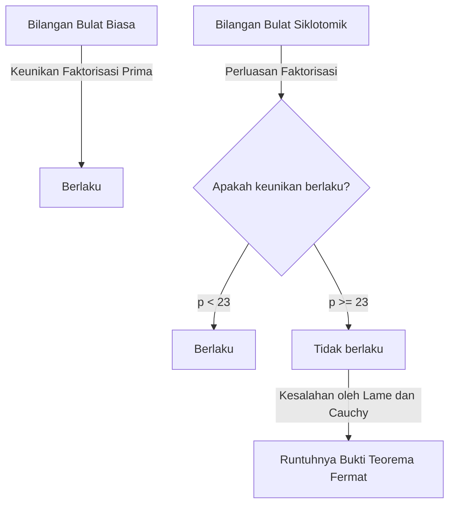
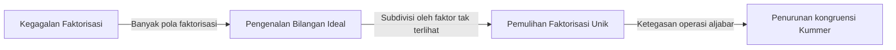
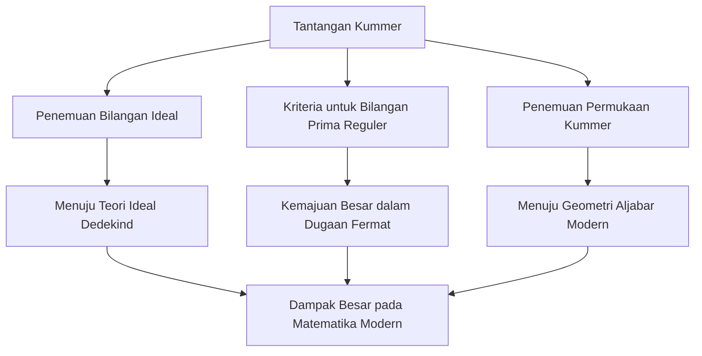

# [Ernst Kummer](https://kenji.blog/id/p/kummer/): Bapak Bilangan Ideal dan Fajar Teori Bilangan Aljabar

Dalam sejarah matematika, bukan hal yang aneh bagi sebuah tantangan terhadap masalah terbuka tertentu untuk membuka bidang studi yang sama sekali baru. Ernst Eduard [Kummer](https://kenji.blog/id/p/kummer/) ( **Ernst Eduard [Kummer](https://kenji.blog/id/p/kummer/)** ) adalah seorang raksasa matematika Jerman abad ke-19 yang menciptakan titik balik bersejarah seperti itu. Selama perjuangannya yang mendalam dengan **[Teorema Terakhir Fermat](https://kenji.blog/id/p/fermats-last-theorem/)** ( **[Fermat's Last Theorem](https://kenji.blog/id/p/fermats-last-theorem/)** ), ia memperkenalkan konsep revolusioner **Bilangan Ideal** ( **Ideal Numbers** ), yang meletakkan dasar bagi teori bilangan aljabar modern.

Dalam artikel ini, kita akan mempelajari lebih dalam kehidupan [Kummer](https://kenji.blog/id/p/kummer/) yang bergejolak, kisah-kisah manusiawi di sekitarnya, dan pencapaiannya yang cemerlang yang terus bersinar dalam sejarah matematika.

---

## Kehidupan dan Pendidikan [Kummer](https://kenji.blog/id/p/kummer/)

### Kehidupan Awal dan Peralihan dari Teologi

[Ernst Kummer](https://kenji.blog/id/p/kummer/) lahir pada 29 Januari 1810, di Sorau ( **Sorau** ), Kerajaan Prusia (sekarang di Polandia). Ayahnya, seorang dokter, meninggal ketika [Kummer](https://kenji.blog/id/p/kummer/) masih sangat muda, dan ia dibesarkan oleh ibunya. Meskipun miskin, [Kummer](https://kenji.blog/id/p/kummer/) menerima pendidikan yang berdedikasi dan masuk ke Universitas Halle pada tahun 1828.

Awalnya, ia mengambil jurusan teologi Protestan, tetapi di bawah pengaruh Profesor Heinrich Ferdinand Scherk ( **Heinrich Ferdinand Scherk** ), ia terpikat oleh keindahan dan kedalaman matematika. Dibimbing oleh Profesor Scherk, [Kummer](https://kenji.blog/id/p/kummer/) mengabdikan dirinya pada matematika dan memperoleh gelar doktor hanya tiga tahun kemudian, pada tahun 1831.

### Masa-masa sebagai Guru Gymnasium dan Bertemu [Kronecker](https://kenji.blog/id/p/kronecker/)

Setelah lulus, [Kummer](https://kenji.blog/id/p/kummer/) tidak bisa langsung mengamankan posisi universitas, sehingga ia bekerja selama sekitar sepuluh tahun sebagai guru matematika dan fisika di sebuah gymnasium di Liegnitz ( **Liegnitz** ), dekat dengan kampung halamannya. Periode sebagai guru ini sama sekali tidak membuang-buang waktu. Ia memiliki semangat yang mendalam sebagai seorang pendidik dan membesarkan siswa-siswa yang luar biasa.

Salah satu siswa tersebut adalah Leopold [Kronecker](https://kenji.blog/id/p/kronecker/) ( **Leopold [Kronecker](https://kenji.blog/id/p/kronecker/)** ), yang kemudian akan menjadi rekan dan teman seumur hidup [Kummer](https://kenji.blog/id/p/kummer/). [Kummer](https://kenji.blog/id/p/kummer/) mengenali bakat [Kronecker](https://kenji.blog/id/p/kronecker/) yang luar biasa, mengajarinya matematika tingkat lanjut, dan menempatkannya di jalur penelitian. Saat bekerja sebagai guru gymnasium, [Kummer](https://kenji.blog/id/p/kummer/) melanjutkan penelitiannya sendiri, menerbitkan serangkaian makalah luar biasa di jurnal akademik di Berlin.

### Kejayaan sebagai Profesor Universitas

Pencapaian penelitiannya yang luar biasa menarik perhatian para ahli matematika terkemuka pada masa itu. Pada tahun 1842, atas rekomendasi [Carl Gustav Jacob Jacobi](https://kenji.blog/id/p/jacobi/) ( **[Carl Gustav Jacob Jacobi](https://kenji.blog/id/p/jacobi/)** ) dan Peter Gustav Lejeune Dirichlet ( **Peter Gustav Lejeune Dirichlet** ), [Kummer](https://kenji.blog/id/p/kummer/) menjadi profesor penuh di Universitas Breslau. Selanjutnya, pada tahun 1855, ia diangkat sebagai profesor di Universitas Berlin untuk menggantikan Dirichlet, yang telah pindah ke Göttingen.

Di Universitas Berlin, [Kummer](https://kenji.blog/id/p/kummer/), bersama dengan [Karl Weierstrass](https://kenji.blog/id/p/weierstrass/) ( **[Karl Weierstrass](https://kenji.blog/id/p/weierstrass/)** ) dan mantan muridnya [Kronecker](https://kenji.blog/id/p/kronecker/), mengangkat Berlin menjadi pusat matematika global. Kuliah-kuliahnya sangat jelas dan penuh semangat, menarik banyak mahasiswa brilian dari seluruh Eropa.

---

## Anekdot: Matematikawan Hebat yang Kesulitan dengan Aritmatika

Salah satu kisah paling terkenal tentang [Kummer](https://kenji.blog/id/p/kummer/) adalah bahwa ia "buruk dalam berhitung." Meskipun ia adalah seorang jenius yang membangun matematika yang sangat abstrak dan teori yang kompleks, ia dilaporkan sering kesulitan dengan aritmatika dasar.

Saat kuliah suatu hari, [Kummer](https://kenji.blog/id/p/kummer/) terjebak mencoba menghitung $7 \times 9$ di papan tulis.

Ia menatap mahasiswanya dan merenung, "Tujuh dikali sembilan adalah... um..."
"Apakah 61?" tanyanya, di mana seorang mahasiswa menjawab, "Bukan, Profesor."
"Lalu, apakah 65?"
Mahasiswa lain berteriak, "Itu 63!"
Merasa lega, [Kummer](https://kenji.blog/id/p/kummer/) setuju, "Ya, 63. Itu benar," dan melanjutkan kuliahnya dengan mulus seolah-olah tidak terjadi apa-apa.

Anekdot ini masih diceritakan di kalangan matematikawan saat ini sebagai contoh yang mengharukan bahwa intuisi matematika tingkat lanjut dan keterampilan aritmatika mental yang sederhana adalah kemampuan yang sama sekali berbeda.

---

## [Teorema Terakhir Fermat](https://kenji.blog/id/p/fermats-last-theorem/) dan Runtuhnya Faktorisasi Unik

Pencapaian terbesar [Kummer](https://kenji.blog/id/p/kummer/) adalah pendekatannya terhadap **[Teorema Terakhir Fermat](https://kenji.blog/id/p/fermats-last-theorem/)** dalam teori bilangan. Teorema ini menyatakan hal berikut:

$$
x^n + y^n = z^n \quad (\text{di mana } n \ge 3 \text{ adalah bilangan bulat})
$$

Tidak ada solusi bilangan bulat positif $(x, y, z)$ yang memenuhi persamaan ini.

Pada tahun 1847, matematikawan Prancis [Gabriel Lamé](https://kenji.blog/id/p/lame/) ( **[Gabriel Lamé](https://kenji.blog/id/p/lame/)** ) dan [Augustin-Louis Cauchy](https://kenji.blog/id/p/cauchy/) ( **[Augustin-Louis Cauchy](https://kenji.blog/id/p/cauchy/)** ) mengumumkan bahwa mereka telah berhasil membuktikan teorema ini. Pendekatan mereka adalah untuk memperluas faktorisasi ke ranah bilangan kompleks (lapangan siklotomik).

Menggunakan akar persatuan primitif ke-$p$, $\zeta$ (di mana $\zeta^p = 1, \zeta \neq 1$), persamaan $x^p + y^p = z^p$ dapat difaktorkan sebagai berikut:

$$
x^p + y^p = (x + y)(x + \zeta y)(x + \zeta^2 y) \dots (x + \zeta^{p-1} y)
$$

[Lamé](https://kenji.blog/id/p/lame/) dan yang lainnya secara implisit berasumsi bahwa "keunikan faktorisasi prima" dalam bilangan bulat biasa (di mana bilangan bulat apa pun dapat diekspresikan secara unik sebagai produk bilangan prima) juga akan berlaku di dunia bilangan bulat kompleks yang diperluas ini (bilangan bulat siklotomik).

Namun, [Kummer](https://kenji.blog/id/p/kummer/) telah menemukan beberapa tahun sebelumnya bahwa asumsi ini salah. Misalnya, ketika $p=23$, keunikan faktorisasi prima gagal. Tanpa faktorisasi yang unik, bukti oleh [Lamé](https://kenji.blog/id/p/lame/) dan [Cauchy](https://kenji.blog/id/p/cauchy/) runtuh sepenuhnya.

---

## Kelahiran Bilangan Ideal

Untuk mengatasi situasi kritis dari runtuhnya faktorisasi unik, [Kummer](https://kenji.blog/id/p/kummer/) menciptakan konsep yang sama sekali baru: **Bilangan Ideal** ( **Ideal Numbers** ).

Ide [Kummer](https://kenji.blog/id/p/kummer/) adalah ini: "Jika faktorisasi prima tidak unik, mungkin ada 'bilangan prima ideal' yang tak terlihat, dan dengan memecah elemen ke dalam bilangan prima ideal ini, keunikan dapat dipulihkan." Ini mirip dengan kimia, di mana memecah materi dari molekul menjadi atom memperjelas komposisi dasarnya.

[Kummer](https://kenji.blog/id/p/kummer/) mendefinisikan "faktor ideal" di dalam himpunan bilangan bulat siklotomik — faktor yang tidak ada sebagai bilangan biasa tetapi dapat ditangani dengan konsistensi lengkap dalam operasi aljabar. Melalui hal ini, ia dengan brilian membangkitkan kembali keunikan faktorisasi prima di ranah bilangan bulat siklotomik.

Kemudian, Richard Dedekind ( **Richard Dedekind** ) menggeneralisasi bilangan ideal [Kummer](https://kenji.blog/id/p/kummer/), mengangkatnya ke konsep **Ideal** ( **Ideal** ) menggunakan teori himpunan. Ini menjadi dasar geometri aljabar modern dan teori gelanggang.

---

## Bilangan Prima Reguler dan Bukti Parsial dari [Teorema Terakhir Fermat](https://kenji.blog/id/p/fermats-last-theorem/)

Menggunakan teori bilangan ideal, [Kummer](https://kenji.blog/id/p/kummer/) memberikan pukulan besar terhadap [Teorema Terakhir Fermat](https://kenji.blog/id/p/fermats-last-theorem/). Ia mendefinisikan konsep **Bilangan Prima Reguler** ( **Regular Primes** ) dan membuktikan hasil yang menakjubkan bahwa "jika $p$ adalah bilangan prima reguler, maka [Teorema Terakhir Fermat](https://kenji.blog/id/p/fermats-last-theorem/) berlaku untuk $p$."

Bilangan prima reguler adalah bilangan prima $p$ yang tidak membagi bilangan kelas $h_p$ dari lapangan siklotomik $\mathbb{Q}(\zeta_p)$. Bilangan kelas adalah indeks yang mengukur seberapa buruk faktorisasi unik gagal; jika bilangan kelas adalah $1$, faktorisasi unik berlaku.

[Kummer](https://kenji.blog/id/p/kummer/) lebih jauh menemukan kriteria yang kuat untuk menentukan apakah bilangan prima tertentu adalah reguler. Kriteria ini menggunakan **Bilangan Bernoulli** ( **Bernoulli Numbers** ) $B_k$. Bilangan prima $p$ adalah reguler jika ia tidak membagi pembilang dari salah satu bilangan Bernoulli berikut:

$$
B_2, B_4, B_6, \dots, B_{p-3}
$$

Menggunakan kriteria ini, [Kummer](https://kenji.blog/id/p/kummer/) membuktikan bahwa [Teorema Terakhir Fermat](https://kenji.blog/id/p/fermats-last-theorem/) berlaku untuk semua bilangan prima di bawah $100$, kecuali untuk bilangan prima ireguler $37, 59$, dan $67$. Ini adalah pencapaian monumental yang mengirimkan gelombang kejutan ke seluruh komunitas matematika pada saat itu.

---

## Kontribusi pada Geometri: Permukaan [Kummer](https://kenji.blog/id/p/kummer/)

Selain karyanya yang inovatif dalam teori bilangan, [Kummer](https://kenji.blog/id/p/kummer/) membuat penemuan penting di bidang geometri. Yang paling representatif dari hal ini adalah **Permukaan [Kummer](https://kenji.blog/id/p/kummer/)** ( **[Kummer](https://kenji.blog/id/p/kummer/) Surface** ).

Pada tahun 1864, [Kummer](https://kenji.blog/id/p/kummer/) mempelajari kelas spesifik dari permukaan kuartik dalam ruang tiga dimensi. Permukaan ini memiliki sifat yang sangat menarik karena memiliki jumlah maksimum titik singular yang mungkin (titik di mana permukaannya tidak mulus, mis., puncak tajam) — tepatnya $16$.

$$
\text{Ciri-ciri Permukaan [Kummer](https://kenji.blog/id/p/kummer/):} \quad \text{Sebuah permukaan kuartik, namun memiliki 16 titik singular}
$$

Permukaan ini nantinya akan memainkan peran penting dalam berbagai bidang, dari teori fungsi [Abel](https://kenji.blog/id/p/abel/)ian dalam matematika murni hingga teori dawai dalam fisika modern. Dalam geometri aljabar, ia masih dipelajari secara intensif sebagai salah satu contoh paling klasik dan indah dari apa yang dikenal sebagai permukaan K3.

---

## Kesimpulan

[Ernst Kummer](https://kenji.blog/id/p/kummer/) memperluas kerangka matematika itu sendiri saat mengatasi "teka-teki yang tak terpecahkan" dari [Teorema Terakhir Fermat](https://kenji.blog/id/p/fermats-last-theorem/). Gagasannya tentang **Bilangan Ideal** menjadi bahasa yang sangat diperlukan dalam aljabar selanjutnya dan terus memengaruhi setiap cabang matematika modern.

Memiliki sisi manusiawi yang buruk dalam perhitungan, namun diberkahi dengan wawasan untuk menemukan "bilangan ideal tak terlihat" di luar intuisi manusia, kecemerlangan [Kummer](https://kenji.blog/id/p/kummer/) benar-benar layak menyandang gelar jenius. Pencapaian [Kummer](https://kenji.blog/id/p/kummer/) mengajarkan kita pentingnya mempertimbangkan kembali kerangka itu sendiri ketika dihadapkan pada masalah yang tampaknya mustahil.

Warisan abadinya terus menginspirasi para ahli matematika hingga hari ini.
