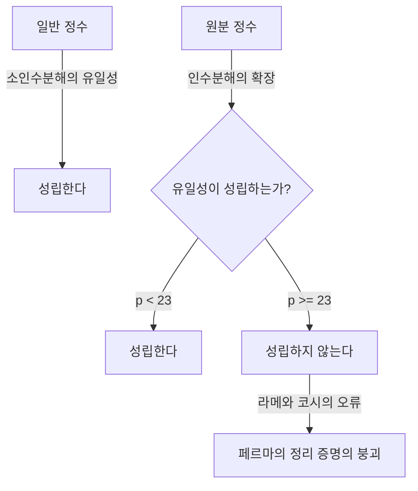
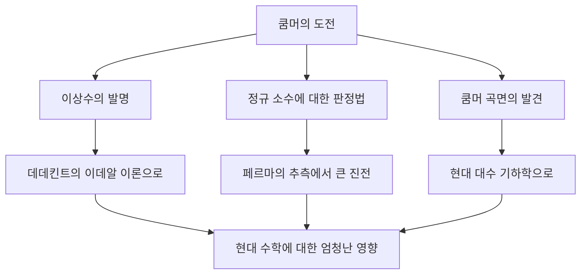

# [에른스트 쿰머](https://kenji.blog/ko/p/kummer/): 이상수의 아버지와 대수적 정수론의 여명

수학의 역사에서 특정 난제에 대한 도전이 완전히 새로운 수학 분야를 개척하는 것은 드문 일이 아닙니다. 에른스트 에두아르트 쿰머 ( **Ernst Eduard [Kummer](https://kenji.blog/ko/p/kummer/)** )는 바로 그러한 역사적 전환점을 만들어낸 19세기 독일의 위대한 수학자입니다. 그는 **페르마의 마지막 정리** ( **[Fermat's Last Theorem](https://kenji.blog/ko/p/fermats-last-theorem/)** )라는 초난제와 씨름하는 과정에서 **이상수** ( **Ideal Numbers** )라는 획기적인 개념을 도입하여 현대 대수적 정수론의 기초를 다졌습니다.

본 기사에서는 쿰머의 파란만장한 생애, 그를 둘러싼 인간미 넘치는 에피소드, 그리고 수학사에 찬란하게 빛나는 그의 업적에 대해 깊이 파헤쳐 보겠습니다.

---

## 쿰머의 생애와 교육

### 청년기와 신학에서의 전향

[에른스트 쿰머](https://kenji.blog/ko/p/kummer/)는 1810년 1월 29일 프로이센 왕국(현재의 폴란드)의 조라우 ( **Sorau** )에서 태어났습니다. 의사였던 아버지는 쿰머가 아주 어렸을 때 세상을 떠났고, 그는 어머니 손에 자랐습니다. 가난했지만 열성적인 교육을 받은 쿰머는 1828년 할레 대학교에 입학했습니다.

처음에 그는 개신교 신학을 전공했지만, 하인리히 페르디난트 셰르크 ( **Heinrich Ferdinand Scherk** ) 교수의 영향을 받아 수학의 아름다움과 깊이에 매료되었습니다. 셰르크 교수의 지도 아래 쿰머는 수학에 전념하게 되었고 불과 3년 후인 1831년에 박사 학위를 취득했습니다.

### 김나지움 교사 시절과 크로네커와의 만남

대학 졸업 후 쿰머는 곧바로 대학의 자리를 얻지 못해 고향과 가까운 리그니츠 ( **Liegnitz** )의 김나지움에서 약 10년 동안 수학과 물리 교사로 일했습니다. 이 교사 시절은 결코 시간 낭비가 아니었습니다. 그는 교육자로서 깊은 열정을 가졌고 뛰어난 제자들을 길러냈습니다.

이 제자 중 한 명이 훗날 쿰머의 동료이자 평생의 친구가 되는 레오폴트 크로네커 ( **Leopold [Kronecker](https://kenji.blog/ko/p/kronecker/)** )였습니다. 쿰머는 크로네커의 비범한 재능을 알아보고 고등 수학을 가르쳐 연구의 길로 이끌었습니다. 김나지움 교사로 일하면서도 쿰머는 자신의 연구를 계속하여 베를린의 학술지에 우수한 논문들을 잇달아 발표했습니다.

### 대학교수로서의 영광

그의 놀라운 연구 성과는 당시 주요 수학자들의 관심을 끌었습니다. 1842년, [카를 구스타프 야코프 야코비](https://kenji.blog/ko/p/jacobi/) ( **[Carl Gustav Jacob Jacobi](https://kenji.blog/ko/p/jacobi/)** )와 페터 구스타프 르죈 디리클레 ( **Peter Gustav Lejeune Dirichlet** )의 추천으로 쿰머는 브레스라우 대학교의 정교수가 되었습니다. 또한 1855년에는 괴팅겐으로 떠난 디리클레의 후임으로 베를린 대학교의 교수로 임명되었습니다.

베를린 대학교에서 쿰머는 [카를 바이어슈트라스](https://kenji.blog/ko/p/weierstrass/) ( **[Karl Weierstrass](https://kenji.blog/ko/p/weierstrass/)** )와 옛 제자 크로네커와 함께 베를린을 세계적인 수학의 중심지로 끌어올렸습니다. 그의 강의는 매우 명쾌하고 열정적이어서 유럽 전역에서 수많은 수재들이 모여들었습니다.

---

## 일화: 계산에 서툴렀던 위대한 수학자

쿰머에 얽힌 가장 유명한 일화 중 하나는 그가 "계산에 서툴렀다"는 것입니다. 매우 추상적인 수학과 복잡한 이론을 구축한 천재였지만, 일상적인 사칙연산에는 종종 어려움을 겪었다고 합니다.

어느 날 강의 중 쿰머는 칠판에서 $7 \times 9$를 계산하려다 막히고 말았습니다.

그는 학생들을 향해 "7 곱하기 9는... 음..." 하고 고민했습니다.
"61인가?" 하고 묻자 한 학생이 "아닙니다, 교수님." 하고 대답했습니다.
"그럼 65인가?"
다른 학생이 "63입니다!"라고 소리쳤습니다.
그제서야 안도한 쿰머는 "맞아, 63이다. 그게 정답이다."라고 수긍하고 아무 일도 없었다는 듯이 매끄럽게 강의를 계속 이어갔다고 합니다.

이 일화는 고도의 수학적 직관과 단순한 암산 능력이 전혀 다른 능력임을 보여주는 훈훈한 예로 오늘날까지도 수학자들 사이에서 전해지고 있습니다.

---

## [페르마의 마지막 정리](https://kenji.blog/ko/p/fermats-last-theorem/)와 소인수분해의 유일성 붕괴

쿰머의 가장 큰 업적은 정수론에서 **[페르마의 마지막 정리](https://kenji.blog/ko/p/fermats-last-theorem/)** 에 대한 그의 접근 방식이었습니다. 정리는 다음과 같이 명시합니다.

$$
x^n + y^n = z^n \quad (\text{단, } n \ge 3 \text{ 은 정수})
$$

이 방정식을 만족하는 양의 정수해 $(x, y, z)$는 존재하지 않는다.

1847년 프랑스의 수학자 [가브리엘 라메](https://kenji.blog/ko/p/lame/) ( **Gabriel Lamé** )와 오귀스탱 루이 코시 ( **[Augustin-Louis Cauchy](https://kenji.blog/ko/p/cauchy/)** )는 이 정리를 증명하는 데 성공했다고 발표했습니다. 그들의 접근 방식은 복소수 영역(원분체)으로 인수분해를 확장하는 것이었습니다.

1의 원시 $p$제곱근 $\zeta$ (단, $\zeta^p = 1, \zeta \neq 1$)를 사용하여 방정식 $x^p + y^p = z^p$는 다음과 같이 인수분해 될 수 있습니다.

$$
x^p + y^p = (x + y)(x + \zeta y)(x + \zeta^2 y) \dots (x + \zeta^{p-1} y)
$$

라메 등은 일반 정수에서의 "소인수분해의 유일성"(어떤 정수든 소수들의 곱으로 유일하게 표현될 수 있음)이 확장된 복소수 정수(원분 정수)의 세계에서도 적용될 것이라고 암묵적으로 가정했습니다.

그러나 쿰머는 이미 몇 년 전에 이 가정이 거짓이라는 것을 발견했습니다. 예를 들어 $p=23$일 때 소인수분해의 유일성은 성립하지 않습니다. 유일한 인수분해가 없다면 라메와 코시의 증명은 완전히 무너지고 맙니다.

---

## 이상수의 탄생

소인수분해 유일성 붕괴라는 위기 상황을 극복하기 위해 쿰머는 완전히 새로운 개념인 **이상수** ( **Ideal Numbers** )를 만들어냈습니다.

쿰머의 아이디어는 다음과 같았습니다. "소인수분해가 유일하지 않다면 눈에 보이지 않는 '이상적인 소수'가 존재할지도 모르며, 이 이상적인 소수들로 요소를 세분화하면 유일성이 회복될 것이다." 이것은 분자에서 원자로 물질을 분해하여 근본적인 구성을 명확히 하는 화학과 유사합니다.

쿰머는 원분 정수 집합 내에 "이상적 인수"를 정의했습니다. 일반 숫자로는 존재하지 않지만 대수 연산에서 완벽한 일관성을 가지고 다룰 수 있는 인수입니다. 이를 통해 그는 원분 정수의 영역에서 소인수분해의 유일성을 멋지게 부활시켰습니다.

이후 리하르트 데데킨트 ( **Richard Dedekind** )는 쿰머의 이상수를 일반화하여 집합론을 사용한 **이데알** ( **Ideal** ) 개념으로 승격시켰습니다. 이것은 현대 대수 기하학과 환론의 토대가 되었습니다.

---

## 정규 소수와 [페르마의 마지막 정리](https://kenji.blog/ko/p/fermats-last-theorem/)의 부분적 증명

이상수 이론을 사용하여 쿰머는 [페르마의 마지막 정리](https://kenji.blog/ko/p/fermats-last-theorem/)에 큰 타격을 입혔습니다. 그는 **정규 소수** ( **Regular Primes** )라는 개념을 정의하고 "$p$가 정규 소수이면 $p$에 대해 [페르마의 마지막 정리](https://kenji.blog/ko/p/fermats-last-theorem/)가 성립한다"는 놀라운 결과를 증명했습니다.

정규 소수란 원분체 $\mathbb{Q}(\zeta_p)$의 류수 $h_p$를 나누지 않는 소수 $p$입니다. 류수는 유일한 인수분해가 얼마나 크게 실패하는지 측정하는 지수이며, 류수가 $1$이면 유일한 인수분해가 성립합니다.

쿰머는 주어진 소수가 정규인지 결정하는 강력한 기준을 추가로 발견했습니다. 그것은 **베르누이 수** ( **Bernoulli Numbers** ) $B_k$를 사용합니다. 소수 $p$는 다음 베르누이 수 중 어느 분자도 나누지 않을 때 정규 소수입니다.

$$
B_2, B_4, B_6, \dots, B_{p-3}
$$

이 기준을 사용하여 쿰머는 불규칙 소수인 $37, 59, 67$을 제외한 $100$ 이하의 모든 소수에 대해 [페르마의 마지막 정리](https://kenji.blog/ko/p/fermats-last-theorem/)가 성립함을 증명했습니다. 이것은 당시 수학계에 충격파를 던진 기념비적인 성과였습니다.

---

## 기하학에 대한 기여: 쿰머 곡면

정수론에서의 획기적인 연구 외에도 쿰머는 기하학 분야에서 결정적인 발견을 했습니다. 그중 가장 대표적인 것이 **쿰머 곡면** ( **[Kummer](https://kenji.blog/ko/p/kummer/) Surface** )입니다.

1864년에 쿰머는 3차원 공간에서 특정 4차 곡면 클래스를 연구했습니다. 이 곡면은 특이점(곡면이 매끄럽지 않은 점, 예: 뾰족한 봉우리)을 가능한 최대 개수인 정확히 $16$개 가지는 매우 매혹적인 특성을 가지고 있습니다.

$$
\text{쿰머 곡면의 특징:} \quad \text{4차 곡면이면서 16개의 특이점을 가짐}
$$

이 곡면은 이후 순수 수학의 아벨 함수론에서부터 현대 물리학의 끈 이론에 이르기까지 광범위한 분야에서 중요한 역할을 하게 됩니다. 대수 기하학에서는 소위 K3 곡면으로 알려진 것 중 가장 고전적이고 아름다운 예 중 하나로 여전히 집중적으로 연구되고 있습니다.

---

## 결론

[에른스트 쿰머](https://kenji.blog/ko/p/kummer/)는 [페르마의 마지막 정리](https://kenji.blog/ko/p/fermats-last-theorem/)라는 "풀 수 없는 퍼즐"에 도전하면서 수학 그 자체의 틀을 확장했습니다. 그의 **이상수** 아이디어는 후대 대수학에서 없어서는 안 될 언어가 되었으며 현대 수학의 모든 분야에 계속 영향을 미치고 있습니다.

계산에 서툴렀다는 인간적인 면모를 지니면서도 인간의 직관을 초월한 "보이지 않는 이상수"를 발견하는 통찰력을 지녔던 쿰머의 천재성은 참으로 그 칭호에 걸맞습니다. 쿰머의 업적은 불가능해 보이는 문제에 직면했을 때 틀 자체를 재고하는 것이 얼마나 중요한지 가르쳐 줍니다.

그의 불멸의 유산은 오늘날까지도 수학자들에게 영감을 주고 있습니다.
