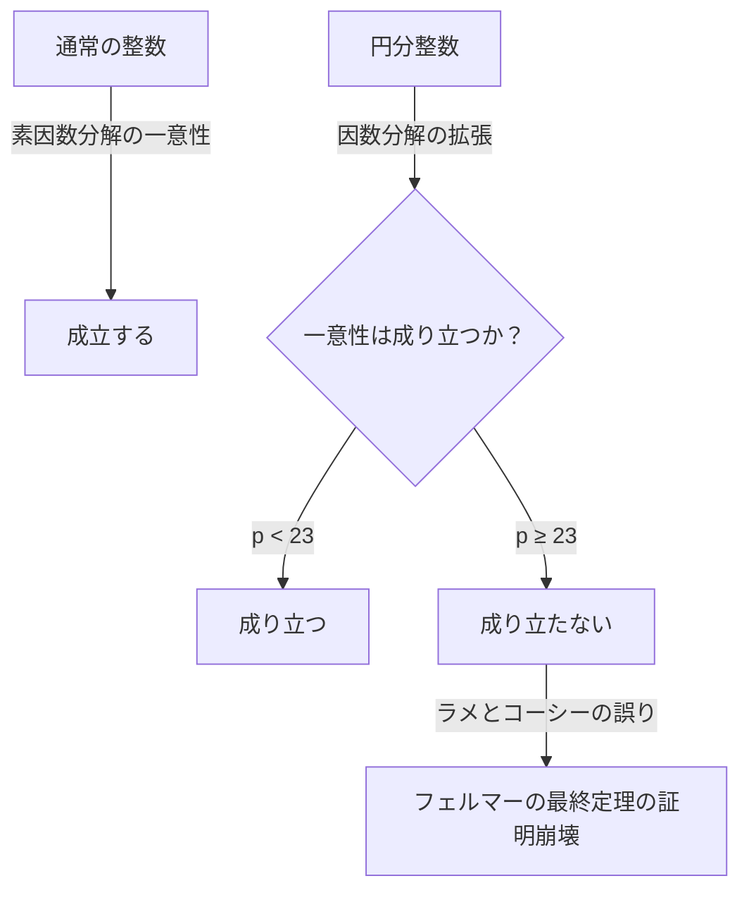
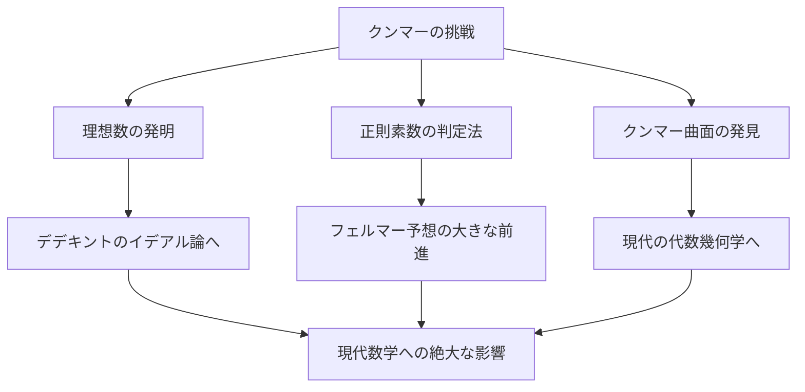

# [エルンスト・クンマー](https://kenji.blog/p/kummer/)：理想数の父と代数的整数論の夜明け

数学の歴史において、特定の難問への挑戦が新しい数学の分野を切り開くことは珍しくありません。エルンスト・エドゥアルト・[クンマー](https://kenji.blog/p/kummer/) ( **Ernst Eduard [Kummer](https://kenji.blog/p/kummer/)** ) は、まさにそのような歴史的転換点を生み出した19世紀のドイツの偉大な数学者です。彼は **[フェルマーの最終定理](https://kenji.blog/p/fermats-last-theorem/)** ( **[Fermat's Last Theorem](https://kenji.blog/p/fermats-last-theorem/)** ) という超難問に挑む過程で **理想数** ( **Ideal Numbers** ) という画期的な概念を導入し、のちの代数的整数論の基礎を築き上げました。

本記事では、[クンマー](https://kenji.blog/p/kummer/)の波乱に満ちた生涯、彼にまつわる人間味あふれるエピソード、そして数学史に燦然と輝く彼の業績について、詳しく深く掘り下げていきます。

---

## [クンマー](https://kenji.blog/p/kummer/)の生涯と教育

### 青年期と神学からの転向

[エルンスト・クンマー](https://kenji.blog/p/kummer/)は1810年1月29日、プロイセン王国（現在のポーランド）のゾーラウ ( **Sorau** ) で生まれました。父親は医師でしたが、[クンマー](https://kenji.blog/p/kummer/)が幼い頃に亡くなり、母親の手によって育てられました。貧しいながらも熱心な教育を受けた[クンマー](https://kenji.blog/p/kummer/)は、1828年にハレ大学に入学します。

当初、彼はプロテスタントの神学を専攻していましたが、そこで出会ったハインリヒ・フェルディナント・シェルク ( **Heinrich Ferdinand Scherk** ) 教授の影響を受け、数学の美しさと奥深さに魅了されます。シェルク教授の指導のもと、[クンマー](https://kenji.blog/p/kummer/)は数学に専念するようになり、わずか3年後の1831年に博士号を取得しました。

### ギムナジウムの教師時代と[クロネッカー](https://kenji.blog/p/kronecker/)との出会い

大学卒業後、[クンマー](https://kenji.blog/p/kummer/)はすぐに大学のポストを得ることができず、故郷に近いリーグニッツ ( **Liegnitz** ) のギムナジウム（中高一貫校）で数学と物理の教師として約10年間働きました。この教師時代は、[クンマー](https://kenji.blog/p/kummer/)にとって決して無駄な時間ではありませんでした。彼は教育者としての情熱を持ち、優れた生徒たちを育て上げました。

その生徒の一人が、後に[クンマー](https://kenji.blog/p/kummer/)の同僚であり終生の友となるレオポルト・[クロネッカー](https://kenji.blog/p/kronecker/) ( **Leopold [Kronecker](https://kenji.blog/p/kronecker/)** ) でした。[クンマー](https://kenji.blog/p/kummer/)は[クロネッカー](https://kenji.blog/p/kronecker/)の非凡な才能を見抜き、彼に高度な数学を教え、研究への道を歩ませました。ギムナジウムの教師でありながら、[クンマー](https://kenji.blog/p/kummer/)自身も研究を続け、ベルリンの学術誌に優れた論文を次々と発表していきました。

### 大学教授としての栄光

彼の卓越した研究業績は当時の数学界の重鎮たちの注目を集めました。1842年、[カール・グスタフ・ヤコブ・ヤコビ](https://kenji.blog/p/jacobi/) ( **[Carl Gustav Jacob Jacobi](https://kenji.blog/p/jacobi/)** ) とペーター・グスタフ・ルジューヌ・ディリクレ ( **Peter Gustav Lejeune Dirichlet** ) の推薦により、[クンマー](https://kenji.blog/p/kummer/)はブレスラウ大学の正教授に就任します。さらに1855年には、ディリクレがゲッティンゲン大学へ移った後任として、ベルリン大学の教授に就任しました。

ベルリン大学での[クンマー](https://kenji.blog/p/kummer/)は、[カール・ワイエルシュトラス](https://kenji.blog/p/weierstrass/) ( **[Karl Weierstrass](https://kenji.blog/p/weierstrass/)** ) や教え子の[クロネッカー](https://kenji.blog/p/kronecker/)と共に、ベルリンを世界的な数学の中心地へと押し上げました。彼の講義は非常に明快で情熱的であり、ヨーロッパ中から多くの優秀な学生が集まりました。

---

## 逸話：計算が苦手な大数学者

[クンマー](https://kenji.blog/p/kummer/)にまつわる最も有名なエピソードの一つに、「計算が苦手だった」というものがあります。高度な抽象数学や複雑な理論を構築する天才でありながら、日常的な四則演算にはしばしば苦戦していたと言われています。

ある日の講義中、[クンマー](https://kenji.blog/p/kummer/)は黒板で計算をしている際に $7 \times 9$ の計算に行き詰まってしまいました。

彼は生徒たちに向かって、「 $7 \times 9$ は……ええと……」と考え込みました。
「61でしょうか？」と彼が言うと、ある生徒が「いいえ、教授」と答えました。
「では、65でしょうか？」
すると別の生徒が「63です！」と叫びました。
[クンマー](https://kenji.blog/p/kummer/)はほっとして、「そうだ、63だ。それが正解だ」と納得し、何事もなかったかのように講義を続けたという逸話が残されています。

このエピソードは、高度な数学的直観と単なる暗算能力が全く別のものであることを示す微笑ましい例として、今日でも数学者たちの間で語り継がれています。

---

## [フェルマーの最終定理](https://kenji.blog/p/fermats-last-theorem/)と一意分解の崩壊

[クンマー](https://kenji.blog/p/kummer/)の最大の業績は、数論における **[フェルマーの最終定理](https://kenji.blog/p/fermats-last-theorem/)** へのアプローチです。[フェルマーの最終定理](https://kenji.blog/p/fermats-last-theorem/)とは、次のような命題です。

$$
x^n + y^n = z^n \quad (\text{ただし} \ n \ge 3 \ \text{は整数})
$$

を満たす正の整数の組 $(x, y, z)$ は存在しない。

1847年、フランスの数学者[ガブリエル・ラメ](https://kenji.blog/p/lame/) ( **[Gabriel Lamé](https://kenji.blog/p/lame/)** ) と[オーギュスタン＝ルイ・コーシー](https://kenji.blog/p/cauchy/) ( **[Augustin-Louis Cauchy](https://kenji.blog/p/cauchy/)** ) は、この定理の証明に成功したと発表しました。彼らのアプローチは、複素数の世界（円分体）に因数分解を拡張するというものでした。

方程式 $x^p + y^p = z^p$ を、 $1$ の原始 $p$ 乗根 $\zeta$ （ $\zeta^p = 1, \zeta \neq 1$ ）を用いて次のように分解します。

$$
x^p + y^p = (x + y)(x + \zeta y)(x + \zeta^2 y) \dots (x + \zeta^{p-1} y)
$$

ラメらは、通常の整数における「素因数分解の一意性」（任意の整数は素数の積としてただ一通りに表される）が、この拡張された複素数の整数（円分整数）の世界でも成り立つと暗黙に仮定していました。

しかし、[クンマー](https://kenji.blog/p/kummer/)はすでにその数年前に、この仮定が誤りであることを発見していました。たとえば、$p=23$ の場合、素因数分解の一意性は成り立ちません。一意分解が成り立たなければ、ラメたちの証明は根本から崩れ去ってしまいます。

---

## 理想数 (Ideal Numbers) の誕生

[クンマー](https://kenji.blog/p/kummer/)は、一意分解の崩壊という危機的状況を克服するために、全く新しい概念である **理想数** ( **Ideal Numbers** ) を生み出しました。

[クンマー](https://kenji.blog/p/kummer/)のアイデアは、「もし素因数分解が一意にならないのであれば、目に見えない『理想的な素数』が存在し、その理想的な素数まで細かく分解すれば一意性が回復するのではないか」というものでした。これは化学において、物質を分子からさらに原子へと分解することで物質の構成が明確になることに似ています。

[クンマー](https://kenji.blog/p/kummer/)は、円分整数の集合の中に、通常の数としては存在しないが、代数的な操作の対象としては完全に矛盾なく扱える「理想的な因子」を定義しました。これにより、円分整数の世界において素因数分解の一意性を見事に復活させたのです。

のちに、リヒャルト・デデキント ( **Richard Dedekind** ) は[クンマー](https://kenji.blog/p/kummer/)の理想数を一般化し、集合論を用いた **イデアル** ( **Ideal** ) という概念へと昇華させました。これが現代の代数幾何学や環論の基盤となっています。

---

## 正則素数と[フェルマーの最終定理](https://kenji.blog/p/fermats-last-theorem/)への部分証明

理想数の理論を用いて、[クンマー](https://kenji.blog/p/kummer/)は[フェルマーの最終定理](https://kenji.blog/p/fermats-last-theorem/)に大きな一矢を報いました。彼は **正則素数** ( **Regular Primes** ) という概念を定義し、「 $p$ が正則素数であれば、[フェルマーの最終定理](https://kenji.blog/p/fermats-last-theorem/)は成り立つ」という驚異的な結果を証明しました。

正則素数とは、円分体 $\mathbb{Q}(\zeta_p)$ の類数 $h_p$ を割り切らない素数 $p$ のことです。類数とは、一意分解がどれくらい崩れているかを測る指標であり、類数が $1$ であれば一意分解が成り立ちます。

[クンマー](https://kenji.blog/p/kummer/)はさらに、ある素数が正則であるかどうかを判定するための強力な基準を発見しました。それは **ベルヌーイ数** ( **Bernoulli Numbers** ) $B_k$ を用いたものです。素数 $p$ が、

$$
B_2, B_4, B_6, \dots, B_{p-3}
$$

のいずれの分子も $p$ で割り切れないとき、その $p$ は正則素数となります。

この判定法を用いて、[クンマー](https://kenji.blog/p/kummer/)は $100$ 以下の素数のうち、非正則素数である $37, 59, 67$ を除くすべての素数について[フェルマーの最終定理](https://kenji.blog/p/fermats-last-theorem/)が成り立つことを証明しました。これは、当時の数学界に衝撃を与える大成果でした。

---

## 幾何学への貢献：[クンマー](https://kenji.blog/p/kummer/)曲面

数論における画期的な業績に加えて、[クンマー](https://kenji.blog/p/kummer/)は幾何学の分野でも重要な発見を残しています。その代表的なものが **[クンマー](https://kenji.blog/p/kummer/)曲面** ( **[Kummer](https://kenji.blog/p/kummer/) Surface** ) です。

1864年、[クンマー](https://kenji.blog/p/kummer/)は空間内の特定の4次曲面について研究を行いました。この曲面は、特異点（曲面が滑らかでない点、例えば尖っている点）を最大の $16$ 個も持つという非常に興味深い性質を持っています。

$$
\text{[クンマー](https://kenji.blog/p/kummer/)曲面の特徴：} \quad \text{4次曲面でありながら、16個の特異点を持つ}
$$

この曲面は、後に[アーベル](https://kenji.blog/p/abel/)関数論や弦理論など、純粋数学から現代物理学に至るまで幅広い分野で重要な役割を果たすことになります。代数幾何学において、K3曲面と呼ばれる重要な対象の最も古典的で美しい例の一つとして、今でも深く研究されています。

---

## おわりに

[エルンスト・クンマー](https://kenji.blog/p/kummer/)は、[フェルマーの最終定理](https://kenji.blog/p/fermats-last-theorem/)という「解けないパズル」に挑む中で、数学そのものの枠組みを拡張しました。彼の **理想数** のアイデアは、のちの代数学において不可欠な言語となり、現代数学のあらゆる分野に影響を与え続けています。

計算が苦手だったという人間らしい一面を持ちながらも、人間の直観を超えた「目に見えない理想の数」を見出した彼の洞察力は、まさに天才の名にふさわしいものです。[クンマー](https://kenji.blog/p/kummer/)の業績は、困難な問題に直面したとき、枠組みそのものを再考することの重要性を私たちに教えてくれます。

彼の残した遺産は、今日もなお、数学者たちにインスピレーションを与え続けています。
