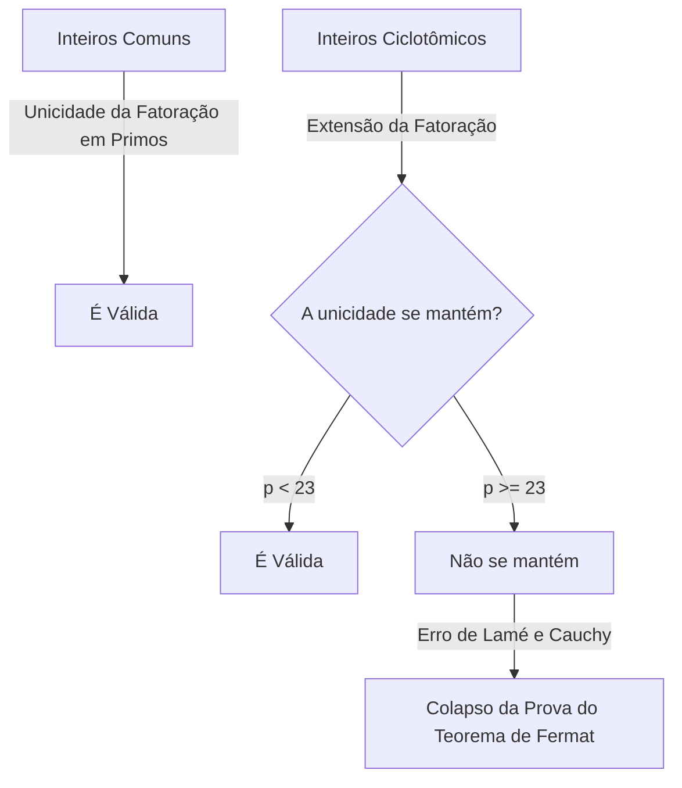
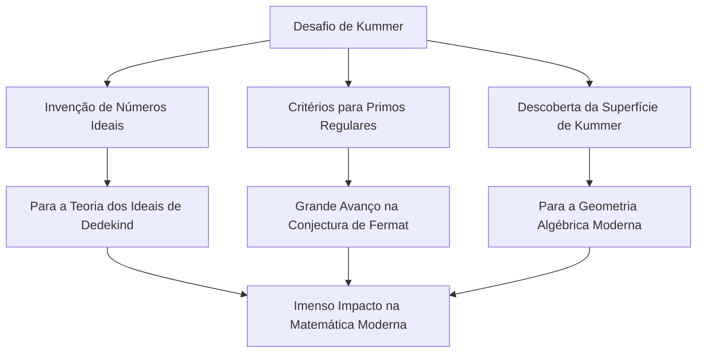

# [Ernst Kummer](https://kenji.blog/pt/p/kummer/): Pai dos Números Ideais e o Amanhecer da Teoria Algébrica dos Números

Na história da matemática, não é incomum que o desafio a um problema em aberto específico crie campos de estudo inteiramente novos. Ernst Eduard [Kummer](https://kenji.blog/pt/p/kummer/) ( **Ernst Eduard Kummer** ) é um gigante matemático alemão do século XIX que criou exatamente esse ponto de virada histórico. Durante sua profunda luta com o **Último Teorema de Fermat** ( **[Fermat's Last Theorem](https://kenji.blog/pt/p/fermats-last-theorem/)** ), ele introduziu o conceito revolucionário de **Números Ideais** ( **Ideal Numbers** ), estabelecendo as bases para a moderna teoria algébrica dos números.

Neste artigo, vamos nos aprofundar na vida turbulenta de [Kummer](https://kenji.blog/pt/p/kummer/), nos episódios humanos que o cercam e em suas brilhantes realizações que continuam a brilhar na história da matemática.

---

## A Vida e Educação de [Kummer](https://kenji.blog/pt/p/kummer/)

### Início da Vida e Mudança da Teologia

[Ernst Kummer](https://kenji.blog/pt/p/kummer/) nasceu em 29 de janeiro de 1810 em Sorau ( **Sorau** ), Reino da Prússia (atual Polônia). Seu pai, um médico, faleceu quando Kummer era muito jovem, e ele foi criado por sua mãe. Apesar de ser pobre, [Kummer](https://kenji.blog/pt/p/kummer/) recebeu uma educação dedicada e ingressou na Universidade de Halle em 1828.

Inicialmente, ele se formou em teologia protestante, mas sob a influência do professor Heinrich Ferdinand Scherk ( **Heinrich Ferdinand Scherk** ), ele ficou cativado pela beleza e profundidade da matemática. Guiado pelo professor Scherk, [Kummer](https://kenji.blog/pt/p/kummer/) dedicou-se à matemática e obteve seu doutorado apenas três anos depois, em 1831.

### Dias como Professor de Gymnasium e o Encontro com [Kronecker](https://kenji.blog/pt/p/kronecker/)

Após a graduação, [Kummer](https://kenji.blog/pt/p/kummer/) não conseguiu garantir imediatamente um cargo universitário, então trabalhou por cerca de dez anos como professor de matemática e física em um gymnasium em Liegnitz ( **Liegnitz** ), perto de sua cidade natal. Este período como professor não foi de forma alguma uma perda de tempo. Ele tinha uma profunda paixão como educador e formou alunos excepcionais.

Um desses alunos foi Leopold [Kronecker](https://kenji.blog/pt/p/kronecker/) ( **Leopold Kronecker** ), que mais tarde se tornaria colega e amigo de Kummer por toda a vida. Kummer reconheceu o talento extraordinário de Kronecker, ensinou-lhe matemática avançada e o colocou no caminho da pesquisa. Enquanto trabalhava como professor de gymnasium, [Kummer](https://kenji.blog/pt/p/kummer/) continuou sua própria pesquisa, publicando uma série de artigos notáveis em periódicos acadêmicos em Berlim.

### Glória como Professor Universitário

Suas notáveis realizações em pesquisa atraíram a atenção dos principais matemáticos da época. Em 1842, por recomendação de [Carl Gustav Jacob Jacobi](https://kenji.blog/pt/p/jacobi/) ( **Carl Gustav Jacob Jacobi** ) e Peter Gustav Lejeune Dirichlet ( **Peter Gustav Lejeune Dirichlet** ), [Kummer](https://kenji.blog/pt/p/kummer/) tornou-se professor titular da Universidade de Breslau. Além disso, em 1855, foi nomeado professor da Universidade de Berlim para suceder Dirichlet, que havia se mudado para Göttingen.

Na Universidade de Berlim, [Kummer](https://kenji.blog/pt/p/kummer/), juntamente com Karl Weierstrass ( **Karl Weierstrass** ) e seu ex-aluno [Kronecker](https://kenji.blog/pt/p/kronecker/), elevaram Berlim a um centro global de matemática. Suas palestras eram extremamente claras e apaixonadas, atraindo muitos alunos brilhantes de toda a Europa.

---

## Episódio: O Grande Matemático que Tinha Dificuldades com a Aritmética

Um dos episódios mais famosos sobre [Kummer](https://kenji.blog/pt/p/kummer/) é que ele era "ruim em cálculo". Embora fosse um gênio que construiu matemática altamente abstrata e teorias complexas, relatos dizem que ele frequentemente tinha dificuldades com aritmética básica.

Durante uma palestra um dia, [Kummer](https://kenji.blog/pt/p/kummer/) travou tentando calcular $7 \times 9$ no quadro negro.

Ele olhou para os alunos e ponderou: "Sete vezes nove é... hum..."
"É 61?" ele perguntou, ao que um aluno respondeu: "Não, professor."
"Então, é 65?"
Outro aluno gritou: "É 63!"
Aliviado, [Kummer](https://kenji.blog/pt/p/kummer/) concordou: "Sim, 63. Está correto", e continuou sua palestra perfeitamente como se nada tivesse acontecido.

Esta anedota ainda é contada hoje entre os matemáticos como um exemplo reconfortante de que a intuição matemática avançada e as habilidades simples de aritmética mental são faculdades totalmente diferentes.

---

## [O Último Teorema de Fermat](https://kenji.blog/pt/p/fermats-last-theorem/) e o Colapso da Fatoração Única

A maior conquista de [Kummer](https://kenji.blog/pt/p/kummer/) foi sua abordagem ao **Último Teorema de [Fermat](https://kenji.blog/pt/p/fermat/)** na teoria dos números. O teorema afirma o seguinte:

$$
x^n + y^n = z^n \quad (\text{onde } n \ge 3 \text{ é um número inteiro})
$$

Não existem soluções inteiras positivas $(x, y, z)$ que satisfaçam esta equação.

Em 1847, os matemáticos franceses [Gabriel Lamé](https://kenji.blog/pt/p/lame/) ( **Gabriel Lamé** ) e Augustin-Louis Cauchy ( **[Augustin-Louis Cauchy](https://kenji.blog/pt/p/cauchy/)** ) anunciaram que haviam conseguido provar este teorema. A abordagem deles foi estender a fatoração para o reino dos números complexos (corpos ciclotômicos).

Usando a $p$-ésima raiz primitiva da unidade $\zeta$ (onde $\zeta^p = 1, \zeta \neq 1$), a equação $x^p + y^p = z^p$ pode ser fatorada da seguinte forma:

$$
x^p + y^p = (x + y)(x + \zeta y)(x + \zeta^2 y) \dots (x + \zeta^{p-1} y)
$$

[Lamé](https://kenji.blog/pt/p/lame/) e outros assumiram implicitamente que a "unicidade da fatoração em primos" nos números inteiros comuns (onde qualquer número inteiro pode ser expresso de forma única como um produto de números primos) também se manteria neste mundo estendido de números inteiros complexos (inteiros ciclotômicos).

No entanto, [Kummer](https://kenji.blog/pt/p/kummer/) já havia descoberto alguns anos antes que essa suposição era falsa. Por exemplo, quando $p=23$, a unicidade da fatoração em primos falha. Sem uma fatoração única, a prova de Lamé e [Cauchy](https://kenji.blog/pt/p/cauchy/) ruiu completamente.

---

## O Nascimento dos Números Ideais

Para superar a situação crítica do colapso da fatoração única, [Kummer](https://kenji.blog/pt/p/kummer/) criou um conceito inteiramente novo: **Números Ideais** ( **Ideal Numbers** ).

A ideia de [Kummer](https://kenji.blog/pt/p/kummer/) foi a seguinte: "Se a fatoração em primos não é única, talvez existam 'primos ideais' invisíveis e, dividindo os elementos nesses primos ideais, a unicidade poderia ser restaurada". Isso é semelhante à química, onde a quebra da matéria de moléculas em átomos esclarece sua composição fundamental.

[Kummer](https://kenji.blog/pt/p/kummer/) definiu "fatores ideais" dentro do conjunto dos inteiros ciclotômicos — fatores que não existem como números comuns, mas que podem ser manipulados com total consistência em operações algébricas. Por meio disso, ele ressuscitou brilhantemente a unicidade da fatoração em primos no reino dos inteiros ciclotômicos.

Mais tarde, Richard Dedekind ( **Richard Dedekind** ) generalizou os números ideais de [Kummer](https://kenji.blog/pt/p/kummer/), elevando-os ao conceito de **Ideal** ( **Ideal** ) usando a teoria dos conjuntos. Isso se tornou a base da geometria algébrica moderna e da teoria dos anéis.

---

## Primos Regulares e a Prova Parcial do Último Teorema de [Fermat](https://kenji.blog/pt/p/fermat/)

Usando a teoria dos números ideais, [Kummer](https://kenji.blog/pt/p/kummer/) desferiu um golpe maciço contra o Último Teorema de Fermat. Ele definiu o conceito de **Primos Regulares** ( **Regular Primes** ) e provou o resultado surpreendente de que "se $p$ é um primo regular, então o Último Teorema de [Fermat](https://kenji.blog/pt/p/fermat/) vale para $p$."

Um primo regular é um número primo $p$ que não divide o número de classe $h_p$ do corpo ciclotômico $\mathbb{Q}(\zeta_p)$. O número de classe é um índice que mede o quão mal a fatoração única falha; se o número da classe for $1$, a fatoração única é válida.

[Kummer](https://kenji.blog/pt/p/kummer/) descobriu ainda um critério poderoso para determinar se um determinado número primo é regular. Ele usa **Números de Bernoulli** ( **Bernoulli Numbers** ) $B_k$. Um primo $p$ é regular se não dividir o numerador de nenhum dos seguintes números de Bernoulli:

$$
B_2, B_4, B_6, \dots, B_{p-3}
$$

Usando este critério, [Kummer](https://kenji.blog/pt/p/kummer/) provou que o Último Teorema de [Fermat](https://kenji.blog/pt/p/fermat/) é válido para todos os números primos menores que $100$, exceto para os primos irregulares $37, 59$ e $67$. Esta foi uma conquista monumental que enviou ondas de choque através da comunidade matemática na época.

---

## Contribuição à Geometria: A Superfície de [Kummer](https://kenji.blog/pt/p/kummer/)

Além de seu trabalho inovador na teoria dos números, [Kummer](https://kenji.blog/pt/p/kummer/) fez descobertas cruciais no campo da geometria. A mais representativa delas é a **Superfície de Kummer** ( **[Kummer](https://kenji.blog/pt/p/kummer/) Surface** ).

Em 1864, [Kummer](https://kenji.blog/pt/p/kummer/) estudou uma classe específica de superfícies quárticas no espaço tridimensional. Esta superfície tem a propriedade profundamente fascinante de possuir o número máximo possível de pontos singulares (pontos onde a superfície não é lisa, por exemplo, picos agudos) — exatamente $16$.

$$
\text{Características da Superfície de [Kummer](https://kenji.blog/pt/p/kummer/):} \quad \text{Uma superfície quártica, porém com 16 pontos singulares}
$$

Essa superfície mais tarde desempenharia um papel vital em uma ampla gama de campos, desde a teoria das funções abelianas na matemática pura até a teoria das cordas na física moderna. Na geometria algébrica, ela ainda é intensamente estudada como um dos exemplos mais clássicos e belos do que é conhecido como superfícies K3.

---

## Conclusão

[Ernst Kummer](https://kenji.blog/pt/p/kummer/) expandiu a própria estrutura da matemática ao enfrentar o "quebra-cabeça insolúvel" do Último Teorema de [Fermat](https://kenji.blog/pt/p/fermat/). Sua ideia dos **Números Ideais** tornou-se uma linguagem indispensável na álgebra posterior e continua a influenciar todos os ramos da matemática moderna.

Possuindo o lado humano de ser ruim de cálculo, mas dotado do discernimento para descobrir "números ideais invisíveis" além da intuição humana, o brilhantismo de [Kummer](https://kenji.blog/pt/p/kummer/) é verdadeiramente digno do título de gênio. As conquistas de [Kummer](https://kenji.blog/pt/p/kummer/) nos ensinam a importância de reconsiderar a própria estrutura ao nos depararmos com problemas aparentemente impossíveis.

Seu legado duradouro continua a inspirar os matemáticos até hoje.
