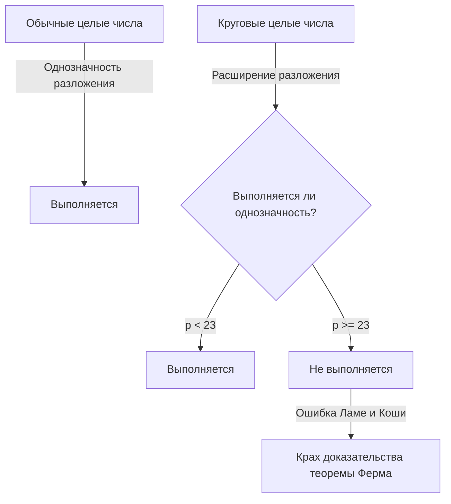
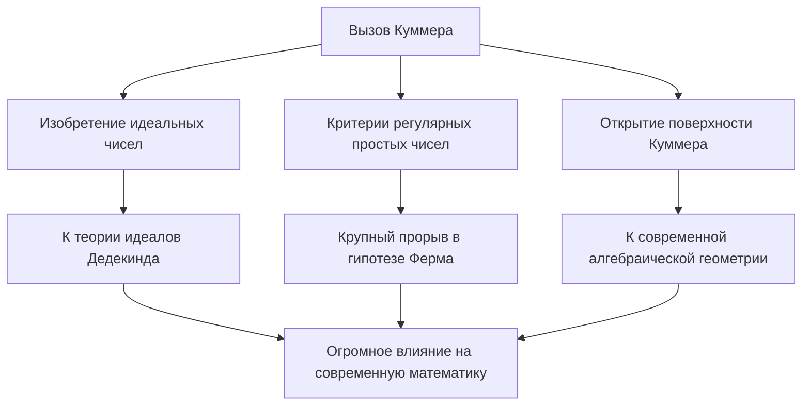

# [Эрнст Куммер](https://kenji.blog/ru/p/kummer/): Отец идеальных чисел и рассвет алгебраической теории чисел

В истории математики нередко случается, что вызов конкретной открытой проблеме открывает совершенно новые области исследований. Эрнст Эдуард Куммер ( **Ernst Eduard [Kummer](https://kenji.blog/ru/p/kummer/)** ) — гигант немецкой математики 19-го века, который создал именно такой исторический поворотный момент. Во время своей глубокой борьбы с **Великой теоремой Ферма** ( **[Fermat's Last Theorem](https://kenji.blog/ru/p/fermats-last-theorem/)** ) он ввел революционную концепцию **идеальных чисел** ( **Ideal Numbers** ), заложив основы современной алгебраической теории чисел.

В этой статье мы глубоко погрузимся в бурную жизнь Куммера, человеческие эпизоды, окружающие его, и его блестящие достижения, которые продолжают сиять в истории математики.

---

## Жизнь и образование Куммера

### Ранние годы и уход от теологии

[Эрнст Куммер](https://kenji.blog/ru/p/kummer/) родился 29 января 1810 года в Зорау ( **Sorau** ), королевство Пруссия (ныне в Польше). Его отец, врач, скончался, когда Куммер был очень молод, и его воспитывала мать. Несмотря на бедность, Куммер получил отличное образование и в 1828 году поступил в Университет Галле.

Сначала он специализировался на протестантской теологии, но под влиянием профессора Генриха Фердинанда Шерка ( **Heinrich Ferdinand Scherk** ) был очарован красотой и глубиной математики. Под руководством профессора Шерка Куммер посвятил себя математике и получил докторскую степень всего через три года, в 1831 году.

### Дни работы учителем в гимназии и встреча с Кронекером

После окончания университета Куммер не смог сразу получить должность в университете, поэтому он около десяти лет работал учителем математики и физики в гимназии в Лигнице ( **Liegnitz** ), недалеко от своего родного города. Этот период работы учителем ни в коем случае не был пустой тратой времени. Он обладал глубокой страстью как педагог и воспитал выдающихся учеников.

Одним из этих учеников был [Леопольд Кронекер](/ru/p/kronecker/) ( **Leopold [Kronecker](https://kenji.blog/ru/p/kronecker/)** ), который позже стал коллегой и другом Куммера на всю жизнь. Куммер распознал необычайный талант Кронекера, обучил его высшей математике и направил на путь исследований. Работая учителем в гимназии, Куммер продолжал свои собственные исследования, публикуя серию выдающихся статей в академических журналах в Берлине.

### Слава профессора университета

Его выдающиеся исследовательские достижения привлекли внимание ведущих математиков того времени. В 1842 году по рекомендации Карла Густава Якоба Якоби ( **[Carl Gustav Jacob Jacobi](https://kenji.blog/ru/p/jacobi/)** ) и Петера Густава Лежена Дирихле ( **Peter Gustav Lejeune Dirichlet** ) Куммер стал полным профессором Университета Бреслау. Кроме того, в 1855 году он был назначен профессором Берлинского университета в качестве преемника Дирихле, который переехал в Гёттинген.

В Берлинском университете Куммер вместе с Карлом Вейерштрассом ( **[Karl Weierstrass](https://kenji.blog/ru/p/weierstrass/)** ) и своим бывшим учеником Кронекером превратил Берлин в мировой центр математики. Его лекции были чрезвычайно ясными и страстными, привлекая множество блестящих студентов со всей Европы.

---

## Эпизод: Великий математик, которому плохо давалась арифметика

Один из самых известных эпизодов о Куммере заключается в том, что он «плохо считал». Хотя он был гением, который конструировал в высшей степени абстрактную математику и сложные теории, по сообщениям, он часто боролся с базовой арифметикой.

Однажды во время лекции Куммер застрял, пытаясь вычислить $7 \times 9$ на доске.

Он повернулся к своим ученикам и задумался: «Семь на девять будет... хм...»
«Может быть, 61?» — спросил он, на что один из учеников ответил: «Нет, профессор».
«Тогда, может быть, 65?»
Другой студент крикнул: «Это 63!»
С облегчением Куммер согласился: «Да, 63. Это верно», и плавно продолжил свою лекцию, как будто ничего не произошло.

Этот анекдот до сих пор рассказывается среди математиков как трогательный пример того, что развитая математическая интуиция и простые навыки счета в уме — это совершенно разные способности.

---

## [Великая теорема Ферма](https://kenji.blog/ru/p/fermats-last-theorem/) и крах однозначного разложения на множители

Величайшим достижением Куммера был его подход к **Великой теореме Ферма** в теории чисел. Теорема утверждает следующее:

$$
x^n + y^n = z^n \quad (\text{где } n \ge 3 \text{ — целое число})
$$

Не существует положительных целых решений $(x, y, z)$, удовлетворяющих этому уравнению.

В 1847 году французские математики [Габриэль Ламе](https://kenji.blog/ru/p/lame/) ( **Gabriel Lamé** ) и [Огюстен Луи Коши](/ru/p/cauchy/) ( **[Augustin-Louis Cauchy](https://kenji.blog/ru/p/cauchy/)** ) объявили, что им удалось доказать эту теорему. Их подход заключался в расширении разложения на множители на область комплексных чисел (круговые поля).

Используя первообразный корень $p$-й степени из единицы $\zeta$ (где $\zeta^p = 1, \zeta \neq 1$), уравнение $x^p + y^p = z^p$ можно разложить на множители следующим образом:

$$
x^p + y^p = (x + y)(x + \zeta y)(x + \zeta^2 y) \dots (x + \zeta^{p-1} y)
$$

Ламе и другие неявно предполагали, что «однозначность разложения на простые множители» в обычных целых числах (где любое целое число может быть однозначно выражено как произведение простых чисел) также будет сохраняться в этом расширенном мире комплексных целых чисел (круговых целых чисел).

Однако несколькими годами ранее Куммер уже обнаружил, что это предположение ошибочно. Например, при $p=23$ однозначность разложения на простые множители нарушается. Без однозначного разложения доказательство Ламе и Коши полностью рухнуло.

---

## Рождение идеальных чисел

Чтобы преодолеть критическую ситуацию краха однозначного разложения на множители, Куммер создал совершенно новую концепцию: **идеальные числа** ( **Ideal Numbers** ).

Идея Куммера заключалась в следующем: «Если разложение на простые множители не является однозначным, возможно, существуют невидимые «идеальные простые числа», и, разбивая элементы на эти идеальные простые числа, можно восстановить однозначность». Это сродни химии, где разложение материи от молекул к атомам проясняет ее фундаментальный состав.

Куммер определил «идеальные факторы» в множестве круговых целых чисел — факторы, которые не существуют как обычные числа, но с которыми можно абсолютно непротиворечиво обращаться в алгебраических операциях. Благодаря этому он блестяще возродил однозначность разложения на простые множители в царстве круговых целых чисел.

Позже Рихард Дедекинд ( **Richard Dedekind** ) обобщил идеальные числа Куммера, возведя их в понятие **идеала** ( **Ideal** ) с использованием теории множеств. Это стало основой современной алгебраической геометрии и теории колец.

---

## Регулярные простые числа и частичное доказательство Великой теоремы Ферма

Используя теорию идеальных чисел, Куммер нанес сокрушительный удар по Великой теореме Ферма. Он определил понятие **регулярных простых чисел** ( **Regular Primes** ) и доказал поразительный результат: «если $p$ — регулярное простое число, то [Великая теорема Ферма](https://kenji.blog/ru/p/fermats-last-theorem/) для него выполняется».

Регулярное простое число — это простое число $p$, которое не делит число классов $h_p$ кругового поля $\mathbb{Q}(\zeta_p)$. Число классов — это индекс, который измеряет, насколько сильно нарушается однозначность разложения; если число классов равно $1$, то выполняется однозначное разложение.

Куммер также обнаружил мощный критерий для определения того, является ли данное простое число регулярным. Он использует **числа Бернулли** ( **Bernoulli Numbers** ) $B_k$. Простое число $p$ является регулярным, если оно не делит числитель ни одного из следующих чисел Бернулли:

$$
B_2, B_4, B_6, \dots, B_{p-3}
$$

Используя этот критерий, Куммер доказал, что [Великая теорема Ферма](https://kenji.blog/ru/p/fermats-last-theorem/) выполняется для всех простых чисел до $100$, за исключением нерегулярных простых чисел $37, 59$ и $67$. Это было монументальное достижение, вызвавшее шок в математическом сообществе того времени.

---

## Вклад в геометрию: Поверхность Куммера

В дополнение к своей новаторской работе в теории чисел, Куммер сделал важнейшие открытия в области геометрии. Наиболее показательным из них является **поверхность Куммера** ( **[Kummer](https://kenji.blog/ru/p/kummer/) Surface** ).

В 1864 году Куммер изучал специфический класс поверхностей четвертой степени в трехмерном пространстве. Эта поверхность обладает глубоко захватывающим свойством наличия максимально возможного количества особых точек (точек, где поверхность не гладкая, например, острые пики) — ровно $16$.

$$
\text{Особенности поверхности Куммера:} \quad \text{Поверхность 4-й степени, но имеет 16 особых точек}
$$

Эта поверхность позже сыграет жизненно важную роль в широком спектре областей, от теории абелевых функций в чистой математике до теории струн в современной физике. В алгебраической геометрии она по-прежнему интенсивно изучается как один из самых классических и красивых примеров так называемых К3-поверхностей.

---

## Заключение

[Эрнст Куммер](https://kenji.blog/ru/p/kummer/) расширил сами рамки математики, решая «неразрешимую головоломку» Великой теоремы Ферма. Его идея **идеальных чисел** стала незаменимым языком в последующей алгебре и продолжает влиять на все разделы современной математики.

Обладая человеческой слабостью — плохим счетом в уме, но наделенный проницательностью, позволяющей открыть «невидимые идеальные числа» за пределами человеческой интуиции, гениальность Куммера воистину достойна этого звания. Достижения Куммера учат нас важности пересмотра самих рамок при столкновении с, казалось бы, неразрешимыми проблемами.

Его непреходящее наследие продолжает вдохновлять математиков и по сей день.
