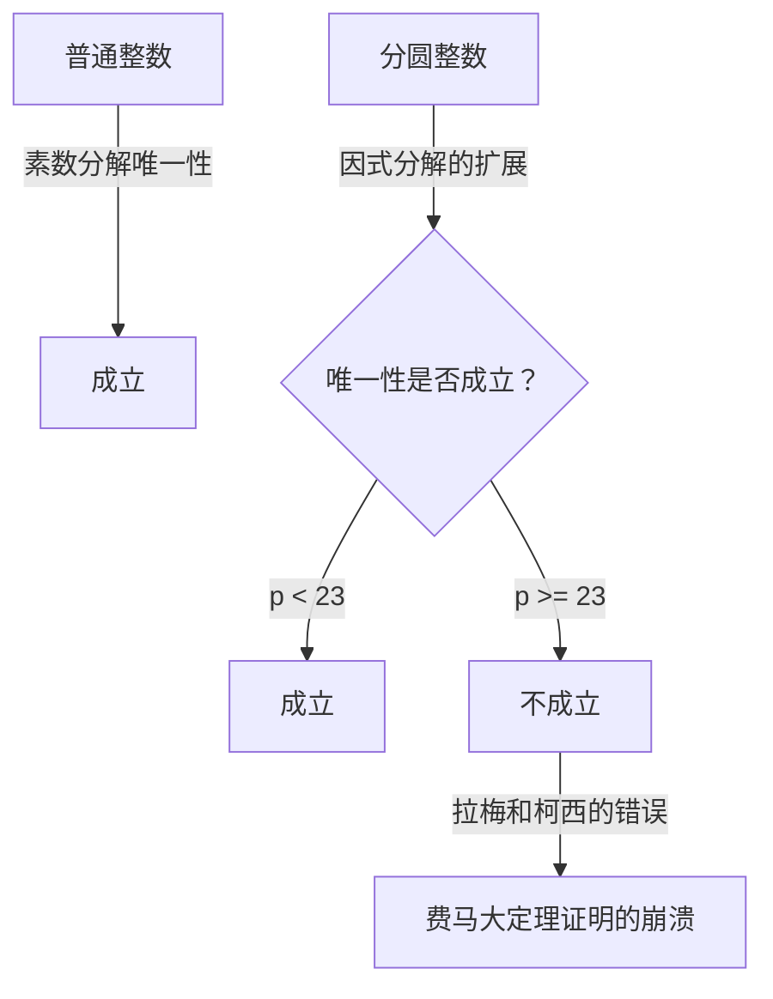
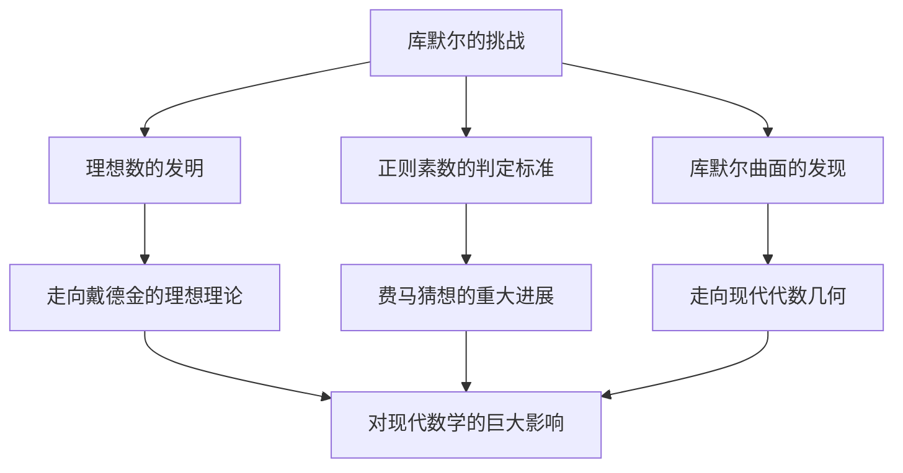

# 恩斯特·库默尔：理想数之父与代数数论的黎明

在数学的历史上，对某个特定未解之谜的挑战开启了全新研究领域的现象并不罕见。恩斯特·爱德华·库默尔 ( **Ernst Eduard Kummer** ) 就是一位创造了如此历史转折点的 19 世纪德国数学巨人。在与 **费马大定理** ( **Fermat's Last Theorem** ) 深刻搏斗的过程中，他引入了具有突破性的 **理想数** ( **Ideal Numbers** ) 概念，为现代代数数论奠定了基础。

在本文中，我们将深入探讨库默尔波澜壮阔的一生、围绕他的充满人情味的轶事，以及他在数学史上持续闪耀的辉煌成就。

---

## 库默尔的生平与教育

### 早年生活与从神学转向

恩斯特·库默尔于 1810 年 1 月 29 日出生在普鲁士王国（今属波兰）的索劳 ( **Sorau** )。他的父亲是一名医生，在库默尔很小的时候就去世了，他由母亲抚养长大。尽管家境贫寒，库默尔还是接受了良好的教育，并于 1828 年进入哈雷大学。

起初，他主修新教神学，但在海因里希·费迪南德·谢尔克 ( **Heinrich Ferdinand Scherk** ) 教授的影响下，他被数学的美和深度所吸引。在谢尔克教授的指导下，库默尔全身心投入数学研究，仅仅三年后的 1831 年就获得了博士学位。

### 担任文理中学教师的岁月与结识克罗内克

毕业后，库默尔未能立即获得大学教职，因此他在离家乡不远的利格尼茨 ( **Liegnitz** ) 的一所文理中学担任了大约十年的数学和物理教师。这段作为教师的时期绝不是浪费时间。他作为教育者怀有深厚的热情，并培养出了杰出的学生。

其中一位学生就是利奥波德·克罗内克 ( **Leopold Kronecker** )，他后来成为库默尔的同事和终生挚友。库默尔发现了克罗内克非凡的才华，教授他高等数学，并引导他走上了研究之路。在担任中学教师的同时，库默尔继续自己的研究，在柏林的学术期刊上发表了一系列出色的论文。

### 作为大学教授的荣耀

他卓越的研究成果吸引了当时顶尖数学家的注意。1842 年，在卡尔·古斯塔夫·雅各布·雅可比 ( **Carl Gustav Jacob Jacobi** ) 和彼得·古斯塔夫·勒热纳·狄利克雷 ( **Peter Gustav Lejeune Dirichlet** ) 的推荐下，库默尔成为布雷斯劳大学的正式教授。此外，在 1855 年，他被任命为柏林大学教授，接替前往哥廷根的狄利克雷。

在柏林大学，库默尔与卡尔·魏尔斯特拉斯 ( **Karl Weierstrass** ) 以及他以前的学生克罗内克一起，将柏林提升为全球数学中心。他的讲座极其清晰且充满激情，吸引了来自欧洲各地的许多才华横溢的学生。

---

## 轶事：不擅长算术的伟大数学家

关于库默尔最著名的轶事之一是他“不擅长计算”。尽管他是一位构建了高度抽象的数学和复杂理论的天才，但据报道，他经常在基础算术上陷入困境。

有一天在讲课时，库默尔在黑板上试图计算 $7 \times 9$ 时卡住了。

他面向学生们思考着：“七乘九等于……嗯……”
“是 61 吗？”他问道，一名学生回答：“不是，教授。”
“那么，是 65 吗？”
另一名学生喊道：“是 63！”
库默尔松了一口气，同意道：“对，63。那是正确的。”然后他流畅地继续讲课，仿佛什么都没发生过。

这段轶事至今仍在数学家之间流传，作为一个令人感到亲切的例子，说明了高级的数学直觉和简单的日常心算技能是完全不同的能力。

---

## 费马大定理与唯一分解的崩溃

库默尔最大的成就是他在数论中对 **费马大定理** 的研究。该定理指出以下内容：

$$
x^n + y^n = z^n \quad (\text{其中 } n \ge 3 \text{ 是整数})
$$

不存在满足该方程的正整数解 $(x, y, z)$。

1847 年，法国数学家加布里埃尔·拉梅 ( **Gabriel Lamé** ) 和奥古斯丁-路易·柯西 ( **Augustin-Louis Cauchy** ) 宣布他们已成功证明了这一定理。他们的方法是将因式分解扩展到复数（分圆域）领域。

使用 $1$ 的本原 $p$ 次方根 $\zeta$（其中 $\zeta^p = 1, \zeta \neq 1$），方程 $x^p + y^p = z^p$ 可以分解如下：

$$
x^p + y^p = (x + y)(x + \zeta y)(x + \zeta^2 y) \dots (x + \zeta^{p-1} y)
$$

拉梅等人隐含地假设了普通整数中的“素数分解唯一性”（即任何整数都可以唯一地表示为素数的乘积）在这个扩展的复整数（分圆整数）世界中同样成立。

然而，库默尔早在几年前就已经发现这个假设是错误的。例如，当 $p=23$ 时，素数分解的唯一性就不成立了。如果没有唯一分解，拉梅和柯西的证明就彻底崩溃了。

---

## 理想数的诞生

为了克服唯一分解崩溃的危机情况，库默尔创造了一个全新的概念： **理想数** ( **Ideal Numbers** )。

库默尔的想法是这样的：“如果素数分解不是唯一的，也许存在看不见的‘理想素数’，通过将元素分解为这些理想素数，就可以恢复唯一性。”这类似于化学中将物质从分子分解为原子，从而阐明其基本组成。

库默尔在分圆整数集合中定义了“理想因子”——这些因子作为普通数字并不存在，但在代数运算中可以完全一致地处理。通过这一点，他出色地在分圆整数领域恢复了素数分解的唯一性。

后来，理查德·戴德金 ( **Richard Dedekind** ) 推广了库默尔的理想数，使用集合论将其提升为 **理想** ( **Ideal** ) 的概念。这成为了现代代数几何和环论的基础。

---

## 正则素数与费马大定理的部分证明

利用理想数理论，库默尔对费马大定理发起了重击。他定义了 **正则素数** ( **Regular Primes** ) 的概念，并证明了一个惊人的结果：“如果 $p$ 是一个正则素数，那么费马大定理对 $p$ 成立。”

正则素数是指不能整除分圆域 $\mathbb{Q}(\zeta_p)$ 的类数 $h_p$ 的素数 $p$。类数是衡量唯一分解失败程度的一个指标；如果类数为 $1$，则唯一分解成立。

库默尔进一步发现了一个强大的标准来确定给定的素数是否为正则素数。它使用了 **伯努利数** ( **Bernoulli Numbers** ) $B_k$。如果一个素数 $p$ 不能整除以下任何伯努利数的分子，那么它就是正则素数：

$$
B_2, B_4, B_6, \dots, B_{p-3}
$$

利用这一标准，库默尔证明了费马大定理对于 $100$ 以下的所有素数都成立，除了非正则素数 $37, 59$ 和 $67$。这是一项具有里程碑意义的成就，在当时的数学界引起了轰动。

---

## 对几何学的贡献：库默尔曲面

除了在数论方面开创性的工作外，库默尔还在几何学领域做出了至关重要的发现。其中最具代表性的就是 **库默尔曲面** ( **Kummer Surface** )。

1864 年，库默尔研究了三维空间中一类特殊的四次曲面。这个曲面具有极其迷人的特性：它拥有最大可能数量的奇点（曲面不光滑的点，例如尖峰）——刚好 $16$ 个。

$$
\text{库默尔曲面的特征：} \quad \text{一个四次曲面，却拥有 16 个奇点}
$$

这个曲面后来在广泛的领域中发挥了至关重要的作用，从纯粹数学中的阿贝尔函数论到现代物理学中的弦理论。在代数几何中，它作为被称为 K3 曲面中最经典、最优美的例子之一，至今仍在被深入研究。

---

## 结论

恩斯特·库默尔在解决费马大定理这个“无解之谜”时，扩展了数学本身的框架。他的 **理想数** 思想成为后来代数学中不可或缺的语言，并继续影响着现代数学的各个分支。

虽然有着不擅长计算的普通人的一面，却被赋予了超越人类直觉发现“看不见的理想数”的洞察力，库默尔的才华无愧于天才的称号。库默尔的成就教会了我们，当面对看似不可能的问题时，重新思考框架本身是多么重要。

他不朽的遗产时至今日仍在激励着数学家们。
