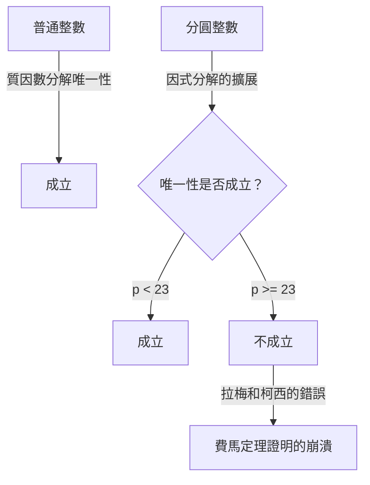
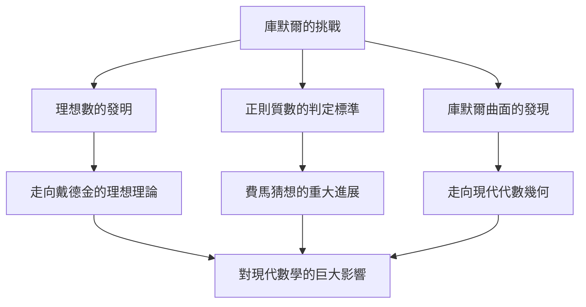

# [恩斯特·庫默爾](https://kenji.blog/zh-tw/p/kummer/)：理想數之父與代數數論的黎明

在數學的歷史上，對某個特定未解之謎的挑戰開啟了全新研究領域的現象並不罕見。恩斯特·愛德華·庫默爾 ( **Ernst Eduard [Kummer](https://kenji.blog/zh-tw/p/kummer/)** ) 就是一位創造了如此歷史轉折點的 19 世紀德國數學巨人。在與 **[費馬最後定理](/zh-tw/p/fermats-last-theorem/)** ( **[Fermat's Last Theorem](https://kenji.blog/zh-tw/p/fermats-last-theorem/)** ) 深刻搏鬥的過程中，他引入了具有突破性的 **理想數** ( **Ideal Numbers** ) 概念，為現代代數數論奠定了基礎。

在本文中，我們將深入探討庫默爾波瀾壯闊的一生、圍繞他的充滿人情味的軼事，以及他在數學史上持續閃耀的輝煌成就。

---

## 庫默爾的生平與教育

### 早年生活與從神學轉向

[恩斯特·庫默爾](https://kenji.blog/zh-tw/p/kummer/)於 1810 年 1 月 29 日出生在普魯士王國（今屬波蘭）的索勞 ( **Sorau** )。他的父親是一名醫生，在庫默爾很小的時候就去世了，他由母親撫養長大。儘管家境貧寒，庫默爾還是接受了良好的教育，並於 1828 年進入哈雷大學。

起初，他主修新教神學，但在海因里希·斐迪南·謝爾克 ( **Heinrich Ferdinand Scherk** ) 教授的影響下，他被數學的美和深度所吸引。在謝爾克教授的指導下，庫默爾全身心投入數學研究，僅僅三年後的 1831 年就獲得了博士學位。

### 擔任文理中學教師的歲月與結識克羅內克

畢業後，庫默爾未能立即獲得大學教職，因此他在離家鄉不遠的利格尼茨 ( **Liegnitz** ) 的一所文理中學擔任了大約十年的數學和物理教師。這段作為教師的時期絕不是浪費時間。他作為教育者懷有深厚的熱情，並培養出了傑出的學生。

其中一位學生就是[利奧波德·克羅內克](/zh-tw/p/kronecker/) ( **Leopold [Kronecker](https://kenji.blog/zh-tw/p/kronecker/)** )，他後來成為庫默爾的同事和終生摯友。庫默爾發現了克羅內克非凡的才華，教授他高等數學，並引導他走上了研究之路。在擔任中學教師的同時，庫默爾繼續自己的研究，在柏林的學術期刊上發表了一系列出色的論文。

### 作為大學教授的榮耀

他卓越的研究成果吸引了當時頂尖數學家的注意。1842 年，在[卡爾·古斯塔夫·雅各布·雅可比](https://kenji.blog/zh-tw/p/jacobi/) ( **[Carl Gustav Jacob Jacobi](https://kenji.blog/zh-tw/p/jacobi/)** ) 和彼得·古斯塔夫·勒熱納·狄利克雷 ( **Peter Gustav Lejeune Dirichlet** ) 的推薦下，庫默爾成為布雷斯勞大學的正式教授。此外，在 1855 年，他被任命為柏林大學教授，接替前往哥廷根的狄利克雷。

在柏林大學，庫默爾與[卡爾·魏爾斯特拉斯](https://kenji.blog/zh-tw/p/weierstrass/) ( **[Karl Weierstrass](https://kenji.blog/zh-tw/p/weierstrass/)** ) 以及他以前的學生克羅內克一起，將柏林提升為全球數學中心。他的講座極其清晰且充滿激情，吸引了來自歐洲各地的許多才華橫溢的學生。

---

## 軼事：不擅長算術的偉大數學家

關於庫默爾最著名的軼事之一是他「不擅長計算」。儘管他是一位建構了高度抽象的數學和複雜理論的天才，但據報導，他經常在基礎算術上陷入困境。

有一天在講課時，庫默爾在黑板上試圖計算 $7 \times 9$ 時卡住了。

他面向學生們思考著：「七乘九等於……嗯……」
「是 61 嗎？」他問道，一名學生回答：「不是，教授。」
「那麼，是 65 嗎？」
另一名學生喊道：「是 63！」
庫默爾鬆了一口氣，同意道：「對，63。那是正確的。」然後他流暢地繼續講課，彷彿什麼都沒發生過。

這段軼事至今仍在數學家之間流傳，作為一個令人感到親切的例子，說明了高級的數學直覺和簡單的日常心算技能是完全不同的能力。

---

## [費馬最後定理](https://kenji.blog/zh-tw/p/fermats-last-theorem/)與唯一分解的崩潰

庫默爾最大的成就是他在數論中對 **[費馬最後定理](https://kenji.blog/zh-tw/p/fermats-last-theorem/)** 的研究。該定理指出以下內容：

$$
x^n + y^n = z^n \quad (\text{其中 } n \ge 3 \text{ 是整數})
$$

不存在滿足該方程式的正整數解 $(x, y, z)$。

1847 年，法國數學家[加布里埃爾·拉梅](https://kenji.blog/zh-tw/p/lame/) ( **Gabriel Lamé** ) 和[奧古斯丁-路易·柯西](/zh-tw/p/cauchy/) ( **[Augustin-Louis Cauchy](https://kenji.blog/zh-tw/p/cauchy/)** ) 宣布他們已成功證明了這一定理。他們的方法是將因式分解擴展到複數（分圓域）領域。

使用 $1$ 的本原 $p$ 次方根 $\zeta$（其中 $\zeta^p = 1, \zeta \neq 1$），方程式 $x^p + y^p = z^p$ 可以分解如下：

$$
x^p + y^p = (x + y)(x + \zeta y)(x + \zeta^2 y) \dots (x + \zeta^{p-1} y)
$$

拉梅等人隱含地假設了普通整數中的「質因數分解唯一性」（即任何整數都可以唯一地表示為質數的乘積）在這個擴展的複整數（分圓整數）世界中同樣成立。

然而，庫默爾早在幾年前就已經發現這個假設是錯誤的。例如，當 $p=23$ 時，質因數分解的唯一性就不成立了。如果沒有唯一分解，拉梅和柯西的證明就徹底崩潰了。

---

## 理想數的誕生

為了克服唯一分解崩潰的危機情況，庫默爾創造了一個全新的概念： **理想數** ( **Ideal Numbers** )。

庫默爾的想法是這樣的：「如果質因數分解不是唯一的，也許存在看不見的『理想質數』，透過將元素分解為這些理想質數，就可以恢復唯一性。」這類似於化學中將物質從分子分解為原子，從而闡明其基本組成。

庫默爾在分圓整數集合中定義了「理想因子」——這些因子作為普通數字並不存在，但在代數運算中可以完全一致地處理。透過這一點，他出色地在分圓整數領域恢復了質因數分解的唯一性。

後來，理查德·戴德金 ( **Richard Dedekind** ) 推廣了庫默爾的理想數，使用集合論將其提升為 **理想** ( **Ideal** ) 的概念。這成為了現代代數幾何和環論的基礎。

---

## 正則質數與[費馬最後定理](https://kenji.blog/zh-tw/p/fermats-last-theorem/)的部分證明

利用理想數理論，庫默爾對[費馬最後定理](https://kenji.blog/zh-tw/p/fermats-last-theorem/)發起了重擊。他定義了 **正則質數** ( **Regular Primes** ) 的概念，並證明了一個驚人的結果：「如果 $p$ 是一個正則質數，那麼[費馬最後定理](https://kenji.blog/zh-tw/p/fermats-last-theorem/)對 $p$ 成立。」

正則質數是指不能整除分圓域 $\mathbb{Q}(\zeta_p)$ 的類數 $h_p$ 的質數 $p$。類數是衡量唯一分解失敗程度的一個指標；如果類數為 $1$，則唯一分解成立。

庫默爾進一步發現了一個強大的標準來確定給定的質數是否為正則質數。它使用了 **伯努利數** ( **Bernoulli Numbers** ) $B_k$。如果一個質數 $p$ 不能整除以下任何伯努利數的分子，那麼它就是正則質數：

$$
B_2, B_4, B_6, \dots, B_{p-3}
$$

利用這一標準，庫默爾證明了[費馬最後定理](https://kenji.blog/zh-tw/p/fermats-last-theorem/)對於 $100$ 以下的所有質數都成立，除了非正則質數 $37, 59$ 和 $67$。這是一項具有里程碑意義的成就，在當時的數學界引起了轟動。

---

## 對幾何學的貢獻：庫默爾曲面

除了在數論方面開創性的工作外，庫默爾還在幾何學領域做出了至關重要的發現。其中最具代表性的就是 **庫默爾曲面** ( **[Kummer](https://kenji.blog/zh-tw/p/kummer/) Surface** )。

1864 年，庫默爾研究了三維空間中一類特殊的四次曲面。這個曲面具有極其迷人的特性：它擁有最大可能數量的奇點（曲面不光滑的點，例如尖峰）——剛好 $16$ 個。

$$
\text{庫默爾曲面的特徵：} \quad \text{一個四次曲面，卻擁有 16 個奇點}
$$

這個曲面後來在廣泛的領域中發揮了至關重要的作用，從純粹數學中的阿貝爾函數論到現代物理學中的弦理論。在代數幾何中，它作為被稱為 K3 曲面中最經典、最優美的例子之一，至今仍在被深入研究。

---

## 結論

[恩斯特·庫默爾](https://kenji.blog/zh-tw/p/kummer/)在解決[費馬最後定理](https://kenji.blog/zh-tw/p/fermats-last-theorem/)這個「無解之謎」時，擴展了數學本身的框架。他的 **理想數** 思想成為後來代數學中不可或缺的語言，並繼續影響著現代數學的各個分支。

雖然有著不擅長計算的普通人的一面，卻被賦予了超越人類直覺發現「看不見的理想數」的洞察力，庫默爾的才華無愧於天才的稱號。庫默爾的成就教會了我們，當面對看似不可能的問題時，重新思考框架本身是多麼重要。

他不朽的遺產時至今日仍在激勵著數學家們。
