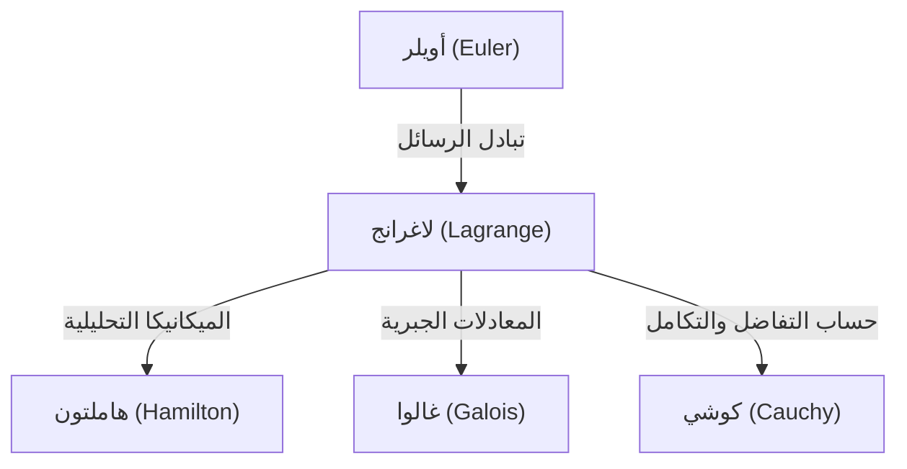

## مقدمة

في تاريخ الرياضيات والفيزياء، كان القرن الثامن عشر حقبة تألق فيها العباقرة العظماء مثل النجوم. ومن بينهم أحد أعظم علماء الرياضيات، والذي يُذكر غالباً إلى جانب ليونهارت أويلر، وهو **[جوزيف لويس لاغرانج](https://kenji.blog/p/lagrange/)** (1736-1813). يُعرف بأنه مؤسس "الميكانيكا التحليلية"، حيث أسس حساب التغيرات وارتقى بالميكانيكا من الحدس الهندسي إلى التحليل الرياضي البحت.

في هذا المقال، سوف نتعمق في الحياة المضطربة للاغرانج، الذي كان يتمتع بشخصية متواضعة وتأملية، وإنجازاته الرياضية والفيزيائية الضخمة التي تشكل أساس العلوم والتكنولوجيا الحديثة.

## حياة لاغرانج

### الولادة في تورينو واليقظة المبكرة

ولد لاغرانج في 25 يناير 1736 في تورينو، إيطاليا. كان اسمه الحقيقي جوزيبي لودوفيكو لاغرانجيا. ولأن جده كان فرنسياً، فقد اتخذ لاحقاً اسماً فرنسياً. وُلد في عائلة ثرية، ولكن لأن والده فقد ثروته في المضاربة، اضطر لاغرانج إلى الاستقلال في سن مبكرة. في وقت لاحق من حياته، تذكر قائلاً: "لو كنت غنياً، ربما لم أكن لأكرس نفسي للرياضيات".

في البداية، درس القانون، ولكن في سن السابعة عشرة، وبعد قراءة ورقة بحثية عن البصريات لإدموند هالي، استيقظ على اهتمام شديد بالرياضيات. درس الرياضيات بشكل مكثف بمفرده وعُيِّن أستاذاً للرياضيات في المدرسة الملكية للمدفعية في تورينو وهو في سن التاسعة عشرة فقط.

في هذا الوقت تقريباً، بدأ مراسلة مع أويلر، حيث نقل إليه فكرة رائدة تتعلق بتعميم مشكلة المنحنى متساوي الزمن (والذي أصبح لاحقاً حساب التغيرات). أشاد أويلر بموهبته بشدة وأجل بشكل شهير نشر ورقته البحثية ليمنح أولوية الاكتشاف لهذا العبقري الشاب.

### عصر أكاديمية برلين

في عام 1766، وبدعوة من فريدريك العظيم، عُيِّن مديراً للرياضيات في الأكاديمية البروسية للعلوم (أكاديمية برلين)، خلفاً لأويلر. رحب به فريدريك العظيم قائلاً: "أعظم ملك في أوروبا يتمنى أن يكون أعظم عالم رياضيات في أوروبا في بلاطه".

كانت العشرين عاماً التي قضاها في برلين الفترة الأكثر إنتاجية للاغرانج. فقد نشر تباعاً أوراقاً بحثية مبتكرة في مجموعة مذهلة من المجالات، بما في ذلك الميكانيكا وديناميكا الموائع ونظرية الاحتمالات ونظرية الأعداد. كُتب الجزء الأكبر من تحفته، *الميكانيكا التحليلية* (Mécanique analytique)، أيضاً خلال هذه الفترة في برلين.

### السنوات الأخيرة في باريس

في عام 1787، بعد وفاة فريدريك العظيم، انتقل لاغرانج إلى باريس، فرنسا، بدعوة من لويس السادس عشر. أُعطي شققاً في قصر اللوفر، لكن سنوات العمل الإضافي الطويلة أثرت عليه سلباً، وعانى من اكتئاب شديد. يُقال إنه عندما نُشر كتاب *الميكانيكا التحليلية* في عام 1788، لم يفتح كتابه المطبوع حديثاً لمدة عامين.

ومع ذلك، عندما اندلعت الثورة الفرنسية، استأنف نشاطه كعضو في لجنة إنشاء النظام الجديد للأوزان والمقاييس (النظام المتري). حتى في عاصفة الثورة، أنقذته شهرته وشخصيته اللطيفة من الإعدام (عندما تم إعدام صديقه المقرب، الكيميائي لافوازييه، رثاه قائلاً: "لم يستغرق الأمر سوى لحظة لقطع هذا الرأس، لكن الأمر لن يستغرق مائة عام لإنتاج رأس مثله").

في وقت لاحق، أصبح أول أستاذ في مدرسة البوليتكنيك وكرس نفسه للتعليم. توفي في باريس عام 1813 عن عمر يناهز 77 عاماً ودُفن في البانثيون.

## الإنجازات الكبرى في الرياضيات والفيزياء

إنجازات لاغرانج واسعة بشكل لا يصدق، لكننا نقدم هنا بعضاً من أهمها.

### 1. حساب التغيرات ومعادلة أويلر-لاغرانج

صاغ لاغرانج بدقة "حساب التغيرات"، الذي يجد الدالة التي تعظم أو تقلل دالياً (دالة الدالة). بافتراض أن $S$ هو تكامل الفعل و $L$ هو اللاغرانجيان، يتم وصف المعادلة الأساسية للميكانيكا بناءً على مبدأ الفعل الأقل على النحو التالي:

$$ \frac{\partial L}{\partial q_i} - \frac{d}{dt} \left( \frac{\partial L}{\partial \dot{q}_i} \right) = 0 $$

هنا، $q_i$ هي الإحداثيات المعممة و $\dot{q}_i$ هي السرعات المعممة. سمحت **معادلة أويلر-لاغرانج** هذه بحل مشاكل النظام المقيدة، مثل المستويات المائلة أو البندولات - المعقدة في الميكانيكا النيوتونية - بطريقة موحدة ومستقلة عن اختيار نظام الإحداثيات.

### 2. بناء الميكانيكا التحليلية

يُعد كتاب *الميكانيكا التحليلية* المنشور عام 1788 تحفة تاريخية حررت الميكانيكا من المخططات الهندسية وأعادت بنائها كنظام من الجبر والتحليل البحت. في المقدمة، أعلن لاغرانج: "لن يتم العثور على أي مخططات في هذا العمل". أصبح هذا التجريد أساساً صلباً أدى إلى ميكانيكا هاملتون بواسطة هاملتون لاحقاً، ومن ثم إلى ميكانيكا الكم في القرن العشرين.

### 3. مضاعفات لاغرانج

إحدى الطرق الرياضية القوية للعثور على القيم القصوى والدنيا المحلية لدالة تخضع لقيود المساواة هي طريقة **مضاعفات لاغرانج**.
عند الرغبة في تعظيم أو تقليل الدالة $f(x, y)$ مع مراعاة القيد $g(x, y) = 0$، يتم إدخال مضاعف غير محدد $\lambda$ لتعريف دالة جديدة (اللاغرانجيان):

$$ \mathcal{L}(x, y, \lambda) = f(x, y) - \lambda \cdot g(x, y) $$

من خلال إيجاد النقطة التي يصبح فيها تدرج هذه الدالة صفراً ($\nabla \mathcal{L} = 0$)، يمكن العثور على الحل الأمثل. تعد هذه الطريقة أداة أساسية في الاقتصاد الحديث ومشاكل التحسين في التعلم الآلي.

### 4. مساهمات في نظرية الأعداد والجبر

ترك لاغرانج أيضاً إنجازات رائعة في نظرية الأعداد.
- **مبرهنة المربعات الأربعة للاغرانج**: أثبت المبرهنة التي تنص على أن كل عدد طبيعي يمكن تمثيله كمجموع لأربعة مربعات أعداد صحيحة على الأكثر (مثل، $7 = 2^2 + 1^2 + 1^2 + 1^2$).
- **الحل الجبري للمعادلات**: باستخدام فكرة تباديل الجذور، كان رائداً في البحث حول ما إذا كان يمكن حل معادلات الدرجة الخامسة أو أعلى جبرياً. كانت هذه خطوة مهمة تطورت لاحقاً إلى نظرية غالوا ونظرية الزمر.

## الفلسفة والتأثير على الأجيال اللاحقة

تتميز طريقة لاغرانج بمتابعة الدقة المنطقية والجمال التحليلي مع القضاء على الحدس. يمكن تخطيط تأثيره على النحو التالي:

أصبح مفهوم "اللاغرانجيان" الذي تركه وراءه اللغة المشتركة لوصف جميع المعادلات الأساسية للفيزياء الحديثة، من النموذج القياسي لفيزياء الجسيمات إلى النسبية العامة.

## خاتمة

نجا [جوزيف لويس لاغرانج](https://kenji.blog/p/lagrange/) من القرن الثامن عشر المضطرب، ومع ذلك كان عقله دائماً في عالم الحقيقة الرياضية البحتة. إن إنجازاته ليست مجرد اكتشافات سابقة؛ إنها لا تزال تتنفس في طليعة الفيزياء والرياضيات اليوم. إن إرثه، الذي يؤمن بجمال الصيغ الرياضية وعالمية المنطق، سيستمر في توجيه سعي البشرية للمعرفة.
