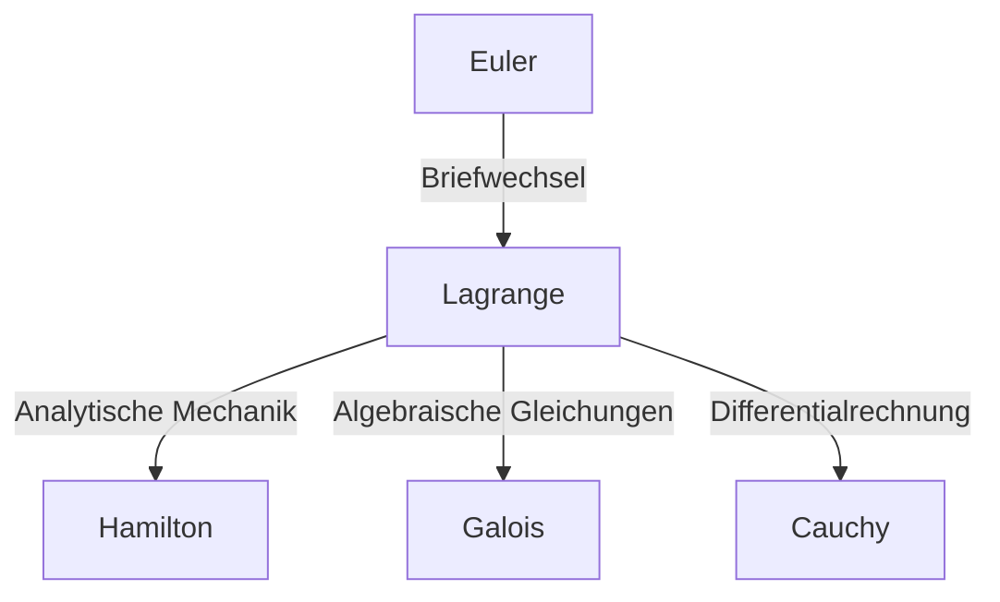

## Einleitung

In der Geschichte der Mathematik und Physik war das 18. Jahrhundert eine Ära, in der große Genies wie Sterne leuchteten. Unter ihnen ist einer der größten Mathematiker, der oft neben [Leonhard Euler](https://kenji.blog/de/p/euler/) erwähnt wird, **[Joseph-Louis Lagrange](https://kenji.blog/de/p/lagrange/)** (1736–1813). Er ist als Begründer der „analytischen Mechanik“ bekannt, da er die Variationsrechnung etablierte und die Mechanik aus der geometrischen Intuition in die reine mathematische Analyse erhob.

In diesem Artikel werden wir uns mit dem turbulenten Leben von [Lagrange](https://kenji.blog/de/p/lagrange/), der eine bescheidene und nachdenkliche Persönlichkeit besaß, und seinen monumentalen mathematischen und physikalischen Errungenschaften befassen, die das Fundament der modernen Wissenschaft und Technologie bilden.

## Das Leben von [Lagrange](https://kenji.blog/de/p/lagrange/)

### Geburt in Turin und frühes Erwachen

[Lagrange](https://kenji.blog/de/p/lagrange/) wurde am 25. Januar 1736 in Turin, Italien, geboren. Sein eigentlicher Name war Giuseppe Lodovico Lagrangia. Da sein Großvater Franzose war, nahm er später einen französisch klingenden Namen an. Er wurde in eine wohlhabende Familie geboren, aber da sein Vater sein Vermögen durch Spekulationen verlor, war [Lagrange](https://kenji.blog/de/p/lagrange/) gezwungen, schon in jungen Jahren unabhängig zu werden. Später erinnerte er sich: „Wäre ich reich gewesen, hätte ich mich wahrscheinlich nicht der Mathematik gewidmet.“

Zunächst studierte er Jura, aber im Alter von 17 Jahren, nachdem er eine Abhandlung von Edmond Halley über Optik gelesen hatte, erwachte in ihm ein intensives Interesse an der Mathematik. Er studierte intensiv Mathematik im Selbststudium und wurde im jungen Alter von 19 Jahren zum Professor für Mathematik an der Königlichen Artillerieschule in Turin ernannt.

Um diese Zeit begann er einen Briefwechsel mit Euler, in dem er eine bahnbrechende Idee bezüglich der Verallgemeinerung des Tautochronenproblems (aus der später die Variationsrechnung wurde) vermittelte. Euler lobte sein Talent in höchsten Tönen und verzögerte bekanntermaßen die Veröffentlichung seiner eigenen Arbeit, um die Priorität der Entdeckung diesem jungen Genie zu überlassen.

### Die Ära der Berliner Akademie

1766 wurde er auf Einladung Friedrichs des Großen als Nachfolger Eulers zum Direktor der Mathematik an der Preußischen Akademie der Wissenschaften (Berliner Akademie) ernannt. Friedrich der Große begrüßte ihn mit den Worten: „Der größte König Europas wünscht den größten Mathematiker Europas an seinem Hof zu haben.“

Die 20 Jahre in Berlin waren die produktivste Zeit für [Lagrange](https://kenji.blog/de/p/lagrange/). Er veröffentlichte nacheinander innovative Arbeiten in einer erstaunlichen Vielfalt von Bereichen, darunter Mechanik, Fluiddynamik, Wahrscheinlichkeitstheorie und Zahlentheorie. Der Großteil seines Meisterwerks, der *Mécanique analytique* (Analytische Mechanik), wurde ebenfalls in dieser Berliner Zeit geschrieben.

### Späte Jahre in Paris

1787, nach dem Tod Friedrichs des Großen, zog [Lagrange](https://kenji.blog/de/p/lagrange/) auf Einladung Ludwigs XVI. nach Paris, Frankreich. Ihm wurden Wohnräume im Louvre-Palast zugewiesen, aber die langen Jahre der Überarbeitung forderten ihren Tribut, und er litt unter schweren Depressionen. Es wird gesagt, dass er bei der Veröffentlichung der *Mécanique analytique* im Jahr 1788 sein frisch gedrucktes Buch zwei Jahre lang nicht öffnete.

Als jedoch die Französische Revolution ausbrach, nahm er seine Tätigkeit als Ausschussmitglied für die Einführung des neuen Maß- und Gewichtssystems (des metrischen Systems) wieder auf. Selbst im Sturm der Revolution bewahrten ihn sein Ruhm und seine sanfte Persönlichkeit vor der Hinrichtung (als sein enger Freund, der Chemiker Lavoisier, hingerichtet wurde, klagte er: „Es dauerte nur einen Moment, um diesen Kopf abzuschlagen, aber es wird keine hundert Jahre dauern, um einen ähnlichen hervorzubringen“).

Später wurde er der erste Professor der École Polytechnique und widmete sich der Lehre. Er verstarb 1813 im Alter von 77 Jahren in Paris und wurde im Panthéon beigesetzt.

## Wichtige Errungenschaften in Mathematik und Physik

[Lagrange](https://kenji.blog/de/p/lagrange/)s Errungenschaften sind unglaublich breit gefächert, aber hier stellen wir einige der wichtigsten vor.

### 1. Variationsrechnung und die Euler-[Lagrange](https://kenji.blog/de/p/lagrange/)-Gleichung

[Lagrange](https://kenji.blog/de/p/lagrange/) formulierte streng die „Variationsrechnung“, die die Funktion findet, die ein Funktional (eine Funktion einer Funktion) maximiert oder minimiert. Wenn $S$ das Wirkungsintegral und $L$ die [Lagrange](https://kenji.blog/de/p/lagrange/)-Funktion ist, wird die Grundgleichung der Mechanik basierend auf dem Prinzip der kleinsten Wirkung wie folgt beschrieben:

$$ \frac{\partial L}{\partial q_i} - \frac{d}{dt} \left( \frac{\partial L}{\partial \dot{q}_i} \right) = 0 $$

Hierbei sind $q_i$ die generalisierten Koordinaten und $\dot{q}_i$ die generalisierten Geschwindigkeiten. Diese **Euler-[Lagrange](https://kenji.blog/de/p/lagrange/)-Gleichung** ermöglichte es, Probleme von Zwangssystemen wie schiefe Ebenen oder Pendel, die in der Newtonschen Mechanik kompliziert sind, auf einheitliche Weise und unabhängig von der Wahl des Koordinatensystems zu lösen.

### 2. Konstruktion der analytischen Mechanik

Die 1788 veröffentlichte *Mécanique analytique* ist ein historisches Meisterwerk, das die Mechanik von geometrischen Diagrammen befreite und als System der reinen Algebra und Analysis rekonstruierte. Im Vorwort erklärte [Lagrange](https://kenji.blog/de/p/lagrange/): „In diesem Werk wird man keine Abbildungen finden.“ Diese Abstraktion wurde zu einem soliden Fundament, das später zur Hamiltonschen Mechanik durch Hamilton und im 20. Jahrhundert zur Quantenmechanik führte.

### 3. [Lagrange](https://kenji.blog/de/p/lagrange/)-Multiplikatoren

Eine leistungsstarke mathematische Methode zum Auffinden lokaler Maxima und Minima einer Funktion unter Gleichungsnebenbedingungen ist die Methode der **[Lagrange](https://kenji.blog/de/p/lagrange/)-Multiplikatoren**.
Wenn man eine Funktion $f(x, y)$ unter der Nebenbedingung $g(x, y) = 0$ maximieren oder minimieren möchte, wird ein unbestimmter Multiplikator $\lambda$ eingeführt, um eine neue Funktion (die [Lagrange](https://kenji.blog/de/p/lagrange/)-Funktion) zu definieren:

$$ \mathcal{L}(x, y, \lambda) = f(x, y) - \lambda \cdot g(x, y) $$

Durch Lösen nach dem Punkt, an dem der Gradient dieser Funktion Null wird ($\nabla \mathcal{L} = 0$), kann die optimale Lösung gefunden werden. Diese Methode ist ein unverzichtbares Werkzeug in den modernen Wirtschaftswissenschaften und bei Optimierungsproblemen im maschinellen Lernen.

### 4. Beiträge zur Zahlentheorie und Algebra

[Lagrange](https://kenji.blog/de/p/lagrange/) hinterließ auch brillante Errungenschaften in der Zahlentheorie.
- **Vier-Quadrate-Satz von [Lagrange](https://kenji.blog/de/p/lagrange/)**: Er bewies den Satz, dass jede natürliche Zahl als Summe von höchstens vier Quadratzahlen dargestellt werden kann (z.B. $7 = 2^2 + 1^2 + 1^2 + 1^2$).
- **Algebraische Lösung von Gleichungen**: Unter Verwendung der Idee der Permutationen von Wurzeln leistete er Pionierarbeit bei der Untersuchung, ob Gleichungen fünften oder höheren Grades algebraisch gelöst werden können. Dies war ein wichtiger Schritt, der sich später zur [Galois](https://kenji.blog/de/p/galois/)-Theorie und Gruppentheorie entwickelte.

## Philosophie und Einfluss auf spätere Generationen

[Lagrange](https://kenji.blog/de/p/lagrange/)s Methode zeichnet sich durch das Streben nach logischer Strenge und analytischer Schönheit bei gleichzeitigem Verzicht auf Intuition aus. Sein Einfluss lässt sich wie folgt schematisch darstellen:

Das Konzept der „[Lagrange](https://kenji.blog/de/p/lagrange/)-Funktion“ (Lagrangian), das er hinterließ, ist zur gemeinsamen Sprache für die Beschreibung aller grundlegenden Gleichungen der modernen Physik geworden, vom Standardmodell der Teilchenphysik bis zur allgemeinen Relativitätstheorie.

## Fazit

[Joseph-Louis Lagrange](https://kenji.blog/de/p/lagrange/) überlebte das turbulente 18. Jahrhundert, doch sein Geist befand sich stets in der Welt der reinen mathematischen Wahrheit. Seine Errungenschaften sind nicht nur Entdeckungen der Vergangenheit; sie atmen noch heute an vorderster Front von Physik und Mathematik. Sein Vermächtnis, der Glaube an die Schönheit mathematischer Formeln und die Universalität der Logik, wird weiterhin das Streben der Menschheit nach Wissen leiten.
