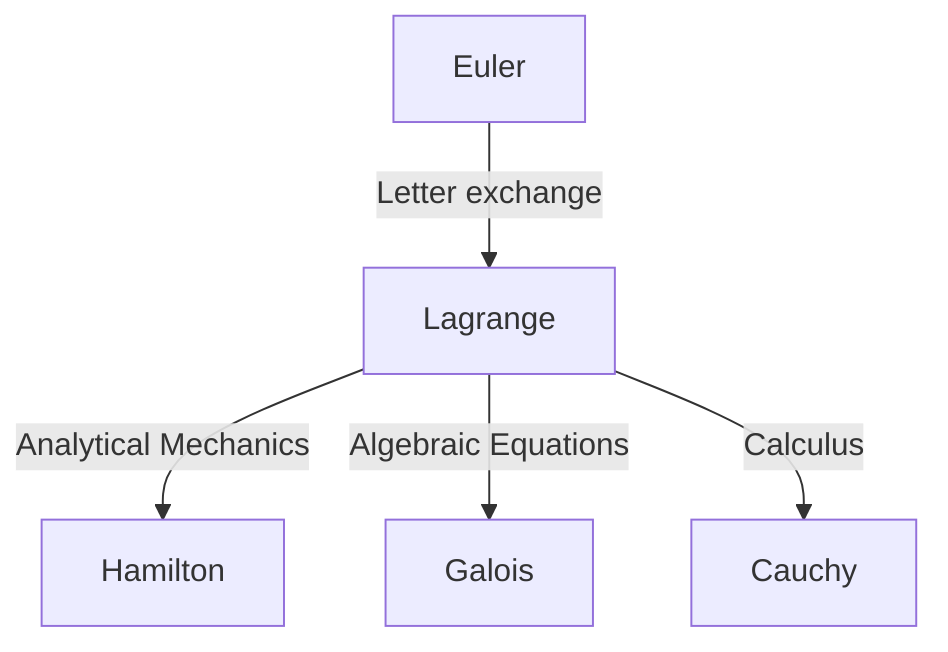

## Introduction

In the history of mathematics and physics, the 18th century was an era when great geniuses shone like stars. Among them, one of the greatest mathematicians, often mentioned alongside [Leonhard Euler](https://kenji.blog/en/p/euler/), is **[Joseph-Louis Lagrange](https://kenji.blog/en/p/lagrange/)** (1736–1813). He is known as the founder of "analytical mechanics," having established the calculus of variations and elevated mechanics from geometric intuition to pure mathematical analysis.

In this article, we will delve into the turbulent life of [Lagrange](https://kenji.blog/en/p/lagrange/), who had a modest and contemplative personality, and his monumental mathematical and physical achievements that form the foundation of modern science and technology.

## The Life of [Lagrange](https://kenji.blog/en/p/lagrange/)

### Birth in Turin and Early Awakening

[Lagrange](https://kenji.blog/en/p/lagrange/) was born on January 25, 1736, in Turin, Italy. His real name was Giuseppe Lodovico Lagrangia. Since his grandfather was French, he later adopted a French-style name. He was born into a wealthy family, but because his father lost his fortune through speculation, [Lagrange](https://kenji.blog/en/p/lagrange/) was forced to become independent at a young age. Later in life, he recalled, "If I had been rich, I probably would not have devoted myself to mathematics."

Initially, he studied law, but at the age of 17, after reading a paper on optics by Edmond Halley, he awakened to an intense interest in mathematics. He studied mathematics intensely on his own and was appointed professor of mathematics at the Royal Artillery School in Turin at the young age of 19.

Around this time, he began a correspondence with Euler, conveying a groundbreaking idea regarding the generalization of the tautochrone problem (which later became the calculus of variations). Euler highly praised his talent and famously delayed the publication of his own paper to yield the priority of the discovery to this young genius.

### The Berlin Academy Era

In 1766, at the invitation of Frederick the Great, he was appointed Director of Mathematics at the Prussian Academy of Sciences (Berlin Academy), succeeding Euler. Frederick the Great welcomed him, saying, "The greatest king in Europe wishes to have the greatest mathematician in Europe at his court."

The 20 years in Berlin were the most productive period for [Lagrange](https://kenji.blog/en/p/lagrange/). He successively published innovative papers in an astonishing variety of fields, including mechanics, fluid dynamics, probability theory, and number theory. The majority of his masterpiece, *Mécanique analytique* (Analytical Mechanics), was also written during this Berlin era.

### Later Years in Paris

In 1787, after the death of Frederick the Great, [Lagrange](https://kenji.blog/en/p/lagrange/) moved to Paris, France, at the invitation of Louis XVI. He was given apartments in the Louvre Palace, but long years of overwork took their toll, and he suffered from severe depression. It is said that when *Mécanique analytique* was published in 1788, he did not open his freshly printed book for two years.

However, when the French Revolution broke out, he resumed his activities as a committee member for the establishment of the new system of weights and measures (the metric system). Even in the storm of the revolution, his fame and gentle personality saved him from execution (when his close friend, the chemist Lavoisier, was executed, he lamented, "It took them only an instant to cut off that head, but it will not take a hundred years to produce another like it").

Later, he became the first professor of the École Polytechnique and devoted himself to education. He passed away in Paris in 1813 at the age of 77 and was buried in the Panthéon.

## Major Achievements in Mathematics and Physics

[Lagrange](https://kenji.blog/en/p/lagrange/)'s achievements are incredibly broad, but here we introduce some of the most important ones.

### 1. Calculus of Variations and the Euler-[Lagrange](https://kenji.blog/en/p/lagrange/) Equation

[Lagrange](https://kenji.blog/en/p/lagrange/) strictly formulated the "calculus of variations," which finds the function that maximizes or minimizes a functional (a function of a function). Letting $S$ be the action integral and $L$ the Lagrangian, the fundamental equation of mechanics based on the principle of least action is described as follows:

$$ \frac{\partial L}{\partial q_i} - \frac{d}{dt} \left( \frac{\partial L}{\partial \dot{q}_i} \right) = 0 $$

Here, $q_i$ are the generalized coordinates and $\dot{q}_i$ are the generalized velocities. This **Euler-[Lagrange](https://kenji.blog/en/p/lagrange/) equation** allowed constrained system problems, such as inclined planes or pendulums—which are complicated in Newtonian mechanics—to be solved in a unified way independent of the choice of coordinate system.

### 2. Construction of Analytical Mechanics

Published in 1788, *Mécanique analytique* is a historic masterpiece that freed mechanics from geometric diagrams and reconstructed it as a system of pure algebra and calculus. In the preface, [Lagrange](https://kenji.blog/en/p/lagrange/) declared, "No diagrams will be found in this work." This abstraction became a solid foundation leading to Hamiltonian mechanics by Hamilton later on, and further to quantum mechanics in the 20th century.

### 3. [Lagrange](https://kenji.blog/en/p/lagrange/) Multipliers

A powerful mathematical method for finding the local maxima and minima of a function subject to equality constraints is the method of **[Lagrange](https://kenji.blog/en/p/lagrange/) multipliers**.
When wanting to maximize or minimize a function $f(x, y)$ subject to the constraint $g(x, y) = 0$, an undetermined multiplier $\lambda$ is introduced to define a new function (the Lagrangian):

$$ \mathcal{L}(x, y, \lambda) = f(x, y) - \lambda \cdot g(x, y) $$

By solving for the point where the gradient of this function becomes zero ($\nabla \mathcal{L} = 0$), the optimal solution can be found. This method is an essential tool in modern economics and optimization problems in machine learning.

### 4. Contributions to Number Theory and Algebra

[Lagrange](https://kenji.blog/en/p/lagrange/) also left brilliant achievements in number theory.
- **[Lagrange](https://kenji.blog/en/p/lagrange/)'s four-square theorem**: He proved the theorem that every natural number can be represented as the sum of at most four integer squares (e.g., $7 = 2^2 + 1^2 + 1^2 + 1^2$).
- **Algebraic solution of equations**: Using the idea of permutations of roots, he pioneered the research on whether equations of degree five or higher could be solved algebraically. This was an important step that later developed into [Galois theory](https://kenji.blog/en/p/galois-theory/) and group theory.

## Philosophy and Influence on Later Generations

[Lagrange](https://kenji.blog/en/p/lagrange/)'s method is characterized by pursuing logical rigor and analytical beauty while eliminating intuition. His influence can be diagrammed as follows:

The concept of the "Lagrangian" that he left behind has become the common language for describing all the fundamental equations of modern physics, from the Standard Model of particle physics to general relativity.

## Conclusion

[Joseph-Louis Lagrange](https://kenji.blog/en/p/lagrange/) survived the turbulent 18th century, yet his mind was always in the world of pure mathematical truth. His achievements are not merely past discoveries; they still breathe at the forefront of physics and mathematics today. His legacy, believing in the beauty of mathematical formulas and the universality of logic, will continue to guide humanity's quest for knowledge.
