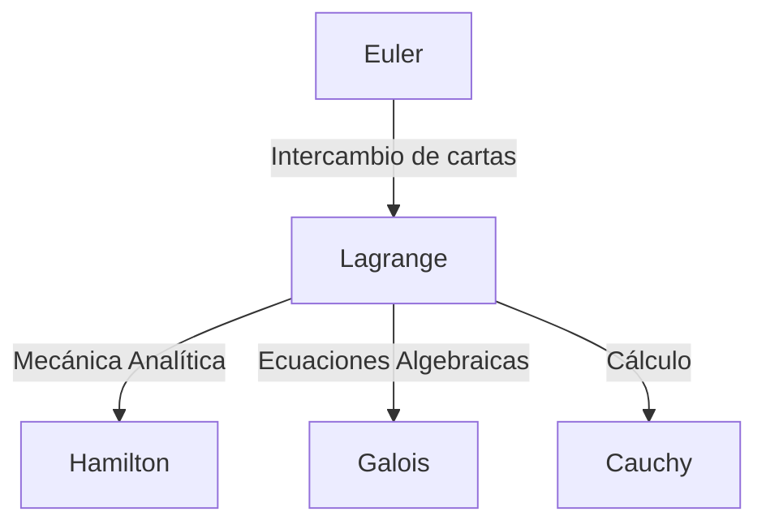

## Introducción

En la historia de las matemáticas y la física, el siglo XVIII fue una época en la que grandes genios brillaron como estrellas. Entre ellos, uno de los matemáticos más grandes, a menudo mencionado junto a [Leonhard Euler](https://kenji.blog/es/p/euler/), es **[Joseph-Louis Lagrange](https://kenji.blog/es/p/lagrange/)** (1736–1813). Es conocido como el fundador de la "mecánica analítica", habiendo establecido el cálculo de variaciones y elevado la mecánica de la intuición geométrica al puro análisis matemático.

En este artículo, profundizaremos en la turbulenta vida de [Lagrange](https://kenji.blog/es/p/lagrange/), quien tenía una personalidad modesta y contemplativa, y sus monumentales logros matemáticos y físicos que forman la base de la ciencia y la tecnología modernas.

## La Vida de [Lagrange](https://kenji.blog/es/p/lagrange/)

### Nacimiento en Turín y Despertar Temprano

[Lagrange](https://kenji.blog/es/p/lagrange/) nació el 25 de enero de 1736 en Turín, Italia. Su verdadero nombre era Giuseppe Lodovico Lagrangia. Como su abuelo era francés, más tarde adoptó un nombre de estilo francés. Nació en una familia adinerada, pero debido a que su padre perdió su fortuna a través de la especulación, [Lagrange](https://kenji.blog/es/p/lagrange/) se vio obligado a independizarse a una edad temprana. Más adelante en la vida, recordó: "Si hubiera sido rico, probablemente no me habría dedicado a las matemáticas".

Inicialmente, estudió derecho, pero a la edad de 17 años, después de leer un artículo sobre óptica de Edmond Halley, despertó en él un intenso interés por las matemáticas. Estudió matemáticas intensamente por su cuenta y fue nombrado profesor de matemáticas en la Real Escuela de Artillería de Turín a la temprana edad de 19 años.

Alrededor de esta época, comenzó una correspondencia con Euler, transmitiendo una idea innovadora sobre la generalización del problema de la curva tautócrona (que más tarde se convirtió en el cálculo de variaciones). Euler elogió mucho su talento y retrasó la publicación de su propio artículo para ceder la prioridad del descubrimiento a este joven genio.

### La Era de la Academia de Berlín

En 1766, por invitación de Federico el Grande, fue nombrado Director de Matemáticas en la Academia Prusiana de las Ciencias (Academia de Berlín), sucediendo a Euler. Federico el Grande le dio la bienvenida diciendo: "El rey más grande de Europa desea tener al matemático más grande de Europa en su corte".

Los 20 años en Berlín fueron el período más productivo para [Lagrange](https://kenji.blog/es/p/lagrange/). Publicó sucesivamente artículos innovadores en una asombrosa variedad de campos, incluyendo mecánica, dinámica de fluidos, teoría de la probabilidad y teoría de números. La mayor parte de su obra maestra, la *Mécanique analytique* (Mecánica Analítica), también fue escrita durante esta era berlinesa.

### Últimos Años en París

En 1787, después de la muerte de Federico el Grande, [Lagrange](https://kenji.blog/es/p/lagrange/) se trasladó a París, Francia, por invitación de Luis XVI. Se le asignaron apartamentos en el Palacio del Louvre, pero los largos años de exceso de trabajo le pasaron factura y sufrió una grave depresión. Se dice que cuando se publicó la *Mécanique analytique* en 1788, no abrió su libro recién impreso durante dos años.

Sin embargo, cuando estalló la Revolución Francesa, reanudó sus actividades como miembro del comité para el establecimiento del nuevo sistema de pesos y medidas (el sistema métrico). Incluso en la tormenta de la revolución, su fama y su personalidad amable lo salvaron de la ejecución (cuando su amigo cercano, el químico Lavoisier, fue ejecutado, se lamentó: "Solo les tomó un instante cortar esa cabeza, pero no pasarán cien años antes de que se produzca otra igual").

Más tarde, se convirtió en el primer profesor de la École Polytechnique y se dedicó a la educación. Falleció en París en 1813 a la edad de 77 años y fue enterrado en el Panteón.

## Principales Logros en Matemáticas y Física

Los logros de [Lagrange](https://kenji.blog/es/p/lagrange/) son increíblemente amplios, pero aquí presentamos algunos de los más importantes.

### 1. Cálculo de Variaciones y la Ecuación de Euler-[Lagrange](https://kenji.blog/es/p/lagrange/)

[Lagrange](https://kenji.blog/es/p/lagrange/) formuló estrictamente el "cálculo de variaciones", que encuentra la función que maximiza o minimiza un funcional (una función de una función). Si $S$ es la integral de acción y $L$ el lagrangiano, la ecuación fundamental de la mecánica basada en el principio de mínima acción se describe de la siguiente manera:

$$ \frac{\partial L}{\partial q_i} - \frac{d}{dt} \left( \frac{\partial L}{\partial \dot{q}_i} \right) = 0 $$

Aquí, $q_i$ son las coordenadas generalizadas y $\dot{q}_i$ son las velocidades generalizadas. Esta **ecuación de Euler-[Lagrange](https://kenji.blog/es/p/lagrange/)** permitió que los problemas de sistemas restringidos, como planos inclinados o péndulos —que son complicados en la mecánica newtoniana— se resolvieran de manera unificada independientemente de la elección del sistema de coordenadas.

### 2. Construcción de la Mecánica Analítica

Publicada en 1788, la *Mécanique analytique* es una obra maestra histórica que liberó a la mecánica de los diagramas geométricos y la reconstruyó como un sistema de álgebra pura y cálculo. En el prefacio, [Lagrange](https://kenji.blog/es/p/lagrange/) declaró: "No se encontrarán diagramas en esta obra". Esta abstracción se convirtió en una base sólida que condujo a la mecánica hamiltoniana de Hamilton más tarde, y más aún a la mecánica cuántica en el siglo XX.

### 3. Multiplicadores de [Lagrange](https://kenji.blog/es/p/lagrange/)

Un poderoso método matemático para encontrar los máximos y mínimos locales de una función sujeta a restricciones de igualdad es el método de los **multiplicadores de [Lagrange](https://kenji.blog/es/p/lagrange/)**.
Cuando se desea maximizar o minimizar una función $f(x, y)$ sujeta a la restricción $g(x, y) = 0$, se introduce un multiplicador indeterminado $\lambda$ para definir una nueva función (el lagrangiano):

$$ \mathcal{L}(x, y, \lambda) = f(x, y) - \lambda \cdot g(x, y) $$

Al resolver para el punto donde el gradiente de esta función se vuelve cero ($\nabla \mathcal{L} = 0$), se puede encontrar la solución óptima. Este método es una herramienta esencial en la economía moderna y en problemas de optimización en el aprendizaje automático.

### 4. Contribuciones a la Teoría de Números y el Álgebra

[Lagrange](https://kenji.blog/es/p/lagrange/) también dejó brillantes logros en la teoría de números.
- **Teorema de los cuatro cuadrados de [Lagrange](https://kenji.blog/es/p/lagrange/)**: Demostró el teorema de que todo número natural puede representarse como la suma de como máximo cuatro cuadrados de números enteros (por ejemplo, $7 = 2^2 + 1^2 + 1^2 + 1^2$).
- **Solución algebraica de ecuaciones**: Usando la idea de permutaciones de raíces, fue pionero en la investigación sobre si las ecuaciones de grado cinco o superior podrían resolverse algebraicamente. Este fue un paso importante que luego se desarrolló en la teoría de [Galois](https://kenji.blog/es/p/galois/) y la teoría de grupos.

## Filosofía e Influencia en Generaciones Posteriores

El método de [Lagrange](https://kenji.blog/es/p/lagrange/) se caracteriza por buscar el rigor lógico y la belleza analítica al tiempo que elimina la intuición. Su influencia se puede diagramar de la siguiente manera:

El concepto del "Lagrangiano" que dejó atrás se ha convertido en el lenguaje común para describir todas las ecuaciones fundamentales de la física moderna, desde el Modelo Estándar de la física de partículas hasta la relatividad general.

## Conclusión

[Joseph-Louis Lagrange](https://kenji.blog/es/p/lagrange/) sobrevivió al turbulento siglo XVIII, pero su mente siempre estuvo en el mundo de la pura verdad matemática. Sus logros no son meros descubrimientos del pasado; todavía respiran a la vanguardia de la física y las matemáticas en la actualidad. Su legado, creyendo en la belleza de las fórmulas matemáticas y la universalidad de la lógica, seguirá guiando la búsqueda de conocimiento de la humanidad.
