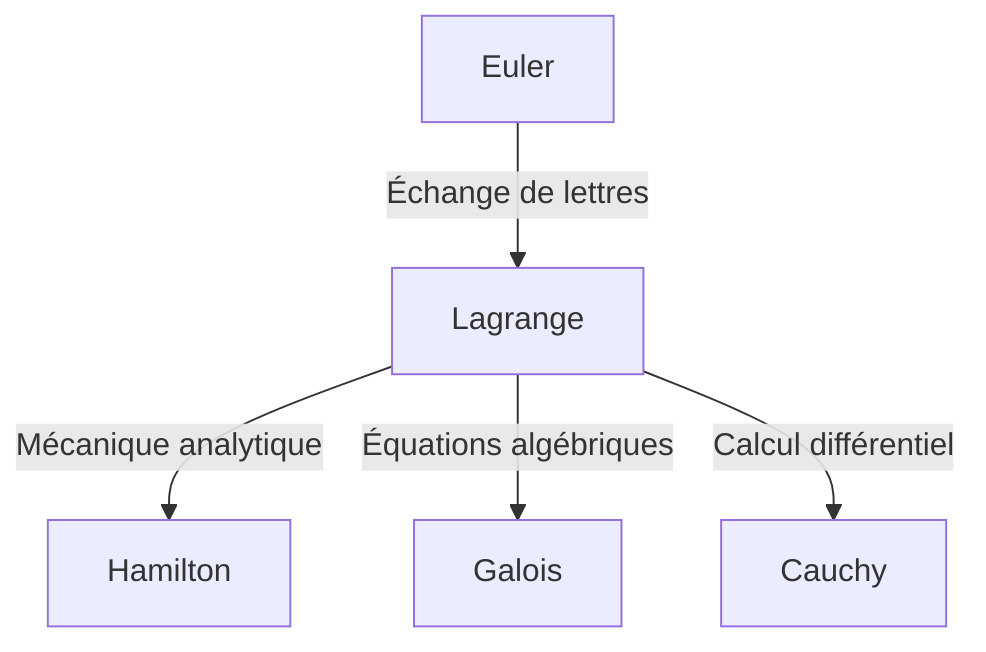

## Introduction

Dans l'histoire des mathématiques et de la physique, le XVIIIe siècle fut une époque où de grands génies brillaient comme des étoiles. Parmi eux, l'un des plus grands mathématiciens, souvent mentionné aux côtés de [Leonhard Euler](https://kenji.blog/fr/p/euler/), est **[Joseph-Louis Lagrange](https://kenji.blog/fr/p/lagrange/)** (1736–1813). Il est connu comme le fondateur de la « mécanique analytique », ayant établi le calcul des variations et élevé la mécanique de l'intuition géométrique à l'analyse mathématique pure.

Dans cet article, nous plongerons dans la vie mouvementée de [Lagrange](https://kenji.blog/fr/p/lagrange/), qui avait une personnalité modeste et contemplative, et dans ses réalisations mathématiques et physiques monumentales qui forment le fondement de la science et de la technologie modernes.

## La vie de [Lagrange](https://kenji.blog/fr/p/lagrange/)

### Naissance à Turin et éveil précoce

[Lagrange](https://kenji.blog/fr/p/lagrange/) est né le 25 janvier 1736 à Turin, en Italie. Son vrai nom était Giuseppe Lodovico Lagrangia. Son grand-père étant français, il adopta plus tard un nom à consonance française. Il est né dans une famille riche, mais son père ayant perdu sa fortune dans des spéculations, [Lagrange](https://kenji.blog/fr/p/lagrange/) a été contraint de devenir indépendant dès son plus jeune âge. Plus tard dans sa vie, il se souvint : « Si j'avais été riche, je ne me serais probablement pas consacré aux mathématiques. »

Initialement, il a étudié le droit, mais à l'âge de 17 ans, après avoir lu un article sur l'optique d'Edmond Halley, il s'est éveillé à un intérêt intense pour les mathématiques. Il étudia les mathématiques de manière intensive par lui-même et fut nommé professeur de mathématiques à l'École royale d'artillerie de Turin au jeune âge de 19 ans.

À cette époque, il entama une correspondance avec Euler, transmettant une idée novatrice concernant la généralisation du problème de la courbe tautochrone (qui deviendra plus tard le calcul des variations). Euler a fait l'éloge de son talent et a notoirement retardé la publication de son propre article pour céder la priorité de la découverte à ce jeune génie.

### L'ère de l'Académie de Berlin

En 1766, à l'invitation de Frédéric le Grand, il fut nommé directeur des mathématiques à l'Académie prussienne des sciences (Académie de Berlin), succédant à Euler. Frédéric le Grand l'accueillit en disant : « Le plus grand roi d'Europe souhaite avoir le plus grand mathématicien d'Europe à sa cour. »

Les 20 années passées à Berlin furent la période la plus productive pour [Lagrange](https://kenji.blog/fr/p/lagrange/). Il a publié successivement des articles novateurs dans une variété étonnante de domaines, notamment la mécanique, la dynamique des fluides, la théorie des probabilités et la théorie des nombres. La majeure partie de son chef-d'œuvre, la *Mécanique analytique*, a également été écrite au cours de cette époque berlinoise.

### Les dernières années à Paris

En 1787, après la mort de Frédéric le Grand, [Lagrange](https://kenji.blog/fr/p/lagrange/) s'installe à Paris, en France, à l'invitation de Louis XVI. Il a reçu des appartements au Palais du Louvre, mais de longues années de surmenage ont fait des ravages et il a souffert d'une grave dépression. On dit que lors de la publication de la *Mécanique analytique* en 1788, il n'a pas ouvert son livre fraîchement imprimé pendant deux ans.

Cependant, lorsque la Révolution française a éclaté, il a repris ses activités en tant que membre du comité pour l'établissement du nouveau système de poids et mesures (le système métrique). Même dans la tourmente de la révolution, sa renommée et sa personnalité douce l'ont sauvé de l'exécution (lorsque son ami proche, le chimiste Lavoisier, a été exécuté, il s'est lamenté : « Il ne leur a fallu qu'un instant pour faire tomber cette tête, mais il ne suffira pas d'un siècle pour en produire une pareille »).

Plus tard, il devint le premier professeur de l'École polytechnique et se consacra à l'enseignement. Il mourut à Paris en 1813 à l'âge de 77 ans et fut inhumé au Panthéon.

## Principales réalisations en mathématiques et en physique

Les réalisations de [Lagrange](https://kenji.blog/fr/p/lagrange/) sont incroyablement vastes, mais nous présentons ici quelques-unes des plus importantes.

### 1. Le calcul des variations et l'équation d'Euler-[Lagrange](https://kenji.blog/fr/p/lagrange/)

[Lagrange](https://kenji.blog/fr/p/lagrange/) a formulé de manière stricte le « calcul des variations », qui trouve la fonction qui maximise ou minimise une fonctionnelle (une fonction d'une fonction). En posant $S$ comme intégrale d'action et $L$ comme lagrangien, l'équation fondamentale de la mécanique basée sur le principe de moindre action est décrite comme suit :

$$ \frac{\partial L}{\partial q_i} - \frac{d}{dt} \left( \frac{\partial L}{\partial \dot{q}_i} \right) = 0 $$

Ici, $q_i$ sont les coordonnées généralisées et $\dot{q}_i$ sont les vitesses généralisées. Cette **équation d'Euler-[Lagrange](https://kenji.blog/fr/p/lagrange/)** a permis de résoudre des problèmes de systèmes contraints, tels que les plans inclinés ou les pendules — qui sont compliqués en mécanique newtonienne — d'une manière unifiée indépendante du choix du système de coordonnées.

### 2. Construction de la mécanique analytique

Publiée en 1788, la *Mécanique analytique* est un chef-d'œuvre historique qui a libéré la mécanique des diagrammes géométriques et l'a reconstruite comme un système d'algèbre pure et de calcul. Dans la préface, [Lagrange](https://kenji.blog/fr/p/lagrange/) déclare : « On ne trouvera point de figures dans cet ouvrage. » Cette abstraction est devenue une base solide menant à la mécanique hamiltonienne par Hamilton plus tard, et plus loin à la mécanique quantique au XXe siècle.

### 3. Les multiplicateurs de [Lagrange](https://kenji.blog/fr/p/lagrange/)

Une méthode mathématique puissante pour trouver les maxima et minima locaux d'une fonction soumise à des contraintes d'égalité est la méthode des **multiplicateurs de [Lagrange](https://kenji.blog/fr/p/lagrange/)**.
Lorsque l'on souhaite maximiser ou minimiser une fonction $f(x, y)$ soumise à la contrainte $g(x, y) = 0$, un multiplicateur indéterminé $\lambda$ est introduit pour définir une nouvelle fonction (le lagrangien) :

$$ \mathcal{L}(x, y, \lambda) = f(x, y) - \lambda \cdot g(x, y) $$

En résolvant le point où le gradient de cette fonction devient nul ($\nabla \mathcal{L} = 0$), on peut trouver la solution optimale. Cette méthode est un outil essentiel en économie moderne et dans les problèmes d'optimisation en apprentissage automatique.

### 4. Contributions à la théorie des nombres et à l'algèbre

[Lagrange](https://kenji.blog/fr/p/lagrange/) a également laissé de brillantes réalisations en théorie des nombres.
- **Théorème des quatre carrés de [Lagrange](https://kenji.blog/fr/p/lagrange/)** : Il a prouvé le théorème selon lequel tout nombre entier naturel peut s'écrire comme la somme de quatre carrés d'entiers au maximum (par exemple, $7 = 2^2 + 1^2 + 1^2 + 1^2$).
- **Résolution algébrique des équations** : Utilisant l'idée des permutations de racines, il a été le pionnier de la recherche pour savoir si les équations de degré cinq ou plus pouvaient être résolues algébriquement. Ce fut une étape importante qui s'est ensuite développée en théorie de [Galois](https://kenji.blog/fr/p/galois/) et en théorie des groupes.

## Philosophie et influence sur les générations ultérieures

La méthode de [Lagrange](https://kenji.blog/fr/p/lagrange/) se caractérise par la poursuite de la rigueur logique et de la beauté analytique tout en éliminant l'intuition. Son influence peut être schématisée comme suit :

Le concept de « Lagrangien » qu'il a laissé derrière lui est devenu le langage commun pour décrire toutes les équations fondamentales de la physique moderne, du modèle standard de la physique des particules à la relativité générale.

## Conclusion

[Joseph-Louis Lagrange](https://kenji.blog/fr/p/lagrange/) a survécu au turbulent XVIIIe siècle, mais son esprit était toujours dans le monde de la vérité mathématique pure. Ses réalisations ne sont pas de simples découvertes du passé ; elles respirent encore à l'avant-garde de la physique et des mathématiques d'aujourd'hui. Son héritage, croyant en la beauté des formules mathématiques et à l'universalité de la logique, continuera de guider la quête de connaissances de l'humanité.
