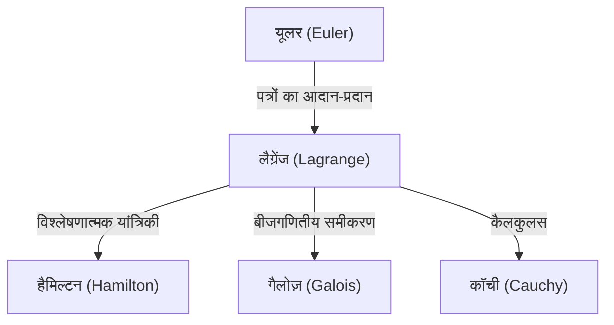

## परिचय

गणित और भौतिकी के इतिहास में, 18वीं सदी एक ऐसा युग था जब महान प्रतिभाएं तारों की तरह चमकती थीं। उनमें से एक सबसे महान गणितज्ञ, जिन्हें अक्सर लियोनहार्ड यूलर के साथ याद किया जाता है, **जोसेफ-लुई लैग्रेंज** (1736–1813) हैं। उन्हें "विश्लेषणात्मक यांत्रिकी" (Analytical Mechanics) के संस्थापक के रूप में जाना जाता है, जिन्होंने विविधताओं की गणना (Calculus of Variations) की स्थापना की और यांत्रिकी को ज्यामितीय अंतर्ज्ञान से शुद्ध गणितीय विश्लेषण तक उन्नत किया।

इस लेख में, हम लैग्रेंज के अशांत जीवन में गहराई से उतरेंगे, जिनका व्यक्तित्व विनम्र और विचारशील था, और उनके स्मारकीय गणितीय और भौतिक उपलब्धियों के बारे में जानेंगे जो आधुनिक विज्ञान और प्रौद्योगिकी की नींव बनाते हैं।

## लैग्रेंज का जीवन

### ट्यूरिन में जन्म और प्रारंभिक जागृति

लैग्रेंज का जन्म 25 जनवरी 1736 को इटली के ट्यूरिन में हुआ था। उनका असली नाम ज्यूसेपे लोडोविको लैग्रांगिया था। चूंकि उनके दादा फ्रांसीसी थे, इसलिए उन्होंने बाद में एक फ्रांसीसी शैली का नाम अपनाया। उनका जन्म एक धनी परिवार में हुआ था, लेकिन क्योंकि उनके पिता ने सट्टेबाजी के कारण अपना भाग्य खो दिया था, लैग्रेंज को कम उम्र में ही स्वतंत्र होने के लिए मजबूर होना पड़ा। बाद के जीवन में, उन्होंने याद करते हुए कहा, "यदि मैं अमीर होता, तो शायद मैंने खुद को गणित के प्रति समर्पित नहीं किया होता।"

शुरू में, उन्होंने कानून का अध्ययन किया, लेकिन 17 साल की उम्र में, एडमंड हैली के प्रकाशिकी पर एक पत्र पढ़ने के बाद, गणित में उनकी तीव्र रुचि जाग गई। उन्होंने स्वयं ही गणित का गहन अध्ययन किया और महज 19 वर्ष की छोटी उम्र में ट्यूरिन के रॉयल आर्टिलरी स्कूल में गणित के प्रोफेसर नियुक्त किए गए।

इस समय के आसपास, उन्होंने यूलर के साथ पत्राचार शुरू किया, जिसमें टॉटोक्रोन समस्या (Tautochrone problem) के सामान्यीकरण के संबंध में एक अभूतपूर्व विचार (जो बाद में विविधताओं की गणना बन गया) व्यक्त किया। यूलर ने उनकी प्रतिभा की अत्यधिक प्रशंसा की और इस युवा प्रतिभा को खोज की प्राथमिकता देने के लिए अपने स्वयं के पेपर के प्रकाशन में देरी की।

### बर्लिन अकादमी युग

1766 में, फ्रेडरिक द ग्रेट के निमंत्रण पर, उन्हें यूलर के उत्तराधिकारी के रूप में प्रशिया एकेडमी ऑफ साइंसेज (बर्लिन अकादमी) में गणित का निदेशक नियुक्त किया गया था। फ्रेडरिक द ग्रेट ने उनका स्वागत करते हुए कहा, "यूरोप का सबसे महान राजा चाहता है कि यूरोप का सबसे महान गणितज्ञ उसके दरबार में हो।"

बर्लिन में 20 वर्ष लैग्रेंज के लिए सबसे अधिक उत्पादक अवधि थी। उन्होंने यांत्रिकी, द्रव गतिकी, संभाव्यता सिद्धांत और संख्या सिद्धांत सहित विभिन्न क्षेत्रों में लगातार नवीन शोध पत्र प्रकाशित किए। उनकी उत्कृष्ट कृति, *Mécanique analytique* (विश्लेषणात्मक यांत्रिकी) का अधिकांश भाग भी इसी बर्लिन युग के दौरान लिखा गया था।

### पेरिस में अंतिम वर्ष

1787 में, फ्रेडरिक द ग्रेट की मृत्यु के बाद, लैग्रेंज लुई सोलहवें के निमंत्रण पर पेरिस, फ्रांस चले गए। उन्हें लौवर पैलेस में अपार्टमेंट दिए गए थे, लेकिन अत्यधिक काम के लंबे वर्षों ने अपना असर दिखाया, और वह गंभीर अवसाद से पीड़ित हो गए। ऐसा कहा जाता है कि जब 1788 में *Mécanique analytique* प्रकाशित हुई थी, तो उन्होंने दो साल तक अपनी नई छपी किताब नहीं खोली थी।

हालाँकि, जब फ्रांसीसी क्रांति छिड़ी, तो उन्होंने वजन और माप की नई प्रणाली (मीट्रिक प्रणाली) की स्थापना के लिए एक समिति के सदस्य के रूप में अपनी गतिविधियों को फिर से शुरू किया। क्रांति के तूफान में भी, उनकी प्रसिद्धि और सौम्य व्यक्तित्व ने उन्हें फांसी से बचा लिया (जब उनके करीबी दोस्त, रसायनज्ञ लावोइसियर को फांसी दी गई थी, तो उन्होंने विलाप किया था, "उस सिर को काटने में उन्हें केवल एक क्षण लगा, लेकिन ऐसा दूसरा सिर पैदा करने में सौ साल भी कम पड़ेंगे")।

बाद में, वह इकोले पॉलीटेक्निक के पहले प्रोफेसर बने और खुद को शिक्षा के लिए समर्पित कर दिया। 1813 में 77 वर्ष की आयु में पेरिस में उनका निधन हो गया और उन्हें पैन्थियन में दफनाया गया।

## गणित और भौतिकी में प्रमुख उपलब्धियां

लैग्रेंज की उपलब्धियाँ अविश्वसनीय रूप से व्यापक हैं, लेकिन यहाँ हम कुछ सबसे महत्वपूर्ण उपलब्धियों का परिचय देते हैं।

### 1. विविधताओं की गणना और यूलर-लैग्रेंज समीकरण

लैग्रेंज ने "विविधताओं की गणना" (Calculus of Variations) को सख्ती से तैयार किया, जो उस फ़ंक्शन को ढूंढता है जो एक कार्यात्मक (एक फ़ंक्शन का फ़ंक्शन) को अधिकतम या न्यूनतम करता है। $S$ को एक्शन इंटीग्रल और $L$ को लैग्रेंजियन (Lagrangian) मानते हुए, न्यूनतम कार्रवाई के सिद्धांत (Principle of least action) पर आधारित यांत्रिकी के मूल समीकरण को इस प्रकार वर्णित किया गया है:

$$ \frac{\partial L}{\partial q_i} - \frac{d}{dt} \left( \frac{\partial L}{\partial \dot{q}_i} \right) = 0 $$

यहाँ, $q_i$ सामान्यीकृत निर्देशांक (generalized coordinates) हैं और $\dot{q}_i$ सामान्यीकृत वेग (generalized velocities) हैं। इस **यूलर-लैग्रेंज समीकरण** ने विवश प्रणाली समस्याओं (constrained system problems), जैसे कि झुके हुए तल या पेंडुलम—जो न्यूटनियन यांत्रिकी में जटिल हैं—को समन्वय प्रणाली की पसंद से स्वतंत्र एक एकीकृत तरीके से हल करने की अनुमति दी।

### 2. विश्लेषणात्मक यांत्रिकी का निर्माण

1788 में प्रकाशित, *Mécanique analytique* एक ऐतिहासिक कृति है जिसने यांत्रिकी को ज्यामितीय आरेखों से मुक्त किया और इसे शुद्ध बीजगणित और कैलकुलस की एक प्रणाली के रूप में फिर से बनाया। प्रस्तावना में, लैग्रेंज ने घोषणा की, "इस कार्य में कोई आरेख नहीं पाया जाएगा।" यह अमूर्तीकरण एक ठोस आधार बन गया जिससे बाद में हैमिल्टन द्वारा हैमिल्टनियन यांत्रिकी (Hamiltonian mechanics) और 20वीं सदी में क्वांटम यांत्रिकी का विकास हुआ।

### 3. लैग्रेंज गुणक (Lagrange Multipliers)

समानता बाधाओं (equality constraints) के अधीन फ़ंक्शन के स्थानीय मैक्सिमा और मिनिमा को खोजने के लिए एक शक्तिशाली गणितीय विधि **लैग्रेंज गुणक** (Lagrange multipliers) की विधि है।
जब बाधा $g(x, y) = 0$ के अधीन किसी फ़ंक्शन $f(x, y)$ को अधिकतम या न्यूनतम करना चाहते हैं, तो एक नया फ़ंक्शन (लैग्रेंजियन) परिभाषित करने के लिए एक अनिर्धारित गुणक $\lambda$ पेश किया जाता है:

$$ \mathcal{L}(x, y, \lambda) = f(x, y) - \lambda \cdot g(x, y) $$

उस बिंदु के लिए हल करके जहाँ इस फ़ंक्शन का ढाल (gradient) शून्य ($\nabla \mathcal{L} = 0$) हो जाता है, इष्टतम समाधान पाया जा सकता है। यह विधि आधुनिक अर्थशास्त्र और मशीन लर्निंग में अनुकूलन (optimization) समस्याओं में एक आवश्यक उपकरण है।

### 4. संख्या सिद्धांत और बीजगणित में योगदान

लैग्रेंज ने संख्या सिद्धांत में भी शानदार उपलब्धियाँ छोड़ीं।
- **लैग्रेंज का चार-वर्ग प्रमेय (Lagrange's four-square theorem)**: उन्होंने यह प्रमेय सिद्ध किया कि प्रत्येक प्राकृत संख्या को अधिक से अधिक चार पूर्णांक वर्गों के योग के रूप में दर्शाया जा सकता है (उदा., $7 = 2^2 + 1^2 + 1^2 + 1^2$)।
- **समीकरणों का बीजगणितीय समाधान**: जड़ों के क्रमपरिवर्तन (permutations) के विचार का उपयोग करते हुए, उन्होंने इस बात पर शोध किया कि क्या डिग्री पाँच या उससे अधिक के समीकरणों को बीजगणितीय रूप से हल किया जा सकता है। यह एक महत्वपूर्ण कदम था जो बाद में गैलोज़ थ्योरी ([Galois theory](https://kenji.blog/p/galois-theory/)) और ग्रुप थ्योरी में विकसित हुआ।

## दर्शन और बाद की पीढ़ियों पर प्रभाव

लैग्रेंज की पद्धति में अंतर्ज्ञान को खत्म करते हुए तार्किक कठोरता और विश्लेषणात्मक सुंदरता का पीछा करना शामिल है। उनके प्रभाव को निम्न प्रकार से आरेखित किया जा सकता है:

"लैग्रेंजियन" की अवधारणा जिसे वह पीछे छोड़ गए, आधुनिक भौतिकी के सभी मूलभूत समीकरणों का वर्णन करने के लिए आम भाषा बन गई है, कण भौतिकी के मानक मॉडल (Standard Model) से लेकर सामान्य सापेक्षता (general relativity) तक।

## निष्कर्ष

जोसेफ-लुई लैग्रेंज 18वीं सदी के अशांत दौर में जीवित रहे, फिर भी उनका दिमाग हमेशा शुद्ध गणितीय सत्य की दुनिया में था। उनकी उपलब्धियाँ केवल अतीत की खोजें नहीं हैं; वे आज भी भौतिकी और गणित के अग्रिम मोर्चे पर जीवित हैं। उनकी विरासत, गणितीय सूत्रों की सुंदरता और तर्क की सार्वभौमिकता में विश्वास करते हुए, मानवता की ज्ञान की खोज का मार्गदर्शन करती रहेगी।
