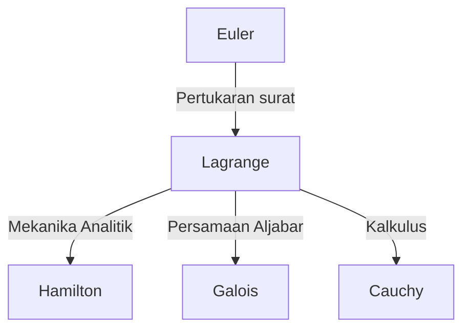

## Pengantar

Dalam sejarah matematika dan fisika, abad ke-18 adalah era di mana para jenius besar bersinar seperti bintang. Di antara mereka, salah satu matematikawan terbesar, yang sering disebut bersama Leonhard Euler, adalah **Joseph-Louis Lagrange** (1736–1813). Ia dikenal sebagai pendiri "mekanika analitik," setelah menetapkan kalkulus variasi dan mengangkat mekanika dari intuisi geometris menjadi analisis matematika murni.

Dalam artikel ini, kita akan menyelami kehidupan yang penuh gejolak dari Lagrange, yang memiliki kepribadian yang sederhana dan kontemplatif, dan pencapaian matematika dan fisikanya yang monumental yang membentuk dasar sains dan teknologi modern.

## Kehidupan Lagrange

### Kelahiran di Turin dan Kebangkitan Awal

Lagrange lahir pada tanggal 25 Januari 1736, di Turin, Italia. Nama aslinya adalah Giuseppe Lodovico Lagrangia. Karena kakeknya adalah orang Prancis, ia kemudian mengadopsi nama bergaya Prancis. Ia dilahirkan dalam keluarga kaya, tetapi karena ayahnya kehilangan kekayaannya melalui spekulasi, Lagrange terpaksa menjadi mandiri di usia muda. Di kemudian hari, ia mengenang, "Jika saya kaya, saya mungkin tidak akan mengabdikan diri pada matematika."

Awalnya, ia belajar hukum, tetapi pada usia 17 tahun, setelah membaca makalah tentang optika oleh Edmond Halley, minatnya pada matematika bangkit dengan kuat. Ia belajar matematika secara intensif secara otodidak dan diangkat menjadi profesor matematika di Sekolah Artileri Kerajaan di Turin pada usia muda 19 tahun.

Sekitar waktu ini, ia memulai korespondensi dengan Euler, menyampaikan ide terobosan mengenai generalisasi masalah kurva tautokron (yang kemudian menjadi kalkulus variasi). Euler sangat memuji bakatnya dan dengan terkenal menunda publikasi makalahnya sendiri untuk memberikan prioritas penemuan kepada jenius muda ini.

### Era Akademi Berlin

Pada tahun 1766, atas undangan Frederick yang Agung, ia diangkat sebagai Direktur Matematika di Akademi Sains Prusia (Akademi Berlin), menggantikan Euler. Frederick yang Agung menyambutnya, mengatakan, "Raja terbesar di Eropa ingin memiliki matematikawan terbesar di Eropa di istananya."

20 tahun di Berlin adalah periode paling produktif bagi Lagrange. Ia berturut-turut menerbitkan makalah-makalah inovatif dalam berbagai bidang yang menakjubkan, termasuk mekanika, dinamika fluida, teori probabilitas, dan teori bilangan. Sebagian besar mahakaryanya, *Mécanique analytique* (Mekanika Analitik), juga ditulis selama era Berlin ini.

### Tahun-Tahun Terakhir di Paris

Pada tahun 1787, setelah kematian Frederick yang Agung, Lagrange pindah ke Paris, Prancis, atas undangan Louis XVI. Ia diberi apartemen di Istana Louvre, tetapi bertahun-tahun bekerja terlalu keras menelan korban, dan ia menderita depresi parah. Dikatakan bahwa ketika *Mécanique analytique* diterbitkan pada tahun 1788, ia tidak membuka buku yang baru dicetaknya itu selama dua tahun.

Namun, ketika Revolusi Prancis pecah, ia melanjutkan aktivitasnya sebagai anggota komite pembentukan sistem berat dan ukuran baru (sistem metrik). Bahkan dalam badai revolusi, ketenaran dan kepribadiannya yang lembut menyelamatkannya dari eksekusi (ketika teman dekatnya, ahli kimia Lavoisier, dieksekusi, ia meratap, "Mereka hanya butuh sekejap untuk memenggal kepala itu, tetapi seratus tahun belum tentu cukup untuk menghasilkan kepala yang serupa").

Kemudian, ia menjadi profesor pertama di École Polytechnique dan mengabdikan dirinya pada pendidikan. Ia meninggal di Paris pada tahun 1813 pada usia 77 tahun dan dimakamkan di Panthéon.

## Pencapaian Utama dalam Matematika dan Fisika

Pencapaian Lagrange sangat luas, tetapi di sini kami memperkenalkan beberapa yang paling penting.

### 1. Kalkulus Variasi dan Persamaan Euler-Lagrange

Lagrange secara ketat merumuskan "kalkulus variasi," yang menemukan fungsi yang memaksimalkan atau meminimalkan suatu fungsional (fungsi dari suatu fungsi). Membiarkan $S$ menjadi integral aksi dan $L$ Lagrangian, persamaan dasar mekanika berdasarkan prinsip aksi terkecil dijelaskan sebagai berikut:

$$ \frac{\partial L}{\partial q_i} - \frac{d}{dt} \left( \frac{\partial L}{\partial \dot{q}_i} \right) = 0 $$

Di sini, $q_i$ adalah koordinat umum dan $\dot{q}_i$ adalah kecepatan umum. **Persamaan Euler-Lagrange** ini memungkinkan masalah sistem terbatas, seperti bidang miring atau pendulum—yang rumit dalam mekanika Newtonian—untuk diselesaikan secara terpadu tanpa bergantung pada pilihan sistem koordinat.

### 2. Konstruksi Mekanika Analitik

Diterbitkan pada tahun 1788, *Mécanique analytique* adalah mahakarya bersejarah yang membebaskan mekanika dari diagram geometris dan merekonstruksinya sebagai sistem aljabar murni dan kalkulus. Dalam kata pengantarnya, Lagrange menyatakan, "Tidak ada diagram yang akan ditemukan dalam karya ini." Abstraksi ini menjadi fondasi kuat yang mengarah ke mekanika Hamiltonian oleh Hamilton kemudian, dan lebih jauh ke mekanika kuantum di abad ke-20.

### 3. Pengganda Lagrange

Metode matematika yang kuat untuk menemukan nilai maksimum dan minimum lokal dari suatu fungsi yang tunduk pada kendala kesetaraan adalah metode **pengganda Lagrange** (Lagrange multipliers).
Bila ingin memaksimalkan atau meminimalkan fungsi $f(x, y)$ yang tunduk pada kendala $g(x, y) = 0$, pengganda yang belum ditentukan $\lambda$ diperkenalkan untuk menentukan fungsi baru (Lagrangian):

$$ \mathcal{L}(x, y, \lambda) = f(x, y) - \lambda \cdot g(x, y) $$

Dengan menyelesaikan titik di mana gradien fungsi ini menjadi nol ($\nabla \mathcal{L} = 0$), solusi optimal dapat ditemukan. Metode ini merupakan alat penting dalam ekonomi modern dan masalah optimasi dalam pembelajaran mesin.

### 4. Kontribusi pada Teori Bilangan dan Aljabar

Lagrange juga meninggalkan pencapaian cemerlang dalam teori bilangan.
- **Teorema empat kuadrat Lagrange**: Ia membuktikan teorema bahwa setiap bilangan asli dapat direpresentasikan sebagai jumlah paling banyak empat bilangan bulat kuadrat (misalnya, $7 = 2^2 + 1^2 + 1^2 + 1^2$).
- **Solusi aljabar persamaan**: Menggunakan ide permutasi akar, ia memelopori penelitian tentang apakah persamaan derajat lima atau lebih tinggi dapat diselesaikan secara aljabar. Ini merupakan langkah penting yang kemudian berkembang menjadi teori Galois dan teori grup.

## Filosofi dan Pengaruh pada Generasi Berikutnya

Metode Lagrange ditandai dengan mengejar ketelitian logis dan keindahan analitik sambil menghilangkan intuisi. Pengaruhnya dapat digambarkan sebagai berikut:

Konsep "Lagrangian" yang ditinggalkannya telah menjadi bahasa umum untuk menggambarkan semua persamaan fundamental fisika modern, dari Model Standar fisika partikel hingga relativitas umum.

## Kesimpulan

Joseph-Louis Lagrange selamat dari abad ke-18 yang bergejolak, namun pikirannya selalu berada di dunia kebenaran matematika murni. Pencapaiannya bukan hanya sekadar penemuan masa lalu; mereka masih bernapas di garis depan fisika dan matematika saat ini. Warisannya, percaya pada keindahan rumus matematika dan universalitas logika, akan terus memandu pencarian umat manusia akan pengetahuan.
