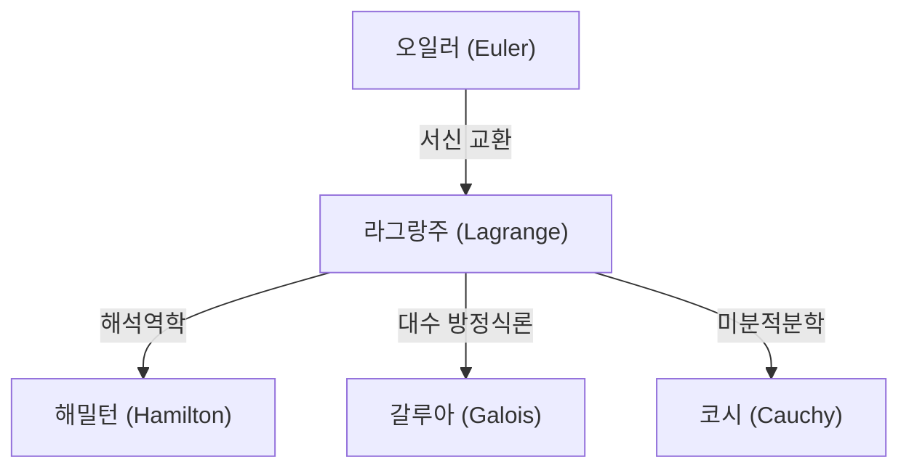

## 서론

수학과 물리학의 역사에서 18세기는 위대한 천재들이 별처럼 빛나던 시대였습니다. 그중에서도 [레온하르트 오일러](https://kenji.blog/ko/p/euler/)와 나란히 일컬어지는 가장 위대한 수학자 중 한 명이 바로 **[조제프루이 라그랑주](https://kenji.blog/ko/p/lagrange/)** ([Joseph-Louis Lagrange](https://kenji.blog/ko/p/lagrange/), 1736–1813) 입니다. 그는 변분법을 확립하고 역학을 기하학적 직관에서 순수 해석학으로 승화시킨 "해석역학"의 창시자로 알려져 있습니다.

이 글에서는 겸손하고 사색적인 성격을 지녔던 라그랑주의 파란만장한 생애와 현대 과학 기술의 근간을 이루는 그의 위대한 수학적, 물리학적 업적에 대해 자세히 풀어보겠습니다.

## 라그랑주의 생애

### 토리노에서의 탄생과 젊은 시절의 각성

라그랑주는 1736년 1월 25일 이탈리아 토리노에서 태어났습니다. 본명은 주세페 로도비코 라그란자(Giuseppe Lodovico Lagrangia)였으며, 할아버지가 프랑스인이었기 때문에 나중에 그는 프랑스식 이름을 사용하게 됩니다. 유복한 가정에서 태어났으나 아버지가 투기로 재산을 잃는 바람에 라그랑주는 젊은 나이에 자립해야만 했습니다. 훗날 그는 "만약 내가 부유했다면 아마도 수학에 헌신하지 않았을 것이다"라고 회고했습니다.

처음에는 법학을 공부했으나, 17세 때 에드먼드 핼리의 광학에 관한 논문을 읽고 수학에 대한 강렬한 흥미를 느끼게 되었습니다. 그는 독학으로 수학을 맹렬히 공부하여 불과 19세의 나이에 토리노 왕립 포병학교의 수학 교수로 임명되었습니다.

이 무렵 그는 오일러와 서신을 주고받기 시작했으며, 등시강하곡선 문제의 일반화에 관한 획기적인 아이디어(훗날의 변분법)를 전달했습니다. 오일러는 그의 재능을 극찬하며, 이 젊은 천재에게 발견의 우선권을 양보하기 위해 자신의 논문 발표를 미루었다는 유명한 일화가 남아 있습니다.

### 베를린 아카데미 시대

1766년, 프리드리히 대왕의 초청으로 그는 오일러의 후임으로서 프로이센 과학 아카데미(베를린 아카데미)의 수학 부장으로 취임했습니다. 프리드리히 대왕은 "유럽 최고의 왕은 유럽 최고의 수학자가 자신의 궁정에 있기를 바란다"며 그를 환영했습니다.

베를린에서의 20년은 라그랑주에게 가장 생산적인 시기였습니다. 그는 역학, 유체역학, 확률론, 정수론 등 놀라울 정도로 다양한 분야에서 혁신적인 논문들을 차례로 발표했습니다. 그의 대표작인 『해석역학』(Mécanique analytique)의 대부분도 이 베를린 시대에 집필되었습니다.

### 파리에서의 만년

1787년 프리드리히 대왕이 사망한 후, 라그랑주는 루이 16세의 초청으로 프랑스 파리로 이주했습니다. 루브르 궁전의 거처를 제공받았으나, 오랜 과로가 겹쳐 심각한 우울증에 시달리게 됩니다. 『해석역학』이 출판된 1788년, 그는 갓 인쇄된 자신의 저서를 2년 동안이나 펼쳐보지 않았다고 전해집니다.

그러나 프랑스 혁명이 발발하자, 그는 새로운 도량형 제도(미터법) 제정 위원으로서 다시 활동을 시작합니다. 혁명의 폭풍 속에서도 그의 명성과 온화한 성품 덕분에 처형을 면할 수 있었습니다(친한 친구였던 화학자 라부아지에가 처형되었을 때, 그는 "저 머리를 베어버리는 것은 한순간이지만, 같은 두뇌를 낳는 데는 100년이 걸려도 부족할 것이다"라며 비통해했습니다).

그 후 에콜 폴리테크니크(이공과대학)의 초대 교수로 취임하여 교육에도 헌신했습니다. 1813년 파리에서 77세의 나이로 생을 마감하고 팡테옹에 안장되었습니다.

## 수학 및 물리학에서의 주요 업적

라그랑주의 업적은 너무나도 광범위하지만, 여기서는 특히 중요한 몇 가지를 소개합니다.

### 1. 변분법과 오일러-라그랑주 방정식

라그랑주는 어떤 범함수(함수의 함수)를 최대화하거나 최소화하는 함수를 찾는 "변분법"을 엄밀한 형태로 정식화했습니다. 작용 적분을 $S$, 라그랑지안을 $L$ 이라고 할 때, 최소 작용의 원리에 기반한 역학의 기본 방정식은 다음과 같이 기술됩니다.

$$ \frac{\partial L}{\partial q_i} - \frac{d}{dt} \left( \frac{\partial L}{\partial \dot{q}_i} \right) = 0 $$

여기서 $q_i$ 는 일반화 좌표, $\dot{q}_i$ 는 일반화 속도입니다. 이 **오일러-라그랑주 방정식** 을 통해 뉴턴 역학에서는 복잡해지는 빗면이나 진자 등의 구속계 문제를 좌표계의 선택에 의존하지 않는 통일된 방법으로 풀 수 있게 되었습니다.

### 2. 『해석역학』의 구축

1788년에 출판된 『해석역학』은 역학을 기하학적 도형에서 해방시키고 순수 대수학과 미적분학의 체계로 재구축한 역사적 명저입니다. 라그랑주는 서문에서 "이 책에는 도형이 단 하나도 없다"라고 선언했습니다. 이러한 추상화는 훗날 해밀턴에 의한 해밀턴 역학, 더 나아가 20세기 양자역학으로 이어지는 굳건한 기반이 되었습니다.

### 3. 미정계수법 (Lagrange Multipliers)

제약 조건 하에서 다변수 함수의 극값을 구하기 위한 강력한 수학적 기법이 **미정계수법** 입니다.
제약 조건 $g(x, y) = 0$ 하에서 함수 $f(x, y)$ 를 최대화 또는 최소화하고 싶을 때, 미정계수 $\lambda$ 를 도입하여 새로운 함수(라그랑지안)를 정의합니다.

$$ \mathcal{L}(x, y, \lambda) = f(x, y) - \lambda \cdot g(x, y) $$

이 함수의 기울기가 0이 되는 점 $\nabla \mathcal{L} = 0$ 을 풀음으로써 최적해를 찾을 수 있습니다. 이 기법은 현대 경제학이나 기계학습의 최적화 문제에서도 필수적인 도구가 되었습니다.

### 4. 정수론 및 대수학에의 기여

라그랑주는 정수론에서도 빛나는 성과를 남겼습니다.
- **라그랑주의 네 제곱수 정리**: 임의의 자연수는 많아야 4개의 제곱수의 합으로 나타낼 수 있다는 정리를 증명했습니다 (예: $7 = 2^2 + 1^2 + 1^2 + 1^2$).
- **방정식의 대수적 해법**: 그는 근의 치환이라는 아이디어를 사용하여 5차 이상의 방정식이 대수적으로 풀릴 수 있는지에 대한 연구의 선구자가 되었습니다. 이는 훗날 갈루아 이론 및 군론으로 발전하는 중요한 단계였습니다.

## 사상과 후세에 미친 영향

라그랑주의 수법은 직관을 배제하고 논리적 엄밀성과 해석적인 아름다움을 추구했다는 점에 특징이 있습니다. 그의 영향력을 도식화하면 다음과 같습니다.

그가 남긴 "라그랑지안"이라는 개념은 입자물리학의 표준 모형부터 일반 상대성이론에 이르기까지, 현대 물리학의 모든 기초 방정식을 기술하기 위한 공통 언어가 되었습니다.

## 결론

[조제프루이 라그랑주](https://kenji.blog/ko/p/lagrange/)는 격동의 18세기를 살아냈음에도, 그의 정신은 항상 순수한 수학적 진리의 세계에 있었습니다. 그의 업적은 단순히 과거의 발견에 머무르지 않고, 현재도 여전히 물리학과 수학의 최전선에서 살아 숨 쉬고 있습니다. 수식의 아름다움과 논리의 보편성을 믿었던 그의 유산은 앞으로도 인류의 지식 탐구를 계속해서 이끌어갈 것입니다.
