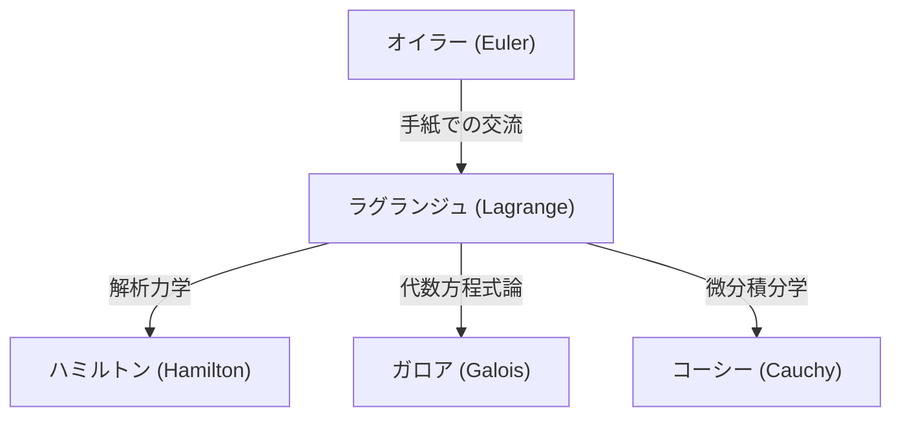

## はじめに

数学と物理学の歴史において、18世紀は偉大な天才たちが星々のように輝いていた時代です。その中でも、レオンハルト・[オイラー](https://kenji.blog/p/euler/)と並び称される最大の数学者の一人が、**ジョゼフ＝ルイ・ラグランジュ** ([Joseph-Louis Lagrange](https://kenji.blog/p/lagrange/), 1736–1813) です。彼は変分法を確立し、力学を幾何学的な直観から解放して純粋な解析学へと昇華させた「解析力学」の創始者として知られています。

本記事では、控えめで思索的な性格であった[ラグランジュ](https://kenji.blog/p/lagrange/)の波乱に満ちた生涯と、現代の科学技術の根幹を支える彼の偉大な数学的・物理学的業績について、詳しく紐解いていきます。

## [ラグランジュ](https://kenji.blog/p/lagrange/)の生涯

### トリノでの誕生と若き日の覚醒

[ラグランジュ](https://kenji.blog/p/lagrange/)は1736年1月25日、イタリアのトリノで生まれました。本名はジュゼッペ・ルドヴィーコ・ラグラージア (Giuseppe Lodovico Lagrangia) といい、彼の祖父はフランス人であったため、後に彼はフランス風の名を名乗ることになります。裕福な家庭に生まれましたが、父が投機で財産を失ったため、[ラグランジュ](https://kenji.blog/p/lagrange/)は若くして自立する必要に迫られました。後年、彼は「もし私が裕福であったなら、おそらく数学に身を捧げることはなかっただろう」と回顧しています。

当初は法律を学んでいましたが、17歳の時にエドモンド・ハレーの光学に関する論文を読み、数学への強烈な興味に目覚めました。彼は独学で数学を猛勉強し、わずか19歳でトリノの王立砲兵学校の数学教授に任命されます。

この頃、彼は[オイラー](https://kenji.blog/p/euler/)と文通を始め、等時降下曲線問題の一般化について画期的なアイデア（後の変分法）を伝えました。[オイラー](https://kenji.blog/p/euler/)はその才能を絶賛し、自身の論文の発表を遅らせてまで、この若き天才に先取権を譲ったという有名な逸話が残されています。

### ベルリン・アカデミー時代

1766年、フリードリヒ大王の招きにより、[オイラー](https://kenji.blog/p/euler/)の後任としてプロイセン科学アカデミー（ベルリン・アカデミー）の数学部長に就任しました。フリードリヒ大王は「ヨーロッパ最大の王は、ヨーロッパ最大の数学者が自分の宮廷にいることを望む」と彼を歓迎しました。

ベルリンでの20年間は、[ラグランジュ](https://kenji.blog/p/lagrange/)にとって最も生産的な時期でした。力学、流体力学、確率論、数論など、驚くべき多岐にわたる分野で革新的な論文を次々と発表しました。彼の代表作である『解析力学』 (Mécanique analytique) の大部分も、このベルリン時代に執筆されました。

### パリでの晩年

1787年、フリードリヒ大王の死後、[ラグランジュ](https://kenji.blog/p/lagrange/)はルイ16世の招きでフランスのパリに移住しました。ルーヴル宮殿に住居を与えられましたが、長年の過労がたたり、深刻な鬱病に悩まされます。『解析力学』が出版された1788年、彼はその印刷されたばかりの自著を2年間も開くことがなかったと言われています。

しかし、フランス革命が勃発すると、彼は新しい度量衡制度（メートル法）の制定委員として再び活動を開始します。革命の嵐の中でも、彼の名声と温厚な性格により処刑を免れました（親友であった化学者ラヴォアジエが処刑された際、彼は「あの頭を切り落とすのは一瞬だが、同じ頭脳を生み出すには100年かかっても足りないだろう」と嘆き悲しみました）。

その後、エコール・ポリテクニーク（理工科学校）の初代教授に就任し、教育にも尽力しました。1813年、パリで77歳の生涯を閉じ、パンテオンに埋葬されました。

## 数学・物理学における主要な業績

[ラグランジュ](https://kenji.blog/p/lagrange/)の業績はあまりにも広範ですが、ここでは特に重要なものをいくつか紹介します。

### 1. 変分法と[オイラー](https://kenji.blog/p/euler/)＝[ラグランジュ](https://kenji.blog/p/lagrange/)方程式

[ラグランジュ](https://kenji.blog/p/lagrange/)は、ある汎関数（関数の関数）を最大化または最小化する関数を見つける「変分法」を厳密な形で定式化しました。作用積分を $S$ 、ラグランジアンを $L$ としたとき、最小作用の原理に基づく力学の基本方程式は以下のように記述されます。

$$ \frac{\partial L}{\partial q_i} - \frac{d}{dt} \left( \frac{\partial L}{\partial \dot{q}_i} \right) = 0 $$

ここで、$q_i$ は一般化座標、$\dot{q}_i$ は一般化速度です。この **[オイラー](https://kenji.blog/p/euler/)＝ラグランジュ方程式** により、[ニュートン](https://kenji.blog/p/newton/)力学では複雑になる斜面や振り子などの束縛系の問題が、座標系の取り方に依存しない統一的な方法で解けるようになりました。

### 2. 『解析力学』の構築

1788年に出版された『解析力学』は、力学を幾何学の図形から解放し、純粋な代数と微積分の体系として再構築した歴史的名著です。[ラグランジュ](https://kenji.blog/p/lagrange/)は序文で「この本には図形は一つもない」と宣言しました。この抽象化は、のちのハミルトンによるハミルトン力学、さらには20世紀の量子力学へとつながる強固な基盤となりました。

### 3. 未定乗数法 ([Lagrange](https://kenji.blog/p/lagrange/) Multipliers)

制約条件の下で多変数関数の極値を求めるための強力な数学的手法が、**未定乗数法** です。
関数 $f(x, y)$ を制約条件 $g(x, y) = 0$ の下で最大化・最小化したい場合、未定乗数 $\lambda$ を導入して新たな関数（ラグランジアン）を定義します。

$$ \mathcal{L}(x, y, \lambda) = f(x, y) - \lambda \cdot g(x, y) $$

この関数の勾配がゼロになる点 $\nabla \mathcal{L} = 0$ を解くことで、最適解を見つけることができます。この手法は現代の経済学や機械学習の最適化問題においても必須のツールとなっています。

### 4. 数論・代数学への貢献

[ラグランジュ](https://kenji.blog/p/lagrange/)は数論においても輝かしい成果を残しました。
- **四平方定理 ([Lagrange](https://kenji.blog/p/lagrange/)'s four-square theorem)**: 任意の自然数は、高々4つの平方数の和として表すことができるという定理を証明しました（例： $7 = 2^2 + 1^2 + 1^2 + 1^2$ ）。
- **方程式の代数的解法**: 彼は根の置換というアイデアを用いて、5次以上の方程式が代数的に解けるかどうかの研究に先鞭をつけました。これは後に、[ガロア理論](https://kenji.blog/p/galois-theory/)や群論へと発展していく重要なステップでした。

## 思想と後世への影響

[ラグランジュ](https://kenji.blog/p/lagrange/)の手法は、直観を排して論理的な厳密さと解析的な美しさを追求した点に特徴があります。彼の影響力は図式化すると以下のようになります。

彼の残した「ラグランジアン」という概念は、素粒子物理学の標準模型から一般相対性理論まで、現代物理学のあらゆる基礎方程式を記述するための共通言語となっています。

## まとめ

[ジョゼフ＝ルイ・ラグランジュ](https://kenji.blog/p/lagrange/)は、激動の18世紀を生き抜きながらも、その精神は常に純粋な数学的真理の世界にありました。彼の業績は、単に過去の発見にとどまらず、現在もなお物理学と数学の最前線で息づいています。数式の美しさと論理の普遍性を信じた彼の遺産は、これからも人類の知の探求を導き続けることでしょう。
