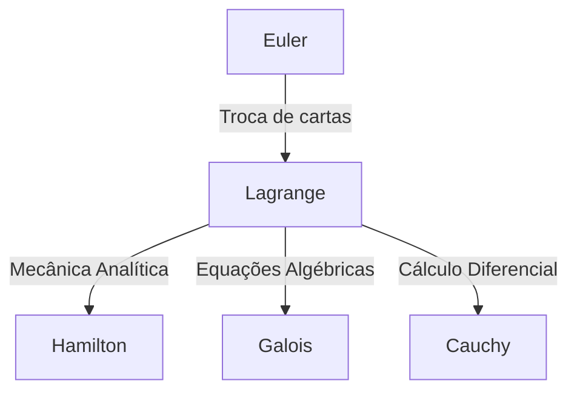

## Introdução

Na história da matemática e da física, o século XVIII foi uma era em que grandes gênios brilharam como estrelas. Entre eles, um dos maiores matemáticos, frequentemente mencionado ao lado de [Leonhard Euler](https://kenji.blog/pt/p/euler/), é **[Joseph-Louis Lagrange](https://kenji.blog/pt/p/lagrange/)** (1736–1813). Ele é conhecido como o fundador da "mecânica analítica", tendo estabelecido o cálculo de variações e elevado a mecânica da intuição geométrica à pura análise matemática.

Neste artigo, vamos nos aprofundar na vida turbulenta de [Lagrange](https://kenji.blog/pt/p/lagrange/), que possuía uma personalidade modesta e contemplativa, e em suas monumentais conquistas matemáticas e físicas que formam a base da ciência e tecnologia modernas.

## A Vida de [Lagrange](https://kenji.blog/pt/p/lagrange/)

### Nascimento em Turim e Despertar Precoce

[Lagrange](https://kenji.blog/pt/p/lagrange/) nasceu em 25 de janeiro de 1736, em Turim, Itália. Seu nome verdadeiro era Giuseppe Lodovico Lagrangia. Como seu avô era francês, mais tarde ele adotou um nome de estilo francês. Ele nasceu em uma família rica, mas devido ao fato de seu pai ter perdido a fortuna com especulações, [Lagrange](https://kenji.blog/pt/p/lagrange/) foi forçado a se tornar independente ainda jovem. Mais tarde na vida, ele relembrou: "Se eu fosse rico, provavelmente não teria me dedicado à matemática."

Inicialmente, ele estudou direito, mas aos 17 anos, após ler um artigo sobre óptica de Edmond Halley, despertou para um intenso interesse pela matemática. Ele estudou matemática intensamente por conta própria e foi nomeado professor de matemática na Escola Real de Artilharia de Turim com a jovem idade de 19 anos.

Nessa época, iniciou uma correspondência com Euler, transmitindo uma ideia inovadora a respeito da generalização do problema da curva tautócrona (que mais tarde se tornaria o cálculo de variações). Euler elogiou muito seu talento e, de forma famosa, adiou a publicação de seu próprio artigo para ceder a prioridade da descoberta a esse jovem gênio.

### A Era da Academia de Berlim

Em 1766, a convite de Frederico, o Grande, ele foi nomeado Diretor de Matemática na Academia Prussiana de Ciências (Academia de Berlim), sucedendo Euler. Frederico, o Grande, deu-lhe as boas-vindas dizendo: "O maior rei da Europa deseja ter o maior matemático da Europa em sua corte."

Os 20 anos em Berlim foram o período mais produtivo para [Lagrange](https://kenji.blog/pt/p/lagrange/). Ele publicou sucessivamente artigos inovadores em uma variedade surpreendente de campos, incluindo mecânica, dinâmica de fluidos, teoria das probabilidades e teoria dos números. A maior parte de sua obra-prima, *Mécanique analytique* (Mecânica Analítica), também foi escrita durante esta era em Berlim.

### Últimos Anos em Paris

Em 1787, após a morte de Frederico, o Grande, [Lagrange](https://kenji.blog/pt/p/lagrange/) mudou-se para Paris, França, a convite de Luís XVI. Ele recebeu aposentos no Palácio do Louvre, mas os longos anos de excesso de trabalho cobraram seu preço, e ele sofreu de uma depressão severa. Diz-se que, quando a *Mécanique analytique* foi publicada em 1788, ele não abriu seu livro recém-impresso por dois anos.

No entanto, quando a Revolução Francesa estourou, ele retomou suas atividades como membro do comitê para o estabelecimento do novo sistema de pesos e medidas (o sistema métrico). Mesmo na tempestade da revolução, sua fama e personalidade gentil o salvaram da execução (quando seu amigo próximo, o químico Lavoisier, foi executado, ele lamentou: "Levou-se apenas um instante para cortar aquela cabeça, mas cem anos não serão suficientes para produzir outra igual").

Mais tarde, tornou-se o primeiro professor da École Polytechnique e dedicou-se à educação. Faleceu em Paris em 1813, aos 77 anos, e foi sepultado no Panteão.

## Principais Conquistas em Matemática e Física

As conquistas de [Lagrange](https://kenji.blog/pt/p/lagrange/) são incrivelmente amplas, mas aqui apresentamos algumas das mais importantes.

### 1. Cálculo de Variações e a Equação de Euler-[Lagrange](https://kenji.blog/pt/p/lagrange/)

[Lagrange](https://kenji.blog/pt/p/lagrange/) formulou estritamente o "cálculo de variações", que encontra a função que maximiza ou minimiza um funcional (uma função de uma função). Sendo $S$ a integral de ação e $L$ o lagrangiano, a equação fundamental da mecânica baseada no princípio da mínima ação é descrita da seguinte forma:

$$ \frac{\partial L}{\partial q_i} - \frac{d}{dt} \left( \frac{\partial L}{\partial \dot{q}_i} \right) = 0 $$

Aqui, $q_i$ são as coordenadas generalizadas e $\dot{q}_i$ são as velocidades generalizadas. Esta **equação de Euler-[Lagrange](https://kenji.blog/pt/p/lagrange/)** permitiu que problemas de sistemas com restrições, como planos inclinados ou pêndulos — que são complicados na mecânica newtoniana — fossem resolvidos de uma forma unificada, independente da escolha do sistema de coordenadas.

### 2. Construção da Mecânica Analítica

Publicada em 1788, a *Mécanique analytique* é uma obra-prima histórica que libertou a mecânica dos diagramas geométricos e a reconstruiu como um sistema de álgebra pura e cálculo. No prefácio, [Lagrange](https://kenji.blog/pt/p/lagrange/) declarou: "Não se encontrarão figuras nesta obra." Essa abstração tornou-se uma base sólida que levou à mecânica hamiltoniana por Hamilton mais tarde, e ainda mais à mecânica quântica no século XX.

### 3. Multiplicadores de [Lagrange](https://kenji.blog/pt/p/lagrange/)

Um método matemático poderoso para encontrar os máximos e mínimos locais de uma função sujeita a restrições de igualdade é o método dos **multiplicadores de [Lagrange](https://kenji.blog/pt/p/lagrange/)**.
Quando se deseja maximizar ou minimizar uma função $f(x, y)$ sujeita à restrição $g(x, y) = 0$, um multiplicador indeterminado $\lambda$ é introduzido para definir uma nova função (o lagrangiano):

$$ \mathcal{L}(x, y, \lambda) = f(x, y) - \lambda \cdot g(x, y) $$

Resolvendo para o ponto onde o gradiente desta função se torna zero ($\nabla \mathcal{L} = 0$), a solução ideal pode ser encontrada. Este método é uma ferramenta essencial na economia moderna e em problemas de otimização em aprendizado de máquina.

### 4. Contribuições à Teoria dos Números e à Álgebra

[Lagrange](https://kenji.blog/pt/p/lagrange/) também deixou conquistas brilhantes na teoria dos números.
- **Teorema dos quatro quadrados de [Lagrange](https://kenji.blog/pt/p/lagrange/)**: Ele provou o teorema de que todo número natural pode ser representado como a soma de, no máximo, quatro quadrados de inteiros (por exemplo, $7 = 2^2 + 1^2 + 1^2 + 1^2$).
- **Solução algébrica de equações**: Usando a ideia de permutações de raízes, ele foi o pioneiro na pesquisa sobre se equações de grau cinco ou superior poderiam ser resolvidas algebricamente. Este foi um passo importante que mais tarde se desenvolveu na teoria de [Galois](https://kenji.blog/pt/p/galois/) e na teoria dos grupos.

## Filosofia e Influência nas Gerações Posteriores

O método de [Lagrange](https://kenji.blog/pt/p/lagrange/) é caracterizado por buscar o rigor lógico e a beleza analítica, eliminando a intuição. Sua influência pode ser diagramada da seguinte forma:

O conceito de "Lagrangiano" que ele deixou para trás tornou-se a linguagem comum para descrever todas as equações fundamentais da física moderna, desde o Modelo Padrão da física de partículas até a relatividade geral.

## Conclusão

[Joseph-Louis Lagrange](https://kenji.blog/pt/p/lagrange/) sobreviveu ao turbulento século XVIII, mas sua mente estava sempre no mundo da pura verdade matemática. Suas conquistas não são meras descobertas do passado; elas ainda respiram na vanguarda da física e da matemática hoje. Seu legado, acreditando na beleza das fórmulas matemáticas e na universalidade da lógica, continuará a guiar a busca da humanidade pelo conhecimento.
