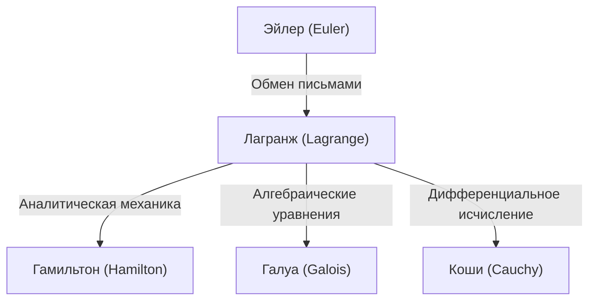

## Введение

В истории математики и физики XVIII век был эпохой, когда великие гении сияли подобно звездам. Среди них один из величайших математиков, чье имя часто упоминается наряду с Леонардом Эйлером, — **[Жозеф-Луи Лагранж](https://kenji.blog/ru/p/lagrange/)** (1736–1813). Он известен как основоположник «аналитической механики», создавший вариационное исчисление и поднявший механику от геометрической интуиции до чистого математического анализа.

В этой статье мы подробно рассмотрим бурную жизнь Лагранжа, обладавшего скромным и созерцательным характером, а также его монументальные математические и физические достижения, составляющие фундамент современной науки и техники.

## Жизнь Лагранжа

### Рождение в Турине и раннее пробуждение

Лагранж родился 25 января 1736 года в Турине, Италия. Его настоящее имя — Джузеппе Лодовико Лагранжа. Поскольку его дед был французом, позже он взял имя на французский манер. Он родился в богатой семье, но из-за того, что его отец потерял свое состояние в результате спекуляций, Лагранж был вынужден стать независимым в раннем возрасте. Позже он вспоминал: «Если бы я был богат, я, вероятно, не посвятил бы себя математике».

Первоначально он изучал право, но в возрасте 17 лет, прочитав статью Эдмунда Галлея по оптике, он проснулся с огромным интересом к математике. Он интенсивно изучал математику самостоятельно и был назначен профессором математики в Королевской артиллерийской школе в Турине в юном возрасте 19 лет.

Примерно в это же время он начал переписку с Эйлером, поделившись новаторской идеей, касающейся обобщения задачи о таутохроне (которая позже стала вариационным исчислением). Эйлер высоко оценил его талант и, как известно, отложил публикацию собственной статьи, чтобы уступить приоритет открытия этому молодому гению.

### Эпоха Берлинской академии

В 1766 году по приглашению Фридриха Великого он был назначен директором по математике в Прусской академии наук (Берлинская академия), сменив Эйлера. Фридрих Великий приветствовал его словами: «Величайший король Европы желает иметь величайшего математика Европы при своем дворе».

20 лет в Берлине были самым продуктивным периодом для Лагранжа. Он последовательно публиковал новаторские статьи в поразительном разнообразии областей, включая механику, гидродинамику, теорию вероятностей и теорию чисел. Большая часть его шедевра, *Mécanique analytique* (Аналитическая механика), также была написана в этот берлинский период.

### Последние годы в Париже

В 1787 году, после смерти Фридриха Великого, Лагранж переехал в Париж, Франция, по приглашению Людовика XVI. Ему предоставили апартаменты в Лувре, но долгие годы переутомления взяли свое, и он страдал от тяжелой депрессии. Говорят, что когда в 1788 году была опубликована *Mécanique analytique*, он не открывал свою только что напечатанную книгу два года.

Однако, когда разразилась Великая французская революция, он возобновил свою деятельность в качестве члена комитета по созданию новой системы мер и весов (метрической системы). Даже в буре революции его слава и мягкий характер спасли его от казни (когда его близкий друг, химик Лавуазье, был казнен, он сокрушался: «Им потребовалось лишь мгновение, чтобы отрубить эту голову, но не хватит и ста лет, чтобы произвести подобную»).

Позже он стал первым профессором Политехнической школы и посвятил себя образованию. Он скончался в Париже в 1813 году в возрасте 77 лет и был похоронен в Пантеоне.

## Основные достижения в математике и физике

Достижения Лагранжа невероятно обширны, но здесь мы представляем некоторые из наиболее важных.

### 1. Вариационное исчисление и уравнение Эйлера-Лагранжа

Лагранж строго сформулировал «вариационное исчисление», которое находит функцию, максимизирующую или минимизирующую функционал (функцию от функции). Если $S$ — интеграл действия, а $L$ — лагранжиан, основное уравнение механики, основанное на принципе наименьшего действия, описывается следующим образом:

$$ \frac{\partial L}{\partial q_i} - \frac{d}{dt} \left( \frac{\partial L}{\partial \dot{q}_i} \right) = 0 $$

Здесь $q_i$ — обобщенные координаты, а $\dot{q}_i$ — обобщенные скорости. Это **уравнение Эйлера-Лагранжа** позволило решать задачи систем со связями, такие как наклонные плоскости или маятники — которые сложны в ньютоновской механике — единым способом независимо от выбора системы координат.

### 2. Создание аналитической механики

Опубликованная в 1788 году, *Mécanique analytique* — это исторический шедевр, который освободил механику от геометрических чертежей и реконструировал ее как систему чистой алгебры и исчисления. В предисловии Лагранж заявил: «В этой работе не будет найдено никаких чертежей». Эта абстракция стала прочным фундаментом, приведшим позже к гамильтоновой механике Гамильтона и далее к квантовой механике в XX веке.

### 3. Множители Лагранжа

Мощным математическим методом нахождения локальных максимумов и минимумов функции при наличии ограничений-равенств является метод **множителей Лагранжа**.
Когда необходимо максимизировать или минимизировать функцию $f(x, y)$ при ограничении $g(x, y) = 0$, вводится неопределенный множитель $\lambda$ для определения новой функции (лагранжиана):

$$ \mathcal{L}(x, y, \lambda) = f(x, y) - \lambda \cdot g(x, y) $$

Решая для точки, где градиент этой функции становится равным нулю ($\nabla \mathcal{L} = 0$), можно найти оптимальное решение. Этот метод является важным инструментом в современной экономике и задачах оптимизации в машинном обучении.

### 4. Вклад в теорию чисел и алгебру

Лагранж также оставил блестящие достижения в теории чисел.
- **Теорема Лагранжа о сумме четырёх квадратов**: Он доказал теорему о том, что каждое натуральное число может быть представлено в виде суммы не более чем четырех квадратов целых чисел (например, $7 = 2^2 + 1^2 + 1^2 + 1^2$).
- **Алгебраическое решение уравнений**: Используя идею перестановок корней, он был пионером в исследовании того, можно ли алгебраически решить уравнения пятой или более высокой степени. Это был важный шаг, который позже перерос в теорию Галуа и теорию групп.

## Философия и влияние на последующие поколения

Метод Лагранжа характеризуется стремлением к логической строгости и аналитической красоте при отказе от интуиции. Его влияние можно схематично представить следующим образом:

Оставленная им концепция «лагранжиана» стала общим языком для описания всех фундаментальных уравнений современной физики, от Стандартной модели физики элементарных частиц до общей теории относительности.

## Заключение

[Жозеф-Луи Лагранж](https://kenji.blog/ru/p/lagrange/) пережил бурный XVIII век, однако его разум всегда находился в мире чистой математической истины. Его достижения — это не просто открытия прошлого; они и сегодня живут на переднем крае физики и математики. Его наследие, вера в красоту математических формул и универсальность логики, будет продолжать направлять человечество в поисках знаний.
