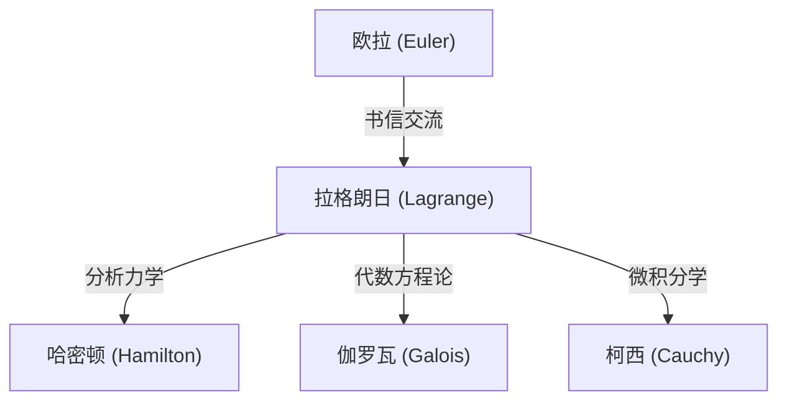

## 引言

在数学和物理学的历史中，18世纪是一个伟大天才如群星般闪耀的时代。其中，常与莱昂哈德·欧拉并列被提及的最伟大的数学家之一，就是 **约瑟夫·路易·拉格朗日** (Joseph-Louis Lagrange, 1736–1813)。他被誉为“分析力学”的创始人，确立了变分法，将力学从几何直观升华为纯粹的数学分析。

在本文中，我们将深入探讨性格谦逊、善于沉思的拉格朗日那波澜壮阔的一生，以及他在数学和物理学领域取得的、构筑了现代科学技术基石的众多伟大成就。

## 拉格朗日的生平

### 诞生于都灵与早年的觉醒

拉格朗日于1736年1月25日出生于意大利的都灵。他的本名是朱塞佩·洛多维科·拉格兰吉亚 (Giuseppe Lodovico Lagrangia)。由于他的祖父是法国人，他后来采用了法式的名字。他出生在一个富裕的家庭，但由于父亲在投机中失去了财产，拉格朗日被迫在很小的时候就自立。在晚年，他回忆道：“如果我很富有，我可能就不会献身于数学了。”

起初，他学习法律，但在17岁时，读了爱德蒙·哈雷关于光学的一篇论文后，他对数学产生了强烈的兴趣。他通过自学刻苦钻研数学，在年仅19岁时就被任命为都灵皇家炮兵学校的数学教授。

大约在这个时候，他开始与欧拉通信，传达了关于最速降线问题一般化的突破性想法（后来发展为变分法）。欧拉对他的才华大加赞赏，甚至故意推迟了自己论文的发表，以便将这一发现的优先权让给这位年轻的天才，这成为了一段著名的佳话。

### 柏林科学院时代

1766年，应腓特烈大帝的邀请，他接替欧拉，被任命为普鲁士科学院（柏林科学院）的数学部主任。腓特烈大帝欢迎他说：“欧洲最伟大的国王希望他的宫廷里有欧洲最伟大的数学家。”

在柏林的20年是拉格朗日最多产的时期。他接连在力学、流体力学、概率论、数论等令人惊叹的众多领域发表了创新性的论文。他的代表作《分析力学》(Mécanique analytique) 的大部分也是在柏林时期完成的。

### 巴黎的晚年

1787年腓特烈大帝去世后，拉格朗日应路易十六的邀请移居法国巴黎。他被赐予卢浮宫内的住所，但长年的过度劳累使他付出了代价，他患上了严重的抑郁症。据说在1788年《分析力学》出版时，他竟然整整两年没有翻开过那本刚印好的自己的著作。

然而，当法国大革命爆发时，他作为建立新度量衡制度（公制）的委员会成员，重新恢复了活动。即使在革命的狂风暴雨中，他的名望和温和的性格使他免于被处死（当他的挚友、化学家拉瓦锡被处死时，他悲叹道：“砍下那颗头颅只需要一瞬间，但要长出同样的头脑，一百年也不够”）。

之后，他成为巴黎综合理工学院的首任教授，并投身于教育事业。1813年，他在巴黎逝世，享年77岁，被安葬在先贤祠。

## 数学与物理学领域的主要成就

拉格朗日的成就极其广泛，在这里我们仅介绍其中最重要的一些。

### 1. 变分法与欧拉-拉格朗日方程

拉格朗日严格地形式化了“变分法”，这是一种寻找使泛函（函数的函数）最大化或最小化的函数的方法。设 $S$ 为作用量积分，$L$ 为拉格朗日量，基于最小作用量原理的力学基本方程描述如下：

$$ \frac{\partial L}{\partial q_i} - \frac{d}{dt} \left( \frac{\partial L}{\partial \dot{q}_i} \right) = 0 $$

这里，$q_i$ 是广义坐标，$\dot{q}_i$ 是广义速度。这种 **欧拉-拉格朗日方程** 使得在牛顿力学中变得复杂的约束系统问题（如斜面或单摆），能够以一种独立于坐标系选择的统一方法来解决。

### 2. 《分析力学》的构建

1788年出版的《分析力学》是一部历史性的杰作，它将力学从几何图形中解放出来，将其重构为纯代数和微积分的体系。拉格朗日在序言中宣称：“在这本书中找不到任何图形。”这种抽象化成为了坚实的基础，后来直接导向了哈密顿的哈密顿力学，并进一步发展为20世纪的量子力学。

### 3. 拉格朗日乘数法 (Lagrange Multipliers)

在等式约束条件下寻找多变量函数局部极值的一种强大的数学方法就是 **拉格朗日乘数法** 。
当希望在约束条件 $g(x, y) = 0$ 下使函数 $f(x, y)$ 最大化或最小化时，引入一个未定乘数 $\lambda$ 来定义一个新的函数（拉格朗日函数）：

$$ \mathcal{L}(x, y, \lambda) = f(x, y) - \lambda \cdot g(x, y) $$

通过求解使该函数梯度为零的点 ($\nabla \mathcal{L} = 0$)，就可以找到最优解。这种方法在现代经济学和机器学习的优化问题中已成为必不可少的工具。

### 4. 对数论与代数学的贡献

拉格朗日在数论方面也留下了辉煌的成就。
- **拉格朗日四平方和定理**：他证明了任何自然数都可以表示为最多四个整数的平方和（例如， $7 = 2^2 + 1^2 + 1^2 + 1^2$ ）。
- **方程的代数解法**：他利用根的置换思想，开创了关于五次及以上方程是否能用代数方法求解的研究。这是一个重要的步骤，后来发展成为伽罗瓦理论和群论。

## 思想与对后世的影响

拉格朗日的方法的特点在于排除了直观，追求逻辑的严密性和分析的美感。他的影响力可以图解如下：

他留下的“拉格朗日量”这一概念，已经成为描述从粒子物理学的标准模型到广义相对论等现代物理学所有基础方程的共通语言。

## 结语

约瑟夫·路易·拉格朗日虽然经历了动荡的18世纪，但他的精神始终沉浸在纯粹数学真理的世界里。他的成就不仅仅是过去的发现，今天依然在物理学和数学的最前沿焕发着生机。他坚信数学公式之美和逻辑的普遍性，他的遗产将继续指引人类对知识的探索。
