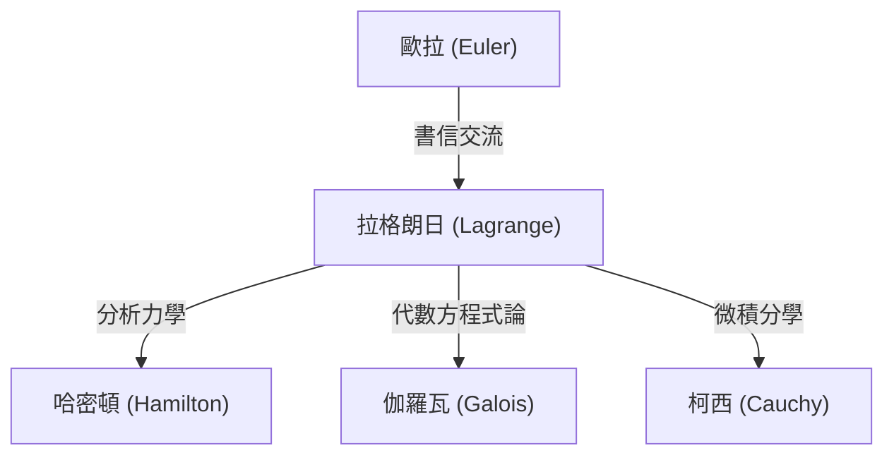

## 引言

在數學和物理學的歷史中，18世紀是一個偉大天才如群星般閃耀的時代。其中，常與萊昂哈德·歐拉並列被提及的最偉大的數學家之一，就是 **[約瑟夫·路易·拉格朗日](https://kenji.blog/zh-tw/p/lagrange/)** ([Joseph-Louis Lagrange](https://kenji.blog/zh-tw/p/lagrange/), 1736–1813)。他被譽為「分析力學」的創始人，確立了變分法，將力學從幾何直觀昇華為純粹的數學分析。

在本文中，我們將深入探討性格謙遜、善於沉思的拉格朗日那波瀾壯闊的一生，以及他在數學和物理學領域取得的、構築了現代科學技術基石的眾多偉大成就。

## 拉格朗日的生平

### 誕生於杜林與早年的覺醒

拉格朗日於1736年1月25日出生於義大利的杜林。他的本名是朱塞佩·洛多維科·拉格蘭吉亞 (Giuseppe Lodovico Lagrangia)。由於他的祖父是法國人，他後來採用了法式的名字。他出生在一個富裕的家庭，但由於父親在投機中失去了財產，拉格朗日被迫在很小的時候就自立。在晚年，他回憶道：「如果我很富有，我可能就不會獻身於數學了。」

起初，他學習法律，但在17歲時，讀了愛德蒙·哈雷關於光學的一篇論文後，他對數學產生了強烈的興趣。他透過自學刻苦鑽研數學，在年僅19歲時就被任命為杜林皇家炮兵學校的數學教授。

大約在這個時候，他開始與歐拉通信，傳達了關於最速降線問題一般化的突破性想法（後來發展為變分法）。歐拉對他的才華大加讚賞，甚至故意推遲了自己論文的發表，以便將這一發現的優先權讓給這位年輕的天才，這成為了一段著名的佳話。

### 柏林科學院時代

1766年，應腓特烈大帝的邀請，他接替歐拉，被任命為普魯士科學院（柏林科學院）的數學部主任。腓特烈大帝歡迎他說：「歐洲最偉大的國王希望他的宮廷裡有歐洲最偉大的數學家。」

在柏林的20年是拉格朗日最多產的時期。他接連在力學、流體力學、機率論、數論等令人驚嘆的眾多領域發表了創新性的論文。他的代表作《分析力學》(Mécanique analytique) 的大部分也是在柏林時期完成的。

### 巴黎的晚年

1787年腓特烈大帝去世後，拉格朗日應路易十六的邀請移居法國巴黎。他被賜予羅浮宮內的住所，但長年的過度勞累使他付出了代價，他患上了嚴重的憂鬱症。據說在1788年《分析力學》出版時，他竟然整整兩年沒有翻開過那本剛印好的自己的著作。

然而，當法國大革命爆發時，他作為建立新度量衡制度（公制）的委員會成員，重新恢復了活動。即使在革命的狂風暴雨中，他的名望和溫和的性格使他免於被處死（當他的摯友、化學家拉瓦節被處死時，他悲嘆道：「砍下那顆頭顱只需要一瞬間，但要長出同樣的頭腦，一百年也不夠」）。

之後，他成為巴黎綜合理工學院的首任教授，並投身於教育事業。1813年，他在巴黎逝世，享年77歲，被安葬在先賢祠。

## 數學與物理學領域的主要成就

拉格朗日的成就極其廣泛，在這裡我們僅介紹其中最重要的一些。

### 1. 變分法與歐拉-拉格朗日方程式

拉格朗日嚴格地形式化了「變分法」，這是一種尋找使泛函（函數的函數）最大化或最小化的函數的方法。設 $S$ 為作用量積分，$L$ 為拉格朗日量，基於最小作用量原理的力學基本方程式描述如下：

$$ \frac{\partial L}{\partial q_i} - \frac{d}{dt} \left( \frac{\partial L}{\partial \dot{q}_i} \right) = 0 $$

這裡，$q_i$ 是廣義座標，$\dot{q}_i$ 是廣義速度。這種 **歐拉-拉格朗日方程式** 使得在牛頓力學中變得複雜的約束系統問題（如斜面或單擺），能夠以一種獨立於座標系選擇的統一方法來解決。

### 2. 《分析力學》的建構

1788年出版的《分析力學》是一部歷史性的傑作，它將力學從幾何圖形中解放出來，將其重構為純代數和微積分的體系。拉格朗日在序言中宣稱：「在這本書中找不到任何圖形。」這種抽象化成為了堅實的基礎，後來直接導向了哈密頓的哈密頓力學，並進一步發展為20世紀的量子力學。

### 3. 拉格朗日乘數法 ([Lagrange](https://kenji.blog/zh-tw/p/lagrange/) Multipliers)

在等式約束條件下尋找多變數函數局部極值的一種強大的數學方法就是 **拉格朗日乘數法** 。
當希望在約束條件 $g(x, y) = 0$ 下使函數 $f(x, y)$ 最大化或最小化時，引入一個未定乘數 $\lambda$ 來定義一個新的函數（拉格朗日函數）：

$$ \mathcal{L}(x, y, \lambda) = f(x, y) - \lambda \cdot g(x, y) $$

透過求解使該函數梯度為零的點 ($\nabla \mathcal{L} = 0$)，就可以找到最佳解。這種方法在現代經濟學和機器學習的最佳化問題中已成為不可或缺的工具。

### 4. 對數論與代數學的貢獻

拉格朗日在數論方面也留下了輝煌的成就。
- **拉格朗日四平方和定理**：他證明了任何自然數都可以表示為最多四個整數的平方和（例如， $7 = 2^2 + 1^2 + 1^2 + 1^2$ ）。
- **方程式的代數解法**：他利用根的置換思想，開創了關於五次及以上方程式是否能用代數方法求解的研究。這是一個重要的步驟，後來發展成為伽羅瓦理論和群論。

## 思想與對後世的影響

拉格朗日的方法的特點在於排除了直觀，追求邏輯的嚴密性和分析的美感。他的影響力可以圖解如下：

他留下的「拉格朗日量」這一概念，已經成為描述從粒子物理學的標準模型到廣義相對論等現代物理學所有基礎方程式的共通語言。

## 結語

[約瑟夫·路易·拉格朗日](https://kenji.blog/zh-tw/p/lagrange/)雖然經歷了動盪的18世紀，但他的精神始終沉浸在純粹數學真理的世界裡。他的成就不僅僅是過去的發現，今天依然在物理學和數學的最前線煥發著生機。他堅信數學公式之美和邏輯的普遍性，他的遺產將繼續指引人類對知識的探索。
