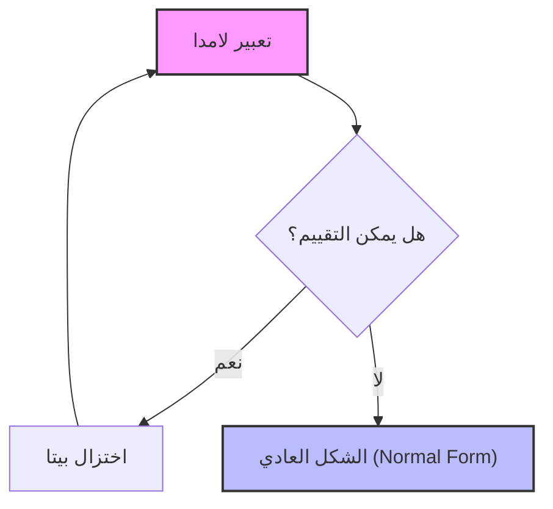
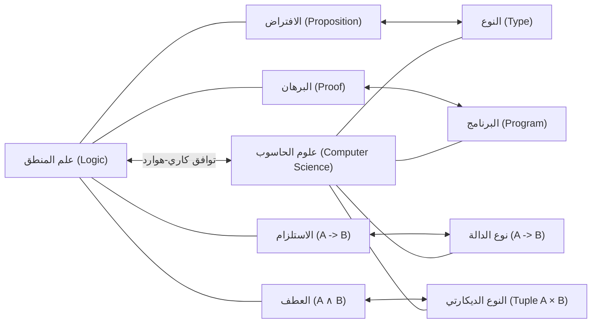

## 1. مقدمة: الفلسفة الكامنة وراء البرمجة الوظيفية

في تطوير البرمجيات الحديث، لم تعد **البرمجة الوظيفية** ([Functional Programming](https://kenji.blog/ar/p/oop-vs-fp-vs-dop/)) مجرد نهج لبعض الهواة، بل أصبحت نموذجًا واسع الانتشار. من تقنيات الواجهة الأمامية مثل React، إلى لغات مثل Rust وScala، وحتى اللغات كائنية التوجه مثل [Java](https://kenji.blog/ar/p/programming-languages-history-paradigm-evolution/) وC#، تم تبني مفاهيم مثل التعامل مع الدوال ككائنات من الدرجة الأولى والقضاء على الآثار الجانبية.

ومع ذلك، وراء هذا النموذج تكمن نظرية رياضية عميقة تم بناؤها في الثلاثينيات من القرن الماضي قبل الولادة المادية لأجهزة الكمبيوتر. وهو **حساب لامدا** ($\lambda$-calculus) الذي اقترحه ألونزو تشيرش (Alonzo Church).

في هذا المقال، بدءًا من النظرية الأساسية لحساب لامدا، سوف نستكشف بالتفصيل كيف أثرت على لغة البرمجة المبكرة **Lisp**، والتطور التاريخي والنظري الذي أدى إلى لغة البرمجة الوظيفية البحتة **Haskell**.

## 2. ولادة حساب لامدا: ألونزو تشيرش وتعريف الحوسبة

### 2.1 التحدي في مشكلة القرار (Entscheidungsproblem)

في عام 1928، طرح عالم الرياضيات ديفيد هيلبرت "مشكلة القرار" (Entscheidungsproblem). وكان السؤال هو: "بالنظر إلى افتراض رياضي معين، هل توجد خوارزمية يمكنها تحديد ميكانيكيًا ما إذا كان صحيحًا أم خاطئًا؟"

للإجابة على هذا السؤال، كان من الضروري أولاً تحديد ما يعنيه بالضبط أن تكون "قابلة للحساب" أو "وجود خوارزمية". في عام 1936، كان هناك عبقريان قدما إجابات مستقلة لهذه المشكلة. أحدهما كان آلان تورينج والآخر هو ألونزو تشيرش، الذي كان أيضًا المشرف على تورينج.

أظهر تورينج حدود الحوسبة باستخدام نموذج آلة افتراضية يسمى "آلة تورينج". من ناحية أخرى، عرّف تشيرش قابلية الحساب من خلال نهج رمزي بحت يسمى **حساب لامدا**. ومن المدهش أن هذين النموذجين، اللذين تم تعريفهما بمناهج مختلفة تمامًا، أثبتا أنهما متكافئان تمامًا في القوة الحسابية (أطروحة تشيرش وتورينج).

### 2.2 البنية الأساسية لحساب لامدا

عالم حساب لامدا بسيط للغاية. يحتوي على ثلاثة عناصر فقط: تعريف المتغيرات، وتجريد الدوال، وتطبيق الدوال.

$$
E ::= x \mid (\lambda x. E) \mid (E_1 \ E_2)
$$

- $x$ : **متغير** (Variable)
- $\lambda x. E$ : **تجريد** (Abstraction) - يُعرّف دالة تأخذ الوسيطة $x$ وتُرجع التعبير $E$.
- $E_1 \ E_2$ : **تطبيق الدالة** (Application) - يُطبق الدالة $E_1$ على الوسيطة $E_2$.

على سبيل المثال، دالة الهوية (دالة تُرجع الوسيطة المستلمة كما هي) تُكتب في حساب لامدا كالتالي:

$$
\lambda x. x
$$

## 3. قواعد الحساب في حساب لامدا

في حساب لامدا، تم وضع قواعد صارمة لتقييم (اختزال) التعبيرات. تشمل القواعد الرئيسية **تحويل ألفا** و **اختزال بيتا** و **تحويل إيتا**.

### 3.1 تحويل ألفا ($\alpha$-conversion)

تحويل ألفا هو قاعدة لتغيير أسماء المتغيرات المقيدة بأمان. بما أن أسماء المتغيرات المستخدمة في الدالة ليس لها معنى جوهري، يمكن تغييرها طالما أنها لا تتعارض مع أسماء المتغيرات الأخرى.

$$
\lambda x. x \equiv \lambda y. y
$$

### 3.2 اختزال بيتا ($\beta$-reduction)

اختزال بيتا هو "تنفيذ الحساب" بحد ذاته في حساب لامدا. يشير إلى عملية استبدال الوسيطة بالمتغير داخل جسم الدالة عند تطبيق الدالة.

$$
(\lambda x. x \ y) \ z \rightarrow z \ y
$$

### 3.3 تحويل إيتا ($\eta$-conversion)

تحويل إيتا هو مفهوم يمثل المدى (extensionality) للدوال. يعتمد على قاعدة أن الدالتين اللتين تُرجعان نفس النتيجة لجميع الوسائط هما متساويتان.

$$
\lambda x. (f \ x) \equiv f
$$



## 4. ترميز تشيرش: خلق شيء من لا شيء

في حساب لامدا، لا توجد أنواع بيانات مدمجة (مثل الأرقام، والقيم المنطقية، والقوائم). كل شيء هو مجرد دالة. ومع ذلك، أظهر تشيرش أنه من خلال الدمج الماهر للدوال، يمكن التعبير عن جميع هياكل البيانات وهياكل التحكم. يسمى هذا **ترميز تشيرش** (Church Encoding).

### 4.1 القيم المنطقية (قيم تشيرش المنطقية)

تُعرّف القيمتان الصواب (True) والخطأ (False) كدوال تأخذ وسيطتين وتُرجع إحداهما.

- **TRUE** : $\lambda x. \lambda y. x$ (تُرجع الوسيطة الأولى)
- **FALSE** : $\lambda x. \lambda y. y$ (تُرجع الوسيطة الثانية)

باستخدام هذا، يمكن التعبير عن التفرع الشرطي المعادل لعبارة IF ببساطة كتطبيق دالة.

- **IF** : $\lambda p. \lambda x. \lambda y. p \ x \ y$

### 4.2 الأرقام (أرقام تشيرش)

يمكن التعبير عن الأعداد الطبيعية أيضًا باستخدام الدوال. في أرقام تشيرش، يُعرّف الرقم $n$ بأنه "دالة ذات ترتيب أعلى تُطبق دالة معينة $f$ على الوسيطة $x$ لعدد $n$ من المرات".

- **0** : $\lambda f. \lambda x. x$
- **1** : $\lambda f. \lambda x. f \ x$
- **2** : $\lambda f. \lambda x. f \ (f \ x)$
- **3** : $\lambda f. \lambda x. f \ (f \ (f \ x))$

يُعرّف الدالة اللاحقة (SUCC: دالة تضيف 1 إلى الرقم المعطى) كالتالي:

- **SUCC** : $\lambda n. \lambda f. \lambda x. f \ (n \ f \ x)$

دعونا نحاكي هذا المفهوم في كود Python.

```python
# تمثيل أرقام تشيرش في Python
ZERO  = lambda f: lambda x: x
ONE   = lambda f: lambda x: f(x)
TWO   = lambda f: lambda x: f(f(x))

# الدالة اللاحقة (Successor)
SUCC  = lambda n: lambda f: lambda x: f(n(f)(x))

# الجمع
ADD   = lambda m: lambda n: lambda f: lambda x: m(f)(n(f)(x))

# دالة مساعدة لتحويل رقم تشيرش إلى عدد صحيح عادي في Python
def to_int(church_numeral):
    return church_numeral(lambda x: x + 1)(0)

print(to_int(TWO)) # المخرجات: 2
print(to_int(ADD(TWO)(SUCC(TWO)))) # 2 + 3 = 5
```

## 5. مُجمّع النقطة الثابتة واكتمال تورينج

في حساب لامدا، الدوال ليس لها أسماء (دوال مجهولة). إذن، كيف نتمكن من تحقيق الاستدعاء العودي؟ ما يحل هذه المشكلة هو **مُجمّع النقطة الثابتة** (Fixed-point combinator)، وبشكل خاص **مُجمّع Y** الشهير.

$$
Y = \lambda f. (\lambda x. f \ (x \ x)) \ (\lambda x. f \ (x \ x))
$$

يحقق مُجمّع Y المعادلة $Y \ f = f \ (Y \ f)$ لأي دالة $f$. باستخدام هذا، يمكن التعبير عن الهيكل العودي كتطبيق للدالة على نفسها، مما يتيح معالجة الحلقات اللانهائية والعودية للحاسوب داخل إطار عمل حساب لامدا. وهذا يوضح أن حساب لامدا هو مكتمل حسب تورينج.

## 6. ولادة Lisp: من النظرية إلى لغة البرمجة

في أواخر الخمسينيات، كان جون مكارثي (John McCarthy) يصمم لغة برمجة جديدة لأبحاث الذكاء الاصطناعي. استوحى أفكاره من حساب لامدا لتشيرش وطور لغة تدعم بشكل مباشر تجريد الدوال والعودية. هذه هي **Lisp** (LISt Processing).

أكبر ميزة في Lisp هي أن الكود نفسه يتم التعبير عنه كبيانات (قائمة) (التماثل الصوري: Homoiconicity)، والقدرة على تعريف الدوال المجهولة باستخدام الكلمة المفتاحية `lambda`.

```lisp
;; مثال لتعريف الدالة والدالة ذات الترتيب الأعلى في Lisp
(define (square x) (* x x))

;; تمرير تعبير لامدا إلى دالة map
(map (lambda (x) (* x x)) '(1 2 3 4 5))
;; النتيجة: (1 4 9 16 25)
```

على الرغم من أن Lisp كانت ذات كتابة ديناميكية ولم تكن نسخة طبق الأصل من حساب لامدا النظري، إلا أنها أصبحت أول إنجاز عظيم في تحقيق روح البرمجة الوظيفية، وهي "التعامل مع الدوال كبيانات" و"اعتبار الحوسبة كتقييم للدوال" على حواسيب العالم الحقيقي.

## 7. حساب لامدا ذو الأنواع وتوافق كاري-هوارد

على الرغم من أن حساب لامدا النقي (حساب لامدا بدون أنواع) قوي، إلا أنه يمكن تمرير أي وسيطة لأي دالة، مما قد يؤدي إلى مفارقات ناجمة عن التطبيق الذاتي (مثل مفارقة راسل). لمنع ذلك، قدم تشيرش لاحقًا **حساب لامدا البسيط ذو الأنواع** (Simply Typed [Lambda](https://kenji.blog/ar/p/serverless-architecture-aws-lambda-cold-start/) Calculus).

### 7.1 توافق كاري-هوارد

مع تطور نظرية الأنواع، تم اكتشاف توافق مدهش بين علوم الحاسوب والمنطق. وهو **توافق كاري-هوارد** (Curry-Howard Correspondence).

- **الأنواع (Types)** تتوافق مع **الافتراضات (Propositions)**.
- **البرامج (Programs)** تتوافق مع **البراهين (Proofs)**.
- **تقييم الدوال (Evaluation)** يتوافق مع **اختزال البرهان (Proof simplification)**.



هذا الأساس الرياضي القوي تطور لاحقًا إلى نهج يضمن صحة البرامج من خلال أنظمة الأنواع، مما مهد الطريق للغات البرمجة الوظيفية ذات الأنواع الثابتة الحديثة.

## 8. ظهور Haskell وقمتها في البرمجة الوظيفية البحتة

في أواخر الثمانينيات، شكل باحثو لغات البرمجة الوظيفية لجنة لإنشاء لغة برمجة وظيفية بحتة وموحدة تعتمد على التقييم الكسول. كان هذا بمثابة ولادة **Haskell**، والتي سُميت على اسم عالم المنطق هاسكل كاري (Haskell Curry).

### 8.1 التقييم الكسول (Lazy Evaluation)

تعتمد Haskell **التقييم الكسول** كإعداد افتراضي، حيث لا يتم تقييم التعبير حتى تكون قيمته مطلوبة حقًا. يتيح هذا التعبير بشكل طبيعي عن مفاهيم مثل القوائم اللانهائية. ويتوافق هذا مع "الاختزال بالترتيب العادي (Normal-order reduction)" في حساب لامدا.

```haskell
-- مثال على قائمة لانهائية في Haskell
-- قائمة بجميع الأعداد الطبيعية بدءًا من 1
naturals :: [Integer]
naturals = [1..]

-- الحصول على أول 10 أعداد زوجية
firstTenEvens :: [Integer]
firstTenEvens = take 10 (map (*2) naturals)
```

### 8.2 الموناد (Monads) وإدارة الآثار الجانبية

في لغات البرمجة الوظيفية البحتة، كانت كيفية التعامل مع "الآثار الجانبية (Side Effects)" مثل الإدخال/الإخراج وتغيرات الحالة مع الحفاظ على النقاء الرياضي (الشفافية المرجعية) تحديًا طويل الأمد. حلت Haskell هذه المشكلة بأناقة من خلال تقديم **الموناد** ([Monad](https://kenji.blog/ar/p/functional-programming-concepts-pure-functions-monads/))، وهو مفهوم من نظرية الفئات (Category Theory).

من خلال IO Monad، نجحت في الفصل التام بين "الحساب" و"التنفيذ المصحوب بآثار جانبية" على مستوى نظام الأنواع.

## 9. الخلاصة: من الرياضيات إلى هندسة البرمجيات

**حساب لامدا** الذي صاغه ألونزو تشيرش في الثلاثينيات باستخدام الورقة والقلم فقط ليس بأي حال من الأحوال نظرية عفا عليها الزمن. لقد أعاد تعريف "ما هي الحوسبة" من زاوية مختلفة عن آلة تورينج، وتم إطلاقه في العالم القابل للبرمجة من خلال Lisp. ومن خلال ارتباطه الجميل بالمنطق المعروف بتوافق كاري-هوارد، أثمر إلى اللغات الحديثة ذات الأنظمة القوية والمتينة مثل Haskell.

اليوم، عندما نستخدم `map` و `filter` في React، ونستفيد من أنواع البيانات الجبرية في [Rust](https://kenji.blog/ar/p/webassembly-wasm-current-future/)، ونكتب تعبيرات لامدا في Python، فإننا جميعًا نستفيد من الإرث الفكري العظيم لتشيرش.

البرمجة الوظيفية ليست مجرد أسلوب كتابة أكواد، بل هي **فلسفة رياضية تقترب من جوهر الحوسبة نفسها**.
