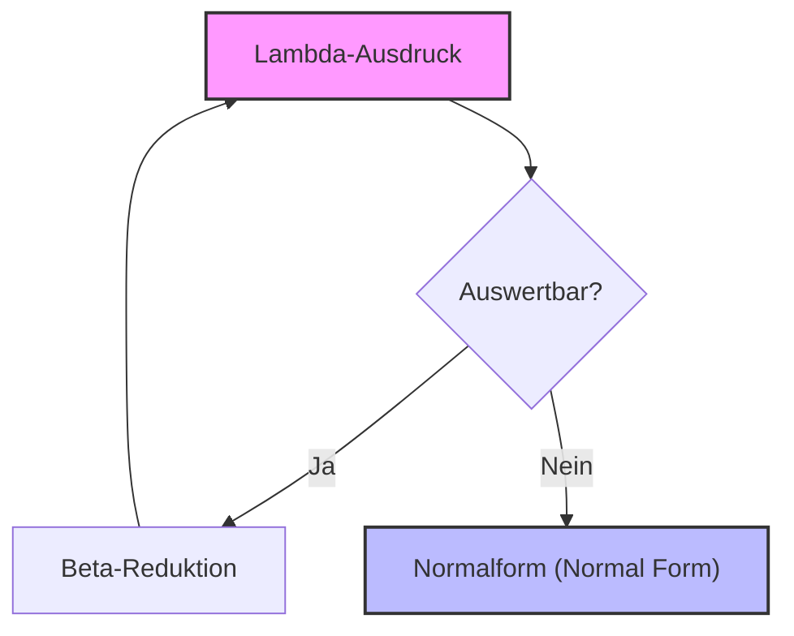
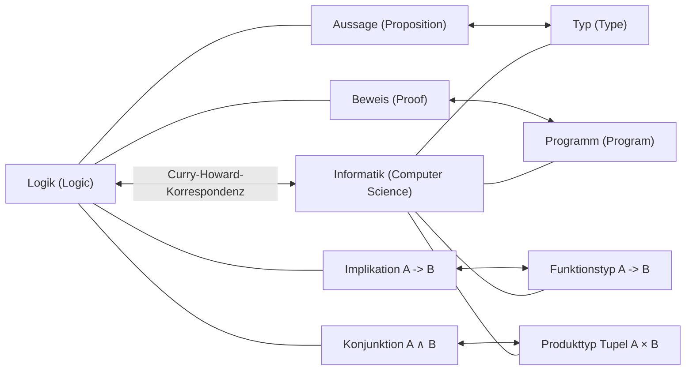

## 1. Einführung: Die Philosophie hinter der funktionalen Programmierung

In der modernen Softwareentwicklung ist die **funktionale Programmierung** ([Functional Programming](https://kenji.blog/de/p/oop-vs-fp-vs-dop/)) nicht mehr nur ein Ansatz für einige wenige Enthusiasten, sondern ein weit verbreitetes Paradigma geworden. Von Frontend-Technologien wie React bis hin zu Rust, Scala und sogar objektorientierten Sprachen wie [Java](https://kenji.blog/de/p/programming-languages-history-paradigm-evolution/) und C# wurden Konzepte wie die Behandlung von Funktionen als First-Class-Citizens und die Eliminierung von Seiteneffekten übernommen.

Hinter diesem Paradigma verbirgt sich jedoch eine tiefgreifende mathematische Theorie, die in den 1930er Jahren aufgebaut wurde, noch bevor Computer physisch existierten. Dies ist das von Alonzo Church (Alonzo Church) vorgeschlagene **[Lambda](https://kenji.blog/de/p/serverless-architecture-aws-lambda-cold-start/)-Kalkül** ( $\lambda$-calculus ).

In diesem Artikel werden wir im Detail untersuchen, wie sich das Lambda-Kalkül von seiner grundlegenden Theorie entwickelt hat, wie es die frühe Programmiersprache **Lisp** beeinflusst hat und welche historischen und theoretischen Entwicklungen bis hin zu **Haskell**, einer rein funktionalen Sprache, stattgefunden haben.

## 2. Die Geburt des Lambda-Kalküls: Alonzo Church und die Definition von Berechnung

### 2.1 Die Herausforderung des Entscheidungsproblems

1928 stellte der Mathematiker David Hilbert das „Entscheidungsproblem“ (Entscheidungsproblem) auf. Die Frage lautete: „Gibt es einen Algorithmus, der für eine gegebene mathematische Aussage mechanisch bestimmen kann, ob sie wahr oder falsch ist?“

Um diese Frage zu beantworten, musste zunächst streng definiert werden, was „berechenbar“ bedeutet oder dass ein „Algorithmus existiert“. 1936 gab es zwei Genies, die dieses Problem unabhängig voneinander lösten. Der eine war Alan Turing und der andere war sein Doktorvater, Alonzo Church.

Turing demonstrierte die Grenzen der Berechnung mithilfe eines fiktiven Maschinenmodells, der „Turingmaschine“. Church hingegen definierte die Berechenbarkeit mit einem rein semiotischen Ansatz namens **Lambda-Kalkül**. Erstaunlicherweise wurde bewiesen, dass diese beiden mit völlig unterschiedlichen Ansätzen definierten Modelle in ihrer Rechenleistung völlig äquivalent sind (Church-Turing-These).

### 2.2 Grundsyntax des Lambda-Kalküls

Die Welt des Lambda-Kalküls ist sehr einfach. Sie besteht nur aus drei Elementen: Definition von Variablen, Abstraktion von Funktionen und Funktionsanwendung.

$$
E ::= x \mid (\lambda x. E) \mid (E_1 \ E_2)
$$

- $x$ : **Variable** (Variable)
- $\lambda x. E$ : **Abstraktion** (Abstraction) - Definiert eine Funktion, die ein Argument $x$ annimmt und den Ausdruck $E$ zurückgibt.
- $E_1 \ E_2$ : **Funktionsanwendung** (Application) - Wendet die Funktion $E_1$ auf das Argument $E_2$ an.

Zum Beispiel wird die Identitätsfunktion (eine Funktion, die das empfangene Argument direkt zurückgibt) im Lambda-Kalkül wie folgt geschrieben:

$$
\lambda x. x
$$

## 3. Operationsregeln des Lambda-Kalküls

Im Lambda-Kalkül sind strenge Regeln festgelegt, um Ausdrücke auszuwerten (zu reduzieren). Die Hauptregeln sind die **Alpha-Konversion**, die **Beta-Reduktion** und die **Eta-Konversion**.

### 3.1 Alpha-Konversion ( $\alpha$ -conversion)

Die Alpha-Konversion ist eine Regel zur sicheren Änderung des Namens von gebundenen Variablen. Da die innerhalb einer Funktion verwendeten Variablennamen keine wesentliche Bedeutung haben, können sie geändert werden, solange sie nicht mit anderen Variablennamen kollidieren.

$$
\lambda x. x \equiv \lambda y. y
$$

### 3.2 Beta-Reduktion ( $\beta$ -reduction)

Die Beta-Reduktion ist die eigentliche „Ausführung der Berechnung“ im Lambda-Kalkül. Sie bezeichnet die Operation, bei der bei einer Funktionsanwendung das Argument für die Variable im Funktionsrumpf eingesetzt wird.

$$
(\lambda x. x \ y) \ z \rightarrow z \ y
$$

### 3.3 Eta-Konversion ( $\eta$ -conversion)

Die Eta-Konversion ist ein Konzept, das die Extensionalität (extensionality) von Funktionen ausdrückt. Sie basiert auf der Regel, dass zwei Funktionen, die für alle Argumente das gleiche Ergebnis zurückgeben, gleich sind.

$$
\lambda x. (f \ x) \equiv f
$$



## 4. Church-Codierung: Aus dem Nichts etwas erschaffen

Im [Lambda](https://kenji.blog/de/p/serverless-architecture-aws-lambda-cold-start/)-Kalkül gibt es überhaupt keine eingebauten Datentypen (Zahlen, Wahrheitswerte, Listen usw.). Alles sind nur Funktionen. Church zeigte jedoch, dass man durch geschicktes Kombinieren von Funktionen jegliche Datenstrukturen oder Kontrollstrukturen darstellen kann. Dies wird als **Church-Codierung** (Church Encoding) bezeichnet.

### 4.1 Wahrheitswerte (Church-Booleans)

Wahr (True) und Falsch (False) werden als Funktionen definiert, die zwei Argumente annehmen und eines davon zurückgeben.

- **TRUE** : $\lambda x. \lambda y. x$ (Gibt das erste Argument zurück)
- **FALSE** : $\lambda x. \lambda y. y$ (Gibt das zweite Argument zurück)

Damit lassen sich bedingte Verzweigungen, die einem IF-Statement entsprechen, einfach als Funktionsanwendung ausdrücken.

- **IF** : $\lambda p. \lambda x. \lambda y. p \ x \ y$

### 4.2 Zahlen (Church-Numerale)

Auch natürliche Zahlen können als Funktionen dargestellt werden. In Church-Numeralen ist die Zahl $n$ als „eine Funktion höherer Ordnung definiert, die eine bestimmte Funktion $f$ $n$-mal auf ein Argument $x$ anwendet“.

- **0** : $\lambda f. \lambda x. x$
- **1** : $\lambda f. \lambda x. f \ x$
- **2** : $\lambda f. \lambda x. f \ (f \ x)$
- **3** : $\lambda f. \lambda x. f \ (f \ (f \ x))$

Die Nachfolgerfunktion (SUCC : eine Funktion, die zu einer gegebenen Zahl 1 addiert) ist wie folgt definiert:

- **SUCC** : $\lambda n. \lambda f. \lambda x. f \ (n \ f \ x)$

Lassen Sie uns dieses Konzept mit Python-Code emulieren.

```python
# Darstellung von Church-Numeralen in Python
ZERO  = lambda f: lambda x: x
ONE   = lambda f: lambda x: f(x)
TWO   = lambda f: lambda x: f(f(x))

# Nachfolgerfunktion (Successor)
SUCC  = lambda n: lambda f: lambda x: f(n(f)(x))

# Addition
ADD   = lambda m: lambda n: lambda f: lambda x: m(f)(n(f)(x))

# Hilfsfunktion zur Umwandlung eines Church-Numerals in einen normalen Python-Integer
def to_int(church_numeral):
    return church_numeral(lambda x: x + 1)(0)

print(to_int(TWO)) # Ausgabe: 2
print(to_int(ADD(TWO)(SUCC(TWO)))) # 2 + 3 = 5
```

## 5. Festpunktkombinator und Turing-Vollständigkeit

Im [Lambda](https://kenji.blog/de/p/serverless-architecture-aws-lambda-cold-start/)-Kalkül haben Funktionen keine Namen (anonyme Funktionen). Wie erreicht man also rekursive Aufrufe? Die Lösung für dieses Problem ist der **Festpunktkombinator** (Fixed-point combinator), insbesondere der berühmte **Y-Kombinator**.

$$
Y = \lambda f. (\lambda x. f \ (x \ x)) \ (\lambda x. f \ (x \ x))
$$

Der Y-Kombinator erfüllt $Y \ f = f \ (Y \ f)$ für eine beliebige Funktion $f$. Durch dessen Nutzung lässt sich eine rekursive Struktur als Anwendung einer Funktion auf sich selbst darstellen, wodurch unendliche Schleifen oder Rekursionen eines Computers im Rahmen des Lambda-Kalküls verarbeitet werden können. Dies beweist, dass das Lambda-Kalkül Turing-vollständig ist.

## 6. Die Geburt von Lisp: Von der Theorie zur Programmiersprache

In den späten 1950er Jahren entwarf John McCarthy eine neue Programmiersprache für die Forschung im Bereich der künstlichen Intelligenz. Inspiriert von Churchs Lambda-Kalkül entwickelte er eine Sprache, die Funktionsabstraktion und Rekursion direkt unterstützt. Dies ist **Lisp** (LISt Processing).

Das wichtigste Merkmal von Lisp ist, dass der Code selbst als Daten (eine Liste) repräsentiert wird (Homoikonizität: Homoiconicity), und dass anonyme Funktionen mit dem Schlüsselwort `lambda` definiert werden können.

```lisp
;; Beispiel für Funktionsdefinition und Funktion höherer Ordnung in Lisp
(define (square x) (* x x))

;; Übergabe eines Lambda-Ausdrucks an die map-Funktion
(map (lambda (x) (* x x)) '(1 2 3 4 5))
;; Ergebnis: (1 4 9 16 25)
```

Obwohl Lisp dynamisch typisiert ist und nicht genau dem theoretischen [Lambda](https://kenji.blog/de/p/serverless-architecture-aws-lambda-cold-start/)-Kalkül entspricht, war es der erste große Meilenstein, der den Geist der funktionalen Programmierung – „Funktionen als Daten behandeln“ und „Berechnung als Funktionsauswertung betrachten“ – auf realen Computern umsetzte.

## 7. Getyptes Lambda-Kalkül und die Curry-Howard-Korrespondenz

Das reine Lambda-Kalkül (ungetyptes Lambda-Kalkül) ist mächtig, aber da jedes Argument an jede Funktion übergeben werden kann, könnte es zu Paradoxien durch Selbstanwendung führen (z.B. das Russellsche Paradoxon). Um dies zu verhindern, führte Church später das **einfach getypte Lambda-Kalkül** (Simply Typed Lambda Calculus) ein.

### 7.1 Curry-Howard-Korrespondenz

Mit der Entwicklung der Typtheorie wurde eine erstaunliche Korrespondenz zwischen Informatik und Logik entdeckt. Dies ist die **Curry-Howard-Korrespondenz** (Curry-Howard Correspondence).

- **Typen (Types)** entsprechen **Aussagen (Propositions)**.
- **Programme (Programs)** entsprechen **Beweisen (Proofs)**.
- **Auswertung einer Funktion (Evaluation)** entspricht der **Beweisvereinfachung (Proof simplification)**.



Dieses starke mathematische Fundament entwickelte sich später zu einem Ansatz, der die Korrektheit von Programmen durch das Typsystem garantiert, und ebnete den Weg für moderne statisch getypte funktionale Sprachen.

## 8. Das Erscheinen von Haskell und der Höhepunkt der rein funktionalen Programmierung

In den späten 1980er Jahren gründeten Forscher funktionaler Sprachen ein Komitee, um eine standardisierte, auf verzögerter Auswertung basierende rein funktionale Sprache zu schaffen. Die Geburt von **Haskell**, benannt nach dem Logiker Haskell Curry.

### 8.1 Verzögerte Auswertung (Lazy Evaluation)

Haskell verwendet standardmäßig eine **verzögerte Auswertung**, bei der Ausdrücke nicht ausgewertet werden, bis ihr Wert wirklich benötigt wird. Dadurch lassen sich Konzepte wie unendliche Listen natürlich darstellen. Dies entspricht der „Normalordnungsreduktion (Normal-order reduction)“ im [Lambda](https://kenji.blog/de/p/serverless-architecture-aws-lambda-cold-start/)-Kalkül.

```haskell
-- Beispiel für eine unendliche Liste in Haskell
-- Eine Liste aller natürlichen Zahlen beginnend mit 1
naturals :: [Integer]
naturals = [1..]

-- Die ersten 10 geraden Zahlen erhalten
firstTenEvens :: [Integer]
firstTenEvens = take 10 (map (*2) naturals)
```

### 8.2 Monaden (Monads) und der Umgang mit Seiteneffekten

In rein funktionalen Sprachen war es eine langjährige Herausforderung, wie man „Seiteneffekte (Side Effects)“ wie Ein-/Ausgabe oder [Zustand](https://kenji.blog/de/p/state-management-history-redux-context-recoil-zustand/)sänderungen handhabt, ohne die mathematische Reinheit (referenzielle Transparenz) zu verlieren. Haskell hat dieses Problem elegant gelöst, indem es die **Monade** ([Monad](https://kenji.blog/de/p/functional-programming-concepts-pure-functions-monads/)) einführte, ein Konzept aus der Kategorientheorie (Category Theory).

Mit der IO-Monade ist es gelungen, „Berechnung“ und „Ausführung mit Seiteneffekten“ auf Ebene des Typsystems vollständig zu trennen.

## 9. Fazit: Von der Mathematik zur Softwareentwicklung

Das **[Lambda](https://kenji.blog/de/p/serverless-architecture-aws-lambda-cold-start/)-Kalkül**, das Alonzo Church in den 1930er Jahren nur mit Stift und Papier skizzierte, ist keineswegs eine veraltete Theorie. Es war ein Überdenken der Frage „Was ist Berechnung?“ aus einem anderen Blickwinkel als dem der Turingmaschine und wurde durch Lisp in die programmierbare Welt entlassen. Über die wunderschöne Verbindung zur Logik durch die Curry-Howard-Korrespondenz fand es seinen Niederschlag in modernen Sprachen mit robusten und mächtigen Typsystemen wie Haskell.

Wenn wir heute in React `map` und `filter` verwenden, in [Rust](https://kenji.blog/de/p/webassembly-wasm-current-future/) algebraische Datentypen einsetzen und in Python [Lambda](https://kenji.blog/de/p/serverless-architecture-aws-lambda-cold-start/)-Ausdrücke schreiben, profitieren wir alle von Churchs großartigem intellektuellen Erbe.

Die funktionale Programmierung ist nicht nur ein Programmierstil, sondern eine **mathematische Philosophie, die dem eigentlichen Kern der Berechnung näher kommt**.
