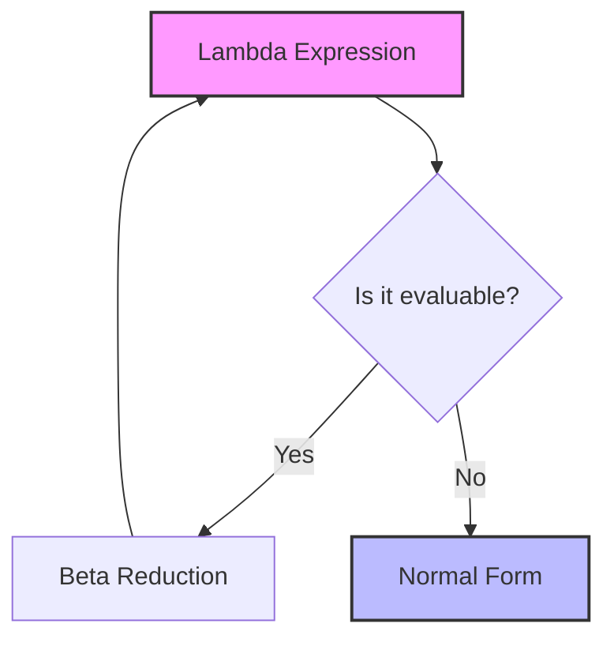
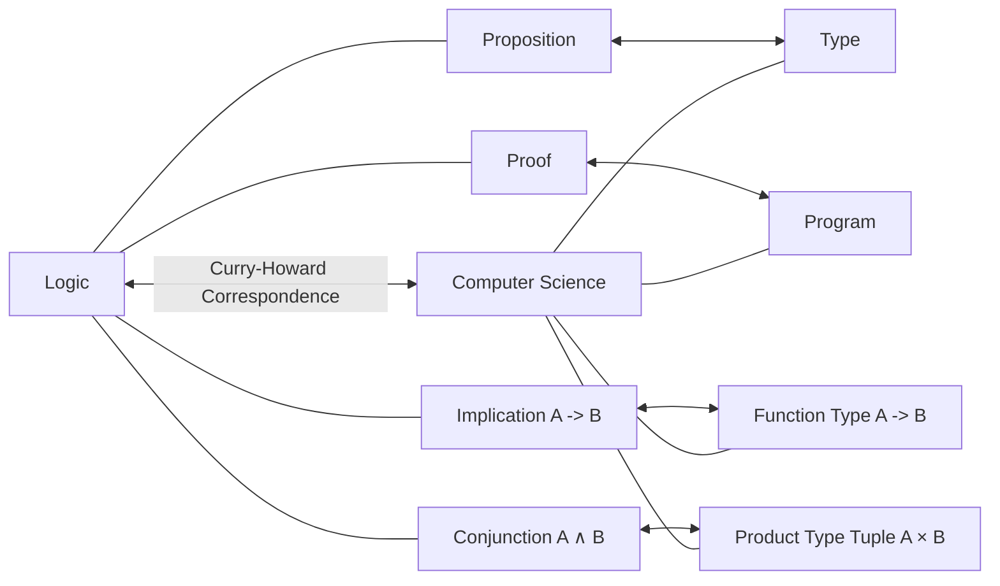

## 1. Introduction: The Philosophy Underlying [Functional Programming](https://kenji.blog/en/p/oop-vs-fp-vs-dop/)

In modern software development, **functional programming** is no longer a niche approach for a subset of enthusiasts, but has become a widely adopted paradigm. From frontend technologies like React to [Rust](https://kenji.blog/en/p/webassembly-wasm-current-future/) and Scala, and even object-oriented languages like [Java](https://kenji.blog/en/p/programming-languages-history-paradigm-evolution/) and C#, concepts such as treating functions as first-class objects and eliminating side effects have been incorporated.

However, behind this paradigm lies a profound mathematical theory constructed in the 1930s, before the physical birth of computers. That is the **lambda calculus** ($\lambda$-calculus) proposed by Alonzo Church.

This article explores the historical and theoretical development in detail, starting from the foundational theory of lambda calculus, how it influenced **Lisp**, an early programming language, and leading up to **Haskell**, a purely functional language.

## 2. The Birth of [Lambda](https://kenji.blog/en/p/serverless-architecture-aws-lambda-cold-start/) Calculus: Alonzo Church and the Definition of Computation

### 2.1 The Challenge of the Decision Problem (Entscheidungsproblem)

In 1928, mathematician David Hilbert proposed the "Decision Problem (Entscheidungsproblem)." This was the question: "Given a mathematical proposition, does there exist an algorithm that can mechanically determine whether it is true or false?"

To answer this question, it was first necessary to strictly define what it means to be "computable" or for an "algorithm to exist." In 1936, two geniuses independently provided answers to this problem. One was Alan Turing, and the other was Alonzo Church, who was also Turing's academic advisor.

Turing demonstrated the limits of computation using a hypothetical machine model called the "Turing machine." On the other hand, Church defined computability using a purely symbolic approach called **lambda calculus**. Amazingly, these two models, defined through completely different approaches, were proven to be entirely equivalent in computational power (the Church-Turing thesis).

### 2.2 Basic Syntax of Lambda Calculus

The world of lambda calculus is incredibly simple. It has only three elements: variable definition, function abstraction, and function application.

$$
E ::= x \mid (\lambda x. E) \mid (E_1 \ E_2)
$$

- $x$ : **Variable**
- $\lambda x. E$ : **Abstraction** - Defines a function that takes an argument $x$ and returns the expression $E$.
- $E_1 \ E_2$ : **Application** - Applies the function $E_1$ to the argument $E_2$.

For example, the identity function (a function that returns the received argument as is) is written in lambda calculus as follows.

$$
\lambda x. x
$$

## 3. Calculation Rules of Lambda Calculus

In lambda calculus, strict rules are established to evaluate (reduce) expressions. The main rules are **alpha conversion**, **beta reduction**, and **eta conversion**.

### 3.1 Alpha Conversion ($\alpha$-conversion)

Alpha conversion is a rule for safely changing the names of bound variables. Since the variable names used within a function have no essential meaning, they can be changed as long as they do not collide with other variable names.

$$
\lambda x. x \equiv \lambda y. y
$$

### 3.2 Beta Reduction ($\beta$-reduction)

Beta reduction is the very "execution of computation" in lambda calculus. It refers to the operation of substituting an argument for a variable within the body of a function during function application.

$$
(\lambda x. x \ y) \ z \rightarrow z \ y
$$

### 3.3 Eta Conversion ($\eta$-conversion)

Eta conversion is a concept that expresses the extensionality of functions. It is based on the rule that two functions that return the same result for all arguments are equal.

$$
\lambda x. (f \ x) \equiv f
$$



## 4. Church Encoding: Creating Something from Nothing

[Lambda](https://kenji.blog/en/p/serverless-architecture-aws-lambda-cold-start/) calculus does not have any built-in data types (such as numbers, booleans, or lists). Everything is just a function. However, Church showed that by cleverly combining functions, any data structure or control structure can be expressed. This is called **Church Encoding**.

### 4.1 Booleans (Church Booleans)

True and False are defined as functions that take two arguments and return one of them.

- **TRUE** : $\lambda x. \lambda y. x$ (Returns the first argument)
- **FALSE** : $\lambda x. \lambda y. y$ (Returns the second argument)

Using these, conditional branching equivalent to an IF statement can be simply expressed as function application.

- **IF** : $\lambda p. \lambda x. \lambda y. p \ x \ y$

### 4.2 Numbers (Church Numerals)

Natural numbers can also be expressed as functions. In Church numerals, the number $n$ is defined as "a higher-order function that applies a certain function $f$ to an argument $x$ exactly $n$ times."

- **0** : $\lambda f. \lambda x. x$
- **1** : $\lambda f. \lambda x. f \ x$
- **2** : $\lambda f. \lambda x. f \ (f \ x)$
- **3** : $\lambda f. \lambda x. f \ (f \ (f \ x))$

The successor function (SUCC: a function that adds 1 to a given number) is defined as follows.

- **SUCC** : $\lambda n. \lambda f. \lambda x. f \ (n \ f \ x)$

Let's emulate this concept with Python code.

```python
# Representation of Church numerals in Python
ZERO  = lambda f: lambda x: x
ONE   = lambda f: lambda x: f(x)
TWO   = lambda f: lambda x: f(f(x))

# Successor function
SUCC  = lambda n: lambda f: lambda x: f(n(f)(x))

# Addition
ADD   = lambda m: lambda n: lambda f: lambda x: m(f)(n(f)(x))

# Helper function to convert a Church numeral to a regular Python integer
def to_int(church_numeral):
    return church_numeral(lambda x: x + 1)(0)

print(to_int(TWO)) # Output: 2
print(to_int(ADD(TWO)(SUCC(TWO)))) # 2 + 3 = 5
```

## 5. Fixed-point Combinators and Turing Completeness

In lambda calculus, functions do not have names (anonymous functions). So, how can recursive calls be realized? The solution to this problem is the **fixed-point combinator**, especially the famous **Y combinator**.

$$
Y = \lambda f. (\lambda x. f \ (x \ x)) \ (\lambda x. f \ (x \ x))
$$

The Y combinator satisfies $Y \ f = f \ (Y \ f)$ for any function $f$. By utilizing this, recursive structures can be expressed as application to the function itself, allowing infinite loops and recursion in computers to be processed within the framework of lambda calculus. This demonstrates that lambda calculus is Turing complete.

## 6. The Birth of Lisp: From Theory to [Programming Language](https://kenji.blog/en/p/programming-languages-history-paradigm-evolution/)

In the late 1950s, John McCarthy was designing a new programming language for artificial intelligence research. Inspired by Church's lambda calculus, he developed a language that directly supported function abstraction and recursion. This is **Lisp** (LISt Processing).

The greatest feature of Lisp is that the code itself is represented as data (lists) (Homoiconicity), and that anonymous functions can be defined using the `lambda` keyword.

```lisp
;; Example of function definition and higher-order functions in Lisp
(define (square x) (* x x))

;; Passing a lambda expression to the map function
(map (lambda (x) (* x x)) '(1 2 3 4 5))
;; Result: (1 4 9 16 25)
```

Lisp was dynamically typed and was not the theoretical lambda calculus as is, but it became the first great milestone to realize the spirit of functional programming—"treating functions as data" and "viewing computation as the evaluation of functions"—on real computers.

## 7. Typed [Lambda](https://kenji.blog/en/p/serverless-architecture-aws-lambda-cold-start/) Calculus and the Curry-Howard Correspondence

Pure lambda calculus (untyped lambda calculus) is powerful, but because any argument can be passed to any function, it could cause paradoxes due to self-application (e.g., Russell's paradox). To prevent this, Church later introduced the **Simply Typed Lambda Calculus**.

### 7.1 The Curry-Howard Correspondence

With the development of type theory, an astonishing correspondence was discovered between computer science and logic. This is the **Curry-Howard Correspondence**.

- **Types** correspond to **Propositions**.
- **Programs** correspond to **Proofs**.
- **Evaluation** of functions corresponds to **Proof simplification**.



This powerful mathematical foundation later evolved into an approach that guarantees program correctness through type systems, paving the way for modern statically typed functional languages.

## 8. The Emergence of Haskell and the Pinnacle of Pure [Functional Programming](https://kenji.blog/en/p/oop-vs-fp-vs-dop/)

In the late 1980s, researchers of functional languages established a committee to create a standardized, lazy-evaluation-based pure functional language. This led to the birth of **Haskell**, named after the logician Haskell Curry.

### 8.1 Lazy Evaluation

Haskell defaults to **lazy evaluation**, where an expression is not evaluated until its value is truly needed. This allows concepts like infinite lists to be expressed naturally. This corresponds to "Normal-order reduction" in lambda calculus.

```haskell
-- Example of an infinite list in Haskell
-- A list of all natural numbers starting from 1
naturals :: [Integer]
naturals = [1..]

-- Getting the first 10 even numbers
firstTenEvens :: [Integer]
firstTenEvens = take 10 (map (*2) naturals)
```

### 8.2 Monads and Managing Side Effects

In purely functional languages, how to handle "Side Effects" like I/O and state changes while maintaining mathematical purity (referential transparency) has been a long-standing challenge. Haskell elegantly solved this problem by introducing the concept of a **[Monad](https://kenji.blog/en/p/functional-programming-concepts-pure-functions-monads/)** from Category Theory.

With the IO monad, it succeeded in completely separating "computation" and "execution with side effects" at the type system level.

## 9. Conclusion: From Mathematics to Software Engineering

The **lambda calculus** drawn solely with paper and pencil in the 1930s by Alonzo Church is by no means an outdated theory. It re-examined "what computation is" from an angle different from the Turing machine, and was unleashed into the programmable world through Lisp. Then, through its beautiful connection with logic via the Curry-Howard Correspondence, it bore fruit as modern languages with robust and powerful type systems like Haskell.

Today, when we use `map` and `filter` in React, leverage algebraic data types in [Rust](https://kenji.blog/en/p/webassembly-wasm-current-future/), or write lambda expressions in Python, we are all benefiting from Church's great intellectual legacy.

Functional programming is not just a coding style, but a **mathematical philosophy that approaches the very essence of computation**.
