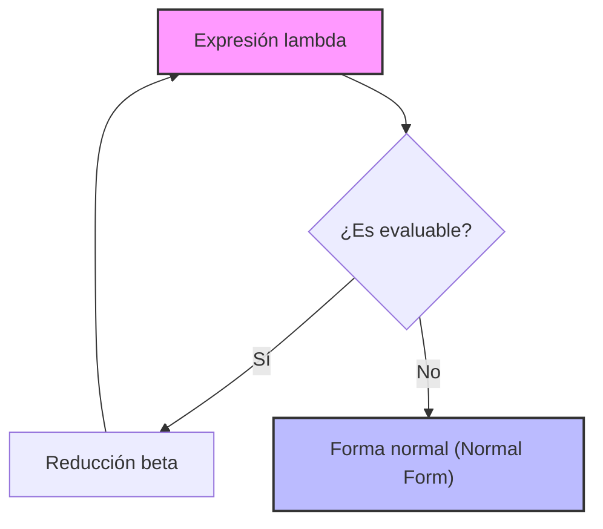
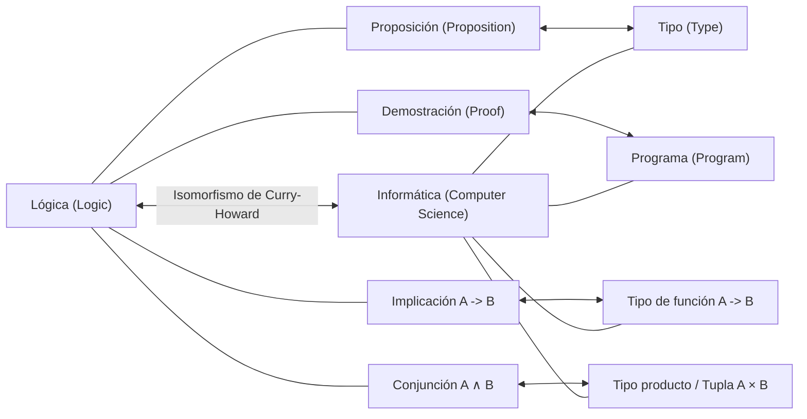

## 1. Introducción: La filosofía subyacente de la programación funcional

En el desarrollo de software moderno, la **programación funcional** ([Functional Programming](https://kenji.blog/es/p/oop-vs-fp-vs-dop/)) ya no es un enfoque para unos pocos entusiastas, sino que se ha convertido en un paradigma ampliamente adoptado. Desde tecnologías frontend como React, hasta Rust y Scala, e incluso en lenguajes orientados a objetos como [Java](https://kenji.blog/es/p/programming-languages-history-paradigm-evolution/) y C#, se han incorporado conceptos como el tratamiento de funciones como objetos de primera clase y la eliminación de efectos secundarios.

Sin embargo, detrás de este paradigma existe una profunda teoría matemática construida en la década de 1930, antes del nacimiento físico de los ordenadores. Se trata del **cálculo lambda** ( $\lambda$-calculus ) propuesto por Alonzo Church.

En este artículo, exploraremos en detalle el desarrollo histórico y teórico del cálculo lambda, comenzando por su teoría básica, y cómo influyó en **Lisp**, uno de los primeros lenguajes de programación, hasta llegar a **Haskell**, un lenguaje funcional puro.

## 2. El nacimiento del cálculo lambda: Alonzo Church y la definición de computación

### 2.1 El desafío del problema de decisión (Entscheidungsproblem)

En 1928, el matemático David Hilbert planteó el "problema de decisión (Entscheidungsproblem)". Esta es la pregunta: "Dada una proposición matemática, ¿existe un algoritmo que pueda determinar mecánicamente si es verdadera o falsa?"

Para responder a esta pregunta, primero fue necesario definir estrictamente qué significa ser "computable" o que "exista un algoritmo". En 1936, hubo dos genios que resolvieron este problema de forma independiente. Uno fue Alan Turing, y el otro fue su supervisor académico, Alonzo Church.

Turing demostró los límites de la computación utilizando un modelo de máquina virtual llamado "Máquina de Turing". Por otro lado, Church definió la computabilidad mediante un enfoque puramente simbólico llamado **cálculo lambda**. Sorprendentemente, se demostró que estos dos modelos, definidos con enfoques completamente diferentes, son completamente equivalentes en términos de capacidad computacional (Tesis de Church-Turing).

### 2.2 Sintaxis básica del cálculo lambda

El mundo del cálculo lambda es muy simple. Solo tiene tres elementos: definición de variables, abstracción de funciones y aplicación de funciones.

$$
E ::= x \mid (\lambda x. E) \mid (E_1 \ E_2)
$$

- $x$ : **Variable** (Variable)
- $\lambda x. E$ : **Abstracción** (Abstraction) - Define una función que toma el argumento $x$ y devuelve la expresión $E$.
- $E_1 \ E_2$ : **Aplicación de función** (Application) - Aplica la función $E_1$ al argumento $E_2$.

Por ejemplo, la función identidad (una función que devuelve el argumento recibido tal cual) se escribe en el cálculo lambda de la siguiente manera:

$$
\lambda x. x
$$

## 3. Reglas de evaluación del cálculo lambda

En el cálculo lambda, existen reglas estrictas para evaluar (reducir) las expresiones. Las reglas principales son la **conversión alfa**, la **reducción beta** y la **conversión eta**.

### 3.1 Conversión alfa ( $\alpha$ -conversion )

La conversión alfa es una regla para cambiar de forma segura el nombre de las variables ligadas. Dado que los nombres de las variables utilizados en una función no tienen un significado intrínseco, se pueden cambiar siempre que no entren en conflicto con otros nombres de variables.

$$
\lambda x. x \equiv \lambda y. y
$$

### 3.2 Reducción beta ( $\beta$ -reduction )

La reducción beta es la "ejecución del cálculo" en sí misma en el cálculo lambda. Se refiere a la operación de sustituir el argumento en las variables dentro del cuerpo de la función durante la aplicación de la función.

$$
(\lambda x. x \ y) \ z \rightarrow z \ y
$$

### 3.3 Conversión eta ( $\eta$ -conversion )

La conversión eta es un concepto que representa la extensionalidad de las funciones. Se basa en la regla de que dos funciones que devuelven el mismo resultado para todos los argumentos son iguales.

$$
\lambda x. (f \ x) \equiv f
$$



## 4. Codificación de Church: Creando algo de la nada

En el cálculo lambda, no existen tipos de datos integrados (números, valores booleanos, listas, etc.). Todo son simplemente funciones. Sin embargo, Church demostró que se puede representar cualquier estructura de datos o estructura de control combinando funciones hábilmente. A esto se le llama **Codificación de Church** (Church Encoding).

### 4.1 Valores booleanos (Booleanos de Church)

Verdadero (True) y Falso (False) se definen como funciones que toman dos argumentos y devuelven uno de ellos.

- **TRUE** : $\lambda x. \lambda y. x$ (Devuelve el primer argumento)
- **FALSE** : $\lambda x. \lambda y. y$ (Devuelve el segundo argumento)

Utilizando esto, una bifurcación condicional equivalente a una sentencia IF se puede expresar simplemente como la aplicación de una función.

- **IF** : $\lambda p. \lambda x. \lambda y. p \ x \ y$

### 4.2 Números (Numerales de Church)

Los números naturales también se pueden representar mediante funciones. En los numerales de Church, el número $n$ se define como "una función de orden superior que aplica una función $f$ $n$ veces a un argumento $x$".

- **0** : $\lambda f. \lambda x. x$
- **1** : $\lambda f. \lambda x. f \ x$
- **2** : $\lambda f. \lambda x. f \ (f \ x)$
- **3** : $\lambda f. \lambda x. f \ (f \ (f \ x))$

La función sucesora (SUCC: función que suma 1 al número dado) se define de la siguiente manera:

- **SUCC** : $\lambda n. \lambda f. \lambda x. f \ (n \ f \ x)$

Vamos a emular este concepto con código Python.

```python
# Representación de numerales de Church en Python
ZERO  = lambda f: lambda x: x
ONE   = lambda f: lambda x: f(x)
TWO   = lambda f: lambda x: f(f(x))

# Función sucesora (Successor)
SUCC  = lambda n: lambda f: lambda x: f(n(f)(x))

# Suma
ADD   = lambda m: lambda n: lambda f: lambda x: m(f)(n(f)(x))

# Función auxiliar para convertir numerales de Church a enteros normales de Python
def to_int(church_numeral):
    return church_numeral(lambda x: x + 1)(0)

print(to_int(TWO)) # Salida: 2
print(to_int(ADD(TWO)(SUCC(TWO)))) # 2 + 3 = 5
```

## 5. Combinador de punto fijo y completitud de Turing

En el cálculo lambda, las funciones no tienen nombre (funciones anónimas). Entonces, ¿cómo se logran las llamadas recursivas? Este problema se resuelve mediante los **combinadores de punto fijo** (Fixed-point combinator), especialmente el famoso **Combinador Y**.

$$
Y = \lambda f. (\lambda x. f \ (x \ x)) \ (\lambda x. f \ (x \ x))
$$

El combinador Y satisface $Y \ f = f \ (Y \ f)$ para cualquier función $f$. Al utilizar esto, la estructura recursiva se puede expresar como la aplicación a la función misma, permitiendo que bucles infinitos y recursión sean procesados dentro del marco del cálculo lambda. Esto demuestra que el cálculo lambda es Turing completo.

## 6. El nacimiento de Lisp: De la teoría al lenguaje de programación

A finales de la década de 1950, John McCarthy estaba diseñando un nuevo lenguaje de programación para la investigación en inteligencia artificial. Inspirado por el cálculo lambda de Church, desarrolló un lenguaje que soportaba directamente la abstracción de funciones y la recursión. Este es **Lisp** (LISt Processing).

La mayor característica de Lisp es que el código en sí se representa como datos (listas) (Homoiconicidad: Homoiconicity) y que se pueden definir funciones anónimas utilizando la palabra clave `lambda`.

```lisp
;; Ejemplo de definición de funciones y funciones de orden superior en Lisp
(define (square x) (* x x))

;; Pasar una expresión lambda a la función map
(map (lambda (x) (* x x)) '(1 2 3 4 5))
;; Resultado: (1 4 9 16 25)
```

Lisp usaba tipado dinámico y no era exactamente el cálculo lambda teórico, pero fue el primer gran hito en la realización del espíritu de la programación funcional ("tratar las funciones como datos" y "entender el cálculo como la evaluación de funciones") en computadoras reales.

## 7. Cálculo lambda tipado e isomorfismo de Curry-Howard

El cálculo lambda puro (cálculo lambda no tipado) es poderoso, pero como se puede pasar cualquier argumento a cualquier función, podría causar paradojas por auto-aplicación (ej: Paradoja de Russell). Para evitar esto, Church introdujo más tarde el **cálculo lambda simplemente tipado** (Simply Typed [Lambda](https://kenji.blog/es/p/serverless-architecture-aws-lambda-cold-start/) Calculus).

### 7.1 Isomorfismo de Curry-Howard

Con el desarrollo de la teoría de tipos, se descubrió una sorprendente correspondencia entre la informática y la lógica. Este es el **Isomorfismo de Curry-Howard** (Curry-Howard Correspondence).

- Los **tipos (Types)** corresponden a las **proposiciones (Propositions)**.
- Los **programas (Programs)** corresponden a las **demostraciones (Proofs)**.
- La **evaluación de funciones (Evaluation)** corresponde a la **reducción de demostraciones (Proof simplification)**.



Esta poderosa base matemática evolucionó más tarde hacia enfoques que garantizan la exactitud del programa a través de sistemas de tipos, allanando el camino para los modernos lenguajes funcionales de tipado estático.

## 8. La aparición de Haskell y el punto culminante de la programación funcional pura

A finales de la década de 1980, los investigadores de lenguajes funcionales formaron un comité para crear un lenguaje funcional puro y estandarizado basado en la evaluación perezosa. Así nació **Haskell**, que lleva el nombre del lógico Haskell Curry.

### 8.1 Evaluación perezosa (Lazy Evaluation)

Haskell emplea por defecto la **evaluación perezosa**, donde las expresiones no se evalúan hasta que realmente se necesitan sus valores. Esto permite representar naturalmente conceptos como listas infinitas. Esto corresponde a la "reducción de orden normal (Normal-order reduction)" en el cálculo lambda.

```haskell
-- Ejemplo de lista infinita en Haskell
-- Lista de todos los números naturales comenzando desde 1
naturals :: [Integer]
naturals = [1..]

-- Obtener los primeros 10 números pares
firstTenEvens :: [Integer]
firstTenEvens = take 10 (map (*2) naturals)
```

### 8.2 Mónadas (Monads) y manejo de efectos secundarios

En los lenguajes funcionales puros, cómo manejar "efectos secundarios (Side Effects)" como la entrada/salida y los cambios de estado manteniendo la pureza matemática (transparencia referencial) fue un desafío de larga data. Haskell resolvió este problema de manera elegante mediante la introducción del concepto de **mónadas** ([Monad](https://kenji.blog/es/p/functional-programming-concepts-pure-functions-monads/)) de la teoría de categorías (Category Theory).

A través de la mónada IO, tuvo éxito en separar completamente "el cálculo" y "la ejecución con efectos secundarios" a nivel del sistema de tipos.

## 9. Conclusión: De las matemáticas a la ingeniería de software

El **cálculo lambda**, que Alonzo Church esbozó solo con lápiz y papel en la década de 1930, de ninguna manera es una teoría obsoleta. Reimaginó "qué es la computación" desde un ángulo diferente al de la máquina de Turing, y se desató en el mundo programable a través de Lisp. Luego, a través de su hermosa conexión con la lógica conocida como el isomorfismo de Curry-Howard, culminó en lenguajes modernos con sistemas de tipos robustos y poderosos como Haskell.

Hoy en día, cuando usamos `map` y `filter` en React, aprovechamos los tipos de datos algebraicos en [Rust](https://kenji.blog/es/p/webassembly-wasm-current-future/) o escribimos expresiones lambda en Python, todos somos beneficiarios del gran legado intelectual de Church.

La programación funcional no es solo un estilo de codificación, es una **filosofía matemática que se acerca a la esencia misma de la computación**.
