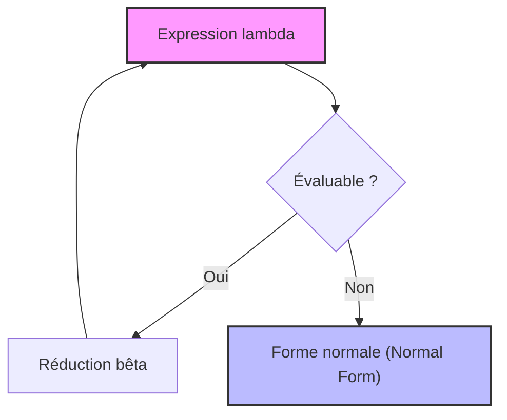
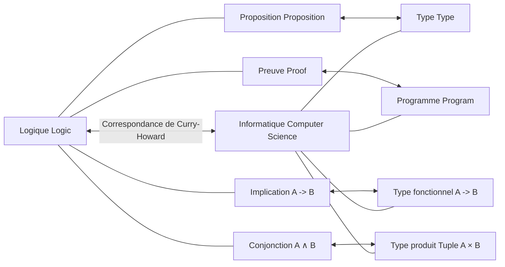

## 1. Introduction : La philosophie sous-jacente à la programmation fonctionnelle

Dans le développement logiciel moderne, la **programmation fonctionnelle** ([Functional Programming](https://kenji.blog/fr/p/oop-vs-fp-vs-dop/)) n'est plus une approche réservée à quelques passionnés, mais un paradigme largement répandu. Des technologies front-end comme React aux langages orientés objet tels que Java et C#, en passant par [Rust](https://kenji.blog/fr/p/webassembly-wasm-current-future/) et Scala, des concepts tels que le traitement des fonctions comme des objets de première classe et l'élimination des effets de bord ont été adoptés.

Cependant, derrière ce paradigme se cache une théorie mathématique profonde élaborée dans les années 1930, bien avant la naissance physique des ordinateurs. Il s'agit du **lambda-calcul** ( $\lambda$-calculus ) proposé par Alonzo Church.

Dans cet article, nous explorerons en détail l'évolution historique et théorique du lambda-calcul, en commençant par sa théorie fondamentale, pour voir comment il a influencé **Lisp**, l'un des premiers langages de programmation, jusqu'à aboutir à **Haskell**, un langage fonctionnel pur.

## 2. La naissance du lambda-calcul : Alonzo Church et la définition du calcul

### 2.1 Le défi du problème de la décision (Entscheidungsproblem)

En 1928, le mathématicien David Hilbert a soulevé le « problème de la décision (Entscheidungsproblem) ». Il s'agissait de la question suivante : « Étant donné une proposition mathématique, existe-t-il un algorithme permettant de déterminer mécaniquement si elle est vraie ou fausse ? »

Pour répondre à cette question, il fallait d'abord définir rigoureusement ce que signifiait « être calculable » ou « avoir un algorithme ». En 1936, deux génies ont apporté des réponses indépendantes à ce problème. L'un était Alan Turing, et l'autre était Alonzo Church, qui fut d'ailleurs le directeur de thèse de Turing.

Turing a démontré les limites du calcul à l'aide d'un modèle de machine virtuelle appelé « machine de Turing ». De son côté, Church a défini la calculabilité par une approche purement symbolique appelée **lambda-calcul**. Étonnamment, ces deux modèles définis par des approches totalement différentes se sont révélés être complètement équivalents en termes de puissance de calcul (Thèse de Church-Turing).

### 2.2 Syntaxe de base du lambda-calcul

Le monde du lambda-calcul est extrêmement simple. Il ne possède que trois éléments : la définition de variables, l'abstraction de fonctions et l'application de fonctions.

$$
E ::= x \mid (\lambda x. E) \mid (E_1 \ E_2)
$$

- $x$ : **Variable** (Variable)
- $\lambda x. E$ : **Abstraction** (Abstraction) - Définit une fonction qui prend un argument $x$ et retourne l'expression $E$.
- $E_1 \ E_2$ : **Application de fonction** (Application) - Applique la fonction $E_1$ à l'argument $E_2$.

Par exemple, la fonction identité (une fonction qui retourne l'argument tel quel) s'écrit en lambda-calcul comme suit :

$$
\lambda x. x
$$

## 3. Les règles de calcul du lambda-calcul

Le lambda-calcul possède des règles strictes pour évaluer (réduire) les expressions. Les principales règles sont la **conversion alpha**, la **réduction bêta** et la **conversion êta**.

### 3.1 Conversion alpha ( $\alpha$ -conversion )

La conversion alpha est une règle permettant de renommer en toute sécurité les variables liées. Le nom d'une variable utilisée dans une fonction n'ayant pas de signification intrinsèque, il peut être modifié tant qu'il n'entre pas en conflit avec un autre nom de variable.

$$
\lambda x. x \equiv \lambda y. y
$$

### 3.2 Réduction bêta ( $\beta$ -reduction )

La réduction bêta est « l'exécution du calcul » elle-même dans le lambda-calcul. Elle désigne l'opération consistant, lors de l'application d'une fonction, à substituer l'argument à la variable dans le corps de la fonction.

$$
(\lambda x. x \ y) \ z \rightarrow z \ y
$$

### 3.3 Conversion êta ( $\eta$ -conversion )

La conversion êta est un concept représentant l'extensionnalité (extensionality) des fonctions. Elle repose sur la règle selon laquelle deux fonctions renvoyant le même résultat pour tous les arguments sont égales.

$$
\lambda x. (f \ x) \equiv f
$$



## 4. Le codage de Church : Créer quelque chose à partir de rien

Le lambda-calcul ne possède aucun type de données intégré (nombres, booléens, listes, etc.). Tout n'est que fonctions. Cependant, Church a montré qu'en combinant habilement les fonctions, il était possible d'exprimer n'importe quelle structure de données ou de contrôle. C'est ce qu'on appelle le **codage de Church** (Church Encoding).

### 4.1 Les booléens (Valeurs booléennes de Church)

Vrai (True) et Faux (False) sont définis comme des fonctions prenant deux arguments et renvoyant l'un d'eux.

- **TRUE** : $\lambda x. \lambda y. x$ (Retourne le premier argument)
- **FALSE** : $\lambda x. \lambda y. y$ (Retourne le deuxième argument)

En utilisant cela, le branchement conditionnel équivalent à une instruction IF peut être simplement exprimé comme une application de fonction.

- **IF** : $\lambda p. \lambda x. \lambda y. p \ x \ y$

### 4.2 Les nombres (Entiers de Church)

Les entiers naturels peuvent également être représentés par des fonctions. Dans les entiers de Church, le nombre $n$ est défini comme une fonction d'ordre supérieur qui applique une fonction $f$ $n$ fois à un argument $x$.

- **0** : $\lambda f. \lambda x. x$
- **1** : $\lambda f. \lambda x. f \ x$
- **2** : $\lambda f. \lambda x. f \ (f \ x)$
- **3** : $\lambda f. \lambda x. f \ (f \ (f \ x))$

La fonction successeur (SUCC : une fonction qui ajoute 1 au nombre donné) est définie comme suit :

- **SUCC** : $\lambda n. \lambda f. \lambda x. f \ (n \ f \ x)$

Essayons d'émuler ce concept avec du code Python.

```python
# Représentation des entiers de Church en Python
ZERO  = lambda f: lambda x: x
ONE   = lambda f: lambda x: f(x)
TWO   = lambda f: lambda x: f(f(x))

# Fonction successeur (Successor)
SUCC  = lambda n: lambda f: lambda x: f(n(f)(x))

# Addition
ADD   = lambda m: lambda n: lambda f: lambda x: m(f)(n(f)(x))

# Fonction d'aide pour convertir un entier de Church en un entier Python normal
def to_int(church_numeral):
    return church_numeral(lambda x: x + 1)(0)

print(to_int(TWO)) # Sortie : 2
print(to_int(ADD(TWO)(SUCC(TWO)))) # 2 + 3 = 5
```

## 5. Le combinateur de point fixe et la complétude de Turing

Dans le lambda-calcul, les fonctions n'ont pas de nom (fonctions anonymes). Alors, comment réaliser un appel récursif ? Ce problème est résolu par le **combinateur de point fixe** (Fixed-point combinator), et plus particulièrement par le célèbre **Combinateur Y**.

$$
Y = \lambda f. (\lambda x. f \ (x \ x)) \ (\lambda x. f \ (x \ x))
$$

Le combinateur Y satisfait l'équation $Y \ f = f \ (Y \ f)$ pour n'importe quelle fonction $f$. En utilisant cela, on peut exprimer la structure récursive comme une application de la fonction à elle-même, ce qui permet de traiter les boucles infinies et les récursions d'un ordinateur dans le cadre du lambda-calcul. Cela démontre que le lambda-calcul est Turing-complet.

## 6. La naissance de Lisp : De la théorie au langage de programmation

À la fin des années 1950, John McCarthy concevait un nouveau langage de programmation pour la recherche en intelligence artificielle. S'inspirant du lambda-calcul de Church, il a développé un langage qui prenait directement en charge l'abstraction de fonctions et la récursion. Ce fut la naissance de **Lisp** (LISt Processing).

La plus grande caractéristique de Lisp est que le code lui-même est représenté sous forme de données (listes) (Homoiconicité : Homoiconicity), et qu'il permet de définir des fonctions anonymes à l'aide du mot-clé `lambda`.

```lisp
;; Exemple de définition de fonction et de fonction d'ordre supérieur en Lisp
(define (square x) (* x x))

;; Passer une expression lambda à la fonction map
(map (lambda (x) (* x x)) '(1 2 3 4 5))
;; Résultat : (1 4 9 16 25)
```

Bien que Lisp soit à typage dynamique et ne soit pas exactement le lambda-calcul théorique en soi, il est devenu le premier grand jalon dans la réalisation de l'esprit de la programmation fonctionnelle sur des ordinateurs réels, en considérant que "les fonctions sont traitées comme des données" et que "le calcul est perçu comme l'évaluation de fonctions".

## 7. Le lambda-calcul typé et la correspondance de Curry-Howard

Le lambda-calcul pur (lambda-calcul non typé) est puissant, mais comme toute fonction peut prendre n'importe quel argument, il pouvait entraîner des paradoxes par auto-application (ex. : le paradoxe de Russell). Pour éviter cela, Church a par la suite introduit le **lambda-calcul simplement typé** (Simply Typed [Lambda](https://kenji.blog/fr/p/serverless-architecture-aws-lambda-cold-start/) Calculus).

### 7.1 La correspondance de Curry-Howard

Avec le développement de la théorie des types, une correspondance surprenante a été découverte entre l'informatique et la logique. Il s'agit de la **correspondance de Curry-Howard** (Curry-Howard Correspondence).

- Les **Types** (Types) correspondent aux **Propositions** (Propositions).
- Les **Programmes** (Programs) correspondent aux **Preuves** (Proofs).
- L' **Évaluation** (Evaluation) des fonctions correspond à la **Simplification de preuve** (Proof simplification).



Cette base mathématique solide a par la suite évolué vers des approches garantissant l'exactitude des programmes grâce au système de types, ouvrant ainsi la voie aux langages fonctionnels modernes à typage statique.

## 8. L'apparition de Haskell et l'aboutissement de la programmation fonctionnelle pure

À la fin des années 1980, des chercheurs en langages fonctionnels ont formé un comité pour créer un langage fonctionnel pur standardisé basé sur l'évaluation paresseuse. Ce fut la naissance de **Haskell**, nommé en l'honneur du logicien Haskell Curry.

### 8.1 L'évaluation paresseuse (Lazy Evaluation)

Haskell utilise par défaut l' **évaluation paresseuse**, où une expression n'est pas évaluée tant que sa valeur n'est pas réellement nécessaire. Cela permet d'exprimer naturellement des concepts tels que les listes infinies. Cela correspond à la « réduction en ordre normal » (Normal-order reduction) dans le lambda-calcul.

```haskell
-- Exemple de liste infinie en Haskell
-- La liste de tous les entiers naturels commençant par 1
naturals :: [Integer]
naturals = [1..]

-- Obtenir les 10 premiers nombres pairs
firstTenEvens :: [Integer]
firstTenEvens = take 10 (map (*2) naturals)
```

### 8.2 Les monades (Monads) et la gestion des effets de bord

Dans les langages fonctionnels purs, la gestion des « effets de bord » (Side Effects), tels que les entrées/sorties ou les changements d'état, tout en maintenant la pureté mathématique (transparence référentielle), a longtemps été un défi. Haskell a élégamment résolu ce problème en introduisant le concept de **Monade** ([Monad](https://kenji.blog/fr/p/functional-programming-concepts-pure-functions-monads/)) issu de la théorie des catégories (Category Theory).

Avec la monade IO, Haskell a réussi à séparer complètement le « calcul » de « l'exécution avec effets de bord » au niveau du système de types.

## 9. Conclusion : Des mathématiques à l'ingénierie logicielle

Le **lambda-calcul**, dessiné par Alonzo Church avec seulement du papier et un crayon dans les années 1930, n'est en aucun cas une théorie obsolète. Il a redéfini « ce qu'est le calcul » sous un angle différent de celui de la machine de Turing, et a été libéré dans le monde programmable par l'intermédiaire de Lisp. Puis, grâce à la belle connexion avec la logique qu'est la correspondance de Curry-Howard, il s'est concrétisé dans des langages modernes dotés de systèmes de types robustes et puissants comme Haskell.

Aujourd'hui, lorsque nous utilisons `map` ou `filter` dans React, que nous tirons parti des types de données algébriques dans [Rust](https://kenji.blog/fr/p/webassembly-wasm-current-future/), ou que nous écrivons des expressions lambda en Python, nous bénéficions tous du grand héritage intellectuel de Church.

La programmation fonctionnelle n'est pas seulement un style de codage, mais une **philosophie mathématique qui touche à l'essence même du calcul**.
