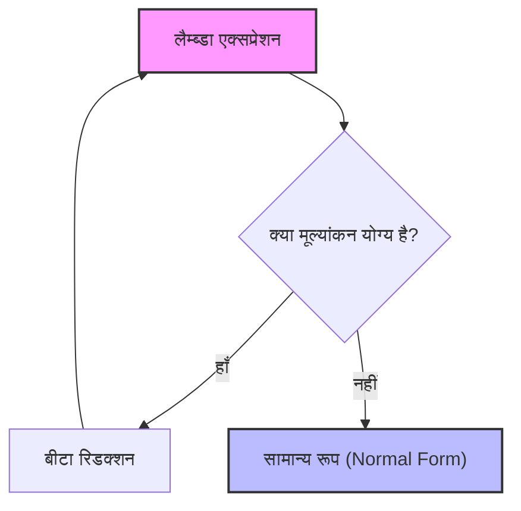
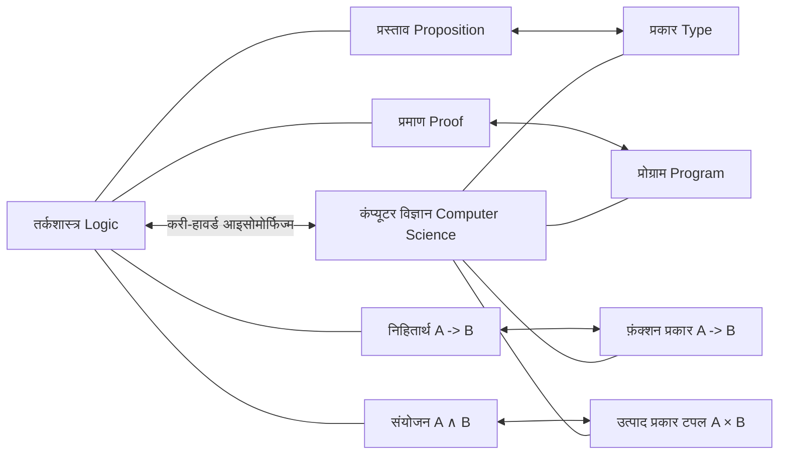

## 1. प्रस्तावना: फंक्शनल प्रोग्रामिंग के मूल में बहता दर्शन

आधुनिक सॉफ्टवेयर विकास में, **फंक्शनल प्रोग्रामिंग** ([Functional Programming](https://kenji.blog/hi/p/oop-vs-fp-vs-dop/)) अब केवल कुछ उत्साही लोगों के लिए एक दृष्टिकोण नहीं है, बल्कि एक व्यापक रूप से अपनाया गया प्रतिमान (paradigm) बन गया है। React जैसी फ्रंटएंड तकनीकों से लेकर [Rust](https://kenji.blog/hi/p/webassembly-wasm-current-future/) और Scala, यहाँ तक कि Java और C# जैसी ऑब्जेक्ट-ओरिएंटेड भाषाओं में भी, कार्यों (functions) को प्रथम-श्रेणी (first-class) ऑब्जेक्ट के रूप में मानने और साइड इफेक्ट्स (side effects) को खत्म करने जैसी अवधारणाओं को अपनाया गया है।

हालाँकि, इस प्रतिमान के पीछे एक गहरा गणितीय सिद्धांत है जिसे कंप्यूटर के भौतिक रूप से जन्म लेने से पहले 1930 के दशक में बनाया गया था। यह अलोंजो चर्च (Alonzo Church) द्वारा प्रस्तावित **लैम्ब्डा कैलकुलस** ($\lambda$-calculus) है।

इस लेख में, हम लैम्ब्डा कैलकुलस के मूल सिद्धांत से शुरू करेंगे, और विस्तार से जानेंगे कि इसने कैसे प्रारंभिक प्रोग्रामिंग भाषा **लिस्प** (Lisp) को प्रभावित किया, और अंततः **हास्केल** (Haskell) जैसी शुद्ध फंक्शनल भाषा तक ऐतिहासिक और सैद्धांतिक रूप से कैसे विकसित हुआ।

## 2. लैम्ब्डा कैलकुलस का जन्म: अलोंजो चर्च और गणना की परिभाषा

### 2.1 निर्णय समस्या (Entscheidungsproblem) की चुनौती

1928 में, गणितज्ञ डेविड हिल्बर्ट ने "निर्णय समस्या" (Entscheidungsproblem) प्रस्तुत की। यह यह सवाल था: "जब कोई गणितीय प्रस्ताव दिया जाता है, तो क्या यह यंत्रवत् निर्धारित करने के लिए कोई एल्गोरिदम है कि यह सत्य है या असत्य?"

इस प्रश्न का उत्तर देने के लिए, सबसे पहले यह कड़ाई से परिभाषित करना आवश्यक था कि "गणना योग्य" या "एल्गोरिदम मौजूद है" का क्या अर्थ है। 1936 में, दो प्रतिभाएं थीं जिन्होंने स्वतंत्र रूप से इस समस्या का समाधान प्रस्तुत किया। एक एलन ट्यूरिंग (Alan Turing) थे, और दूसरे अलोंजो चर्च थे, जो ट्यूरिंग के शोध सलाहकार भी थे।

ट्यूरिंग ने गणना की सीमाओं को प्रदर्शित करने के लिए "ट्यूरिंग मशीन" नामक एक आभासी मशीन मॉडल का उपयोग किया। दूसरी ओर, चर्च ने एक विशुद्ध रूप से प्रतीकात्मक दृष्टिकोण के साथ गणना क्षमता को परिभाषित किया जिसे **लैम्ब्डा कैलकुलस** कहा जाता है। आश्चर्यजनक रूप से, पूरी तरह से अलग दृष्टिकोण के साथ परिभाषित इन दो मॉडलों को गणना शक्ति में पूरी तरह से समतुल्य साबित किया गया था (चर्च-ट्यूरिंग थीसिस)।

### 2.2 लैम्ब्डा कैलकुलस का मूल सिंटैक्स

लैम्ब्डा कैलकुलस की दुनिया बहुत सरल है। इसमें केवल तीन तत्व हैं: चर (variables) की परिभाषा, फ़ंक्शन एब्स्ट्रैक्शन (function abstraction), और फ़ंक्शन एप्लिकेशन (function application)।

$$
E ::= x \mid (\lambda x. E) \mid (E_1 \ E_2)
$$

- $x$ : **चर** (Variable)
- $\lambda x. E$ : **एब्स्ट्रैक्शन** (Abstraction) - एक फ़ंक्शन को परिभाषित करता है जो तर्क (argument) $x$ लेता है और अभिव्यक्ति $E$ देता है।
- $E_1 \ E_2$ : **फ़ंक्शन एप्लिकेशन** (Application) - फ़ंक्शन $E_1$ को तर्क $E_2$ पर लागू करता है।

उदाहरण के लिए, आइडेंटिटी फ़ंक्शन (एक फ़ंक्शन जो प्राप्त तर्क को ज्यों का त्यों लौटाता है) को लैम्ब्डा कैलकुलस में इस प्रकार लिखा जाता है:

$$
\lambda x. x
$$

## 3. लैम्ब्डा कैलकुलस के मूल्यांकन नियम

लैम्ब्डा कैलकुलस में भावों के मूल्यांकन (reduction) के लिए सख्त नियम हैं। मुख्य नियम **अल्फा रूपांतरण** (alpha conversion), **बीटा रिडक्शन** (beta reduction) और **ईटा रूपांतरण** (eta conversion) हैं।

### 3.1 अल्फा रूपांतरण ($\alpha$-conversion)

अल्फा रूपांतरण एक बाध्य चर (bound variable) के नाम को सुरक्षित रूप से बदलने का एक नियम है। चूंकि फ़ंक्शन में उपयोग किए जाने वाले चर नाम का कोई अंतर्निहित अर्थ नहीं होता है, इसलिए इसे बदला जा सकता है जब तक कि यह अन्य चर नामों से न टकराए।

$$
\lambda x. x \equiv \lambda y. y
$$

### 3.2 बीटा रिडक्शन ($\beta$-reduction)

बीटा रिडक्शन लैम्ब्डा कैलकुलस में "गणना का निष्पादन" (execution of calculation) ही है। यह फ़ंक्शन एप्लिकेशन के दौरान फ़ंक्शन बॉडी के भीतर चर में तर्कों को प्रतिस्थापित करने के संचालन को संदर्भित करता है।

$$
(\lambda x. x \ y) \ z \rightarrow z \ y
$$

### 3.3 ईटा रूपांतरण ($\eta$-conversion)

ईटा रूपांतरण एक अवधारणा है जो कार्यों की एक्स्टेंशनलटी (extensionality) का प्रतिनिधित्व करती है। यह इस नियम पर आधारित है कि दो कार्य जो सभी तर्कों के लिए समान परिणाम देते हैं, समान हैं।

$$
\lambda x. (f \ x) \equiv f
$$



## 4. चर्च एन्कोडिंग: शून्यता से निर्माण

लैम्ब्डा कैलकुलस में कोई अंतर्निहित (built-in) डेटा प्रकार (जैसे संख्याएं, बूलियन, सूचियां आदि) नहीं हैं। सब कुछ सिर्फ एक फ़ंक्शन है। हालाँकि, चर्च ने दिखाया कि कार्यों को चतुराई से जोड़कर किसी भी डेटा संरचना या नियंत्रण संरचना को व्यक्त किया जा सकता है। इसे **चर्च एन्कोडिंग** (Church Encoding) कहा जाता है।

### 4.1 बूलियन (चर्च बूलियन)

सत्य (True) और असत्य (False) को दो तर्क लेने वाले कार्यों के रूप में परिभाषित किया गया है, जो दोनों में से एक लौटाते हैं।

- **TRUE** : $\lambda x. \lambda y. x$ (पहला तर्क देता है)
- **FALSE** : $\lambda x. \lambda y. y$ (दूसरा तर्क देता है)

इसका उपयोग करके, IF स्टेटमेंट के समतुल्य सशर्त शाखा को केवल एक फ़ंक्शन एप्लिकेशन के रूप में व्यक्त किया जा सकता है।

- **IF** : $\lambda p. \lambda x. \lambda y. p \ x \ y$

### 4.2 संख्याएँ (चर्च संख्याएँ)

प्राकृतिक संख्याओं को भी कार्यों द्वारा दर्शाया जा सकता है। चर्च संख्याओं में, एक संख्या $n$ को "एक उच्च-क्रम फ़ंक्शन के रूप में परिभाषित किया जाता है जो तर्क $x$ पर $n$ बार एक फ़ंक्शन $f$ लागू करता है"।

- **0** : $\lambda f. \lambda x. x$
- **1** : $\lambda f. \lambda x. f \ x$
- **2** : $\lambda f. \lambda x. f \ (f \ x)$
- **3** : $\lambda f. \lambda x. f \ (f \ (f \ x))$

सक्सेसर फ़ंक्शन (SUCC : दी गई संख्या में 1 जोड़ने का फ़ंक्शन) को इस प्रकार परिभाषित किया गया है:

- **SUCC** : $\lambda n. \lambda f. \lambda x. f \ (n \ f \ x)$

आइए Python कोड में इस अवधारणा का अनुकरण करें।

```python
# पायथन में चर्च संख्याओं का प्रतिनिधित्व
ZERO  = lambda f: lambda x: x
ONE   = lambda f: lambda x: f(x)
TWO   = lambda f: lambda x: f(f(x))

# सक्सेसर फ़ंक्शन (Successor)
SUCC  = lambda n: lambda f: lambda x: f(n(f)(x))

# जोड़ (Addition)
ADD   = lambda m: lambda n: lambda f: lambda x: m(f)(n(f)(x))

# चर्च संख्या को नियमित पायथन पूर्णांक में बदलने के लिए हेल्पर फ़ंक्शन
def to_int(church_numeral):
    return church_numeral(lambda x: x + 1)(0)

print(to_int(TWO)) # आउटपुट: 2
print(to_int(ADD(TWO)(SUCC(TWO)))) # 2 + 3 = 5
```

## 5. फिक्स्ड-पॉइंट कॉम्बिनेटर और ट्यूरिंग कम्प्लीटनेस

लैम्ब्डा कैलकुलस में, कार्यों के नाम नहीं होते हैं (अनाम कार्य - anonymous functions)। तो, हम पुनरावर्ती कॉल (recursive calls) कैसे प्राप्त कर सकते हैं? इस समस्या को हल करने वाला **फिक्स्ड-पॉइंट कॉम्बिनेटर** (Fixed-point combinator), विशेष रूप से प्रसिद्ध **Y कॉम्बिनेटर** (Y combinator) है।

$$
Y = \lambda f. (\lambda x. f \ (x \ x)) \ (\lambda x. f \ (x \ x))
$$

Y कॉम्बिनेटर किसी भी फ़ंक्शन $f$ के लिए $Y \ f = f \ (Y \ f)$ को संतुष्ट करता है। इसका उपयोग करके, पुनरावर्ती संरचनाओं को फ़ंक्शन के स्वयं पर लागू होने के रूप में व्यक्त किया जा सकता है, और कंप्यूटर के अनंत लूप या पुनरावृत्ति को लैम्ब्डा कैलकुलस के ढांचे के भीतर संसाधित किया जा सकता है। यह दर्शाता है कि लैम्ब्डा कैलकुलस ट्यूरिंग पूर्ण (Turing complete) है।

## 6. लिस्प का जन्म: सिद्धांत से प्रोग्रामिंग भाषा तक

1950 के दशक के उत्तरार्ध में, जॉन मैकार्थी (John McCarthy) ने कृत्रिम बुद्धिमत्ता अनुसंधान के लिए एक नई प्रोग्रामिंग भाषा डिजाइन की। चर्च के लैम्ब्डा कैलकुलस से प्रेरित होकर, उन्होंने एक ऐसी भाषा विकसित की जो सीधे फ़ंक्शन एब्स्ट्रैक्शन और रिकर्शन का समर्थन करती थी। यह **लिस्प** (LISt Processing) है।

लिस्प की सबसे बड़ी विशेषता यह है कि कोड स्वयं डेटा (सूचियों) के रूप में दर्शाया जाता है (होमोइकोनिसिटी: Homoiconicity), और `lambda` कीवर्ड का उपयोग करके अनाम कार्यों (anonymous functions) को परिभाषित किया जा सकता है।

```lisp
;; लिस्प में फ़ंक्शन परिभाषा और उच्च-क्रम फ़ंक्शन का उदाहरण
(define (square x) (* x x))

;; map फ़ंक्शन में लैम्ब्डा एक्सप्रेशन पास करना
(map (lambda (x) (* x x)) '(1 2 3 4 5))
;; परिणाम: (1 4 9 16 25)
```

हालांकि लिस्प गतिशील रूप से टाइप (dynamically typed) किया गया था और यह पूरी तरह से सैद्धांतिक लैम्ब्डा कैलकुलस नहीं था, यह वास्तविक दुनिया के कंप्यूटरों पर "डेटा के रूप में कार्यों का इलाज करने" और "फ़ंक्शन मूल्यांकन के रूप में गणना का इलाज करने" की फंक्शनल प्रोग्रामिंग भावना को महसूस करने वाला पहला महान मील का पत्थर बन गया।

## 7. टाइप किया हुआ लैम्ब्डा कैलकुलस और करी-हावर्ड आइसोमोर्फिज्म

शुद्ध लैम्ब्डा कैलकुलस (अटाइप किया हुआ लैम्ब्डा कैलकुलस - untyped lambda calculus) शक्तिशाली है, लेकिन चूंकि किसी भी फ़ंक्शन को किसी भी तर्क के साथ पारित किया जा सकता है, यह स्व-अनुप्रयोग (self-application) के कारण विरोधाभासों (उदा., रसेल का विरोधाभास) का कारण बन सकता है। इसे रोकने के लिए, चर्च ने बाद में **सरल प्रकार का लैम्ब्डा कैलकुलस** (Simply Typed Lambda Calculus) पेश किया।

### 7.1 करी-हावर्ड आइसोमोर्फिज्म

प्रकार सिद्धांत (type theory) के विकास के साथ, कंप्यूटर विज्ञान और तर्कशास्त्र (logic) के बीच एक आश्चर्यजनक पत्राचार (correspondence) की खोज की गई। वह है **करी-हावर्ड आइसोमोर्फिज्म** (Curry-Howard Correspondence)।

- **प्रकार (Types)** **प्रस्तावों (Propositions)** के अनुरूप हैं।
- **प्रोग्राम (Programs)** **प्रमाणों (Proofs)** के अनुरूप हैं।
- **फ़ंक्शन का मूल्यांकन (Evaluation)** **प्रमाण के सरलीकरण (Proof simplification)** के अनुरूप है।



इस शक्तिशाली गणितीय नींव ने बाद में टाइप सिस्टम द्वारा प्रोग्राम की शुद्धता की गारंटी देने के दृष्टिकोण के रूप में विकसित किया, जिससे आधुनिक स्थिर रूप से टाइप की गई फंक्शनल भाषाओं (statically typed functional languages) का मार्ग प्रशस्त हुआ।

## 8. हास्केल का उद्भव और शुद्ध फंक्शनल प्रोग्रामिंग का शिखर

1980 के दशक के उत्तरार्ध में, फंक्शनल भाषाओं के शोधकर्ताओं ने एक मानकीकृत आलसी-मूल्यांकन (lazy-evaluation) आधारित शुद्ध फंक्शनल भाषा बनाने के लिए एक समिति का गठन किया। तर्कशास्त्री हास्केल करी (Haskell Curry) के नाम पर **हास्केल** (Haskell) का जन्म हुआ।

### 8.1 लेज़ी इवैल्यूएशन (Lazy Evaluation)

हास्केल डिफ़ॉल्ट रूप से **लेज़ी इवैल्यूएशन** (lazy evaluation) को नियोजित करता है, जहां किसी अभिव्यक्ति का मूल्यांकन तब तक नहीं किया जाता जब तक कि उसके मान की वास्तव में आवश्यकता न हो। यह अनंत सूचियों (infinite lists) जैसी अवधारणाओं को स्वाभाविक रूप से व्यक्त करने की अनुमति देता है। यह लैम्ब्डा कैलकुलस में "सामान्य-क्रम में कमी" (Normal-order reduction) से मेल खाता है।

```haskell
-- हास्केल में अनंत सूची का उदाहरण
-- 1 से शुरू होने वाली सभी प्राकृतिक संख्याओं की सूची
naturals :: [Integer]
naturals = [1..]

-- पहले 10 सम संख्याएँ प्राप्त करना
firstTenEvens :: [Integer]
firstTenEvens = take 10 (map (*2) naturals)
```

### 8.2 मोनैड (Monads) और साइड इफेक्ट्स का प्रबंधन

शुद्ध फंक्शनल भाषाओं में, गणितीय शुद्धता (संदर्भात्मक पारदर्शिता - referential transparency) को बनाए रखते हुए इनपुट/आउटपुट और राज्य परिवर्तन (state changes) जैसे "साइड इफेक्ट्स" (Side Effects) को कैसे प्रबंधित किया जाए, यह लंबे समय से एक चुनौती रही है। हास्केल ने श्रेणी सिद्धांत (Category Theory) की अवधारणा **मोनैड** (Monad) पेश करके इस समस्या को शानदार ढंग से हल किया।

IO मोनैड ने टाइप सिस्टम स्तर पर "गणना" और "साइड इफेक्ट्स के साथ निष्पादन" को पूरी तरह से अलग करने में सफलता प्राप्त की।

## 9. निष्कर्ष: गणित से सॉफ्टवेयर इंजीनियरिंग तक

1930 के दशक में केवल कागज और पेंसिल के साथ अलोंजो चर्च द्वारा तैयार किया गया **लैम्ब्डा कैलकुलस**, कोई पुरानी थ्योरी नहीं है। यह ट्यूरिंग मशीनों से अलग कोण से "गणना क्या है" को फिर से परिभाषित करता है, और लिस्प के माध्यम से एक प्रोग्राम करने योग्य दुनिया में लाया गया था। और करी-हावर्ड आइसोमोर्फिज्म के माध्यम से तर्कशास्त्र के साथ एक सुंदर संबंध स्थापित करते हुए, इसने हास्केल जैसी आधुनिक भाषाओं को जन्म दिया, जिनमें एक मजबूत और शक्तिशाली टाइप सिस्टम है।

आज, जब हम React में `map` या `filter` का उपयोग करते हैं, [Rust](https://kenji.blog/hi/p/webassembly-wasm-current-future/) में बीजगणितीय डेटा प्रकारों (algebraic data types) का लाभ उठाते हैं, और Python में लैम्ब्डा एक्सप्रेशन लिखते हैं, तो हम सभी चर्च की महान बौद्धिक विरासत से लाभान्वित हो रहे हैं।

फंक्शनल प्रोग्रामिंग केवल एक कोडिंग शैली नहीं है, बल्कि एक **गणितीय दर्शन है जो गणना के सार तक पहुंचता है**।
