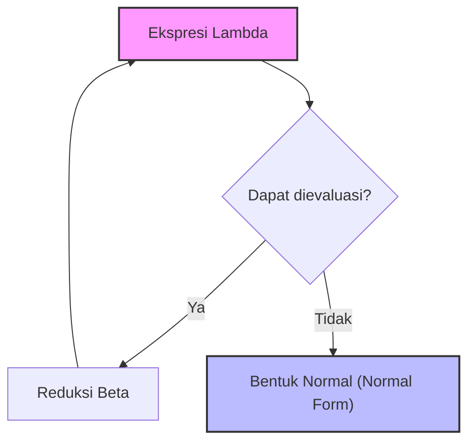
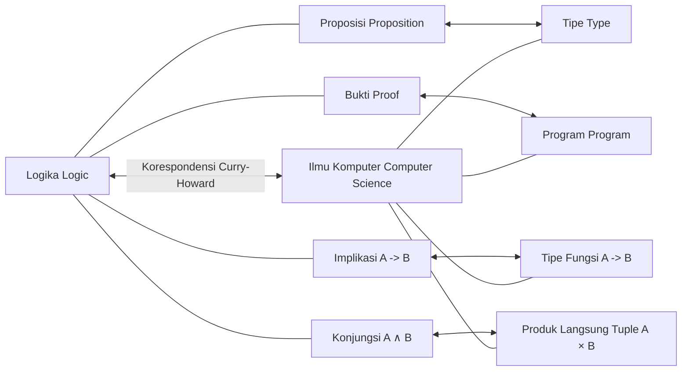

## 1. Pendahuluan: Filosofi di Balik Pemrograman Fungsional

Dalam pengembangan perangkat lunak modern, **pemrograman fungsional** ([Functional Programming](https://kenji.blog/id/p/oop-vs-fp-vs-dop/)) bukan lagi pendekatan untuk sebagian penggemar saja, melainkan telah menjadi paradigma yang digunakan secara luas. Mulai dari teknologi front-end seperti React, hingga Rust dan Scala, bahkan bahasa berorientasi objek seperti Java dan C#, konsep seperti memperlakukan fungsi sebagai warga kelas satu (first-class object) dan penghapusan efek samping (side effects) telah banyak diadopsi.

Namun, di balik paradigma ini, terdapat teori matematika mendalam yang dibangun pada tahun 1930-an, sebelum komputer secara fisik lahir. Itulah **kalkulus lambda** ( $\lambda$-calculus ) yang diusulkan oleh Alonzo Church.

Dalam artikel ini, kita akan menjelajahi secara rinci sejarah dan perkembangan teoretis dari teori dasar kalkulus lambda, bagaimana ia memengaruhi **Lisp** sebagai bahasa pemrograman awal, hingga mencapai **Haskell** sebagai bahasa fungsional murni.

## 2. Lahirnya Kalkulus Lambda: Alonzo Church dan Definisi Komputasi

### 2.1 Tantangan terhadap Masalah Keputusan (Entscheidungsproblem)

Pada tahun 1928, matematikawan David Hilbert mengajukan "Masalah Keputusan (Entscheidungsproblem)". Pertanyaan ini berbunyi: "Mengingat suatu proposisi matematika, adakah algoritma mekanis yang dapat menentukan apakah proposisi tersebut benar atau salah?"

Untuk menjawab pertanyaan ini, pertama-tama perlu mendefinisikan dengan ketat apa yang dimaksud dengan "dapat dikomputasi" atau "memiliki algoritma". Pada tahun 1936, ada dua jenius yang secara independen memberikan jawaban untuk masalah ini. Satu adalah Alan Turing, dan yang lainnya adalah Alonzo Church, yang juga merupakan penasihat akademik Turing.

Turing menunjukkan batas-batas komputasi menggunakan model mesin virtual yang disebut "Mesin Turing". Sementara itu, Church mendefinisikan kemampuan komputasi menggunakan pendekatan simbolik murni yang disebut **kalkulus lambda**. Hebatnya, dua model yang didefinisikan melalui pendekatan yang sama sekali berbeda ini terbukti benar-benar setara dalam kemampuan komputasinya (Tesis Church-Turing).

### 2.2 Sintaks Dasar Kalkulus Lambda

Dunia kalkulus lambda sangat sederhana. Ia hanya memiliki tiga elemen: definisi variabel, abstraksi fungsi, dan aplikasi fungsi.

$$
E ::= x \mid (\lambda x. E) \mid (E_1 \ E_2)
$$

- $x$ : **Variabel** (Variable)
- $\lambda x. E$ : **Abstraksi** (Abstraction) - Mendefinisikan fungsi yang mengambil argumen $x$ dan mengembalikan ekspresi $E$.
- $E_1 \ E_2$ : **Aplikasi Fungsi** (Application) - Menerapkan fungsi $E_1$ pada argumen $E_2$.

Misalnya, fungsi identitas (fungsi yang mengembalikan argumen yang diterimanya apa adanya) ditulis dalam kalkulus lambda sebagai berikut.

$$
\lambda x. x
$$

## 3. Aturan Operasi Kalkulus Lambda

Dalam kalkulus lambda, aturan ketat ditetapkan untuk mengevaluasi (mereduksi) ekspresi. Aturan utamanya adalah **Konversi Alfa** ( $\alpha$ -conversion), **Reduksi Beta** ( $\beta$ -reduction), dan **Konversi Eta** ( $\eta$ -conversion).

### 3.1 Konversi Alfa ( $\alpha$ -conversion)

Konversi alfa adalah aturan untuk mengubah nama variabel terikat dengan aman. Karena nama variabel yang digunakan di dalam fungsi tidak memiliki makna esensial, nama tersebut dapat diubah asalkan tidak bentrok dengan nama variabel lain.

$$
\lambda x. x \equiv \lambda y. y
$$

### 3.2 Reduksi Beta ( $\beta$ -reduction)

Reduksi beta adalah inti dari "pelaksanaan komputasi" dalam kalkulus lambda. Ini mengacu pada operasi penggantian argumen ke dalam variabel di dalam tubuh fungsi saat fungsi diterapkan.

$$
(\lambda x. x \ y) \ z \rightarrow z \ y
$$

### 3.3 Konversi Eta ( $\eta$ -conversion)

Konversi eta adalah konsep yang mewakili ekstensialitas (extensionality) dari fungsi. Ini didasarkan pada aturan bahwa dua fungsi yang mengembalikan hasil yang sama untuk semua argumen adalah sama.

$$
\lambda x. (f \ x) \equiv f
$$



## 4. Pengkodean Church (Church Encoding): Menciptakan Sesuatu dari Ketiadaan

Dalam kalkulus lambda, tidak ada tipe data bawaan (seperti angka, nilai boolean, atau daftar). Semuanya hanyalah fungsi. Namun, Church menunjukkan bahwa dengan menggabungkan fungsi-fungsi secara cerdik, kita dapat merepresentasikan struktur data dan struktur kontrol apa pun. Ini disebut **Pengkodean Church** (Church Encoding).

### 4.1 Nilai Boolean (Nilai Boolean Church)

Benar (True) dan Salah (False) didefinisikan sebagai fungsi yang menerima dua argumen dan mengembalikan salah satunya.

- **TRUE** : $\lambda x. \lambda y. x$ (Mengembalikan argumen pertama)
- **FALSE** : $\lambda x. \lambda y. y$ (Mengembalikan argumen kedua)

Dengan menggunakan ini, percabangan bersyarat yang setara dengan pernyataan IF dapat direpresentasikan secara sederhana sebagai aplikasi fungsi.

- **IF** : $\lambda p. \lambda x. \lambda y. p \ x \ y$

### 4.2 Angka (Angka Church)

Bilangan asli juga dapat direpresentasikan dengan fungsi. Dalam angka Church, angka $n$ didefinisikan sebagai "fungsi tingkat tinggi (higher-order function) yang menerapkan fungsi $f$ pada argumen $x$ sebanyak $n$ kali".

- **0** : $\lambda f. \lambda x. x$
- **1** : $\lambda f. \lambda x. f \ x$
- **2** : $\lambda f. \lambda x. f \ (f \ x)$
- **3** : $\lambda f. \lambda x. f \ (f \ (f \ x))$

Fungsi penerus (SUCC : fungsi yang menambahkan 1 ke angka yang diberikan) didefinisikan sebagai berikut.

- **SUCC** : $\lambda n. \lambda f. \lambda x. f \ (n \ f \ x)$

Mari kita emulasikan konsep ini dengan kode Python.

```python
# Representasi angka Church dalam Python
ZERO  = lambda f: lambda x: x
ONE   = lambda f: lambda x: f(x)
TWO   = lambda f: lambda x: f(f(x))

# Fungsi penerus (Successor)
SUCC  = lambda n: lambda f: lambda x: f(n(f)(x))

# Penjumlahan
ADD   = lambda m: lambda n: lambda f: lambda x: m(f)(n(f)(x))

# Fungsi pembantu untuk mengubah angka Church menjadi bilangan bulat Python biasa
def to_int(church_numeral):
    return church_numeral(lambda x: x + 1)(0)

print(to_int(TWO)) # Output: 2
print(to_int(ADD(TWO)(SUCC(TWO)))) # 2 + 3 = 5
```

## 5. Kombinator Titik Tetap (Fixed-point Combinator) dan Kelengkapan Turing

Dalam kalkulus lambda, fungsi tidak memiliki nama (fungsi anonim). Lalu, bagaimana kita mengimplementasikan pemanggilan rekursif? Masalah ini diselesaikan oleh **Kombinator Titik Tetap** (Fixed-point combinator), terutama **Y combinator** yang sangat terkenal.

$$
Y = \lambda f. (\lambda x. f \ (x \ x)) \ (\lambda x. f \ (x \ x))
$$

Kombinator Y memenuhi $Y \ f = f \ (Y \ f)$ untuk setiap fungsi $f$. Dengan memanfaatkan ini, struktur rekursif dapat direpresentasikan sebagai aplikasi ke fungsi itu sendiri, memungkinkan loop tak terbatas dan rekursi dalam komputasi diproses dalam kerangka kalkulus lambda. Ini menunjukkan bahwa kalkulus lambda adalah Turing lengkap.

## 6. Lahirnya Lisp: Dari Teori ke Bahasa Pemrograman

Pada akhir tahun 1950-an, John McCarthy sedang merancang bahasa pemrograman baru untuk penelitian kecerdasan buatan. Terinspirasi oleh kalkulus lambda Church, ia mengembangkan bahasa yang secara langsung mendukung abstraksi fungsi dan rekursi. Itulah **Lisp** (LISt Processing).

Fitur terbesar Lisp adalah bahwa kodenya sendiri direpresentasikan sebagai data (daftar) (homoikonisitas: Homoiconicity) dan kemampuannya untuk mendefinisikan fungsi anonim menggunakan kata kunci `lambda`.

```lisp
;; Contoh definisi fungsi dan fungsi tingkat tinggi (higher-order function) di Lisp
(define (square x) (* x x))

;; Melewatkan ekspresi lambda ke fungsi map
(map (lambda (x) (* x x)) '(1 2 3 4 5))
;; Hasil: (1 4 9 16 25)
```

Lisp diketik secara dinamis (dynamically typed) dan tidak sepenuhnya sama dengan kalkulus lambda secara teoretis, tetapi ia menjadi tonggak sejarah hebat pertama yang mewujudkan semangat pemrograman fungsional seperti "memperlakukan fungsi sebagai data" dan "memandang komputasi sebagai evaluasi fungsi" pada komputer nyata.

## 7. Kalkulus Lambda Berjenis (Typed Lambda Calculus) dan Korespondensi Curry-Howard

Kalkulus lambda murni (kalkulus lambda tanpa tipe) memang kuat, tetapi karena argumen apa pun dapat diteruskan ke fungsi apa pun, hal itu dapat menyebabkan paradoks melalui aplikasi diri (contoh: Paradoks Russell). Untuk mencegah hal ini, Church kemudian memperkenalkan **Kalkulus Lambda Berjenis Sederhana** (Simply Typed Lambda Calculus).

### 7.1 Korespondensi Curry-Howard

Seiring dengan perkembangan teori tipe, korespondensi mengejutkan ditemukan antara ilmu komputer dan logika. Itulah **Korespondensi Curry-Howard** (Curry-Howard Correspondence).

- **Tipe (Types)** berkorespondensi dengan **Proposisi (Propositions)**.
- **Program (Programs)** berkorespondensi dengan **Bukti (Proofs)**.
- **Evaluasi Fungsi (Evaluation)** berkorespondensi dengan **Penyederhanaan Bukti (Proof simplification)**.



Fondasi matematika yang kuat ini kemudian berkembang menjadi pendekatan yang menjamin kebenaran program melalui sistem tipe, membuka jalan bagi bahasa fungsional yang diketik secara statis modern.

## 8. Munculnya Haskell dan Puncak Pemrograman Fungsional Murni

Pada akhir tahun 1980-an, para peneliti bahasa fungsional membentuk sebuah komite untuk membuat bahasa fungsional murni berbasis evaluasi malas (lazy evaluation) yang distandarisasi. Inilah lahirnya **Haskell**, yang dinamai menurut nama ahli logika Haskell Curry.

### 8.1 Evaluasi Malas (Lazy Evaluation)

Haskell secara default menggunakan **evaluasi malas** (lazy evaluation), di mana sebuah ekspresi tidak akan dievaluasi sampai nilainya benar-benar dibutuhkan. Hal ini memungkinkan konsep seperti daftar tak terbatas direpresentasikan secara alami. Ini berkorespondensi dengan "reduksi urutan normal (Normal-order reduction)" dalam kalkulus lambda.

```haskell
-- Contoh daftar tak terbatas di Haskell
-- Daftar semua bilangan asli yang dimulai dari 1
naturals :: [Integer]
naturals = [1..]

-- Mendapatkan 10 bilangan genap pertama
firstTenEvens :: [Integer]
firstTenEvens = take 10 (map (*2) naturals)
```

### 8.2 Monad (Monads) dan Manajemen Efek Samping

Dalam bahasa fungsional murni, menjaga kemurnian matematis (transparansi referensial) sambil menangani "efek samping (Side Effects)" seperti I/O dan perubahan status (state) merupakan tantangan yang berlangsung lama. Haskell memecahkan masalah ini dengan elegan dengan memperkenalkan **Monad** (Monads), sebuah konsep dari Teori Kategori (Category Theory).

Melalui Monad IO, Haskell berhasil memisahkan sepenuhnya antara "komputasi" dan "eksekusi yang melibatkan efek samping" pada tingkat sistem tipe.

## 9. Kesimpulan: Dari Matematika ke Rekayasa Perangkat Lunak

**Kalkulus lambda** yang digambar oleh Alonzo Church dengan pena dan kertas pada tahun 1930-an sama sekali bukan teori yang usang. Ini adalah pendefinisian ulang tentang "apa itu komputasi" dari sudut pandang yang berbeda dengan Mesin Turing, dan telah dibebaskan ke dunia yang dapat diprogram melalui Lisp. Kemudian, melalui hubungannya yang indah dengan logika dalam Korespondensi Curry-Howard, ia membuahkan hasil dalam bentuk bahasa modern dengan sistem tipe yang kuat dan tangguh seperti Haskell.

Saat ini, ketika kita menggunakan `map` atau `filter` di React, memanfaatkan tipe data aljabar (algebraic data types) di Rust, atau menulis ekspresi lambda di Python, kita semua mendapatkan manfaat dari warisan intelektual Church yang hebat.

Pemrograman fungsional bukan sekadar gaya pengkodean, melainkan **filosofi matematis yang menyentuh esensi dari komputasi itu sendiri**.
