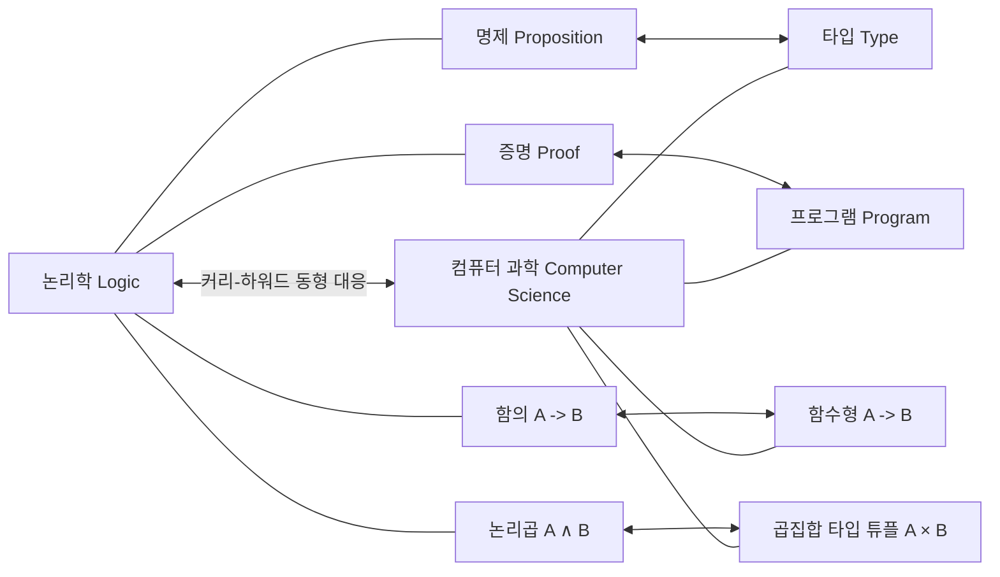

## 1. 서론: 함수형 프로그래밍의 근저에 흐르는 철학

현대의 소프트웨어 개발에서,  **함수형 프로그래밍** ([Functional Programming](https://kenji.blog/ko/p/oop-vs-fp-vs-dop/))은 더 이상 일부 마니아를 위한 접근법이 아니라 널리 보급된 패러다임이 되었습니다. React 등의 프런트엔드 기술부터 Rust와 Scala, 나아가 [Java](https://kenji.blog/ko/p/programming-languages-history-paradigm-evolution/)나 C#과 같은 객체 지향 언어에 이르기까지, 함수를 일급 객체로 취급하거나 부작용을 배제하는 등의 개념이 도입되고 있습니다.

그러나 이 패러다임의 이면에는 컴퓨터가 물리적으로 탄생하기 이전인 1930년대에 구축된 심오한 수학적 이론이 존재합니다. 그것이 바로 알론조 처치(Alonzo Church)가 제안한  **람다 대수** ( $\lambda$-calculus )입니다.

이 글에서는 람다 대수의 기초 이론에서 시작하여, 그것이 어떻게 초기 프로그래밍 언어인  **Lisp**  에 영향을 주었고, 그리고 순수 함수형 언어인  **Haskell**  에 이르기까지 어떠한 역사적·이론적 발전을 이루었는지 자세히 탐구해 봅니다.

## 2. 람다 대수의 탄생: 알론조 처치와 계산의 정의

### 2.1 결정 문제(Entscheidungsproblem)에 대한 도전

1928년, 수학자 다비트 힐베르트는 "결정 문제(Entscheidungsproblem)"를 제기했습니다. 이는 "어떤 수학적 명제가 주어졌을 때, 그것이 참인지 거짓인지를 기계적으로 판정하는 알고리즘이 존재하는가?"라는 질문입니다.

이 질문에 답하기 위해서는 먼저 "계산 가능하다" 또는 "알고리즘이 존재한다"는 것이 엄밀히 어떤 의미인지를 정의할 필요가 있었습니다. 1936년, 이 문제에 대해 독립적으로 해답을 제시한 두 명의 천재가 있었습니다. 한 명은 앨런 튜링이었고, 다른 한 명은 튜링의 지도 교수였던 알론조 처치입니다.

튜링은 "튜링 기계"라는 가상의 기계 모델을 사용하여 계산의 한계를 보여주었습니다. 반면, 처치는  **람다 대수**  라는 순수하게 기호론적인 접근법으로 계산 가능성을 정의했습니다. 놀랍게도 완전히 다른 접근법으로 정의된 이 두 모델은 계산 능력에 있어 완전히 동등함이 증명되었습니다(처치-튜링 명제).

### 2.2 람다 대수의 기초 구문

람다 대수의 세계는 매우 단순합니다. 변수의 정의, 함수의 추상화, 그리고 함수의 적용이라는 세 가지 요소만 가집니다.

$$
E ::= x \mid (\lambda x. E) \mid (E_1 \ E_2)
$$

- $x$ :  **변수** (Variable)
- $\lambda x. E$ :  **추상화** (Abstraction) - 인수 $x$ 를 취하고, 식 $E$ 를 반환하는 함수를 정의합니다.
- $E_1 \ E_2$ :  **함수 적용** (Application) - 함수 $E_1$ 을 인수 $E_2$ 에 적용합니다.

예를 들어, 항등 함수(받은 인수를 그대로 반환하는 함수)는 람다 대수에서 다음과 같이 기술됩니다.

$$
\lambda x. x
$$

## 3. 람다 대수의 연산 규칙

람다 대수에서는 식을 평가(간약)해 나가기 위한 엄밀한 규칙이 정해져 있습니다. 주요 규칙으로  **알파 변환**  과  **베타 간약** , 그리고  **에타 변환**  이 있습니다.

### 3.1 알파 변환( $\alpha$ -conversion)

알파 변환은 종속 변수의 이름을 안전하게 변경하는 규칙입니다. 함수 내에서 사용되는 변수명은 본질적인 의미를 갖지 않으므로, 다른 변수명과 충돌하지 않는 한 변경 가능합니다.

$$
\lambda x. x \equiv \lambda y. y
$$

### 3.2 베타 간약( $\beta$ -reduction)

베타 간약은 람다 대수에서의 "계산의 실행" 그 자체입니다. 함수 적용 시 인수를 함수 본문 내의 변수에 대입하는 조작을 의미합니다.

$$
(\lambda x. x \ y) \ z \rightarrow z \ y
$$

### 3.3 에타 변환( $\eta$ -conversion)

에타 변환은 함수의 외연성(extensionality)을 나타내는 개념입니다. 모든 인수에 대해 동일한 결과를 반환하는 두 함수는 같다는 규칙에 기반합니다.

$$
\lambda x. (f \ x) \equiv f
$$

```mermaid
graph TD
    A["람다 식"] --> B{"평가 가능한가?"}
    B --|"Yes"|--> C["베타 간약"]
    C --> A
    B --|"No"|--> D["정규형 Normal Form"]
    
    style A fill:#f9f,stroke:#333,stroke-width:2px
    style D fill:#bbf,stroke:#333,stroke-width:2px
```

## 4. 처치 인코딩: 무에서 유를 창조하다

람다 대수에는 내장 데이터 타입(숫자, 진릿값, 리스트 등)이 전혀 존재하지 않습니다. 모든 것은 그저 함수일 뿐입니다. 하지만 함수를 교묘하게 조합함으로써 모든 데이터 구조나 제어 구조를 표현할 수 있음을 처치는 보여주었습니다. 이를  **처치 인코딩** (Church Encoding)이라고 부릅니다.

### 4.1 진릿값(처치 불리언)

참(True)과 거짓(False)은 두 개의 인수를 받아 그중 하나를 반환하는 함수로 정의됩니다.

-  **TRUE**  : $\lambda x. \lambda y. x$ (첫 번째 인수를 반환)
-  **FALSE**  : $\lambda x. \lambda y. y$ (두 번째 인수를 반환)

이를 이용하면 IF 문에 해당하는 조건 분기는 단순히 함수 적용으로 표현할 수 있습니다.

-  **IF**  : $\lambda p. \lambda x. \lambda y. p \ x \ y$

### 4.2 숫자(처치 수)

자연수도 함수로 표현할 수 있습니다. 처치 수에서 숫자 $n$ 은 "어떤 함수 $f$ 를 인수 $x$ 에 대해 $n$ 번 적용하는 고차 함수"로 정의됩니다.

-  **0**  : $\lambda f. \lambda x. x$
-  **1**  : $\lambda f. \lambda x. f \ x$
-  **2**  : $\lambda f. \lambda x. f \ (f \ x)$
-  **3**  : $\lambda f. \lambda x. f \ (f \ (f \ x))$

다음수 함수(SUCC : 주어진 숫자에 1을 더하는 함수)는 다음과 같이 정의됩니다.

-  **SUCC**  : $\lambda n. \lambda f. \lambda x. f \ (n \ f \ x)$

Python 코드로 이 개념을 에뮬레이트해 봅시다.

```python
# 처치 수의 Python에 의한 표현
ZERO  = lambda f: lambda x: x
ONE   = lambda f: lambda x: f(x)
TWO   = lambda f: lambda x: f(f(x))

# 다음수 함수(Successor)
SUCC  = lambda n: lambda f: lambda x: f(n(f)(x))

# 덧셈
ADD   = lambda m: lambda n: lambda f: lambda x: m(f)(n(f)(x))

# 처치 수를 일반 Python 정수로 변환하는 도우미 함수
def to_int(church_numeral):
    return church_numeral(lambda x: x + 1)(0)

print(to_int(TWO)) # 출력: 2
print(to_int(ADD(TWO)(SUCC(TWO)))) # 2 + 3 = 5
```

## 5. 부동점 콤비네이터와 튜링 완전성

람다 대수에서 함수에는 이름이 없습니다(익명 함수). 그러면 어떻게 재귀 호출을 구현할 수 있을까요? 이 문제를 해결하는 것이  **부동점 콤비네이터** (Fixed-point combinator), 특히 유명한  **Y 콤비네이터**  입니다.

$$
Y = \lambda f. (\lambda x. f \ (x \ x)) \ (\lambda x. f \ (x \ x))
$$

Y 콤비네이터는 임의의 함수 $f$ 에 대해 $Y \ f = f \ (Y \ f)$ 를 만족합니다. 이를 이용함으로써 재귀 구조를 함수 자신에 대한 적용으로 표현하여, 컴퓨터의 무한 루프나 재귀를 람다 대수의 틀 안에서 처리할 수 있게 됩니다. 이로써 람다 대수가 튜링 완전함이 증명됩니다.

## 6. Lisp의 탄생: 이론에서 프로그래밍 언어로

1950년대 후반, 존 매카시(John McCarthy)는 인공지능 연구를 위해 새로운 프로그래밍 언어를 설계하고 있었습니다. 그는 처치의 람다 대수에서 영감을 받아, 함수의 추상화나 재귀를 직접적으로 지원하는 언어를 개발했습니다. 이것이  **Lisp** (LISt Processing)입니다.

Lisp의 가장 큰 특징은 코드 자체가 데이터(리스트)로 표현된다는 점(동형성: Homoiconicity)과 `lambda` 키워드를 통해 익명 함수를 정의할 수 있다는 점에 있습니다.

```lisp
;; Lisp에서의 함수 정의와 고차 함수의 예
(define (square x) (* x x))

;; map 함수에 람다 식을 전달
(map (lambda (x) (* x x)) '(1 2 3 4 5))
;; 결과: (1 4 9 16 25)
```

Lisp는 동적 타입 언어였으며 이론적인 람다 대수 그대로는 아니었지만, "함수를 데이터로 취급한다" "계산을 함수의 평가로 파악한다"는 함수형 프로그래밍의 정신을 현실의 컴퓨터 상에서 구현한 최초의 위대한 이정표가 되었습니다.

## 7. 타입 람다 대수와 커리-하워드 동형 대응

순수 람다 대수(타입 없는 람다 대수)는 강력하지만, 어떤 함수에든 어떤 인수라도 전달할 수 있기 때문에 자기 적용에 의한 역설(예: 러셀의 역설)을 일으킬 가능성이 있었습니다. 이를 방지하기 위해 처치가 나중에 도입한 것이  **단순 타입 람다 대수** (Simply Typed [Lambda](https://kenji.blog/ko/p/serverless-architecture-aws-lambda-cold-start/) Calculus)입니다.

### 7.1 커리-하워드 동형 대응

타입 이론의 발전에 따라, 컴퓨터 과학과 논리학 사이에 놀라운 대응 관계가 발견되었습니다. 그것이  **커리-하워드 동형 대응** (Curry-Howard Correspondence)입니다.

-  **타입(Types)**  은  **명제(Propositions)**  에 대응한다.
-  **프로그램(Programs)**  은  **증명(Proofs)**  에 대응한다.
-  **함수의 평가(Evaluation)**  는  **증명의 간약(Proof simplification)**  에 대응한다.



이 강력한 수학적 기반은 이후 프로그램의 정당성을 타입 시스템을 통해 보장하는 접근법으로 진화하여, 현대의 정적 타입 함수형 언어로 향하는 길을 열었습니다.

## 8. Haskell의 등장과 순수 함수형 프로그래밍의 도달점

1980년대 후반, 함수형 언어 연구자들은 표준화된 지연 평가 기반의 순수 함수형 언어를 만들기 위해 위원회를 설립했습니다. 논리학자 해스켈 커리(Haskell Curry)의 이름을 딴  **Haskell**  의 탄생입니다.

### 8.1 지연 평가(Lazy Evaluation)

Haskell은 식이 그 값을 진정으로 필요로 할 때까지 평가되지 않는  **지연 평가**  를 기본으로 채택하고 있습니다. 이로써 무한 리스트 등의 개념을 자연스럽게 표현할 수 있습니다. 이는 람다 대수에서의 "정규 순서 간약(Normal-order reduction)"에 해당합니다.

```haskell
-- Haskell에서의 무한 리스트의 예
-- 1부터 시작하는 모든 자연수의 리스트
naturals :: [Integer]
naturals = [1..]

-- 처음 10개의 짝수를 가져오기
firstTenEvens :: [Integer]
firstTenEvens = take 10 (map (*2) naturals)
```

### 8.2 모나드(Monads)와 부작용의 관리

순수 함수형 언어에서 수학적인 순수성(참조 투명성)을 유지한 채, 입출력이나 상태 변화 등의 "부작용(Side Effects)"을 어떻게 다룰지는 오랜 과제였습니다. Haskell은 범주론(Category Theory)의 개념인  **모나드** ([Monad](https://kenji.blog/ko/p/functional-programming-concepts-pure-functions-monads/))를 도입함으로써 이 문제를 우아하게 해결했습니다.

IO 모나드를 통해, "계산"과 "부작용을 동반하는 실행"을 타입 시스템 수준에서 완전히 분리하는 데 성공한 것입니다.

## 9. 결론: 수학에서 소프트웨어 엔지니어링으로

1930년대에 종이와 연필만으로 알론조 처치가 그려낸  **람다 대수**  는 결코 시대에 뒤떨어진 이론이 아닙니다. 그것은 튜링 기계와는 다른 각도에서 "계산이란 무엇인가"를 재조명한 것이며, Lisp를 통해 프로그래밍 가능한 세계로 해방되었습니다. 그리고 커리-하워드 동형 대응이라는 논리학과의 아름다운 결합을 거쳐, Haskell과 같은 견고하고 강력한 타입 시스템을 갖춘 현대의 언어로 결실을 맺었습니다.

오늘날 우리가 React에서 `map` 이나 `filter` 를 사용하고, [Rust](https://kenji.blog/ko/p/webassembly-wasm-current-future/)에서 대수적 데이터 타입을 활용하며, Python에서 람다 식을 작성할 때, 우리 모두는 처치의 위대한 지적 유산의 혜택을 받고 있는 것입니다.

함수형 프로그래밍은 단순한 코딩 스타일이 아니라,  **계산 그 자체의 본질에 다가가는 수학적 철학**  인 것입니다.
