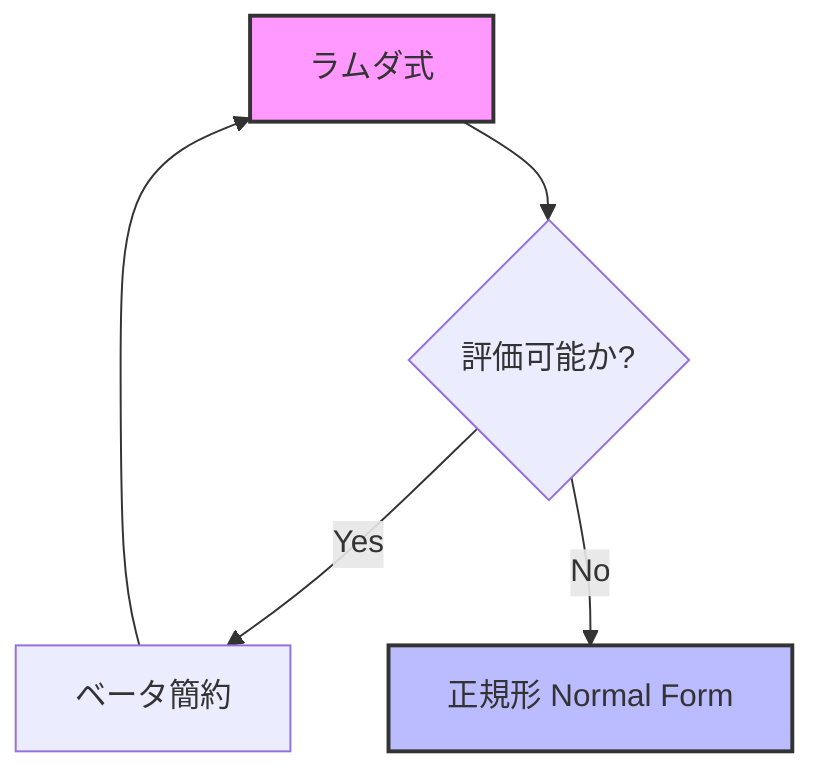
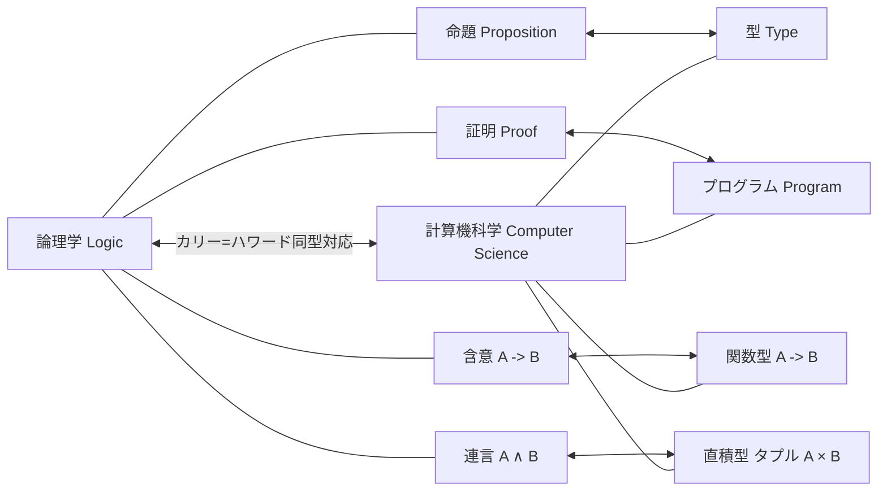

## 1. はじめに：[関数型プログラミング](https://kenji.blog/p/oop-vs-fp-vs-dop/)の根底に流れる哲学

現代のソフトウェア開発において、 **[関数型プログラミング](https://kenji.blog/p/functional-programming-concepts-pure-functions-monads/)** （Functional Programming）はもはや一部のマニア向けのアプローチではなく、広く普及したパラダイムとなりました。Reactなどのフロントエンド技術から、RustやScala、さらにはJavaやC#といった[オブジェクト指向](https://kenji.blog/p/oop-vs-fp-vs-dop/)言語にまで、関数の第一級オブジェクトとしての扱いや副作用の排除といった概念が取り入れられています。

しかし、このパラダイムの背後には、コンピュータが物理的に誕生する以前の1930年代に構築された深遠な数学的理論が存在します。それが、アロンゾ・チャーチ（Alonzo Church）によって提唱された **ラムダ計算** （ $\lambda$-calculus ）です。

この記事では、ラムダ計算の基礎理論から始まり、それがどのようにして初期の[プログラミング言語](https://kenji.blog/p/programming-languages-history-paradigm-evolution/)である **Lisp** に影響を与え、そして[純粋関数](https://kenji.blog/p/functional-programming-concepts-pure-functions-monads/)型言語である **Haskell** に至るまで、どのような歴史的・理論的発展を遂げたのかを、詳細に探求していきます。

## 2. ラムダ計算の誕生：アロンゾ・チャーチと計算の定義

### 2.1 決定問題（Entscheidungsproblem）への挑戦

1928年、数学者ダフィット・ヒルベルトは「決定問題（Entscheidungsproblem）」を提起しました。これは、「ある数学的命題が与えられたとき、それが真であるか偽であるかを機械的に判定するアルゴリズムは存在するか？」という問いです。

この問いに答えるためには、まず「計算可能である」あるいは「アルゴリズムが存在する」とは厳密にどういうことかを定義する必要がありました。1936年、この問題に対して独立して解答を出した二人の天才がいました。一人がアラン・チューリングであり、もう一人がチューリングの指導教官でもあったアロンゾ・チャーチです。

チューリングは「[チューリングマシン](https://kenji.blog/p/turing-machine-computability/)」という仮想の機械モデルを用いて計算の限界を示しました。一方、チャーチは **ラムダ計算** という純粋に記号論的なアプローチで計算可能性を定義しました。驚くべきことに、全く異なるアプローチで定義されたこれら二つのモデルは、計算能力において完全に等価であることが証明されました（チャーチ＝チューリングのテーゼ）。

### 2.2 ラムダ計算の基礎構文

ラムダ計算の世界は非常にシンプルです。変数の定義、関数の抽象化、そして関数の適用の3つの要素しか持ちません。

$$
E ::= x \mid (\lambda x. E) \mid (E_1 \ E_2)
$$

- $x$ : **変数** (Variable)
- $\lambda x. E$ : **抽象化** (Abstraction) - 引数 $x$ を取り、式 $E$ を返す関数を定義します。
- $E_1 \ E_2$ : **関数適用** (Application) - 関数 $E_1$ を引数 $E_2$ に適用します。

たとえば、恒等関数（受け取った引数をそのまま返す関数）はラムダ計算では次のように記述されます。

$$
\lambda x. x
$$

## 3. ラムダ計算の演算規則

ラムダ計算では、式を評価（簡約）していくための厳密なルールが定められています。主な規則として **アルファ変換** と **ベータ簡約** 、そして **イータ変換** があります。

### 3.1 アルファ変換（ $\alpha$ -conversion）

アルファ変換は、束縛変数の名前を安全に変更するルールです。関数の中で使われている変数名は本質的な意味を持たないため、他の変数名と衝突しない限り変更可能です。

$$
\lambda x. x \equiv \lambda y. y
$$

### 3.2 ベータ簡約（ $\beta$ -reduction）

ベータ簡約は、ラムダ計算における「計算の実行」そのものです。関数適用の際、引数を関数の本体内の変数に代入する操作を指します。

$$
(\lambda x. x \ y) \ z \rightarrow z \ y
$$

### 3.3 イータ変換（ $\eta$ -conversion）

イータ変換は、関数の外延性（extensionality）を表す概念です。すべての引数に対して同じ結果を返す2つの関数は等しい、というルールに基づきます。

$$
\lambda x. (f \ x) \equiv f
$$



## 4. チャーチエンコーディング：無から有を生み出す

ラムダ計算には、組み込みのデータ型（数値、真偽値、リストなど）は一切存在しません。すべてはただの関数です。しかし、関数を巧みに組み合わせることで、あらゆるデータ構造や制御構造を表現できることをチャーチは示しました。これを **チャーチエンコーディング** （Church Encoding）と呼びます。

### 4.1 真偽値（チャーチブール値）

真（True）と偽（False）は、2つの引数を受け取り、どちらか一方を返す関数として定義されます。

- **TRUE** : $\lambda x. \lambda y. x$ （1つ目の引数を返す）
- **FALSE** : $\lambda x. \lambda y. y$ （2つ目の引数を返す）

これを用いると、IF文に相当する条件分岐は単純に関数適用として表現できます。

- **IF** : $\lambda p. \lambda x. \lambda y. p \ x \ y$

### 4.2 数値（チャーチ数）

自然数も関数で表現できます。チャーチ数において、数 $n$ は「ある関数 $f$ を引数 $x$ に対して $n$ 回適用する高階関数」として定義されます。

- **0** : $\lambda f. \lambda x. x$
- **1** : $\lambda f. \lambda x. f \ x$
- **2** : $\lambda f. \lambda x. f \ (f \ x)$
- **3** : $\lambda f. \lambda x. f \ (f \ (f \ x))$

後者関数（SUCC : 与えられた数に1を足す関数）は次のように定義されます。

- **SUCC** : $\lambda n. \lambda f. \lambda x. f \ (n \ f \ x)$

Pythonコードでこの概念をエミュレートしてみましょう。

```python
# チャーチ数のPythonによる表現
ZERO  = lambda f: lambda x: x
ONE   = lambda f: lambda x: f(x)
TWO   = lambda f: lambda x: f(f(x))

# 後者関数（Successor）
SUCC  = lambda n: lambda f: lambda x: f(n(f)(x))

# 加算
ADD   = lambda m: lambda n: lambda f: lambda x: m(f)(n(f)(x))

# チャーチ数を通常のPythonの整数に変換するヘルパー関数
def to_int(church_numeral):
    return church_numeral(lambda x: x + 1)(0)

print(to_int(TWO)) # 出力: 2
print(to_int(ADD(TWO)(SUCC(TWO)))) # 2 + 3 = 5
```

## 5. 不動点コンビネータとチューリング完全性

ラムダ計算において、関数には名前がありません（無名関数）。では、どうやって再帰呼び出しを実現するのでしょうか？この問題を解決するのが **不動点コンビネータ** （Fixed-point combinator）、特に有名な **Yコンビネータ** です。

$$
Y = \lambda f. (\lambda x. f \ (x \ x)) \ (\lambda x. f \ (x \ x))
$$

Yコンビネータは、任意の関数 $f$ に対して $Y \ f = f \ (Y \ f)$ を満たします。これを利用することで、再帰構造を関数自身への適用として表現し、計算機の無限のループや再帰をラムダ計算の枠内で処理できるようになります。これにより、ラムダ計算がチューリング完全であることが示されます。

## 6. Lispの誕生：理論から[プログラミング言語](https://kenji.blog/p/programming-languages-history-paradigm-evolution/)へ

1950年代後半、ジョン・マッカーシー（John McCarthy）は、人工知能の研究のために新たなプログラミング言語を設計していました。彼はチャーチのラムダ計算にインスピレーションを受け、関数の抽象化や再帰を直接的にサポートする言語を開発しました。これが **Lisp** （LISt Processing）です。

Lispの最大の特徴は、コード自体がデータ（リスト）として表現されること（同図像性：Homoiconicity）と、 `lambda` キーワードによって無名関数を定義できる点にあります。

```lisp
;; Lispでの関数定義と高階関数の例
(define (square x) (* x x))

;; map関数にラムダ式を渡す
(map (lambda (x) (* x x)) '(1 2 3 4 5))
;; 結果: (1 4 9 16 25)
```

Lispは動的型付けであり、理論的なラムダ計算そのままではありませんでしたが、「関数をデータとして扱う」「計算を関数の評価として捉える」という[関数型プログラミング](https://kenji.blog/p/oop-vs-fp-vs-dop/)の精神を現実の計算機上で実現した最初の偉大なマイルストーンとなりました。

## 7. 型付きラムダ計算とカリー＝ハワード同型対応

純粋なラムダ計算（型無しラムダ計算）は強力ですが、どんな関数にもどんな引数でも渡せてしまうため、自己適用によるパラドックス（例：ラッセルのパラドックス）を引き起こす可能性がありました。これを防ぐためにチャーチが後に導入したのが **単純型付きラムダ計算** （Simply Typed [Lambda](https://kenji.blog/p/serverless-architecture-aws-lambda-cold-start/) Calculus）です。

### 7.1 カリー＝ハワード同型対応

型理論の発展に伴い、計算機科学と論理学の間に驚くべき対応関係が発見されました。それが **カリー＝ハワード同型対応** （Curry-Howard Correspondence）です。

- **型（Types）** は **命題（Propositions）** に対応する。
- **プログラム（Programs）** は **証明（Proofs）** に対応する。
- **関数の評価（Evaluation）** は **証明の簡約（Proof simplification）** に対応する。



この強力な数学的基盤は、後にプログラムの正当性を型システムによって保証するアプローチへと進化し、現代の静的型付き関数型言語への道を切り拓きました。

## 8. Haskellの登場と純粋[関数型プログラミング](https://kenji.blog/p/oop-vs-fp-vs-dop/)の到達点

1980年代後半、関数型言語の研究者たちは、標準化された遅延評価ベースの[純粋関数](https://kenji.blog/p/functional-programming-concepts-pure-functions-monads/)型言語を作成するために委員会を設立しました。論理学者ハスケル・カリー（Haskell Curry）の名を冠した **Haskell** の誕生です。

### 8.1 遅延評価（Lazy Evaluation）

Haskellは、式がその値を本当に必要とされるまで評価されない **遅延評価** をデフォルトで採用しています。これにより、無限リストなどの概念を自然に表現できます。これはラムダ計算における「正規順序簡約（Normal-order reduction）」に対応しています。

```haskell
-- Haskellにおける無限リストの例
-- 1から始まるすべての自然数のリスト
naturals :: [Integer]
naturals = [1..]

-- 最初の10個の偶数を取得する
firstTenEvens :: [Integer]
firstTenEvens = take 10 (map (*2) naturals)
```

### 8.2 [モナド](https://kenji.blog/p/functional-programming-concepts-pure-functions-monads/)（Monads）と副作用の管理

[純粋関数](https://kenji.blog/p/functional-programming-concepts-pure-functions-monads/)型言語において、数学的な純粋性（参照透過性）を保ったまま、入出力や状態変化などの「副作用（Side Effects）」をどのように扱うかは長年の課題でした。Haskellは圏論（Category Theory）の概念である **モナド** （[Monad](https://kenji.blog/p/functional-programming-concepts-pure-functions-monads/)）を導入することでこの問題をエレガントに解決しました。

IOモナドによって、「計算」と「副作用を伴う実行」を型システムレベルで完全に分離することに成功したのです。

## 9. まとめ：数学からソフトウェアエンジニアリングへ

1930年代に紙と鉛筆だけでアロンゾ・チャーチが描いた **ラムダ計算** は、決して時代遅れの理論ではありません。それは[チューリングマシン](https://kenji.blog/p/turing-machine-computability/)とは異なる角度から「計算とは何か」を捉え直したものであり、Lispを通じてプログラマブルな世界へと解き放たれました。そして、カリー＝ハワード同型対応という論理学との美しい結びつきを経て、Haskellのような堅牢で強力な型システムを持つ現代の言語へと結実しました。

今日、私たちがReactで `map` や `filter` を使い、[Rust](https://kenji.blog/p/webassembly-wasm-current-future/)で代数的データ型を活用し、Pythonでラムダ式を書くとき、私たちは皆、チャーチの偉大な知的遺産の恩恵を受けているのです。

[関数型プログラミング](https://kenji.blog/p/oop-vs-fp-vs-dop/)は単なるコーディングスタイルではなく、 **計算そのものの本質に迫る数学的哲学** なのです。
