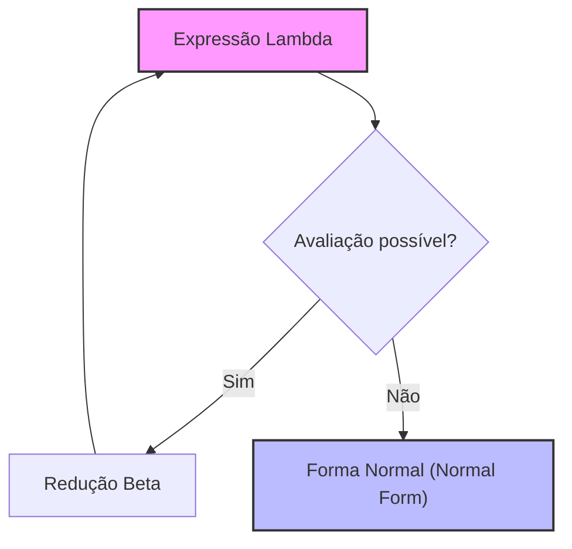
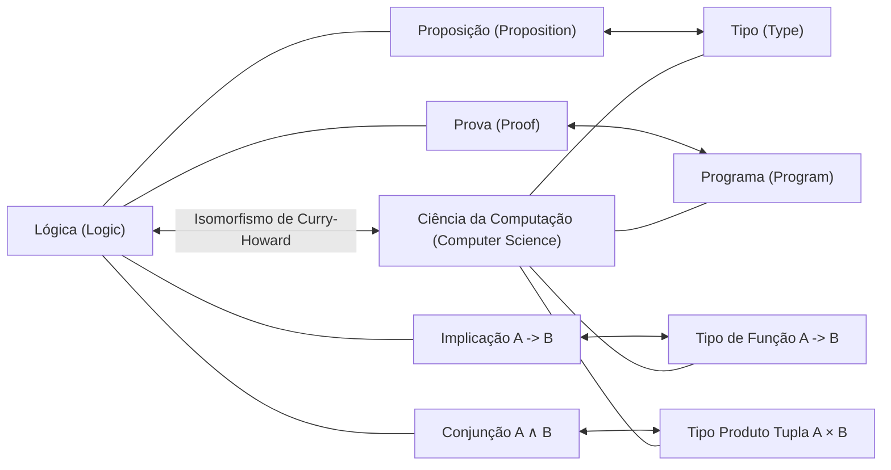

## 1. Introdução: A Filosofia Subjacente à Programação Funcional

No desenvolvimento de software moderno, a **programação funcional** ([Functional Programming](https://kenji.blog/pt/p/oop-vs-fp-vs-dop/)) não é mais uma abordagem para um nicho de entusiastas, mas tornou-se um paradigma amplamente difundido. De tecnologias de front-end como React a linguagens como Rust e Scala, e até mesmo linguagens orientadas a objetos como [Java](https://kenji.blog/pt/p/programming-languages-history-paradigm-evolution/) e C#, conceitos como o tratamento de funções como objetos de primeira classe e a eliminação de efeitos colaterais foram incorporados.

No entanto, por trás desse paradigma, existe uma profunda teoria matemática construída na década de 1930, antes do nascimento físico dos computadores. Trata-se do **cálculo lambda** ( $\lambda$-calculus ) proposto por Alonzo Church.

Neste artigo, exploraremos em detalhes o desenvolvimento histórico e teórico a partir da teoria fundamental do cálculo lambda, passando por como ele influenciou o **Lisp**, uma das primeiras linguagens de programação, até chegar ao **Haskell**, uma linguagem puramente funcional.

## 2. O Nascimento do Cálculo [Lambda](https://kenji.blog/pt/p/serverless-architecture-aws-lambda-cold-start/): Alonzo Church e a Definição de Computação

### 2.1 O Desafio do Problema de Decisão (Entscheidungsproblem)

Em 1928, o matemático David Hilbert propôs o "problema de decisão" (Entscheidungsproblem). A questão era: "Dado um problema matemático, existe um algoritmo que determina mecanicamente se ele é verdadeiro ou falso?"

Para responder a essa pergunta, primeiro era necessário definir estritamente o que significava ser "computável" ou "ter um algoritmo". Em 1936, dois gênios deram respostas a esse problema de forma independente. Um deles foi Alan Turing, e o outro foi seu orientador, Alonzo Church.

Turing demonstrou os limites da computação usando um modelo de máquina teórica chamado "Máquina de Turing". Por outro lado, Church definiu a computabilidade usando uma abordagem puramente simbólica chamada **cálculo lambda**. Surpreendentemente, esses dois modelos, definidos a partir de abordagens completamente diferentes, provaram ser totalmente equivalentes em capacidade computacional (Tese de Church-Turing).

### 2.2 Sintaxe Básica do Cálculo Lambda

O mundo do cálculo lambda é extremamente simples. Ele possui apenas três elementos: definição de variáveis, abstração de funções e aplicação de funções.

$$
E ::= x \mid (\lambda x. E) \mid (E_1 \ E_2)
$$

- $x$ : **Variável** (Variable)
- $\lambda x. E$ : **Abstração** (Abstraction) - Define uma função que recebe um argumento $x$ e retorna a expressão $E$.
- $E_1 \ E_2$ : **Aplicação** (Application) - Aplica a função $E_1$ ao argumento $E_2$.

Por exemplo, a função identidade (uma função que retorna o argumento recebido inalterado) é descrita no cálculo lambda da seguinte forma:

$$
\lambda x. x
$$

## 3. Regras de Avaliação no Cálculo Lambda

No cálculo lambda, existem regras rígidas para avaliar (reduzir) expressões. As principais regras são a **conversão alfa**, a **redução beta** e a **conversão eta**.

### 3.1 Conversão Alfa ( $\alpha$ -conversion)

A conversão alfa é uma regra para renomear com segurança variáveis ligadas. Como os nomes das variáveis usadas dentro de uma função não têm significado essencial, eles podem ser alterados desde que não entrem em conflito com outros nomes de variáveis.

$$
\lambda x. x \equiv \lambda y. y
$$

### 3.2 Redução Beta ( $\beta$ -reduction)

A redução beta é a própria "execução da computação" no cálculo lambda. Refere-se à operação de substituir o argumento pelas variáveis no corpo da função durante a aplicação da função.

$$
(\lambda x. x \ y) \ z \rightarrow z \ y
$$

### 3.3 Conversão Eta ( $\eta$ -conversion)

A conversão eta é um conceito que expressa a extensionalidade (extensionality) das funções. Baseia-se na regra de que duas funções que retornam o mesmo resultado para todos os argumentos são iguais.

$$
\lambda x. (f \ x) \equiv f
$$



## 4. Codificação de Church: Criando Algo a Partir do Nada

No cálculo lambda, não há tipos de dados integrados (números, valores booleanos, listas, etc.). Tudo são apenas funções. No entanto, Church mostrou que, combinando funções de maneira inteligente, era possível representar qualquer estrutura de dados e estrutura de controle. Isso é chamado de **Codificação de Church** (Church Encoding).

### 4.1 Valores Booleanos (Booleanos de Church)

Verdadeiro (True) e Falso (False) são definidos como funções que recebem dois argumentos e retornam um deles.

- **TRUE** : $\lambda x. \lambda y. x$ (Retorna o primeiro argumento)
- **FALSE** : $\lambda x. \lambda y. y$ (Retorna o segundo argumento)

Usando isso, as ramificações condicionais correspondentes às instruções IF podem ser simplesmente expressas como aplicações de funções.

- **IF** : $\lambda p. \lambda x. \lambda y. p \ x \ y$

### 4.2 Números (Numerais de Church)

Os números naturais também podem ser representados por funções. Nos numerais de Church, o número $n$ é definido como "uma função de ordem superior que aplica uma função $f$ a um argumento $x$ $n$ vezes".

- **0** : $\lambda f. \lambda x. x$
- **1** : $\lambda f. \lambda x. f \ x$
- **2** : $\lambda f. \lambda x. f \ (f \ x)$
- **3** : $\lambda f. \lambda x. f \ (f \ (f \ x))$

A função sucessora (SUCC : uma função que adiciona 1 a um determinado número) é definida da seguinte forma:

- **SUCC** : $\lambda n. \lambda f. \lambda x. f \ (n \ f \ x)$

Vamos emular este conceito em código Python.

```python
# Representação de Numerais de Church em Python
ZERO  = lambda f: lambda x: x
ONE   = lambda f: lambda x: f(x)
TWO   = lambda f: lambda x: f(f(x))

# Função sucessora (Successor)
SUCC  = lambda n: lambda f: lambda x: f(n(f)(x))

# Adição
ADD   = lambda m: lambda n: lambda f: lambda x: m(f)(n(f)(x))

# Função auxiliar para converter numerais de Church em inteiros regulares do Python
def to_int(church_numeral):
    return church_numeral(lambda x: x + 1)(0)

print(to_int(TWO)) # Saída: 2
print(to_int(ADD(TWO)(SUCC(TWO)))) # 2 + 3 = 5
```

## 5. Combinador de Ponto Fixo e Completude de Turing

No cálculo lambda, as funções não têm nomes (funções anônimas). Então, como realizamos chamadas recursivas? A solução para esse problema é o **Combinador de Ponto Fixo** (Fixed-point combinator), em especial o famoso **Combinador Y**.

$$
Y = \lambda f. (\lambda x. f \ (x \ x)) \ (\lambda x. f \ (x \ x))
$$

O Combinador Y satisfaz $Y \ f = f \ (Y \ f)$ para qualquer função $f$. Ao utilizar isso, as estruturas recursivas podem ser expressas como aplicações da função a si mesma, permitindo que os loops infinitos e as recursões dos computadores sejam processados na estrutura do cálculo lambda. Isso demonstra que o cálculo lambda é Turing completo.

## 6. O Nascimento do Lisp: Da Teoria à Linguagem de Programação

No final da década de 1950, John McCarthy estava projetando uma nova linguagem de programação para a pesquisa de inteligência artificial. Ele se inspirou no cálculo lambda de Church e desenvolveu uma linguagem que suportava diretamente a abstração e recursão de funções. Este é o **Lisp** (LISt Processing).

As maiores características do Lisp são que o próprio código é expresso como dados (listas) (Homoiconicidade: Homoiconicity), e funções anônimas podem ser definidas usando a palavra-chave `lambda`.

```lisp
;; Exemplo de definição de função e função de ordem superior em Lisp
(define (square x) (* x x))

;; Passando uma expressão lambda para a função map
(map (lambda (x) (* x x)) '(1 2 3 4 5))
;; Resultado: (1 4 9 16 25)
```

O Lisp tinha tipagem dinâmica e não era o cálculo lambda teórico em si, mas tornou-se o primeiro grande marco na materialização do espírito da programação funcional — "tratando funções como dados" e "entendendo o cálculo como a avaliação de funções" — em um computador real.

## 7. Cálculo [Lambda](https://kenji.blog/pt/p/serverless-architecture-aws-lambda-cold-start/) Tipado e o Isomorfismo de Curry-Howard

Embora o cálculo lambda puro (cálculo lambda não tipado) seja poderoso, ele permitia passar qualquer argumento para qualquer função, o que poderia levar a paradoxos devido à autoaplicação (ex: Paradoxo de Russell). Para evitar isso, Church introduziu mais tarde o **Cálculo Lambda Simplesmente Tipado** (Simply Typed Lambda Calculus).

### 7.1 Isomorfismo de Curry-Howard

Com o desenvolvimento da teoria dos tipos, uma correspondência surpreendente foi descoberta entre a ciência da computação e a lógica. É o **Isomorfismo de Curry-Howard** (Curry-Howard Correspondence).

- **Tipos (Types)** correspondem a **Proposições (Propositions)**.
- **Programas (Programs)** correspondem a **Provas (Proofs)**.
- **Avaliação de funções (Evaluation)** corresponde à **Simplificação de provas (Proof simplification)**.



Esse sólido alicerce matemático evoluiu posteriormente para uma abordagem que garante a correção dos programas por meio de sistemas de tipos, abrindo caminho para linguagens funcionais de tipagem estática modernas.

## 8. O Surgimento do Haskell e o Ápice da Programação Funcional Pura

No final da década de 1980, pesquisadores de linguagens funcionais formaram um comitê para criar uma linguagem puramente funcional padronizada baseada em avaliação preguiçosa. Este foi o nascimento do **Haskell**, com o nome do lógico Haskell Curry.

### 8.1 Avaliação Preguiçosa (Lazy Evaluation)

Por padrão, o Haskell usa **avaliação preguiçosa** (lazy evaluation), o que significa que uma expressão não é avaliada até que seu valor seja realmente necessário. Isso permite que conceitos como listas infinitas sejam expressos naturalmente, correspondendo à "redução de ordem normal (Normal-order reduction)" no cálculo lambda.

```haskell
-- Exemplo de lista infinita em Haskell
-- Uma lista de todos os números naturais a partir de 1
naturals :: [Integer]
naturals = [1..]

-- Pegando os primeiros 10 números pares
firstTenEvens :: [Integer]
firstTenEvens = take 10 (map (*2) naturals)
```

### 8.2 Mônadas (Monads) e Gerenciamento de Efeitos Colaterais

Nas linguagens puramente funcionais, a forma de lidar com "efeitos colaterais" (Side Effects), como entrada/saída e mudanças de estado, preservando a pureza matemática (transparência referencial), tem sido um desafio de longa data. O Haskell resolveu esse problema de forma elegante, introduzindo a **Mônada** ([Monad](https://kenji.blog/pt/p/functional-programming-concepts-pure-functions-monads/)), um conceito da Teoria das Categorias (Category Theory).

A Mônada de IO teve sucesso na separação completa entre a "computação" e a "execução com efeitos colaterais" no nível do sistema de tipos.

## 9. Conclusão: Da Matemática à Engenharia de Software

O **cálculo lambda**, que Alonzo Church esboçou com nada além de papel e lápis na década de 1930, não é de forma alguma uma teoria antiquada. Ele redefiniu "o que é computação" de um ângulo diferente da Máquina de Turing e foi lançado em um mundo programável através do Lisp. Em seguida, por meio de uma bela conexão com a lógica conhecida como isomorfismo de Curry-Howard, ele amadureceu nas linguagens modernas com sistemas de tipos robustos e poderosos, como o Haskell.

Hoje, quando usamos `map` e `filter` no React, aproveitamos os tipos de dados algébricos no [Rust](https://kenji.blog/pt/p/webassembly-wasm-current-future/) e escrevemos expressões lambda no Python, estamos todos nos beneficiando da grande herança intelectual de Church.

A programação funcional não é apenas um estilo de codificação, mas uma **filosofia matemática que se aproxima da essência da computação**.
