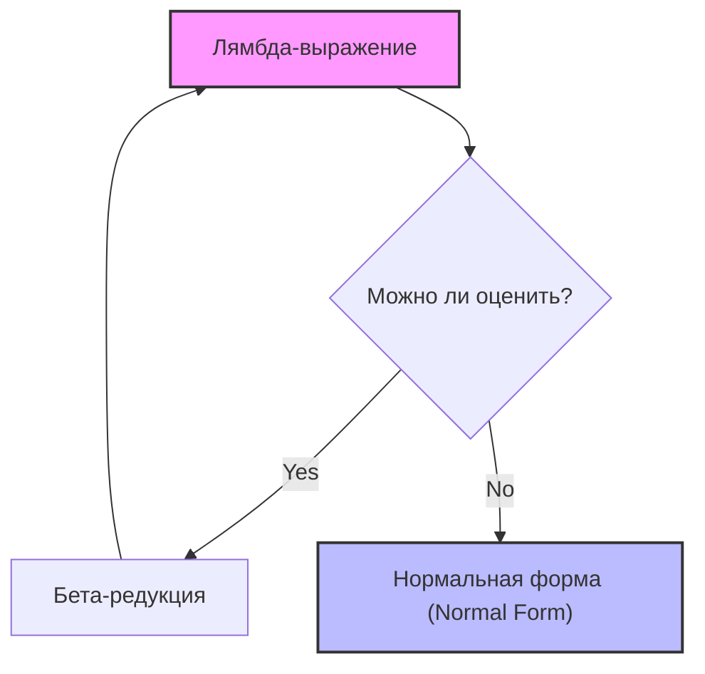
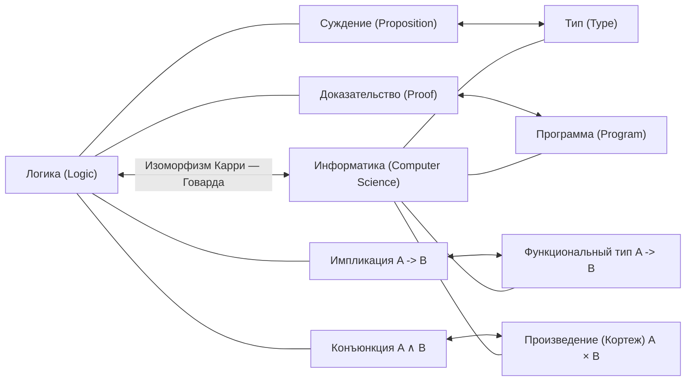

## 1. Введение: Философия, лежащая в основе функционального программирования

В современной разработке программного обеспечения **функциональное программирование** ([Functional Programming](https://kenji.blog/ru/p/oop-vs-fp-vs-dop/)) больше не является подходом для узкого круга энтузиастов, а стало широко распространенной парадигмой. От фронтенд-технологий, таких как React, до Rust и Scala, и даже объектно-ориентированных языков, таких как [Java](https://kenji.blog/ru/p/programming-languages-history-paradigm-evolution/) и C#, — везде внедряются концепции отношения к функциям как к объектам первого класса и устранения побочных эффектов.

Однако за этой парадигмой стоит глубокая математическая теория, созданная в 1930-х годах, еще до физического появления компьютеров. Это **лямбда-исчисление** ( $\lambda$-calculus ), предложенное Алонзо Чёрчем (Alonzo Church).

В этой статье мы подробно рассмотрим, как лямбда-исчисление развивалось исторически и теоретически, начиная с его базовой теории, как оно повлияло на ранний язык программирования **Lisp**, и вплоть до создания чисто функционального языка **Haskell**.

## 2. Рождение лямбда-исчисления: Алонзо Чёрч и определение вычислений

### 2.1 Вызов проблеме разрешения (Entscheidungsproblem)

В 1928 году математик Давид Гильберт сформулировал «проблему разрешения» (Entscheidungsproblem). Это был вопрос: «Существует ли алгоритм, который может механически определить, истинно или ложно данное математическое утверждение?»

Чтобы ответить на этот вопрос, сначала нужно было строго определить, что означает «вычислимо» или «существует алгоритм». В 1936 году два гения независимо друг от друга нашли решение этой проблемы. Одним был Алан Тьюринг, а другим — Алонзо Чёрч, который также был научным руководителем Тьюринга.

Тьюринг продемонстрировал пределы вычислений, используя виртуальную модель машины, названную «машиной Тьюринга». Чёрч же определил вычислимость с помощью чисто символического подхода, названного **лямбда-исчислением**. Поразительно, но эти две модели, определенные совершенно разными подходами, оказались полностью эквивалентными по своей вычислительной мощности (Тезис Чёрча — Тьюринга).

### 2.2 Базовый синтаксис лямбда-исчисления

Мир лямбда-исчисления предельно прост. В нем есть всего три элемента: определение переменных, абстракция функций и применение функций.

$$
E ::= x \mid (\lambda x. E) \mid (E_1 \ E_2)
$$

- $x$ : **Переменная** (Variable)
- $\lambda x. E$ : **Абстракция** (Abstraction) — определяет функцию, которая принимает аргумент $x$ и возвращает выражение $E$.
- $E_1 \ E_2$ : **Применение функции** (Application) — применяет функцию $E_1$ к аргументу $E_2$.

Например, функция идентичности (функция, которая возвращает полученный аргумент как есть) в лямбда-исчислении записывается так:

$$
\lambda x. x
$$

## 3. Правила вычислений в лямбда-исчислении

В лямбда-исчислении установлены строгие правила для оценки (редукции) выражений. Основными правилами являются **альфа-конверсия**, **бета-редукция** и **эта-конверсия**.

### 3.1 Альфа-конверсия ( $\alpha$ -conversion)

Альфа-конверсия — это правило безопасного переименования связанных переменных. Поскольку имена переменных, используемых в функции, не имеют существенного значения, их можно изменять, если они не конфликтуют с другими именами переменных.

$$
\lambda x. x \equiv \lambda y. y
$$

### 3.2 Бета-редукция ( $\beta$ -reduction)

Бета-редукция — это само «выполнение вычислений» в лямбда-исчислении. Она означает операцию подстановки аргумента вместо переменной в теле функции при ее применении.

$$
(\lambda x. x \ y) \ z \rightarrow z \ y
$$

### 3.3 Эта-конверсия ( $\eta$ -conversion)

Эта-конверсия — это концепция, выражающая экстенсиональность (extensionality) функций. Она основана на правиле, согласно которому две функции, возвращающие одинаковый результат для всех аргументов, равны.

$$
\lambda x. (f \ x) \equiv f
$$



## 4. Кодирование Чёрча: создание чего-то из ничего

В лямбда-исчислении нет никаких встроенных типов данных (чисел, логических значений, списков и т. д.). Всё является просто функциями. Однако Чёрч показал, что, умело комбинируя функции, можно выразить любые структуры данных и управляющие конструкции. Это называется **кодированием Чёрча** (Church Encoding).

### 4.1 Логические значения (Булевы значения Чёрча)

Истина (True) и ложь (False) определяются как функции, которые принимают два аргумента и возвращают один из них.

- **TRUE** : $\lambda x. \lambda y. x$ (возвращает первый аргумент)
- **FALSE** : $\lambda x. \lambda y. y$ (возвращает второй аргумент)

Используя это, условное ветвление, эквивалентное оператору IF, можно просто выразить как применение функции.

- **IF** : $\lambda p. \lambda x. \lambda y. p \ x \ y$

### 4.2 Числа (Числа Чёрча)

Натуральные числа также можно представить функциями. В числах Чёрча число $n$ определяется как «функция высшего порядка, которая применяет некоторую функцию $f$ к аргументу $x$ ровно $n$ раз».

- **0** : $\lambda f. \lambda x. x$
- **1** : $\lambda f. \lambda x. f \ x$
- **2** : $\lambda f. \lambda x. f \ (f \ x)$
- **3** : $\lambda f. \lambda x. f \ (f \ (f \ x))$

Функция следования (SUCC: функция, которая добавляет 1 к заданному числу) определяется следующим образом:

- **SUCC** : $\lambda n. \lambda f. \lambda x. f \ (n \ f \ x)$

Давайте эмулируем эту концепцию с помощью кода на Python.

```python
# Представление чисел Чёрча на Python
ZERO  = lambda f: lambda x: x
ONE   = lambda f: lambda x: f(x)
TWO   = lambda f: lambda x: f(f(x))

# Функция следования (Successor)
SUCC  = lambda n: lambda f: lambda x: f(n(f)(x))

# Сложение
ADD   = lambda m: lambda n: lambda f: lambda x: m(f)(n(f)(x))

# Вспомогательная функция для преобразования числа Чёрча в обычное целое число Python
def to_int(church_numeral):
    return church_numeral(lambda x: x + 1)(0)

print(to_int(TWO)) # Вывод: 2
print(to_int(ADD(TWO)(SUCC(TWO)))) # 2 + 3 = 5
```

## 5. Комбинатор неподвижной точки и полнота по Тьюрингу

В лямбда-исчислении у функций нет имен (анонимные функции). Как же тогда реализовать рекурсивный вызов? Эту проблему решает **комбинатор неподвижной точки** (Fixed-point combinator), в частности знаменитый **Y-комбинатор**.

$$
Y = \lambda f. (\lambda x. f \ (x \ x)) \ (\lambda x. f \ (x \ x))
$$

Y-комбинатор удовлетворяет условию $Y \ f = f \ (Y \ f)$ для любой функции $f$. Используя это, рекурсивная структура может быть выражена как применение функции к самой себе, что позволяет обрабатывать бесконечные циклы и рекурсию компьютеров в рамках лямбда-исчисления. Это доказывает, что лямбда-исчисление является полным по Тьюрингу.

## 6. Рождение Lisp: от теории к языку программирования

В конце 1950-х годов Джон Маккарти (John McCarthy) разрабатывал новый язык программирования для исследований в области искусственного интеллекта. Вдохновленный лямбда-исчислением Чёрча, он разработал язык, который напрямую поддерживает абстракцию функций и рекурсию. Этим языком стал **Lisp** (LISt Processing).

Главная особенность Lisp заключается в том, что сам код представлен как данные (списки) (гомоиконность: Homoiconicity), а также в возможности определять анонимные функции с помощью ключевого слова `lambda`.

```lisp
;; Пример определения функции и функции высшего порядка в Lisp
(define (square x) (* x x))

;; Передача лямбда-выражения в функцию map
(map (lambda (x) (* x x)) '(1 2 3 4 5))
;; Результат: (1 4 9 16 25)
```

Lisp имел динамическую типизацию и не был буквальным воплощением теоретического лямбда-исчисления, но он стал первой великой вехой, реализовавшей дух функционального программирования — «отношение к функциям как к данным» и «восприятие вычислений как оценки функций» — на реальных компьютерах.

## 7. Типизированное лямбда-исчисление и изоморфизм Карри — Говарда

Чистое лямбда-исчисление (бестиповое лямбда-исчисление) обладает огромной мощью, но поскольку любой функции можно передать любой аргумент, оно могло приводить к парадоксам, вызванным самоприменимостью (например, парадокс Рассела). Чтобы предотвратить это, Чёрч позже ввел **просто типизированное лямбда-исчисление** (Simply Typed [Lambda](https://kenji.blog/ru/p/serverless-architecture-aws-lambda-cold-start/) Calculus).

### 7.1 Изоморфизм Карри — Говарда

С развитием теории типов было обнаружено удивительное соответствие между информатикой и логикой. Оно получило название **изоморфизм Карри — Говарда** (Curry-Howard Correspondence).

- **Типы (Types)** соответствуют **суждениям (Propositions)**.
- **Программы (Programs)** соответствуют **доказательствам (Proofs)**.
- **Оценка функций (Evaluation)** соответствует **упрощению доказательств (Proof simplification)**.



Эта мощная математическая основа впоследствии эволюционировала в подход, гарантирующий правильность программ с помощью систем типов, что открыло путь современным статически типизированным функциональным языкам.

## 8. Появление Haskell и вершина чисто функционального программирования

В конце 1980-х годов исследователи функциональных языков создали комитет для разработки стандартизированного чисто функционального языка на основе ленивых вычислений. Так родился **Haskell**, названный в честь логика Хаскелла Карри (Haskell Curry).

### 8.1 Ленивые вычисления (Lazy Evaluation)

По умолчанию Haskell использует **ленивые вычисления**, при которых выражения не оцениваются до тех пор, пока их значение не потребуется на самом деле. Это позволяет естественно выражать такие концепции, как бесконечные списки. Это соответствует «редукции в нормальном порядке» (Normal-order reduction) в лямбда-исчислении.

```haskell
-- Пример бесконечного списка в Haskell
-- Список всех натуральных чисел, начиная с 1
naturals :: [Integer]
naturals = [1..]

-- Получение первых 10 четных чисел
firstTenEvens :: [Integer]
firstTenEvens = take 10 (map (*2) naturals)
```

### 8.2 Монады (Monads) и управление побочными эффектами

В чисто функциональных языках давней проблемой было то, как обрабатывать «побочные эффекты» (Side Effects), такие как ввод-вывод или изменение состояния, сохраняя при этом математическую чистоту (ссылочную прозрачность). Haskell элегантно решил эту проблему, внедрив **монады** ([Monad](https://kenji.blog/ru/p/functional-programming-concepts-pure-functions-monads/)) — концепцию из теории категорий (Category Theory).

С помощью монады IO удалось полностью разделить «вычисления» и «выполнение с побочными эффектами» на уровне системы типов.

## 9. Заключение: от математики к программной инженерии

**Лямбда-исчисление**, созданное Алонзо Чёрчем в 1930-х годах с помощью одних лишь бумаги и карандаша, отнюдь не является устаревшей теорией. Оно переосмыслило понятие «вычисление» под иным углом, нежели машина Тьюринга, и через Lisp вышло в программируемый мир. А затем, благодаря прекрасной связи с логикой через изоморфизм Карри — Говарда, оно воплотилось в современных языках с надежными и мощными системами типов, таких как Haskell.

Сегодня, когда мы используем `map` или `filter` в React, применяем алгебраические типы данных в [Rust](https://kenji.blog/ru/p/webassembly-wasm-current-future/) или пишем лямбда-выражения на Python, мы все пользуемся плодами великого интеллектуального наследия Чёрча.

Функциональное программирование — это не просто стиль написания кода, а **математическая философия, которая приближается к самой сути вычислений**.
