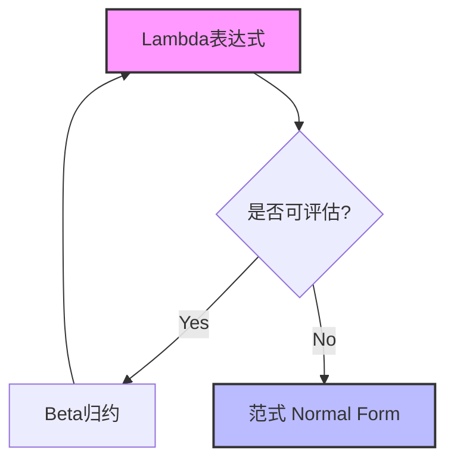
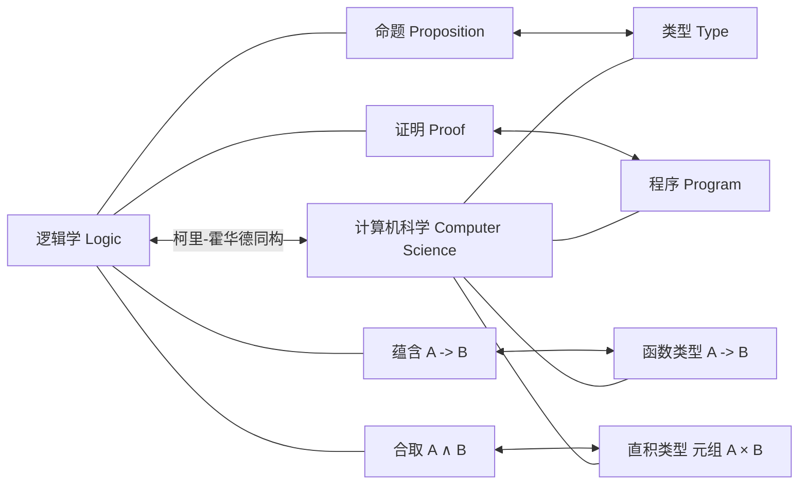

## 1. 引言：流淌在函数式编程根底的哲学

在现代软件开发中， **函数式编程** （[Functional Programming](https://kenji.blog/zh-cn/p/oop-vs-fp-vs-dop/)）早已不再是仅面向部分狂热爱好者的方案，而是成为了广泛普及的范式。从React等前端技术，到Rust和Scala，甚至[Java](https://kenji.blog/zh-cn/p/programming-languages-history-paradigm-evolution/)和C#等面向对象语言，都引入了将函数作为一等公民对待以及消除副作用等概念。

然而，在这个范式的背后，存在着在计算机被物理制造出来之前的1930年代所构建的深奥数学理论。那就是由阿隆佐·邱奇（Alonzo Church）提出的 **[Lambda](https://kenji.blog/zh-cn/p/serverless-architecture-aws-lambda-cold-start/)演算** （ $\lambda$-calculus ）。

本文将从Lambda演算的基础理论开始，深入探讨它如何影响了早期的编程语言 **Lisp** ，并最终发展到纯函数式语言 **Haskell** 的历史与理论发展过程。

## 2. Lambda演算的诞生：阿隆佐·邱奇与计算的定义

### 2.1 对判定问题（Entscheidungsproblem）的挑战

1928年，数学家大卫·希尔伯特提出了“判定问题（Entscheidungsproblem）”。这是一个问题：“给定一个数学命题，是否存在一个能够机械地判定它是真还是伪的算法？”

为了回答这个问题，首先必须严格定义什么是“可计算的”或者什么是“存在算法”。1936年，有两位天才独立地对这个问题给出了答案。一位是艾伦·图灵，另一位是图灵的导师阿隆佐·邱奇。

图灵使用称为“图灵机”的虚拟机器模型展示了计算的极限。另一方面，邱奇使用了纯符号逻辑的 **Lambda演算** 方法定义了可计算性。令人惊讶的是，通过完全不同的方法定义的这两个模型，被证明在计算能力上是完全等价的（邱奇-图灵论题）。

### 2.2 Lambda演算的基础语法

Lambda演算的世界非常简单。它只有变量的定义、函数的抽象以及函数应用这三个元素。

$$
E ::= x \mid (\lambda x. E) \mid (E_1 \ E_2)
$$

- $x$ : **变量** (Variable)
- $\lambda x. E$ : **抽象** (Abstraction) - 定义一个接受参数 $x$ 并返回表达式 $E$ 的函数。
- $E_1 \ E_2$ : **函数应用** (Application) - 将函数 $E_1$ 应用于参数 $E_2$ 。

例如，恒等函数（将接收到的参数原样返回的函数）在Lambda演算中如下表示：

$$
\lambda x. x
$$

## 3. Lambda演算的运算规则

在Lambda演算中，制定了严格的规则来评估（归约）表达式。主要规则有 **Alpha变换** 和 **Beta归约** ，以及 **Eta变换** 。

### 3.1 Alpha变换（ $\alpha$ -conversion）

Alpha变换是安全地更改绑定变量名称的规则。因为在函数中使用的变量名没有本质含义，只要不与其他变量名冲突即可更改。

$$
\lambda x. x \equiv \lambda y. y
$$

### 3.2 Beta归约（ $\beta$ -reduction）

Beta归约是Lambda演算中“执行计算”的本身。它指的是在应用函数时，将参数代入函数主体内的变量的操作。

$$
(\lambda x. x \ y) \ z \rightarrow z \ y
$$

### 3.3 Eta变换（ $\eta$ -conversion）

Eta变换是表示函数外延性（extensionality）的概念。它基于这样一个规则：对所有参数返回相同结果的两个函数是相等的。

$$
\lambda x. (f \ x) \equiv f
$$



## 4. 邱奇编码：无中生有

在[Lambda](https://kenji.blog/zh-cn/p/serverless-architecture-aws-lambda-cold-start/)演算中，完全不存在内置的数据类型（数字、布尔值、列表等）。一切都只是函数。然而，邱奇证明了通过巧妙地组合函数，可以表示任何数据结构和控制结构。这被称为 **邱奇编码** （Church Encoding）。

### 4.1 布尔值（邱奇布尔值）

真（True）和伪（False）被定义为接受两个参数并返回其中一个的函数。

- **TRUE** : $\lambda x. \lambda y. x$ （返回第一个参数）
- **FALSE** : $\lambda x. \lambda y. y$ （返回第二个参数）

使用这个，相当于IF语句的条件分支可以简单地表示为函数应用。

- **IF** : $\lambda p. \lambda x. \lambda y. p \ x \ y$

### 4.2 数字（邱奇数）

自然数也可以用函数表示。在邱奇数中，数字 $n$ 被定义为“将某个函数 $f$ 对参数 $x$ 应用 $n$ 次的高阶函数”。

- **0** : $\lambda f. \lambda x. x$
- **1** : $\lambda f. \lambda x. f \ x$
- **2** : $\lambda f. \lambda x. f \ (f \ x)$
- **3** : $\lambda f. \lambda x. f \ (f \ (f \ x))$

后继函数（SUCC : 给定数字加1的函数）定义如下：

- **SUCC** : $\lambda n. \lambda f. \lambda x. f \ (n \ f \ x)$

让我们在Python代码中模拟这个概念。

```python
# 使用Python表示的邱奇数
ZERO  = lambda f: lambda x: x
ONE   = lambda f: lambda x: f(x)
TWO   = lambda f: lambda x: f(f(x))

# 后继函数（Successor）
SUCC  = lambda n: lambda f: lambda x: f(n(f)(x))

# 加法
ADD   = lambda m: lambda n: lambda f: lambda x: m(f)(n(f)(x))

# 将邱奇数转换为普通Python整数的辅助函数
def to_int(church_numeral):
    return church_numeral(lambda x: x + 1)(0)

print(to_int(TWO)) # 输出: 2
print(to_int(ADD(TWO)(SUCC(TWO)))) # 2 + 3 = 5
```

## 5. 不动点组合子与图灵完备性

在[Lambda](https://kenji.blog/zh-cn/p/serverless-architecture-aws-lambda-cold-start/)演算中，函数没有名字（匿名函数）。那么，如何实现递归调用呢？解决这个问题的是 **不动点组合子** （Fixed-point combinator），特别是著名的 **Y组合子** 。

$$
Y = \lambda f. (\lambda x. f \ (x \ x)) \ (\lambda x. f \ (x \ x))
$$

对于任何函数 $f$ ，Y组合子满足 $Y \ f = f \ (Y \ f)$ 。利用这个特性，可以将递归结构表示为应用于函数自身的过程，从而使计算机的无限循环或递归能够在Lambda演算的框架内处理。这也证明了Lambda演算是图灵完备的。

## 6. Lisp的诞生：从理论到编程语言

20世纪50年代后期，约翰·麦卡锡（John McCarthy）为了人工智能的研究，设计了一种新的编程语言。他受到邱奇的Lambda演算的启发，开发了一种直接支持函数抽象和递归的语言。这就是 **Lisp** （LISt Processing）。

Lisp最大的特点是代码本身被表示为数据（列表）（同像性：Homoiconicity），并且可以通过 `lambda` 关键字定义匿名函数。

```lisp
;; Lisp中函数定义和高阶函数的示例
(define (square x) (* x x))

;; 将Lambda表达式传递给map函数
(map (lambda (x) (* x x)) '(1 2 3 4 5))
;; 结果: (1 4 9 16 25)
```

尽管Lisp是动态类型的，并非完全是理论上的[Lambda](https://kenji.blog/zh-cn/p/serverless-architecture-aws-lambda-cold-start/)演算，但它成为了在实际计算机上实现“将函数作为数据处理”“将计算视为函数的评估”这一函数式编程精神的第一个伟大里程碑。

## 7. 简单类型Lambda演算与柯里-霍华德同构

纯粹的Lambda演算（无类型Lambda演算）虽然强大，但由于任何函数都可以传递任何参数，这可能导致自应用悖论（例如：罗素悖论）。为了防止这种情况，邱奇后来引入了 **简单类型Lambda演算** （Simply Typed Lambda Calculus）。

### 7.1 柯里-霍华德同构

随着类型理论的发展，在计算机科学和逻辑学之间发现了惊人的对应关系。这就是 **柯里-霍华德同构** （Curry-Howard Correspondence）。

- **类型（Types）** 对应于 **命题（Propositions）** 。
- **程序（Programs）** 对应于 **证明（Proofs）** 。
- **函数的评估（Evaluation）** 对应于 **证明的归约（Proof simplification）** 。



这个强大的数学基础，后来演变成通过类型系统保证程序正确性的方法，开辟了通向现代静态类型函数式语言的道路。

## 8. Haskell的登场与纯函数式编程的顶点

在20世纪80年代后期，函数式语言的研究人员成立了一个委员会，旨在创建一个基于惰性求值的标准化纯函数式语言。这就是以逻辑学家哈斯凯尔·柯里（Haskell Curry）的名字命名的 **Haskell** 的诞生。

### 8.1 惰性求值（Lazy Evaluation）

Haskell默认采用 **惰性求值** ，即表达式只有在其值真正被需要时才会被评估。通过这种方式，可以自然地表示无限列表等概念。这对应于[Lambda](https://kenji.blog/zh-cn/p/serverless-architecture-aws-lambda-cold-start/)演算中的“正则序归约（Normal-order reduction）”。

```haskell
-- Haskell中无限列表的示例
-- 从1开始的所有自然数的列表
naturals :: [Integer]
naturals = [1..]

-- 获取前10个偶数
firstTenEvens :: [Integer]
firstTenEvens = take 10 (map (*2) naturals)
```

### 8.2 单子（Monads）与副作用的管理

在纯函数式语言中，如何在保持数学上的纯粹性（引用透明性）的同时，处理输入输出或状态变化等“副作用（Side Effects）”是一个长期存在的问题。Haskell通过引入范畴论（Category Theory）的概念—— **单子** （[Monad](https://kenji.blog/zh-cn/p/functional-programming-concepts-pure-functions-monads/)），优雅地解决了这个问题。

借助IO单子，成功地在类型系统级别将“计算”与“伴随副作用的执行”完全分离。

## 9. 总结：从数学到软件工程

在20世纪30年代，仅凭纸笔，阿隆佐·邱奇描绘的 **[Lambda](https://kenji.blog/zh-cn/p/serverless-architecture-aws-lambda-cold-start/)演算** 绝不是一门过时的理论。它是从与图灵机不同的角度重新审视“计算是什么”，并通过Lisp将其释放到可编程的世界中。然后，经过与逻辑学的完美结合——柯里-霍华德同构，最终结出了像Haskell这样具有强大而健壮类型系统的现代语言的果实。

今天，当我们在React中使用 `map` 或 `filter` ，在[Rust](https://kenji.blog/zh-cn/p/webassembly-wasm-current-future/)中利用代数数据类型，在Python中编写[Lambda](https://kenji.blog/zh-cn/p/serverless-architecture-aws-lambda-cold-start/)表达式时，我们都受益于邱奇伟大的知识遗产。

函数式编程不仅仅是一种编码风格，它是 **逼近计算本质的数学哲学** 。
