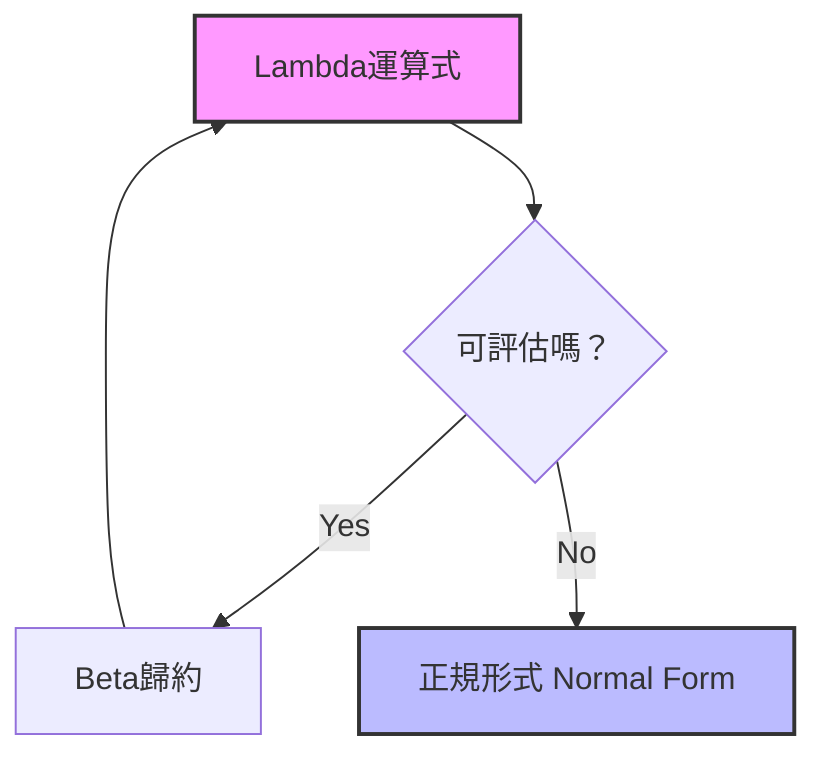
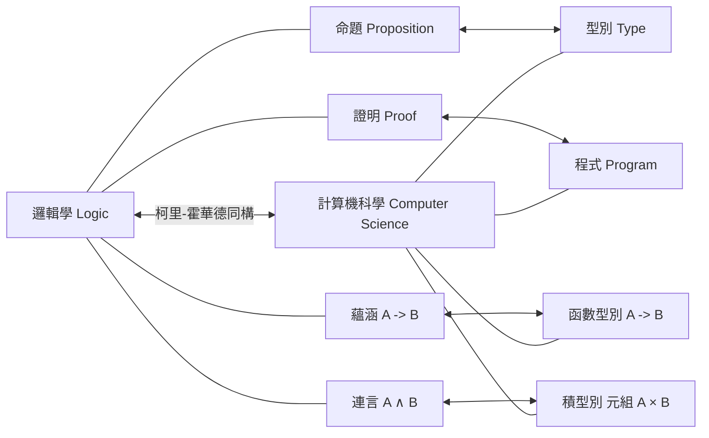

## 1. 簡介：流淌在函數式編程根基的哲學

在現代軟體開發中， **函數式編程** （[Functional Programming](https://kenji.blog/zh-tw/p/oop-vs-fp-vs-dop/)）早已不再是少數狂熱者的方法，而是成為了廣泛普及的範式。從React等前端技術，到[Rust](https://kenji.blog/zh-tw/p/webassembly-wasm-current-future/)、Scala，甚至Java與C#等物件導向語言，都引入了將函數視為一等公民（第一級物件）的處理方式以及消除副作用等概念。

然而，在這個範式的背後，存在著在電腦實體誕生之前的1930年代所建構的深奧數學理論。那就是由阿隆佐·邱奇（Alonzo Church）所提出的 **Lambda演算** （ $\lambda$-calculus ）。

本文將從Lambda演算的基礎理論開始，詳細探討它是如何影響早期的程式語言 **Lisp** ，並最終演變至純函數式語言 **Haskell** ，經歷了怎樣的歷史與理論發展。

## 2. Lambda演算的誕生：阿隆佐·邱奇與計算的定義

### 2.1 挑戰判定問題（Entscheidungsproblem）

1928年，數學家大衛·希爾伯特提出了「判定問題（Entscheidungsproblem）」。這是一個提問：「當給定一個數學命題時，是否存在一個演算法能機械性地判定它是真還是偽？」

為了解答這個問題，首先必須嚴格定義「可計算」或「存在演算法」究竟是什麼意思。1936年，有兩位天才獨立對這個問題給出了答案。一位是艾倫·圖靈，另一位則是圖靈的指導教授阿隆佐·邱奇。

圖靈使用名為「圖靈機」的虛擬機器模型展示了計算的極限。另一方面，邱奇則用 **Lambda演算** 這種純粹符號學的方法定義了可計算性。令人驚訝的是，這兩種透過完全不同方法定義的模型，在計算能力上被證明是完全等價的（邱奇-圖靈論題）。

### 2.2 Lambda演算的基礎語法

Lambda演算的世界非常簡單。它只擁有變數定義、函數抽象化，以及函數應用這三個元素。

$$
E ::= x \mid (\lambda x. E) \mid (E_1 \ E_2)
$$

- $x$ : **變數** (Variable)
- $\lambda x. E$ : **抽象化** (Abstraction) - 定義一個接受參數 $x$ 並返回表達式 $E$ 的函數。
- $E_1 \ E_2$ : **函數應用** (Application) - 將函數 $E_1$ 應用於參數 $E_2$ 。

例如，恆等函數（將接收到的參數原封不動返回的函數）在Lambda演算中會如下描述：

$$
\lambda x. x
$$

## 3. Lambda演算的運算規則

在Lambda演算中，為了評估（歸約）表達式，制定了嚴格的規則。主要的規則有 **Alpha轉換** 、 **Beta歸約** ，以及 **Eta轉換** 。

### 3.1 Alpha轉換（ $\alpha$ -conversion）

Alpha轉換是安全地更改綁定變數名稱的規則。由於函數中使用的變數名稱本身不具備實質意義，只要不與其他變數名稱衝突，就可以更改。

$$
\lambda x. x \equiv \lambda y. y
$$

### 3.2 Beta歸約（ $\beta$ -reduction）

Beta歸約就是Lambda演算中的「執行計算」本身。它指的是在應用函數時，將參數代入函數主體內變數的操作。

$$
(\lambda x. x \ y) \ z \rightarrow z \ y
$$

### 3.3 Eta轉換（ $\eta$ -conversion）

Eta轉換是表示函數外延性（extensionality）的概念。基於一個規則：對於所有參數都能返回相同結果的兩個函數是相等的。

$$
\lambda x. (f \ x) \equiv f
$$



## 4. 邱奇編碼：無中生有

在Lambda演算中，完全不存在內建的資料型別（如數值、布林值、串列等）。一切都只是函數。然而，邱奇展示了透過巧妙地組合函數，可以表達所有的資料結構與控制結構。這被稱為 **邱奇編碼** （Church Encoding）。

### 4.1 布林值（邱奇布林值）

真（True）與偽（False）被定義為接收兩個參數，並返回其中一個的函數。

- **TRUE** : $\lambda x. \lambda y. x$ （返回第一個參數）
- **FALSE** : $\lambda x. \lambda y. y$ （返回第二個參數）

使用這個，相當於IF敘述的條件分支可以單純地表示為函數應用。

- **IF** : $\lambda p. \lambda x. \lambda y. p \ x \ y$

### 4.2 數值（邱奇數）

自然數也可以用函數表示。在邱奇數中，數字 $n$ 被定義為「將某個函數 $f$ 對參數 $x$ 應用 $n$ 次的高階函數」。

- **0** : $\lambda f. \lambda x. x$
- **1** : $\lambda f. \lambda x. f \ x$
- **2** : $\lambda f. \lambda x. f \ (f \ x)$
- **3** : $\lambda f. \lambda x. f \ (f \ (f \ x))$

後繼函數（SUCC : 將給定數字加1的函數）定義如下：

- **SUCC** : $\lambda n. \lambda f. \lambda x. f \ (n \ f \ x)$

讓我們用Python程式碼來模擬這個概念。

```python
# 用Python表示邱奇數
ZERO  = lambda f: lambda x: x
ONE   = lambda f: lambda x: f(x)
TWO   = lambda f: lambda x: f(f(x))

# 後繼函數（Successor）
SUCC  = lambda n: lambda f: lambda x: f(n(f)(x))

# 加法
ADD   = lambda m: lambda n: lambda f: lambda x: m(f)(n(f)(x))

# 將邱奇數轉換為普通Python整數的輔助函數
def to_int(church_numeral):
    return church_numeral(lambda x: x + 1)(0)

print(to_int(TWO)) # 輸出: 2
print(to_int(ADD(TWO)(SUCC(TWO)))) # 2 + 3 = 5
```

## 5. 不動點組合子與圖靈完備性

在Lambda演算中，函數是沒有名稱的（匿名函數）。那麼，究竟該如何實現遞迴呼叫呢？解決這個問題的是 **不動點組合子** （Fixed-point combinator），特別是著名的 **Y組合子** 。

$$
Y = \lambda f. (\lambda x. f \ (x \ x)) \ (\lambda x. f \ (x \ x))
$$

Y組合子對任意函數 $f$ 滿足 $Y \ f = f \ (Y \ f)$ 。利用這個特性，可以將遞迴結構表示為對函數自身的應用，從而能在Lambda演算的框架內處理電腦的無限迴圈與遞迴。這證明了Lambda演算具備圖靈完備性。

## 6. Lisp的誕生：從理論到程式語言

在1950年代後半，約翰·麥卡錫（John McCarthy）為了人工智慧的研究，正在設計一種新的程式語言。他從邱奇的Lambda演算中獲得靈感，開發了一種直接支援函數抽象化與遞迴的語言。這就是 **Lisp** （LISt Processing）。

Lisp最大的特色在於，程式碼本身被表示為資料（串列）（同像性：Homoiconicity），並且可以透過 `lambda` 關鍵字來定義匿名函數。

```lisp
;; 在Lisp中定義函數與高階函數的範例
(define (square x) (* x x))

;; 將Lambda運算式傳遞給map函數
(map (lambda (x) (* x x)) '(1 2 3 4 5))
;; 結果: (1 4 9 16 25)
```

Lisp是動態型別，雖然並不完全等同於理論上的Lambda演算，但它成為了在現實的電腦上實現「將函數視為資料處理」「將計算視為函數評估」等函數式編程精神的第一個偉大里程碑。

## 7. 具型別Lambda演算與柯里-霍華德同構

純粹的Lambda演算（無型別Lambda演算）非常強大，但因為任何函數都可以傳遞任何參數，有可能引發自我應用造成的悖論（例如：羅素悖論）。為了防止這種情況，邱奇後來引入了 **簡單型別Lambda演算** （Simply Typed Lambda Calculus）。

### 7.1 柯里-霍華德同構

隨著型別理論的發展，人們在計算機科學與邏輯學之間發現了令人驚訝的對應關係。這就是 **柯里-霍華德同構** （Curry-Howard Correspondence）。

- **型別（Types）** 對應於 **命題（Propositions）** 。
- **程式（Programs）** 對應於 **證明（Proofs）** 。
- **函數的評估（Evaluation）** 對應於 **證明的簡化（Proof simplification）** 。



這個強大的數學基礎，後來演變為透過型別系統保證程式正確性的方法，並為現代的靜態型別函數式語言開闢了道路。

## 8. Haskell的登場與純函數式編程的頂點

在1980年代後半，函數式語言的研究者們成立了一個委員會，旨在建立一種標準化的基於惰性求值的純函數式語言。這就是冠以邏輯學家哈斯凱爾·柯里（Haskell Curry）之名的 **Haskell** 的誕生。

### 8.1 惰性求值（Lazy Evaluation）

Haskell預設採用 **惰性求值** ，亦即表達式在真正需要其值之前不會被評估。這使得無限串列等概念得以自然地表達。這對應於Lambda演算中的「正常順序歸約（Normal-order reduction）」。

```haskell
-- Haskell中無限串列的範例
-- 從1開始的所有自然數串列
naturals :: [Integer]
naturals = [1..]

-- 取得前10個偶數
firstTenEvens :: [Integer]
firstTenEvens = take 10 (map (*2) naturals)
```

### 8.2 單子（Monads）與副作用的管理

在純函數式語言中，如何在保持數學純粹性（參照透明性）的同時，處理輸入輸出或狀態變化等「副作用（Side Effects）」，一直是一個長期的課題。Haskell透過引入範疇論（Category Theory）的概念—— **單子** （Monad），優雅地解決了這個問題。

透過IO單子，成功地在型別系統層面上將「計算」與「伴隨副作用的執行」完全分離。

## 9. 總結：從數學到軟體工程

阿隆佐·邱奇在1930年代僅憑紙筆描繪的 **Lambda演算** ，絕不是過時的理論。它從與圖靈機不同的角度重新審視了「計算是什麼」，並透過Lisp被釋放到可程式化的世界。然後，經過與邏輯學完美結合的柯里-霍華德同構，最終結出了如Haskell這樣具備堅固且強大型別系統的現代語言之果實。

今天，當我們在React中使用 `map` 或 `filter` ，在[Rust](https://kenji.blog/zh-tw/p/webassembly-wasm-current-future/)中活用代數資料型別，或是在Python中撰寫Lambda表達式時，我們都受惠於邱奇偉大的智慧遺產。

函數式編程不僅僅是一種編碼風格，更是 **直逼計算本身本質的數學哲學** 。
