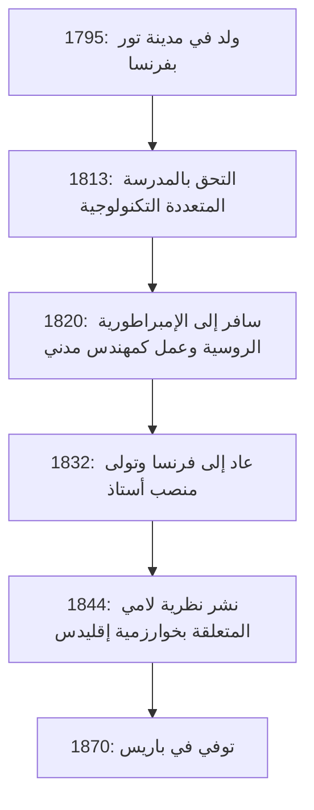
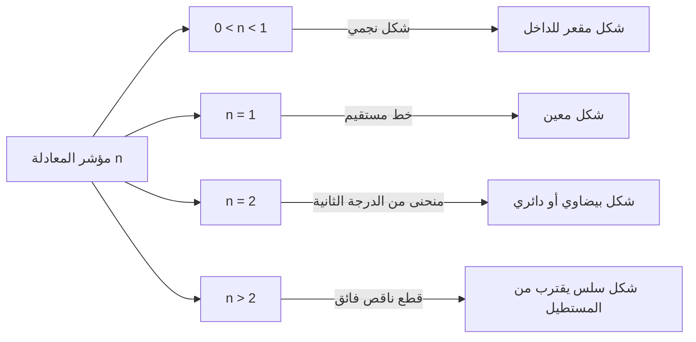

## 1. مقدمة: من هو [غابرييل لامي](https://kenji.blog/ar/p/lame/)؟

كان [غابرييل لامي](https://kenji.blog/ar/p/lame/) ([Gabriel Lamé](https://kenji.blog/ar/p/lame/)، 22 يوليو 1795 - 1 مايو 1870) عالم رياضيات، وفيزيائيًا، ومهندسًا فرنسيًا بارزًا في القرن التاسع عشر. امتدت إسهاماته بشكل واسع من الرياضيات البحتة إلى الرياضيات التطبيقية، وصولاً إلى الهندسة المدنية العملية. حتى يومنا هذا، حُفر اسمه بعمق في الكتب المدرسية للرياضيات والفيزياء من خلال **منحنى لامي** (القطع الناقص الفائق)، و**نظرية لامي** في [خوارزمية [إقليدس](https://kenji.blog/ar/p/euclid/)](https://kenji.blog/p/euclidean-algorithm/)، و**ثوابت لامي** في نظرية المرونة.

في هذا المقال، سنتتبع مسار حياة لامي الحافلة بالأحداث ونشرح بشكل تفصيلي ومنهجي إنجازاته الرائدة. يوفر فهم حياة لامي وعملية تفكيره منظورًا قيمًا جدًا لفهم كيف أرست علوم القرن التاسع عشر الأساس للعصر الحديث.

## 2. حياة ومسيرة [غابرييل لامي](https://kenji.blog/ar/p/lame/)

ترتبط حياة لامي ارتباطًا وثيقًا بالمجتمع الأوروبي المضطرب في أوائل القرن التاسع عشر. لم تقتصر مسيرته المهنية على البرج العاجي الأكاديمي، بل كانت مدعومة بخبرة عملية قاسية في الميدان.

### 2.1 الولادة والتعليم في أوقات مضطربة

ولد [غابرييل لامي](https://kenji.blog/ar/p/lame/) في عام 1795 في مدينة تور بوسط فرنسا. كانت تلك الحقبة في أعقاب الثورة الفرنسية، حيث كان المجتمع بأسره يمر بتحول كبير. أظهر موهبة رياضية في سن مبكرة، والتحق بالمدرسة المرموقة **المدرسة المتعددة التكنولوجية** (École Polytechnique) في عام 1813. هناك، تنافس مع العديد من العقول اللامعة التي قادت العالم العلمي لاحقًا. بعد التخرج، التحق بـ **المدرسة الوطنية العليا للمناجم** (École des Mines) لتعميق معرفته الهندسية العملية.

### 2.2 العمل في روسيا: الممارسة كمهندس

في عام 1820، جاءت نقطة تحول رئيسية في حياة لامي. سافر إلى سانت بطرسبرغ تلبية لدعوة من الإمبراطورية الروسية مع زميله وصديقه المقرب إميل كلابيرون (Émile Clapeyron). في ذلك الوقت، كانت روسيا تسارع لتحديث بنيتها التحتية وكانت بحاجة إلى مهندسين مهرة.

خلال إقامته في روسيا، عمل لامي كمهندس مدني في العديد من المشاريع الوطنية مثل تصميم الجسور وبناء الطرق. وعلى وجه الخصوص، طبق معرفته الرياضية المتقدمة بشكل مباشر في تصميم الجسور المعلقة على الأنهار في سانت بطرسبرغ. هذه التجربة العملية الميدانية كان لها تأثير عميق على أبحاثه اللاحقة في الفيزياء والرياضيات التطبيقية.



### 2.3 العودة إلى فرنسا والمجد الأكاديمي

في عام 1832، بعد 12 عامًا من العمل في روسيا، عاد لامي إلى فرنسا. وبعد عودته، أصبح أستاذًا للفيزياء في جامعته الأم، المدرسة المتعددة التكنولوجية. كما قام بالتدريس في جامعة السوربون (جامعة باريس)، وكرس نفسه لتدريب العديد من الخلفاء. وفي عام 1843، تقديراً لإنجازاته العظيمة، تم انتخابه عضواً في الأكاديمية الفرنسية للعلوم.

## 3. إسهاماته في الرياضيات: منحنى لامي (القطع الناقص الفائق)

أحد المساهمات الأكثر وضوحًا وشهرة للامي في الرياضيات البحتة هو دراسته للأشكال الهندسية المعروفة باسم **منحنيات لامي** (Lamé curves) أو **القطع الناقص الفائق** (Superellipse).

### 3.1 المعادلة وتنوع الأشكال

يتم تعريف منحنى لامي من خلال المعادلة التالية في نظام الإحداثيات الديكارتية:

$$ \left| \frac{x}{a} \right|^n + \left| \frac{y}{b} \right|^n = 1 $$

هنا، $a$ و $b$ هما أرقام حقيقية موجبة تحدد عرض المنحنى وارتفاعه، و $n$ هو رقم حقيقي موجب (الأس) يحدد شكل المنحنى. يتغير شكل منحنى لامي تمامًا بناءً على قيمة $n$.

- إذا كان $n = 2$، فإن هذا يتطابق مع معادلة **القطع الناقص** العادي. وإذا كان $a = b$ فإنه يصبح **دائرة**.
- إذا كان $n < 1$، يصبح المنحنى على شكل نجمة مقعرة للداخل (شكل كويكب).
- إذا كان $n = 1$، فإنه يصبح **معينًا** يربط كل ربع بخط مستقيم.
- إذا كان $n > 2$، يقترب المنحنى تدريجيًا من مستطيل. خاصة عندما يقترب $n$ من اللانهاية، يصبح مستطيلًا مثاليًا.



### 3.2 التطبيقات الحديثة: من التصميم إلى الهندسة المعمارية

في القرن العشرين، تم تطبيق هذا المنحنى، الذي درسه لامي بدافع الاهتمام الرياضي البحت، على التخطيط الحضري والتصميم الصناعي من قبل المصمم الدنماركي بيت هاين. اليوم، يتم استخدامه في كل مكان كشكل يجمع بين الجمال والوظيفة، من أشكال أيقونات الهواتف الذكية، إلى تصميم الخطوط، وحتى الهياكل المعمارية الضخمة.

فيما يلي مثال لبرنامج بسيط يحسب إحداثيات منحنى لامي.

```python
import numpy as np

# دالة لحساب إحداثيات منحنى لامي
def calculate_lame_curve(a, b, n, num_points=100):
    """
    يقوم بإنشاء نقاط لمنحنى لامي بناءً على المعلمات المحددة.
    """
    points = []
    # تغيير الزاوية من 0 إلى 2π
    theta = np.linspace(0, 2 * np.pi, num_points)
    for t in theta:
        # حساب الإحداثيات باستخدام المعادلة البارامترية
        x = a * np.sign(np.cos(t)) * (np.abs(np.cos(t)) ** (2 / n))
        y = b * np.sign(np.sin(t)) * (np.abs(np.sin(t)) ** (2 / n))
        points.append((x, y))
    return points
```

## 4. إسهاماته في نظرية الأعداد: نظرية لامي و[خوارزمية [إقليدس](https://kenji.blog/ar/p/euclid/)](https://kenji.blog/p/euclidean-algorithm/)

في علوم الكمبيوتر ونظرية الأعداد، فإن ما جعل اسم لامي مشهورًا هو **نظرية لامي** (Lamé's Theorem). ومن المعروف أن هذا هو واحد من أقدم الأمثلة في التاريخ لتقييم التعقيد الحسابي (وقت التنفيذ) لخوارزمية بدقة رياضية.

### 4.1 نظرة عامة على النظرية وأهميتها

**[خوارزمية [إقليدس](https://kenji.blog/ar/p/euclid/)](https://kenji.blog/p/euclidean-algorithm/)**، التي تم تمريرها من اليونان القديمة، هي خوارزمية فعالة للعثور على القاسم المشترك الأكبر لعددين طبيعيين. ومع ذلك، حتى جاء لامي في عام 1844، لم يقم أحد بإثبات مدى سرعة انتهاء هذه الخوارزمية بدقة. تنص نظرية لامي على ما يلي:

> "عند العثور على القاسم المشترك الأكبر لعددين صحيحين باستخدام [خوارزمية [إقليدس](https://kenji.blog/ar/p/euclid/)](https://kenji.blog/p/euclidean-algorithm/)، فإن عدد القسمة (خطوات التنفيذ) المطلوبة لا يتجاوز أبدًا 5 أضعاف عدد الأرقام العشرية للرقم الأصغر."

يمكن التعبير عن ذلك رياضيًا على النحو التالي:

$$ \text{عدد الخطوات} \le 5 \times \text{عدد أرقام العدد الأصغر} $$

### 4.2 ارتباطه بسلسلة فيبوناتشي

في عملية إثبات هذه النظرية، اكتشف لامي أن الحالة الأسوأ (حيث يتطلب الأمر أكبر عدد من الخطوات) ل[خوارزمية [إقليدس](https://kenji.blog/ar/p/euclid/)](https://kenji.blog/p/euclidean-algorithm/) تحدث عندما يكون الرقمان المدخلان رقمين متتاليين من **أرقام فيبوناتشي**. من خلال الاستفادة من معدل نمو سلسلة فيبوناتشي وخصائص النسبة الذهبية، اشتق هذا الحد الأعلى الجميل. وبسبب هذا الإنجاز، يُعتبر لامي أحد "آباء نظرية التعقيد" في علوم الكمبيوتر الحديثة.

## 5. إسهاماته في الفيزياء: نظرية المرونة وثوابت لامي

قدم لامي، بخلفيته كمهندس مدني، مساهمات حاسمة في فيزياء قوة المواد وتشوهها، أي **نظرية المرونة**.

### 5.1 أساس ميكانيكا الأوساط المتصلة

في عام 1852، نشر لامي نظرية شاملة لوصف سلوك المواد المرنة الخواص (المواد التي لها نفس الخصائص الفيزيائية في كل الاتجاهات). لقد صاغ العلاقة بين الإجهاد والانفعال للمادة في مساحة ثلاثية الأبعاد باستخدام معاملين مستقلين فقط. تُعرف هذه اليوم بـ **ثوابت لامي** (Lamé parameters)، وهما $\lambda$ و $\mu$.

يوصف قانون هوك المعمم بشكل جميل باستخدام ثوابت لامي على النحو التالي:

$$ \sigma_{ij} = 2\mu \varepsilon_{ij} + \lambda \delta_{ij} \text{انفعال حجمي} $$

حيث يمثل $\sigma_{ij}$ موتر الإجهاد، ويمثل $\varepsilon_{ij}$ موتر الانفعال، ويمثل $\delta_{ij}$ دلتا كرونكر.

### 5.2 المعنى الفيزيائي والتطبيق في الهندسة

من بين الثابتين، يُسمى $\mu$ **معامل القص**، ويوضح مدى مقاومة المادة للتغيرات في الشكل. من ناحية أخرى، يُسمى $\lambda$ **معامل لامي الأول**، ورغم أن تفسيره الفيزيائي المباشر معقد بعض الشيء، إلا أنه يرتبط بمقاومة التغيرات في الحجم. باستخدام هذه الثوابت، أصبح من الممكن إجراء تحليلات ضرورية في الهندسة الحديثة والجيوفيزياء، مثل انتشار الموجات الزلزالية وحسابات الهياكل المعمارية.

## 6. إسهاماته في التحليل الرياضي: نظام الإحداثيات المنحنية ومعادلة الحرارة

إنجاز عظيم آخر للامي هو دراسته المنهجية لـ **أنظمة الإحداثيات المنحنية** (Curvilinear coordinates). في كتابه الذي نُشر عام 1859، أسس إطارًا رياضيًا عامًا للتعامل مع المعادلات التفاضلية في أنظمة الإحداثيات المختلفة (الأسطوانية، الكروية، والبيضاوية).

على وجه الخصوص، لحل **معادلة لابلاس** التي تصف التوصيل الحراري في الفضاء، أظهر أهمية اختيار نظام إحداثيات يناسب الظروف الحدودية المعقدة. **عوامل القياس** للامي (Scale factors) التي قدمها في هذه العملية تشكل أساس تحليل المتجهات والتحليل الموتري الحديث.

## 7. تحديه لنظرية فيرما الأخيرة والانتكاسة

كحادثة درامية في حياة لامي، يمكن ذكر محاولته لإثبات **نظرية فيرما الأخيرة** في عام 1847. في مارس من ذلك العام، أعلن لامي في الأكاديمية الفرنسية للعلوم أنه "أثبت نظرية فيرما الأخيرة بالكامل". كان إثباته نهجًا مبتكرًا للغاية من خلال تحليل المعادلة إلى عوامل باستخدام الأعداد المركبة الحلقية.

ومع ذلك، بعد إعلانه مباشرة، أشار زميله عالم الرياضيات جوزيف ليوفيل بحدة إلى أن "هذا الإثبات يعتمد على الافتراض الضمني بأن 'تفرد التحليل إلى العوامل الأولية' ينطبق أيضًا في عالم الأعداد المركبة، وهو أمر لم يتم إثباته". وفي وقت لاحق، وصلت رسالة من عالم الرياضيات الألماني [إرنست كومر](https://kenji.blog/ar/p/kummer/) تشير إلى أن "تفرد التحليل إلى عوامل أولية لا ينطبق بشكل عام"، مما جعل إثبات لامي باطلاً.

كانت هذه انتكاسة كبيرة للامي، ولكن هذه السلسلة من المناقشات أدت إلى ولادة نظرية "الأعداد المثالية" (المثل) لكومر، والتي فتحت حقلاً رياضياً كبيراً يُعرف لاحقاً باسم نظرية الأعداد الجبرية. وبالتالي، فإن تحدي لامي الجريء أدى في النهاية إلى تقدم كبير في تاريخ الرياضيات.

## 8. كتاباته وجانبه كمعلم

لم يكن لامي باحثًا فحسب، بل كان أيضًا معلمًا استثنائيًا. أسرت محاضراته في المدرسة المتعددة التكنولوجية وجامعة السوربون العديد من الطلاب بوضوحها وعرضها المنطقي. نشر العديد من الكتب المدرسية التي جمعت مذكرات محاضراته ونتائج أبحاثه، وتم اعتمادها كنصوص قياسية في جامعات جميع أنحاء أوروبا.

ومن أبرز أعماله "محاضرات حول النظرية الرياضية للمرونة" (1852) و"محاضرات حول الإحداثيات المنحنية وتطبيقاتها" (1859). ما يميز هذه الأعمال هو أن النظريات الرياضية المتقدمة لم تُترك كمجرد أفكار مجردة، بل كانت دائمًا مرتبطة بظواهر فيزيائية أو بحل مشكلات هندسية. كان لامي يؤمن إيماناً راسخاً بأن "الرياضيات هي اللغة التي تُكشف بها حقائق الطبيعة"، وقد انتقلت هذه الفلسفة التعليمية إلى أجيال العلماء اللاحقة.

في سنواته الأخيرة، عانى لامي من سوء الحظ وفقد سمعه، مما جعل التدريس أمراً صعباً، ولكنه لم يفقد أبداً شغفه بالبحث واستمر في الكتابة طوال حياته.

## 9. الخاتمة: ما تركه لامي للعصر الحديث

بالنظر إلى حياة [غابرييل لامي](https://kenji.blog/ar/p/lame/) وإنجازاته، يتضح تمامًا أنه استطاع الدمج ببراعة بين "الجمال المجرد للرياضيات البحتة" و"فائدة الرياضيات التطبيقية والفيزياء".

في شرفة الطابق الأول من برج إيفل، نُقشت أسماء 72 عالمًا عظيمًا ساهموا في العلوم والتكنولوجيا الفرنسية، واسم لامي (LAMÉ) محفور بكل فخر بينهم. النظريات، الثوابت، والأساليب المبتكرة التي تركها وراءه لا تزال حية حتى اليوم في طليعة العلوم والتكنولوجيا، بفضل المهندسين وعلماء الرياضيات الحديثين.
