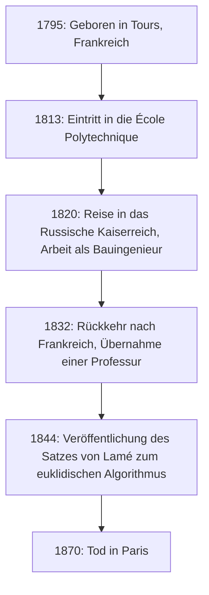
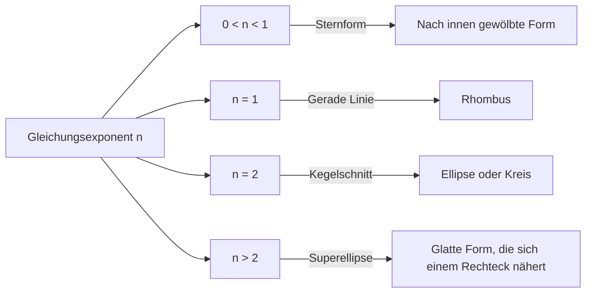

## 1. Einführung: Wer war [Gabriel Lamé](https://kenji.blog/de/p/lame/)?

[Gabriel Lamé](https://kenji.blog/de/p/lame/) (22. Juli 1795 – 1. Mai 1870) war ein herausragender französischer Mathematiker, Physiker und Ingenieur des 19. Jahrhunderts. Seine Beiträge erstreckten sich über ein breites Spektrum, von der reinen über die angewandte Mathematik bis hin zum praktischen Bauingenieurwesen. Noch heute ist sein Name durch die **Lamé-Kurve** (Superellipse), den **Satz von Lamé** im euklidischen Algorithmus und die **Lamé-Konstanten** in der Elastizitätstheorie tief in Mathematik- und Physikbüchern verankert.

In diesem Artikel werden wir die Spuren von Lamés turbulentem Leben verfolgen und seine zahlreichen bahnbrechenden mathematischen und physikalischen Errungenschaften detailliert und systematisch erläutern. Das Verständnis von Lamés Leben und seinen Denkprozessen bietet eine äußerst wertvolle Perspektive, um zu verstehen, wie die Wissenschaft des 19. Jahrhunderts den Grundstein für die Moderne legte.

## 2. Leben und Karriere von [Gabriel Lamé](https://kenji.blog/de/p/lame/)

Lamés Leben war eng mit der turbulenten europäischen Gesellschaft des frühen 19. Jahrhunderts verknüpft. Seine Karriere beschränkte sich nicht auf den akademischen Elfenbeinturm, sondern wurde von harten praktischen Erfahrungen vor Ort untermauert.

### 2.1 Geburt und Ausbildung in turbulenten Zeiten

[Gabriel Lamé](https://kenji.blog/de/p/lame/) wurde 1795 in der Stadt Tours in Zentralfrankreich geboren. Es war die Zeit der Nachwehen der Französischen Revolution, eine Zeit tiefgreifender Veränderungen in der gesamten Gesellschaft. Sein mathematisches Talent blühte früh auf, und 1813 trat er in die renommierte **École Polytechnique** ein. Dort wetteiferte er mit vielen brillanten Köpfen, die später die wissenschaftliche Welt anführen sollten. Nach seinem Abschluss besuchte er die **École des Mines**, um sein praktisches Ingenieurwissen zu vertiefen.

### 2.2 Wirken in Russland: Praxis als Ingenieur

1820 kam ein großer Wendepunkt in Lamés Leben. Zusammen mit seinem Kollegen und engen Freund Émile Clapeyron reiste er auf Einladung des Russischen Kaiserreichs nach Sankt Petersburg. Damals bemühte sich Russland um die Modernisierung seiner Infrastruktur und benötigte hochqualifizierte Ingenieure.

Während seines Aufenthalts in Russland arbeitete Lamé als Bauingenieur an zahlreichen nationalen Projekten wie der Konstruktion von Brücken und dem Straßenbau. Insbesondere bei der Konstruktion von Hängebrücken über die Flüsse in Sankt Petersburg wandte er sein fortgeschrittenes mathematisches Wissen direkt an. Diese praktischen Erfahrungen beeinflussten seine späteren Forschungen in Physik und angewandter Mathematik maßgeblich.



### 2.3 Rückkehr nach Frankreich und akademischer Ruhm

Nach zwölf Jahren Arbeit in Russland kehrte Lamé 1832 nach Frankreich zurück. Nach seiner Rückkehr wurde er Professor für Physik an seiner Alma Mater, der École Polytechnique. Er unterrichtete auch an der Sorbonne (Universität Paris) und widmete sich der Ausbildung zahlreicher Nachwuchswissenschaftler. 1843 wurde er in Anerkennung seiner großen Verdienste in die Französische Akademie der Wissenschaften aufgenommen.

## 3. Beiträge zur Mathematik: Lamé-Kurven (Superellipsen)

Einer der visuellsten und berühmtesten Beiträge Lamés zur reinen Mathematik ist seine Untersuchung der geometrischen Figuren, die als **Lamé-Kurven** oder **Superellipsen** bekannt sind.

### 3.1 Gleichung und Formenvielfalt

Die Lamé-Kurve ist durch die folgende Gleichung im kartesischen Koordinatensystem definiert:

$$ \left| \frac{x}{a} \right|^n + \left| \frac{y}{b} \right|^n = 1 $$

Hierbei sind $a$ und $b$ positive reelle Zahlen, die die Breite und Höhe der Kurve bestimmen, und $n$ ist eine positive reelle Zahl (Exponent), die die Form der Kurve bestimmt. Abhängig vom Wert von $n$ nimmt die Lamé-Kurve völlig unterschiedliche Formen an.

- Wenn $n = 2$, entspricht dies der Gleichung einer normalen **Ellipse**. Wenn $a = b$, wird es ein **Kreis**.
- Wenn $n < 1$, wird die Kurve zu einem nach innen gewölbten Stern (Asteroidenform).
- Wenn $n = 1$, wird es zu einem **Rhombus**, dessen Quadranten durch gerade Linien verbunden sind.
- Wenn $n > 2$, nähert sich die Kurve allmählich einem Rechteck an. Insbesondere wenn $n$ gegen Unendlich geht, wird es ein perfektes Rechteck.



### 3.2 Moderne Anwendungen: Vom Design zur Architektur

Diese Kurve, die Lamé aus reinem mathematischen Interesse untersuchte, wurde im 20. Jahrhundert von dem dänischen Designer Piet Hein auf Stadtplanung und Industriedesign angewandt. Heute wird sie überall als eine Form genutzt, die Schönheit und Funktionalität vereint, von Symbolformen für Smartphones über Schriftarten bis hin zu riesigen architektonischen Strukturen.

Hier ist ein einfaches Programmbeispiel, das die Koordinaten einer Lamé-Kurve berechnet.

```python
import numpy as np

# Funktion zur Berechnung der Koordinaten einer Lamé-Kurve
def calculate_lame_curve(a, b, n, num_points=100):
    """
    Generiert die Punkte einer Lamé-Kurve basierend auf den angegebenen Parametern.
    """
    points = []
    # Den Winkel von 0 bis 2π variieren
    theta = np.linspace(0, 2 * np.pi, num_points)
    for t in theta:
        # Koordinatenberechnung unter Verwendung von Parametergleichungen
        x = a * np.sign(np.cos(t)) * (np.abs(np.cos(t)) ** (2 / n))
        y = b * np.sign(np.sin(t)) * (np.abs(np.sin(t)) ** (2 / n))
        points.append((x, y))
    return points
```

## 4. Beiträge zur Zahlentheorie: Der Satz von Lamé und der euklidische Algorithmus

In der Informatik und Zahlentheorie machte der **Satz von Lamé** seinen Namen am bekanntesten. Dies ist bekannt als eines der frühesten Beispiele in der Geschichte für die mathematisch rigorose Bewertung der rechnerischen Komplexität (Ausführungszeit) eines Algorithmus.

### 4.1 Übersicht und Bedeutung des Satzes

Der **euklidische Algorithmus**, der seit dem antiken Griechenland überliefert ist, ist ein effizienter Algorithmus zur Bestimmung des größten gemeinsamen Teilers zweier natürlicher Zahlen. Es gab jedoch bis zu Lamé im Jahr 1844 niemanden, der genau bewies, "wie schnell" dieser Algorithmus endet. Der Satz von Lamé besagt Folgendes:

> "Bei der Bestimmung des größten gemeinsamen Teilers zweier ganzer Zahlen mit dem euklidischen Algorithmus übersteigt die Anzahl der erforderlichen Divisionen (Schritte) niemals das Fünffache der Anzahl der Dezimalstellen der kleineren Zahl."

In mathematischer Form ausgedrückt:

$$ \text{Anzahl der Schritte} \le 5 \times \text{Anzahl der Stellen der kleineren Zahl} $$

### 4.2 Tiefe Verbindung zur [Fibonacci](https://kenji.blog/de/p/fibonacci/)-Folge

Beim Beweis dieses Satzes entdeckte Lamé, dass der schlimmste Fall (also der mit den meisten Schritten) auftritt, wenn die Eingabe aus zwei aufeinanderfolgenden **[Fibonacci](https://kenji.blog/de/p/fibonacci/)-Zahlen** besteht. Durch die Nutzung der Wachstumsrate der [Fibonacci](https://kenji.blog/de/p/fibonacci/)-Folge und der Eigenschaften des Goldenen Schnitts leitete er diese elegante Obergrenze ab. Aufgrund dieser Leistung gilt Lamé als einer der "Väter der Komplexitätstheorie" in der modernen Informatik.

## 5. Beiträge zur Physik: Elastizitätstheorie und Lamé-Konstanten

Mit seinem Hintergrund als Bauingenieur leistete Lamé auch entscheidende Beiträge zur Physik von Festigkeit und Verformung von Materialien, der **Elastizitätstheorie**.

### 5.1 Grundlagen der Kontinuumsmechanik

1852 veröffentlichte Lamé eine umfassende Theorie zur Beschreibung des Verhaltens isotroper elastischer Körper (Materialien mit denselben physikalischen Eigenschaften in alle Richtungen). Er formulierte die Beziehung zwischen Spannung (Stress) und Dehnung (Strain) in einem dreidimensionalen Raum unter Verwendung von nur zwei unabhängigen Parametern. Diese sind heute als **Lamé-Konstanten** (Lamé parameters) $\lambda$ und $\mu$ bekannt.

Das verallgemeinerte Hookesche Gesetz wird mithilfe der Lamé-Konstanten auf elegante Weise wie folgt beschrieben:

$$ \sigma_{ij} = 2\mu \varepsilon_{ij} + \lambda \delta_{ij} \text{Volumendehnung} $$

Hierbei repräsentiert $\sigma_{ij}$ den Spannungstensor, $\varepsilon_{ij}$ den Dehnungstensor und $\delta_{ij}$ das Kronecker-Delta.

### 5.2 Physikalische Bedeutung und ingenieurtechnische Anwendung

Von den beiden Konstanten wird $\mu$ als **Schermodul** bezeichnet und gibt an, wie stark das Material einer Formänderung widersteht. Andererseits wird $\lambda$ als **erste Lamé-Konstante** bezeichnet. Obwohl ihre direkte physikalische Interpretation etwas komplexer ist, hängt sie mit dem Widerstand gegen Volumenänderungen zusammen. Die Verwendung dieser Konstanten ermöglichte wesentliche Analysen in der modernen Ingenieurwissenschaft und Geophysik, wie die Berechnung der Ausbreitung seismischer Wellen (P-Wellen- und S-Wellen-Geschwindigkeiten) sowie strukturelle Berechnungen von Brücken und Gebäuden.

## 6. Beiträge zur Analysis: Krummlinige Koordinatensysteme und die Wärmeleitungsgleichung

Eine weitere großartige Leistung Lamés ist das systematische Studium **krummliniger Koordinatensysteme** (Curvilinear coordinates). In seinem 1859 veröffentlichten Buch etablierte er einen allgemeinen mathematischen Rahmen zur Behandlung von Differentialgleichungen nicht nur in kartesischen, sondern auch in zylindrischen, sphärischen und sogar elliptischen Koordinatensystemen.

Insbesondere bei der Lösung der **Laplace-Gleichung**, die das Phänomen der Wärmeleitung im Raum beschreibt, zeigte er auf, wie wichtig die Wahl eines Koordinatensystems ist, das an komplexe Randbedingungen (z. B. ellipsoidale Körper) angepasst ist. Die **Laméschen Skalenfaktoren** (Scale factors), die er in diesem Prozess einführte, bilden die Grundlage der modernen Vektor- und Tensoranalysis.

## 7. Die Herausforderung und der Rückschlag bei Fermats Letztem Satz

Eine dramatische Episode im Leben Lamés war sein Versuch von 1847, **Fermats Letzten Satz** zu beweisen. Im März desselben Jahres verkündete Lamé vor der Französischen Akademie der Wissenschaften mit großem Pomp, er habe "Fermats Letzten Satz vollständig bewiesen". Sein Beweis war ein zu dieser Zeit äußerst innovativer und leistungsstarker Ansatz, der die Faktorisierung von Gleichungen mithilfe komplexer Zahlen zyklotomischer Körper umfasste.

Unmittelbar nach seiner Präsentation wies sein Kollege und Mathematiker Joseph Liouville jedoch scharfsinnig darauf hin, dass "dieser Beweis auf der stillschweigenden Annahme beruht, dass die 'Eindeutigkeit der Primfaktorzerlegung' auch im Bereich der komplexen Zahlen gilt, was jedoch nicht bewiesen ist." Kurze Zeit später traf ein Brief des deutschen Mathematikers [Ernst Kummer](https://kenji.blog/de/p/kummer/) ein, in dem er aufzeigte, dass "die Eindeutigkeit der Primfaktorzerlegung im Allgemeinen nicht gilt", womit Lamés Beweis endgültig widerlegt war.

Dies war ein großer Rückschlag für Lamé, aber diese Reihe von Diskussionen führte zur Entstehung von Kummers Theorie der "idealen Zahlen" (Ideale), die später ein riesiges neues Feld der Mathematik eröffnete: die algebraische Zahlentheorie. Lamés kühne Herausforderung trieb somit die Geschichte der Mathematik erheblich voran.

## 8. Schriften und die Rolle als Pädagoge

Lamé war nicht nur ein Forscher, sondern besaß auch außergewöhnliches Talent als Pädagoge. Seine Vorlesungen an der École Polytechnique und der Sorbonne faszinierten viele Studenten durch ihre Klarheit und logische Entwicklung. Er veröffentlichte zahlreiche Lehrbücher, in denen er seine Vorlesungsnotizen und Forschungsergebnisse zusammenfasste, und diese wurden als Standardwerke an Universitäten in ganz Europa übernommen.

Zu seinen wichtigsten Werken gehören "Vorlesungen über die mathematische Theorie der Elastizität" (1852) und "Vorlesungen über krummlinige Koordinaten und ihre Anwendungen" (1859). Das Besondere an diesen Werken ist, dass er fortgeschrittene mathematische Theorien nie im Abstrakten beließ, sondern sie stets im Zusammenhang mit physikalischen Phänomenen oder der Lösung ingenieurtechnischer Probleme erklärte. Lamé vertrat fest den Glauben, dass "Mathematik die Sprache ist, um die Wahrheiten der Natur zu entschlüsseln", und seine pädagogische Philosophie wurde an nachfolgende Generationen von Wissenschaftlern weitergegeben.

In seinen späteren Jahren erlitt Lamé das Unglück, sein Gehör zu verlieren, was ihm das Unterrichten erschwerte. Dennoch verlor er nie seine Leidenschaft für die Forschung und schrieb bis an sein Lebensende weiter.

## 9. Fazit: Lamés Erbe für die Moderne

Wenn man auf das Leben und die Leistungen von [Gabriel Lamé](https://kenji.blog/de/p/lame/) zurückblickt, wird deutlich, dass er "die abstrakte Schönheit der reinen Mathematik" und "die Nützlichkeit der angewandten Mathematik und Physik" perfekt miteinander verschmolz.

Auf dem Balkon im ersten Stock des Eiffelturms sind die Namen von 72 großen Wissenschaftlern eingraviert, die zur französischen Wissenschaft und Technologie beigetragen haben, und unter ihnen prangt stolz der Name Lamé (LAMÉ). Die von ihm hinterlassenen Theoreme, Konstanten und innovativen Ansätze leben noch heute an der Spitze von Wissenschaft und Technologie durch die Hände moderner Ingenieure und Mathematiker weiter.
