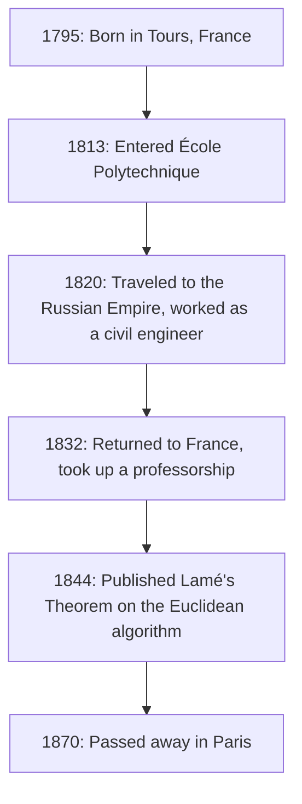
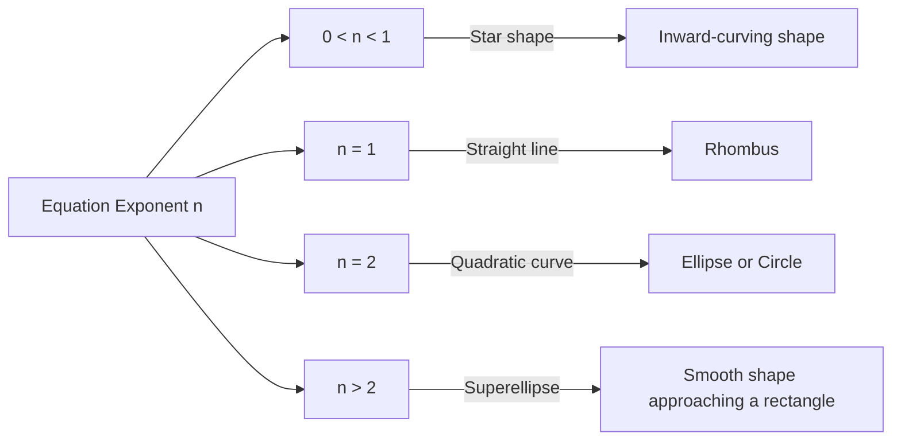

## 1. Introduction: Who was [Gabriel Lamé](https://kenji.blog/p/lame/)?

[Gabriel Lamé](https://kenji.blog/p/lame/) (July 22, 1795 – May 1, 1870) was a prominent French mathematician, physicist, and engineer of the 19th century. His contributions spanned a vast range, from pure mathematics to applied mathematics, and even practical civil engineering. Today, his name remains deeply etched in mathematics and physics textbooks through the **Lamé curve** (superellipse), **Lamé's Theorem** in the [[Euclid](https://kenji.blog/p/euclid/)e](https://kenji.blog/p/euclid/)an algorithm, and the **Lamé parameters** in the theory of elasticity.

In this article, we will trace the eventful trajectory of Lamé's life while comprehensively and systematically explaining the groundbreaking mathematical and physical achievements he left behind. Understanding his life and thought processes provides a highly valuable perspective on how 19th-century science laid the foundations for the modern era.

## 2. Life and Career of [Gabriel Lamé](https://kenji.blog/p/lame/)

Lamé's life was deeply intertwined with the turbulent European society of the early 19th century. His career was not confined to an academic ivory tower but was grounded in harsh practical experiences in the field.

### 2.1 Birth and Education in Turbulent Times

[Gabriel Lamé](https://kenji.blog/p/lame/) was born in 1795 in the city of Tours in central France. This was the aftermath of the French Revolution, a period when society as a whole was undergoing massive transformation. His mathematical talent blossomed early, and in 1813 he entered the prestigious **École Polytechnique**. There, he competed and studied alongside many brilliant minds who would later lead the scientific world. After graduating, he furthered his practical engineering knowledge at the **École des Mines**.

### 2.2 Work in Russia: Practice as an Engineer

In 1820, a major turning point occurred in Lamé's life. Along with his colleague and close friend Émile Clapeyron, he accepted an invitation from the Russian Empire and traveled to Saint Petersburg. At the time, Russia was rushing to modernize its infrastructure and needed skilled engineers.

During his stay in Russia, Lamé worked as a civil engineer on numerous national projects, including designing bridges and building roads. In particular, his advanced mathematical knowledge was directly applied in the design of suspension bridges crossing the rivers of Saint Petersburg. This practical field experience profoundly influenced his later research in physics and applied mathematics.



### 2.3 Return to France and Academic Glory

In 1832, after 12 years of working in Russia, Lamé returned to France. Upon his return, he became a physics professor at his alma mater, the École Polytechnique. He also taught at the Sorbonne (University of Paris), dedicating himself to training many future generations. In 1843, in recognition of his tremendous achievements, he was elected a member of the French Academy of Sciences.

## 3. Contributions to Mathematics: Lamé Curves (Superellipse)

One of Lamé's most visual and famous contributions to pure mathematics is his study of geometric figures known as **Lamé curves**, or **superellipses**.

### 3.1 Equation and Diversity of Shapes

A Lamé curve is defined by the following equation in the Cartesian coordinate system:

$$ \left| \frac{x}{a} \right|^n + \left| \frac{y}{b} \right|^n = 1 $$

Here, $a$ and $b$ are positive real numbers determining the curve's width and height, and $n$ is a positive real number (exponent) that determines the shape of the curve. Depending on the value of $n$, the Lamé curve takes on completely different shapes.

- If $n = 2$, this matches the equation of a standard **ellipse**. If $a = b$, it becomes a **circle**.
- If $n < 1$, the curve becomes an inward-curving star shape (astroid-like).
- If $n = 1$, it becomes a **rhombus** connecting each quadrant with straight lines.
- If $n > 2$, the curve gradually approaches a rectangle. Especially as $n$ approaches infinity, it becomes a perfect rectangle.



### 3.2 Modern Applications: From Design to Architecture

This curve, studied by Lamé out of pure mathematical interest, was applied to urban planning and industrial design in the 20th century by Danish designer Piet Hein. Today, it is used everywhere as a shape that combines beauty and practicality—from smartphone icon shapes and font designs to massive architectural structures.

Below is an example of a simple program that calculates the coordinates of a Lamé curve.

```python
import numpy as np

# Function to calculate the coordinates of a Lamé curve
def calculate_lame_curve(a, b, n, num_points=100):
    """
    Generates points for a Lamé curve based on specified parameters.
    """
    points = []
    # Vary the angle from 0 to 2π
    theta = np.linspace(0, 2 * np.pi, num_points)
    for t in theta:
        # Coordinate calculation using parametric equations
        x = a * np.sign(np.cos(t)) * (np.abs(np.cos(t)) ** (2 / n))
        y = b * np.sign(np.sin(t)) * (np.abs(np.sin(t)) ** (2 / n))
        points.append((x, y))
    return points
```

## 4. Contributions to Number Theory: Lamé's Theorem and the [[Euclid](https://kenji.blog/p/euclid/)e](https://kenji.blog/p/euclid/)an Algorithm

In computer science and number theory, what makes Lamé's name most famous is **Lamé's Theorem**. This is known as one of the earliest examples in history of mathematically and rigorously evaluating the computational complexity (execution time) of an algorithm.

### 4.1 Overview and Significance of the Theorem

The **[[Euclid](https://kenji.blog/p/euclid/)e](https://kenji.blog/p/euclid/)an algorithm**, passed down from ancient Greece, is an efficient algorithm for finding the greatest common divisor of two natural numbers. However, until Lamé in 1844, no one had accurately proven exactly "how fast" this algorithm finishes. Lamé's theorem states the following:

> "When finding the greatest common divisor of two integers using the [[Euclid](https://kenji.blog/p/euclid/)e](https://kenji.blog/p/euclid/)an algorithm, the number of required divisions (steps) never exceeds 5 times the number of decimal digits of the smaller number."

Expressed as a formula, it is:

$$ \text{Number of steps} \le 5 \times \text{Number of digits of the smaller number} $$

### 4.2 Deep Connection with the Fibonacci Sequence

In the process of proving this theorem, Lamé discovered that the worst-case scenario (meaning the one taking the most steps) for the [[Euclid](https://kenji.blog/p/euclid/)e](https://kenji.blog/p/euclid/)an algorithm occurs when the inputs are two consecutive **Fibonacci numbers**. By utilizing the growth rate of the Fibonacci sequence and the properties of the golden ratio, he derived this beautiful upper bound. Due to this achievement, Lamé is considered one of the "fathers of complexity theory" in modern computer science.

## 5. Contributions to Physics: Elasticity Theory and Lamé Parameters

With his background as a civil engineer, Lamé also made decisive contributions to the physics of material strength and deformation, namely the **theory of elasticity**.

### 5.1 Foundation of Continuum Mechanics

In 1852, Lamé published a comprehensive theory for describing the behavior of isotropic elastic bodies (materials with the same physical properties in all directions). He formulated the relationship between stress and strain in a three-dimensional space using just two independent parameters. These are known today as the **Lamé parameters**, $\lambda$ and $\mu$.

The generalized Hooke's law is beautifully described using Lamé parameters as follows:

$$ \sigma_{ij} = 2\mu \varepsilon_{ij} + \lambda \delta_{ij} \text{Volumetric strain} $$

Here, $\sigma_{ij}$ represents the stress tensor, $\varepsilon_{ij}$ represents the strain tensor, and $\delta_{ij}$ represents the Kronecker delta.

### 5.2 Physical Meaning and Engineering Applications

Of the two constants, $\mu$ is called the **shear modulus**, indicating how strongly a material resists changes in shape. On the other hand, $\lambda$ is called **Lamé's first parameter**. While its direct physical interpretation is somewhat complex, it is related to resistance against volume changes. By using these parameters, essential analyses in modern engineering and geophysics became possible, such as calculating the propagation of seismic waves (P-wave and S-wave speeds) and structural calculations for bridges and buildings.

## 6. Contributions to Analysis: Curvilinear Coordinates and the Heat Equation

Another of Lamé's great achievements is his systematic study of **curvilinear coordinates**. In his book published in 1859, he established a general mathematical framework for handling differential equations not only in Cartesian coordinates but also in cylindrical, spherical, and even ellipsoidal coordinates.

In particular, to solve **Laplace's equation**, which describes heat conduction phenomena in space, he demonstrated the importance of choosing a coordinate system tailored to complex boundary conditions (such as ellipsoidal objects). The **Lamé scale factors** he introduced in this process form the foundation of modern vector calculus and tensor analysis.

## 7. Challenge and Setback with [Fermat's Last Theorem](https://kenji.blog/p/fermats-last-theorem/)

A dramatic episode in Lamé's life was his attempt to prove **[Fermat's Last Theorem](https://kenji.blog/p/fermats-last-theorem/)** in 1847. In March of that year, Lamé proudly announced at the French Academy of Sciences that he had "completely proven [Fermat's Last Theorem](https://kenji.blog/p/fermats-last-theorem/)." His proof involved a highly innovative and powerful approach for the time: factoring the equation using cyclotomic complex numbers.

However, immediately after his presentation, his colleague, mathematician Joseph Liouville, sharply pointed out that "the proof rests on the unproven, tacit assumption that 'unique prime factorization' also holds in the realm of complex numbers." Shortly after, a letter arrived from German mathematician [Ernst Kummer](https://kenji.blog/p/kummer/) indicating that "unique prime factorization does not generally hold," effectively rendering Lamé's proof invalid.

This was a major setback for Lamé, but this series of discussions sparked the birth of Kummer's theory of "ideal numbers" (ideals), which later opened up the massive mathematical field of algebraic number theory. Lamé's bold challenge ultimately pushed the history of mathematics significantly forward.

## 8. Writings and Role as an Educator

Lamé was not only a researcher but also exceptionally talented as an educator. His lectures at the École Polytechnique and the Sorbonne captivated many students with their clarity and logical progression. He published numerous textbooks compiling his lecture notes and research findings, which were adopted as standard texts in universities across Europe.

Notable works include "Lectures on the Mathematical Theory of Elasticity" (1852) and "Lectures on Curvilinear Coordinates and their Applications" (1859). A defining feature of these works is that he never left advanced mathematical theories in the abstract; he always explained them by connecting them to physical phenomena or engineering problem-solving. Lamé firmly believed that "mathematics is the language for unlocking the truths of nature," and his educational philosophy was deeply inherited by subsequent generations of scientists.

In his later years, Lamé suffered the misfortune of losing his hearing, which made teaching difficult. Even so, he never lost his passion for research and continued his writing activities throughout his life.

## 9. Conclusion: What Lamé Left for the Modern Era

Looking back on the life and achievements of [Gabriel Lamé](https://kenji.blog/p/lame/), it is clear that he perfectly fused the "abstract beauty of pure mathematics" with the "utility of applied mathematics and physics."

On the first-floor balcony of the Eiffel Tower, the names of 72 great scientists who contributed to French science and technology are engraved, and among them proudly stands the name Lamé (LAMÉ). The theorems, constants, and innovative approaches he left behind continue to live on today at the cutting edge of science and technology, in the hands of modern engineers and mathematicians.
