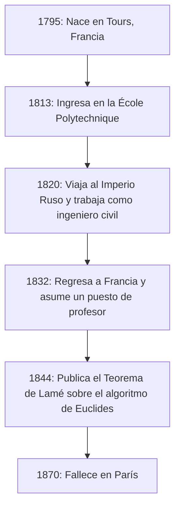
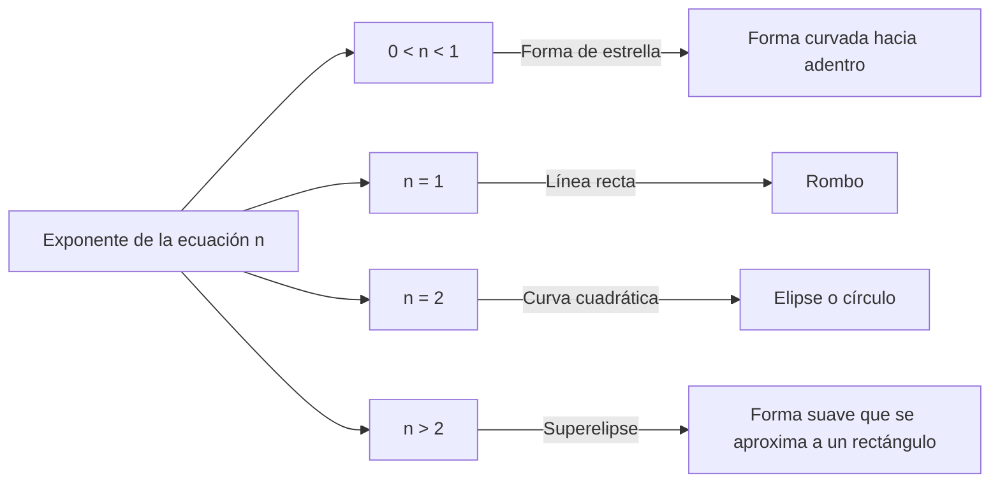

## 1. Introducción: ¿Quién fue [Gabriel Lamé](https://kenji.blog/es/p/lame/)?

[Gabriel Lamé](https://kenji.blog/es/p/lame/) (22 de julio de 1795 – 1 de mayo de 1870) fue un destacado matemático, físico e ingeniero francés del siglo XIX. Sus contribuciones abarcaron una amplia gama, desde las matemáticas puras hasta las matemáticas aplicadas, e incluso la ingeniería civil práctica. Hoy en día, su nombre permanece profundamente grabado en los libros de texto de matemáticas y física a través de la **curva de Lamé** (superelipse), el **teorema de Lamé** en el algoritmo de Euclides, y los **parámetros de [Lamé](https://kenji.blog/es/p/lame/)** en la teoría de la elasticidad.

En este artículo, trazaremos la trayectoria llena de acontecimientos de la vida de [Lamé](https://kenji.blog/es/p/lame/) mientras explicamos de manera exhaustiva y sistemática los innovadores logros matemáticos y físicos que dejó atrás. Comprender su vida y sus procesos de pensamiento proporciona una perspectiva sumamente valiosa sobre cómo la ciencia del siglo XIX sentó las bases para la era moderna.

## 2. Vida y carrera de [Gabriel Lamé](https://kenji.blog/es/p/lame/)

La vida de [Lamé](https://kenji.blog/es/p/lame/) estuvo profundamente entrelazada con la turbulenta sociedad europea de principios del siglo XIX. Su carrera no se limitó a una torre de marfil académica, sino que estuvo fundamentada en duras experiencias prácticas en el campo.

### 2.1 Nacimiento y educación en tiempos turbulentos

[Gabriel Lamé](https://kenji.blog/es/p/lame/) nació en 1795 en la ciudad de Tours, en el centro de Francia. Fue la época posterior a la Revolución Francesa, un período en el que la sociedad en su conjunto experimentaba una gran transformación. Su talento matemático floreció temprano y en 1813 ingresó en la prestigiosa **École Polytechnique**. Allí compitió y estudió junto a muchas mentes brillantes que más tarde liderarían el mundo científico. Después de graduarse, amplió sus conocimientos prácticos de ingeniería en la **École des Mines**.

### 2.2 Trabajo en Rusia: Práctica como ingeniero

En 1820 se produjo un importante punto de inflexión en la vida de [Lamé](https://kenji.blog/es/p/lame/). Junto a su colega y amigo íntimo Émile Clapeyron, aceptó una invitación del Imperio Ruso y viajó a San Petersburgo. En ese momento, Rusia se apresuraba a modernizar su infraestructura y necesitaba ingenieros cualificados.

Durante su estancia en Rusia, [Lamé](https://kenji.blog/es/p/lame/) trabajó como ingeniero civil en numerosos proyectos nacionales, incluyendo el diseño de puentes y la construcción de carreteras. En particular, su avanzado conocimiento matemático se aplicó directamente en el diseño de puentes colgantes que cruzaban los ríos de San Petersburgo. Esta experiencia práctica en el campo influyó profundamente en sus investigaciones posteriores en física y matemáticas aplicadas.



### 2.3 Regreso a Francia y gloria académica

En 1832, después de 12 años trabajando en Rusia, [Lamé](https://kenji.blog/es/p/lame/) regresó a Francia. A su regreso, se convirtió en profesor de física en su alma mater, la École Polytechnique. También enseñó en la Sorbona (Universidad de París), dedicándose a formar a muchas generaciones futuras. En 1843, en reconocimiento a sus tremendos logros, fue elegido miembro de la Academia de Ciencias de Francia.

## 3. Contribuciones a las matemáticas: Curvas de [Lamé](https://kenji.blog/es/p/lame/) (Superelipse)

Una de las contribuciones más visuales y famosas de [Lamé](https://kenji.blog/es/p/lame/) a las matemáticas puras es su estudio de las figuras geométricas conocidas como **curvas de [Lamé](https://kenji.blog/es/p/lame/)**, o **superelipses**.

### 3.1 Ecuación y diversidad de formas

Una curva de [Lamé](https://kenji.blog/es/p/lame/) se define por la siguiente ecuación en el sistema de coordenadas cartesianas:

$$ \left| \frac{x}{a} \right|^n + \left| \frac{y}{b} \right|^n = 1 $$

Aquí, $a$ y $b$ son números reales positivos que determinan el ancho y alto de la curva, y $n$ es un número real positivo (exponente) que determina la forma de la curva. Dependiendo del valor de $n$, la curva de [Lamé](https://kenji.blog/es/p/lame/) adopta formas completamente diferentes.

- Si $n = 2$, esto coincide con la ecuación de una **elipse** normal. Si $a = b$, se convierte en un **círculo**.
- Si $n < 1$, la curva adquiere una forma de estrella curvada hacia adentro (forma de astroide).
- Si $n = 1$, se convierte en un **rombo** que conecta cada cuadrante con líneas rectas.
- Si $n > 2$, la curva se aproxima gradualmente a un rectángulo. Especialmente cuando $n$ tiende a infinito, se convierte en un rectángulo perfecto.



### 3.2 Aplicaciones modernas: Del diseño a la arquitectura

Esta curva, estudiada por [Lamé](https://kenji.blog/es/p/lame/) por puro interés matemático, fue aplicada al urbanismo y al diseño industrial en el siglo XX por el diseñador danés Piet Hein. Hoy en día, se utiliza en todas partes como una forma que combina belleza y practicidad: desde formas de iconos de teléfonos inteligentes y diseños de fuentes tipográficas, hasta estructuras arquitectónicas masivas.

A continuación se muestra un ejemplo de un programa sencillo que calcula las coordenadas de una curva de [Lamé](https://kenji.blog/es/p/lame/).

```python
import numpy as np

# Función para calcular las coordenadas de una curva de Lamé
def calculate_lame_curve(a, b, n, num_points=100):
    """
    Genera puntos para una curva de Lamé basándose en los parámetros especificados.
    """
    points = []
    # Variar el ángulo de 0 a 2π
    theta = np.linspace(0, 2 * np.pi, num_points)
    for t in theta:
        # Cálculo de coordenadas usando ecuaciones paramétricas
        x = a * np.sign(np.cos(t)) * (np.abs(np.cos(t)) ** (2 / n))
        y = b * np.sign(np.sin(t)) * (np.abs(np.sin(t)) ** (2 / n))
        points.append((x, y))
    return points
```

## 4. Contribuciones a la teoría de números: El teorema de [Lamé](https://kenji.blog/es/p/lame/) y el algoritmo de [Euclides](https://kenji.blog/p/euclid/)

En informática y teoría de números, lo que hace más famoso el nombre de [Lamé](https://kenji.blog/es/p/lame/) es el **Teorema de [Lamé](https://kenji.blog/es/p/lame/)**. Se conoce como uno de los primeros ejemplos en la historia de evaluación rigurosa y matemática de la complejidad computacional (tiempo de ejecución) de un algoritmo.

### 4.1 Resumen y significado del teorema

El **algoritmo de [Euclides](https://kenji.blog/p/euclid/)**, transmitido desde la antigua Grecia, es un algoritmo eficiente para encontrar el máximo común divisor de dos números naturales. Sin embargo, hasta que llegó Lamé en 1844, nadie había demostrado con precisión exactamente "qué tan rápido" termina este algoritmo. El teorema de [Lamé](https://kenji.blog/es/p/lame/) establece lo siguiente:

> "Al encontrar el máximo común divisor de dos números enteros utilizando el algoritmo de [Euclides](https://kenji.blog/p/euclid/), el número de divisiones requeridas (pasos) nunca excede 5 veces el número de dígitos decimales del número más pequeño."

Expresado como fórmula, es:

$$ \text{Número de pasos} \le 5 \times \text{Número de dígitos del número menor} $$

### 4.2 Profunda conexión con la sucesión de [Fibonacci](https://kenji.blog/es/p/fibonacci/)

En el proceso de demostrar este teorema, [Lamé](https://kenji.blog/es/p/lame/) descubrió que el peor de los casos (el que requiere más pasos) para el algoritmo de Euclides ocurre cuando las entradas son dos **números de Fibonacci** consecutivos. Utilizando la tasa de crecimiento de la secuencia de Fibonacci y las propiedades de la proporción áurea, dedujo este hermoso límite superior. Debido a este logro, a [Lamé](https://kenji.blog/es/p/lame/) se le considera uno de los "padres de la teoría de la complejidad" en la informática moderna.

## 5. Contribuciones a la física: Teoría de la elasticidad y parámetros de [Lamé](https://kenji.blog/es/p/lame/)

Con su experiencia como ingeniero civil, [Lamé](https://kenji.blog/es/p/lame/) también hizo contribuciones decisivas a la física de la resistencia y deformación de los materiales, es decir, a la **teoría de la elasticidad**.

### 5.1 Fundamentos de la mecánica del medio continuo

En 1852, [Lamé](https://kenji.blog/es/p/lame/) publicó una teoría completa para describir el comportamiento de cuerpos elásticos isotrópicos (materiales con las mismas propiedades físicas en todas las direcciones). Formuló la relación entre tensión (estrés) y deformación en un espacio tridimensional utilizando sólo dos parámetros independientes. Estos se conocen hoy como los **parámetros de [Lamé](https://kenji.blog/es/p/lame/)**, $\lambda$ y $\mu$.

La ley de Hooke generalizada se describe maravillosamente usando los parámetros de [Lamé](https://kenji.blog/es/p/lame/) de la siguiente manera:

$$ \sigma_{ij} = 2\mu \varepsilon_{ij} + \lambda \delta_{ij} \text{Deformación volumétrica} $$

Aquí, $\sigma_{ij}$ representa el tensor de tensión, $\varepsilon_{ij}$ representa el tensor de deformación, y $\delta_{ij}$ representa el delta de [Kronecker](https://kenji.blog/es/p/kronecker/).

### 5.2 Significado físico y aplicaciones en ingeniería

De las dos constantes, $\mu$ se denomina **módulo de corte**, e indica qué tan fuertemente resiste un material a los cambios de forma. Por otro lado, $\lambda$ se denomina **primer parámetro de [Lamé](https://kenji.blog/es/p/lame/)**. Aunque su interpretación física directa es algo compleja, está relacionada con la resistencia a los cambios de volumen. Al utilizar estos parámetros, se hicieron posibles análisis esenciales en la ingeniería y geofísica modernas, como el cálculo de la propagación de ondas sísmicas (velocidades de ondas P y ondas S) y cálculos estructurales para puentes y edificios.

## 6. Contribuciones al análisis: Coordenadas curvilíneas y la ecuación del calor

Otro de los grandes logros de [Lamé](https://kenji.blog/es/p/lame/) es su estudio sistemático de las **coordenadas curvilíneas**. En su libro publicado en 1859, estableció un marco matemático general para manejar ecuaciones diferenciales no sólo en coordenadas cartesianas, sino también en coordenadas cilíndricas, esféricas e incluso elipsoidales.

En particular, para resolver la **ecuación de Laplace**, que describe los fenómenos de conducción de calor en el espacio, demostró la importancia de elegir un sistema de coordenadas adaptado a condiciones de contorno complejas (como objetos elipsoidales). Los **factores de escala de [Lamé](https://kenji.blog/es/p/lame/)** que introdujo en este proceso forman la base del cálculo vectorial moderno y el análisis tensorial.

## 7. El desafío y el revés con el Último Teorema de [Fermat](https://kenji.blog/es/p/fermat/)

Un episodio dramático en la vida de [Lamé](https://kenji.blog/es/p/lame/) fue su intento de demostrar el **Último Teorema de Fermat** en 1847. En marzo de ese año, Lamé anunció con orgullo en la Academia de Ciencias de Francia que había "demostrado completamente el Último Teorema de [Fermat](https://kenji.blog/es/p/fermat/)". Su demostración implicaba un enfoque muy innovador y poderoso para la época: factorizar la ecuación utilizando números complejos ciclotómicos.

Sin embargo, inmediatamente después de su presentación, su colega, el matemático Joseph [Liouville](https://kenji.blog/es/p/liouville/), señaló agudamente que "la demostración se basa en la suposición tácita y no probada de que 'la factorización prima única' también se cumple en el ámbito de los números complejos". Poco después, llegó una carta del matemático alemán Ernst Kummer indicando que "la factorización prima única no se cumple en general", dejando la demostración de [Lamé](https://kenji.blog/es/p/lame/) efectivamente invalidada.

Esto supuso un gran revés para [Lamé](https://kenji.blog/es/p/lame/), pero esta serie de discusiones provocó el nacimiento de la teoría de Kummer de los "números ideales" (ideales), que más tarde abrió el enorme campo matemático de la teoría de números algebraicos. El audaz desafío de [Lamé](https://kenji.blog/es/p/lame/) impulsó significativamente la historia de las matemáticas.

## 8. Escritos y papel como educador

[Lamé](https://kenji.blog/es/p/lame/) no solo fue investigador, sino que también tenía un talento excepcional como educador. Sus conferencias en la École Polytechnique y la Sorbona cautivaron a muchos estudiantes por su claridad y progresión lógica. Publicó numerosos libros de texto recopilando sus apuntes de clase y resultados de investigaciones, los cuales fueron adoptados como textos estándar en universidades de toda Europa.

Entre sus obras destacadas se encuentran "Lecciones sobre la teoría matemática de la elasticidad" (1852) y "Lecciones sobre las coordenadas curvilíneas y sus aplicaciones" (1859). Una característica definitoria de estas obras es que nunca dejó las teorías matemáticas avanzadas en abstracto; siempre las explicó conectándolas con fenómenos físicos o la resolución de problemas de ingeniería. [Lamé](https://kenji.blog/es/p/lame/) creía firmemente que "las matemáticas son el lenguaje para desentrañar las verdades de la naturaleza", y su filosofía educativa fue heredada profundamente por generaciones posteriores de científicos.

En sus últimos años, [Lamé](https://kenji.blog/es/p/lame/) sufrió la desgracia de perder la audición, lo que dificultó su labor docente. Aun así, nunca perdió su pasión por la investigación y continuó con sus actividades de escritura durante toda su vida.

## 9. Conclusión: Lo que [Lamé](https://kenji.blog/es/p/lame/) dejó para la era moderna

Al recordar la vida y los logros de [Gabriel Lamé](https://kenji.blog/es/p/lame/), queda claro que fusionó a la perfección la "belleza abstracta de las matemáticas puras" con la "utilidad de las matemáticas aplicadas y la física".

En el balcón del primer piso de la Torre Eiffel, están grabados los nombres de 72 grandes científicos que contribuyeron a la ciencia y la tecnología francesas, y entre ellos destaca con orgullo el nombre de [Lamé](https://kenji.blog/es/p/lame/) (LAMÉ). Los teoremas, constantes y enfoques innovadores que dejó atrás continúan vivos hoy en día a la vanguardia de la ciencia y la tecnología, en manos de los ingenieros y matemáticos modernos.
