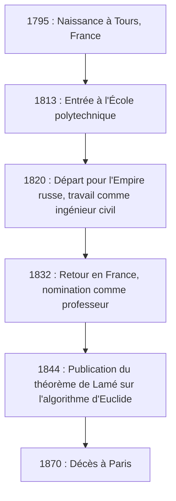
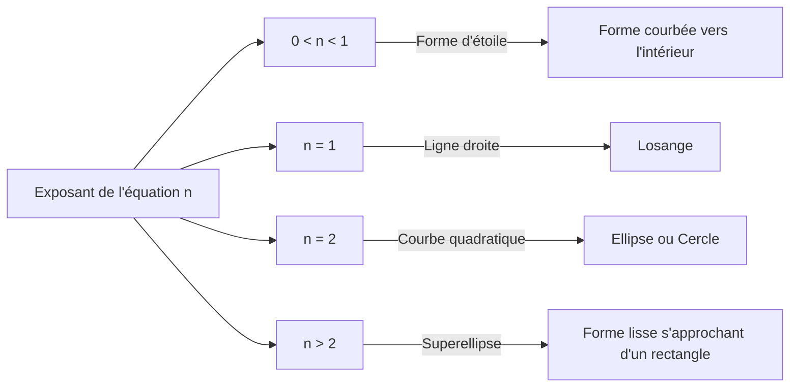

## 1. Introduction : Qui était [Gabriel Lamé](https://kenji.blog/p/lame/) ?

[Gabriel Lamé](https://kenji.blog/p/lame/) (22 juillet 1795 – 1er mai 1870) était un éminent mathématicien, physicien et ingénieur français du XIXe siècle. Ses contributions ont couvert un vaste domaine, des mathématiques pures aux mathématiques appliquées, jusqu'au génie civil pratique. Aujourd'hui encore, son nom reste profondément gravé dans les manuels de mathématiques et de physique à travers la **courbe de Lamé** (superellipse), le **théorème de Lamé** dans l'algorithme d'[[Euclid](https://kenji.blog/p/euclid/)e](https://kenji.blog/p/euclid/), et les **coefficients de Lamé** dans la théorie de l'élasticité.

Dans cet article, nous retracerons la trajectoire mouvementée de la vie de Lamé tout en expliquant de manière exhaustive et systématique les réalisations mathématiques et physiques révolutionnaires qu'il a laissées derrière lui. Comprendre sa vie et son processus de réflexion offre une perspective extrêmement précieuse sur la façon dont la science du XIXe siècle a jeté les bases de l'ère moderne.

## 2. Vie et carrière de [Gabriel Lamé](https://kenji.blog/p/lame/)

La vie de Lamé était profondément liée à la société européenne turbulente du début du XIXe siècle. Sa carrière ne s'est pas limitée à une tour d'ivoire académique, mais s'est appuyée sur de dures expériences pratiques sur le terrain.

### 2.1 Naissance et éducation à une époque troublée

[Gabriel Lamé](https://kenji.blog/p/lame/) est né en 1795 dans la ville de Tours, au centre de la France. C'était au lendemain de la Révolution française, une période où la société tout entière subissait de profondes transformations. Son talent en mathématiques s'est épanoui très tôt, et en 1813, il est entré à la prestigieuse **École polytechnique**. Là, il a étudié aux côtés de nombreux esprits brillants qui allaient plus tard diriger le monde scientifique. Après l'obtention de son diplôme, il a approfondi ses connaissances pratiques en ingénierie à l'**École des mines**.

### 2.2 Travail en Russie : La pratique en tant qu'ingénieur

En 1820, un tournant majeur s'est produit dans la vie de Lamé. Avec son collègue et ami proche Émile Clapeyron, il a accepté une invitation de l'Empire russe et s'est rendu à Saint-Pétersbourg. À l'époque, la Russie s'empressait de moderniser ses infrastructures et avait besoin d'ingénieurs qualifiés.

Pendant son séjour en Russie, Lamé a travaillé comme ingénieur civil sur de nombreux projets nationaux, notamment la conception de ponts et la construction de routes. En particulier, ses connaissances mathématiques avancées ont été directement appliquées à la conception de ponts suspendus traversant les rivières de Saint-Pétersbourg. Cette expérience pratique sur le terrain a profondément influencé ses recherches ultérieures en physique et en mathématiques appliquées.



### 2.3 Retour en France et gloire académique

En 1832, après 12 ans de travail en Russie, Lamé est retourné en France. À son retour, il est devenu professeur de physique dans son alma mater, l'École polytechnique. Il a également enseigné à la Sorbonne (Université de Paris), se consacrant à la formation de nombreuses générations futures. En 1843, en reconnaissance de ses formidables accomplissements, il a été élu membre de l'Académie des sciences.

## 3. Contributions aux mathématiques : Les courbes de Lamé (Superellipse)

L'une des contributions les plus visuelles et célèbres de Lamé aux mathématiques pures est son étude des figures géométriques connues sous le nom de **courbes de Lamé**, ou **superellipses**.

### 3.1 Équation et diversité des formes

Une courbe de Lamé est définie par l'équation suivante dans le système de coordonnées cartésiennes :

$$ \left| \frac{x}{a} \right|^n + \left| \frac{y}{b} \right|^n = 1 $$

Ici, $a$ et $b$ sont des nombres réels positifs déterminant la largeur et la hauteur de la courbe, et $n$ est un nombre réel positif (exposant) qui détermine la forme de la courbe. Selon la valeur de $n$, la courbe de Lamé prend des formes complètement différentes.

- Si $n = 2$, cela correspond à l'équation d'une **ellipse** standard. Si $a = b$, cela devient un **cercle**.
- Si $n < 1$, la courbe prend la forme d'une étoile courbée vers l'intérieur (en forme d'astroïde).
- Si $n = 1$, elle devient un **losange** reliant chaque quadrant par des lignes droites.
- Si $n > 2$, la courbe se rapproche progressivement d'un rectangle. En particulier, lorsque $n$ tend vers l'infini, elle devient un rectangle parfait.



### 3.2 Applications modernes : Du design à l'architecture

Cette courbe, étudiée par Lamé par pur intérêt mathématique, a été appliquée à l'urbanisme et au design industriel au XXe siècle par le designer danois Piet Hein. Aujourd'hui, elle est utilisée partout comme une forme alliant beauté et praticité, qu'il s'agisse des icônes de smartphones, de la conception de polices de caractères, ou même de structures architecturales massives.

Voici un exemple de programme simple qui calcule les coordonnées d'une courbe de Lamé.

```python
import numpy as np

# Fonction pour calculer les coordonnées d'une courbe de Lamé
def calculate_lame_curve(a, b, n, num_points=100):
    """
    Génère des points pour une courbe de Lamé en fonction des paramètres spécifiés.
    """
    points = []
    # Faire varier l'angle de 0 à 2π
    theta = np.linspace(0, 2 * np.pi, num_points)
    for t in theta:
        # Calcul des coordonnées à l'aide d'équations paramétriques
        x = a * np.sign(np.cos(t)) * (np.abs(np.cos(t)) ** (2 / n))
        y = b * np.sign(np.sin(t)) * (np.abs(np.sin(t)) ** (2 / n))
        points.append((x, y))
    return points
```

## 4. Contributions à la théorie des nombres : Le théorème de Lamé et l'algorithme d'[[Euclid](https://kenji.blog/p/euclid/)e](https://kenji.blog/p/euclid/)

En informatique et en théorie des nombres, ce qui a rendu le nom de Lamé le plus célèbre est le **théorème de Lamé**. Il est connu comme l'un des premiers exemples de l'histoire évaluant de manière rigoureuse et mathématique la complexité algorithmique (temps d'exécution) d'un algorithme.

### 4.1 Aperçu et signification du théorème

L'**algorithme d'[[Euclid](https://kenji.blog/p/euclid/)e](https://kenji.blog/p/euclid/)**, transmis depuis la Grèce antique, est un algorithme efficace pour trouver le plus grand commun diviseur (PGCD) de deux entiers naturels. Cependant, jusqu'à Lamé en 1844, personne n'avait prouvé avec précision « à quelle vitesse » cet algorithme se terminait. Le théorème de Lamé énonce ce qui suit :

> « Lors de la recherche du plus grand commun diviseur de deux nombres entiers à l'aide de l'algorithme d'[[Euclid](https://kenji.blog/p/euclid/)e](https://kenji.blog/p/euclid/), le nombre de divisions requises (étapes) ne dépasse jamais 5 fois le nombre de chiffres décimaux du plus petit nombre. »

Exprimé sous forme de formule, cela donne :

$$ \text{Nombre d'étapes} \le 5 \times \text{Nombre de chiffres du plus petit nombre} $$

### 4.2 Lien profond avec la suite de Fibonacci

En prouvant ce théorème, Lamé a découvert que le pire des cas (c'est-à-dire celui nécessitant le plus d'étapes) pour l'algorithme d'[[Euclid](https://kenji.blog/p/euclid/)e](https://kenji.blog/p/euclid/) se produit lorsque les entrées sont deux **nombres de Fibonacci** consécutifs. En utilisant le taux de croissance de la suite de Fibonacci et les propriétés du nombre d'or, il a dérivé cette magnifique borne supérieure. Grâce à cette réalisation, Lamé est considéré comme l'un des « pères de la théorie de la complexité » dans l'informatique moderne.

## 5. Contributions à la physique : Théorie de l'élasticité et coefficients de Lamé

Grâce à sa formation d'ingénieur civil, Lamé a également apporté des contributions décisives à la physique de la résistance et de la déformation des matériaux, à savoir la **théorie de l'élasticité**.

### 5.1 Fondements de la mécanique des milieux continus

En 1852, Lamé a publié une théorie complète pour décrire le comportement des corps élastiques isotropes (matériaux ayant les mêmes propriétés physiques dans toutes les directions). Il a formulé la relation entre la contrainte (stress) et la déformation (strain) dans un espace tridimensionnel en utilisant seulement deux paramètres indépendants. Ceux-ci sont connus aujourd'hui sous le nom de **coefficients de Lamé**, $\lambda$ et $\mu$.

La loi de Hooke généralisée est magnifiquement décrite en utilisant les coefficients de Lamé de la manière suivante :

$$ \sigma_{ij} = 2\mu \varepsilon_{ij} + \lambda \delta_{ij} \text{Déformation volumétrique} $$

Ici, $\sigma_{ij}$ représente le tenseur des contraintes, $\varepsilon_{ij}$ représente le tenseur des déformations, et $\delta_{ij}$ représente le symbole de Kronecker.

### 5.2 Signification physique et applications en ingénierie

Des deux constantes, $\mu$ est appelé le **module de cisaillement**, indiquant avec quelle force un matériau résiste aux changements de forme. D'autre part, $\lambda$ est appelé le **premier coefficient de Lamé**. Bien que son interprétation physique directe soit quelque peu complexe, elle est liée à la résistance aux changements de volume. En utilisant ces paramètres, des analyses essentielles en ingénierie moderne et en géophysique sont devenues possibles, telles que le calcul de la propagation des ondes sismiques (vitesses des ondes P et des ondes S) et les calculs structurels pour les ponts et les bâtiments.

## 6. Contributions à l'analyse : Coordonnées curvilignes et équation de la chaleur

Une autre des grandes réalisations de Lamé est son étude systématique des **coordonnées curvilignes**. Dans son livre publié en 1859, il a établi un cadre mathématique général pour traiter les équations différentielles non seulement en coordonnées cartesianes, mais aussi en coordonnées cylindriques, sphériques et même ellipsoïdales.

En particulier, pour résoudre l'**équation de Laplace**, qui décrit les phénomènes de conduction thermique dans l'espace, il a démontré l'importance de choisir un système de coordonnées adapté aux conditions aux limites complexes (telles que des objets ellipsoïdaux). Les **facteurs d'échelle de Lamé** qu'il a introduits dans ce processus forment la base du calcul vectoriel moderne et de l'analyse tensorielle.

## 7. Le défi et le revers avec le dernier théorème de Fermat

Un épisode dramatique dans la vie de Lamé fut sa tentative de prouver le **dernier théorème de Fermat** en 1847. En mars de cette année-là, Lamé annonça fièrement à l'Académie des sciences qu'il avait « complètement prouvé le dernier théorème de Fermat ». Sa preuve impliquait une approche très innovante et puissante pour l'époque : la factorisation de l'équation à l'aide de nombres complexes cyclotomiques.

Cependant, immédiatement après sa présentation, son collègue, le mathématicien Joseph Liouville, souligna judicieusement que « la preuve repose sur l'hypothèse tacite et non prouvée que "l'unicité de la factorisation en nombres premiers" est également valable dans le domaine des nombres complexes ». Peu après, une lettre du mathématicien allemand [Ernst Kummer](https://kenji.blog/p/kummer/) est arrivée indiquant que « l'unicité de la factorisation en nombres premiers n'est généralement pas valable », rendant la preuve de Lamé effectivement invalide.

Ce fut un revers majeur pour Lamé, mais cette série de discussions a déclenché la naissance de la théorie des « nombres idéaux » (idéaux) de Kummer, qui a ensuite ouvert l'immense champ mathématique de la théorie algébrique des nombres. Le défi audacieux de Lamé a finalement fait avancer l'histoire des mathématiques de manière significative.

## 8. Écrits et rôle en tant qu'éducateur

Lamé n'était pas seulement un chercheur, il était aussi exceptionnellement talentueux en tant qu'éducateur. Ses cours à l'École polytechnique et à la Sorbonne ont captivé de nombreux étudiants par leur clarté et leur progression logique. Il a publié de nombreux manuels compilant ses notes de cours et les résultats de ses recherches, qui ont été adoptés comme textes de référence dans les universités de toute l'Europe.

Parmi ses œuvres remarquables figurent les « Leçons sur la théorie mathématique de l'élasticité » (1852) et les « Leçons sur les coordonnées curvilignes et leurs diverses applications » (1859). Une caractéristique déterminante de ces travaux est qu'il n'a jamais laissé les théories mathématiques avancées dans l'abstrait ; il les a toujours expliquées en les reliant à des phénomènes physiques ou à la résolution de problèmes d'ingénierie. Lamé croyait fermement que « les mathématiques sont le langage permettant de percer les vérités de la nature », et sa philosophie éducative a été profondément héritée par les générations suivantes de scientifiques.

Dans ses dernières années, Lamé a eu le malheur de perdre l'ouïe, ce qui a rendu l'enseignement difficile. Malgré cela, il n'a jamais perdu sa passion pour la recherche et a poursuivi ses activités d'écriture tout au long de sa vie.

## 9. Conclusion : Ce que Lamé a laissé à l'ère moderne

En repensant à la vie et aux réalisations de [Gabriel Lamé](https://kenji.blog/p/lame/), il est clair qu'il a parfaitement fusionné la « beauté abstraite des mathématiques pures » avec « l'utilité des mathématiques appliquées et de la physique ».

Sur le balcon du premier étage de la tour Eiffel, les noms de 72 grands savants ayant contribué à la science et à la technologie françaises sont gravés, et parmi eux figure fièrement le nom de Lamé (LAMÉ). Les théorèmes, les constantes et les approches innovantes qu'il a laissés derrière lui continuent de vivre aujourd'hui à la pointe de la science et de la technologie, entre les mains des ingénieurs et mathématiciens modernes.
