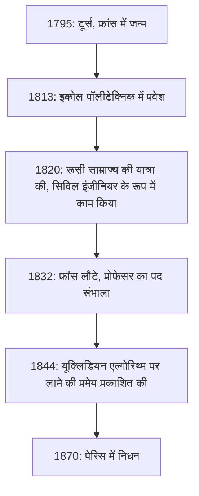
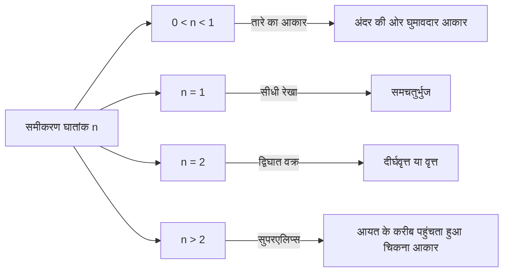

## 1. परिचय: [गेब्रियल लामे](https://kenji.blog/hi/p/lame/) कौन थे?

[गेब्रियल लामे](https://kenji.blog/hi/p/lame/) (22 जुलाई 1795 - 1 मई 1870) 19वीं सदी के एक प्रमुख फ्रांसीसी गणितज्ञ, भौतिक विज्ञानी और इंजीनियर थे। उनका योगदान शुद्ध गणित से लेकर अनुप्रयुक्त गणित और यहां तक कि व्यावहारिक सिविल इंजीनियरिंग तक एक विशाल श्रृंखला में फैला हुआ है। आज भी, उनका नाम **लामे वक्र** (सुपरएलिप्स), [[यूक्लिड](https://kenji.blog/hi/p/euclid/)ियन एल्गोरिथ्म](https://kenji.blog/p/euclidean-algorithm/) में **लामे की प्रमेय**, और लोच के सिद्धांत में **लामे मापदंडों** के माध्यम से गणित और भौतिकी की पाठ्यपुस्तकों में गहराई से अंकित है।

इस लेख में, हम लामे के जीवन के घटनापूर्ण प्रक्षेपवक्र का पता लगाएंगे, साथ ही उनके द्वारा पीछे छोड़ी गई अभूतपूर्व गणितीय और भौतिक उपलब्धियों को व्यापक और व्यवस्थित रूप से स्पष्ट करेंगे। उनके जीवन और विचार प्रक्रियाओं को समझना इस बात पर एक अत्यधिक मूल्यवान परिप्रेक्ष्य प्रदान करता है कि कैसे 19वीं सदी के विज्ञान ने आधुनिक युग की नींव रखी।

## 2. [गेब्रियल लामे](https://kenji.blog/hi/p/lame/) का जीवन और करियर

लामे का जीवन 19वीं सदी की शुरुआत के अशांत यूरोपीय समाज के साथ गहराई से जुड़ा हुआ था। उनका करियर एक अकादमिक हाथीदांत टॉवर तक ही सीमित नहीं था, बल्कि क्षेत्र में कठोर व्यावहारिक अनुभवों पर आधारित था।

### 2.1 अशांत समय में जन्म और शिक्षा

[गेब्रियल लामे](https://kenji.blog/hi/p/lame/) का जन्म 1795 में मध्य फ्रांस के टूर्स शहर में हुआ था। यह फ्रांसीसी क्रांति के बाद का समय था, एक ऐसी अवधि जब पूरा समाज बड़े पैमाने पर परिवर्तन के दौर से गुजर रहा था। उनकी गणितीय प्रतिभा जल्दी ही खिल गई, और 1813 में उन्होंने प्रतिष्ठित **इकोल पॉलीटेक्निक** (École Polytechnique) में प्रवेश लिया। वहां, उन्होंने कई शानदार दिमागों के साथ प्रतिस्पर्धा की और अध्ययन किया, जो बाद में वैज्ञानिक दुनिया का नेतृत्व करेंगे। स्नातक होने के बाद, उन्होंने **इकोल डेस माइन्स** (École des Mines) में अपने व्यावहारिक इंजीनियरिंग ज्ञान को और बढ़ाया।

### 2.2 रूस में कार्य: एक इंजीनियर के रूप में अभ्यास

1820 में, लामे के जीवन में एक बड़ा मोड़ आया। अपने सहयोगी और करीबी दोस्त एमिल क्लैपेरॉन के साथ, उन्होंने रूसी साम्राज्य का निमंत्रण स्वीकार किया और सेंट पीटर्सबर्ग की यात्रा की। उस समय, रूस अपने बुनियादी ढांचे को आधुनिक बनाने में जल्दबाजी कर रहा था और उसे कुशल इंजीनियरों की आवश्यकता थी।

रूस में अपने प्रवास के दौरान, लामे ने पुलों की रूपरेखा तैयार करने और सड़कों के निर्माण सहित कई राष्ट्रीय परियोजनाओं पर एक सिविल इंजीनियर के रूप में काम किया। विशेष रूप से, उनका उन्नत गणितीय ज्ञान सीधे तौर पर सेंट पीटर्सबर्ग की नदियों को पार करने वाले निलंबन पुलों (सस्पेंशन ब्रिज) के डिजाइन में लागू किया गया था। इस व्यावहारिक क्षेत्र के अनुभव ने भौतिकी और अनुप्रयुक्त गणित में उनके बाद के शोध को गहराई से प्रभावित किया।



### 2.3 फ्रांस वापसी और अकादमिक गौरव

1832 में, रूस में 12 साल काम करने के बाद, लामे फ्रांस लौट आए। लौटने पर, वह अपने अल्मा मेटर, इकोल पॉलीटेक्निक में भौतिकी के प्रोफेसर बन गए। उन्होंने सोरबोन (पेरिस विश्वविद्यालय) में भी पढ़ाया, और कई भविष्य की पीढ़ियों को प्रशिक्षित करने के लिए खुद को समर्पित कर दिया। 1843 में, उनकी जबरदस्त उपलब्धियों की मान्यता में, उन्हें फ्रांसीसी विज्ञान अकादमी का सदस्य चुना गया।

## 3. गणित में योगदान: लामे वक्र (सुपरएलिप्स)

शुद्ध गणित में लामे के सबसे दृश्य और प्रसिद्ध योगदानों में से एक ज्यामितीय आकृतियों का उनका अध्ययन है जिसे **लामे वक्र** या **सुपरएलिप्स** (Superellipse) के रूप में जाना जाता है।

### 3.1 समीकरण और आकृतियों की विविधता

एक लामे वक्र कार्टेशियन समन्वय प्रणाली में निम्नलिखित समीकरण द्वारा परिभाषित किया गया है:

$$ \left| \frac{x}{a} \right|^n + \left| \frac{y}{b} \right|^n = 1 $$

यहां, $a$ और $b$ धनात्मक वास्तविक संख्याएं हैं जो वक्र की चौड़ाई और ऊंचाई निर्धारित करती हैं, और $n$ एक धनात्मक वास्तविक संख्या (घातांक) है जो वक्र का आकार निर्धारित करती है। $n$ के मान के आधार पर, लामे वक्र पूरी तरह से अलग-अलग आकार लेता है।

- यदि $n = 2$ है, तो यह एक मानक **दीर्घवृत्त** (ellipse) के समीकरण से मेल खाता है। यदि $a = b$ है, तो यह एक **वृत्त** बन जाता है।
- यदि $n < 1$ है, तो वक्र अंदर की ओर घुमावदार तारे के आकार का (एस्टेरॉइड जैसा) हो जाता है।
- यदि $n = 1$ है, तो यह एक **समचतुर्भुज** (rhombus) बन जाता है जो सीधी रेखाओं के साथ प्रत्येक चतुर्थांश को जोड़ता है।
- यदि $n > 2$ है, तो वक्र धीरे-धीरे एक आयत के करीब पहुंचता है। विशेष रूप से जैसे-जैसे $n$ अनंत की ओर बढ़ता है, यह एक पूर्ण आयत बन जाता है।



### 3.2 आधुनिक अनुप्रयोग: डिजाइन से वास्तुकला तक

विशुद्ध गणितीय रुचि के कारण लामे द्वारा अध्ययन किए गए इस वक्र को 20वीं सदी में डेनिश डिजाइनर पिएट हाइन द्वारा शहरी नियोजन और औद्योगिक डिजाइन में लागू किया गया था। आज, इसका उपयोग हर जगह एक ऐसे आकार के रूप में किया जाता है जो सुंदरता और व्यावहारिकता को जोड़ता है—स्मार्टफोन आइकन आकार और फ़ॉन्ट डिज़ाइन से लेकर विशाल वास्तुकला संरचनाओं तक।

नीचे एक साधारण प्रोग्राम का उदाहरण दिया गया है जो लामे वक्र के निर्देशांक (coordinates) की गणना करता है।

```python
import numpy as np

# लामे वक्र के निर्देशांक की गणना करने के लिए फ़ंक्शन
def calculate_lame_curve(a, b, n, num_points=100):
    """
    निर्दिष्ट मापदंडों के आधार पर लामे वक्र के लिए बिंदु उत्पन्न करता है।
    """
    points = []
    # कोण को 0 से 2π तक बदलें
    theta = np.linspace(0, 2 * np.pi, num_points)
    for t in theta:
        # पैरामीट्रिक समीकरणों का उपयोग करके समन्वय गणना
        x = a * np.sign(np.cos(t)) * (np.abs(np.cos(t)) ** (2 / n))
        y = b * np.sign(np.sin(t)) * (np.abs(np.sin(t)) ** (2 / n))
        points.append((x, y))
    return points
```

## 4. संख्या सिद्धांत में योगदान: लामे की प्रमेय और [[यूक्लिड](https://kenji.blog/hi/p/euclid/)ियन एल्गोरिथ्म](https://kenji.blog/p/euclidean-algorithm/)

कंप्यूटर विज्ञान और संख्या सिद्धांत में, जो चीज़ लामे के नाम को सबसे प्रसिद्ध बनाती है वह है **लामे की प्रमेय**। इसे एल्गोरिथ्म की कम्प्यूटेशनल जटिलता (निष्पादन समय) का गणितीय और कड़ाई से मूल्यांकन करने के इतिहास में शुरुआती उदाहरणों में से एक के रूप में जाना जाता है।

### 4.1 प्रमेय का अवलोकन और महत्व

प्राचीन यूनान से चला आ रहा **[[यूक्लिड](https://kenji.blog/hi/p/euclid/)ियन एल्गोरिथ्म](https://kenji.blog/p/euclidean-algorithm/)**, दो प्राकृतिक संख्याओं का सबसे बड़ा सामान्य भाजक (HCF/GCD) खोजने के लिए एक कुशल एल्गोरिथ्म है। हालाँकि, 1844 में लामे के आने तक, किसी ने भी सटीक रूप से यह साबित नहीं किया था कि यह एल्गोरिथ्म "कितनी तेज़ी" से समाप्त होता है। लामे की प्रमेय निम्नलिखित बताती है:

> "[[यूक्लिड](https://kenji.blog/hi/p/euclid/)ियन एल्गोरिथ्म](https://kenji.blog/p/euclidean-algorithm/) का उपयोग करके दो पूर्णांकों का सबसे बड़ा सामान्य भाजक ढूंढते समय, आवश्यक विभाजनों (चरणों) की संख्या छोटी संख्या के दशमलव अंकों की संख्या के 5 गुना से अधिक कभी नहीं होती है।"

एक सूत्र के रूप में व्यक्त किया गया, यह है:

$$ \text{चरणों की संख्या} \le 5 \times \text{छोटी संख्या के अंकों की संख्या} $$

### 4.2 फाइबोनैचि अनुक्रम के साथ गहरा संबंध

इस प्रमेय को सिद्ध करने की प्रक्रिया में, लामे ने पाया कि [[यूक्लिड](https://kenji.blog/hi/p/euclid/)ियन एल्गोरिथ्म](https://kenji.blog/p/euclidean-algorithm/) के लिए सबसे खराब स्थिति (अर्थात जिसमें सबसे अधिक चरण लगते हैं) तब होती है जब इनपुट दो लगातार **फाइबोनैचि संख्याएँ** होते हैं। फाइबोनैचि अनुक्रम की वृद्धि दर और सुनहरे अनुपात (golden ratio) के गुणों का उपयोग करके, उन्होंने इस सुंदर ऊपरी सीमा (upper bound) को प्राप्त किया। इस उपलब्धि के कारण, लामे को आधुनिक कंप्यूटर विज्ञान में "जटिलता सिद्धांत के पिताओं" (fathers of complexity theory) में से एक माना जाता है।

## 5. भौतिकी में योगदान: लोच सिद्धांत और लामे मापदंड

एक सिविल इंजीनियर के रूप में अपनी पृष्ठभूमि के साथ, लामे ने सामग्री की ताकत और विरूपण की भौतिकी, अर्थात् **लोच के सिद्धांत** (theory of elasticity) में भी निर्णायक योगदान दिया।

### 5.1 निरंतरता यांत्रिकी (Continuum Mechanics) की नींव

1852 में, लामे ने आइसोट्रोपिक लोचदार निकायों (सभी दिशाओं में समान भौतिक गुणों वाली सामग्री) के व्यवहार का वर्णन करने के लिए एक व्यापक सिद्धांत प्रकाशित किया। उन्होंने त्रि-आयामी स्थान में तनाव (stress) और विकृति (strain) के बीच संबंध को केवल दो स्वतंत्र मापदंडों का उपयोग करके तैयार किया। इन्हें आज **लामे मापदंडों** ([Lamé](https://kenji.blog/hi/p/lame/) parameters), $\lambda$ और $\mu$ के रूप में जाना जाता है।

सामान्यीकृत हुक के नियम को लामे मापदंडों का उपयोग करके इस प्रकार खूबसूरती से वर्णित किया गया है:

$$ \sigma_{ij} = 2\mu \varepsilon_{ij} + \lambda \delta_{ij} \text{वॉल्यूमेट्रिक विकृति} $$

यहां, $\sigma_{ij}$ तनाव टेंसर का प्रतिनिधित्व करता है, $\varepsilon_{ij}$ विकृति टेंसर का प्रतिनिधित्व करता है, और $\delta_{ij}$ क्रोनकर डेल्टा का प्रतिनिधित्व करता है।

### 5.2 भौतिक अर्थ और इंजीनियरिंग अनुप्रयोग

दो स्थिरांकों में से, $\mu$ को **कतरनी मापांक** (shear modulus) कहा जाता है, जो यह दर्शाता है कि कोई सामग्री आकार में परिवर्तन का कितनी दृढ़ता से विरोध करती है। दूसरी ओर, $\lambda$ को **लामे का पहला पैरामीटर** कहा जाता है। हालांकि इसकी प्रत्यक्ष भौतिक व्याख्या कुछ जटिल है, यह मात्रा परिवर्तनों के प्रतिरोध से संबंधित है। इन मापदंडों का उपयोग करके, आधुनिक इंजीनियरिंग और भूभौतिकी में आवश्यक विश्लेषण संभव हो गए, जैसे भूकंपीय तरंगों के प्रसार (पी-तरंग और एस-तरंग गति) की गणना करना और पुलों और इमारतों के लिए संरचनात्मक गणना।

## 6. विश्लेषण में योगदान: वक्ररेखीय निर्देशांक और ऊष्मा समीकरण

लामे की एक और बड़ी उपलब्धि **वक्ररेखीय निर्देशांक** (Curvilinear coordinates) का उनका व्यवस्थित अध्ययन है। 1859 में प्रकाशित अपनी पुस्तक में, उन्होंने न केवल कार्टेशियन निर्देशांक में, बल्कि बेलनाकार, गोलाकार और यहां तक कि अण्डाकार निर्देशांक में भी अंतर समीकरणों (differential equations) को संभालने के लिए एक सामान्य गणितीय ढांचा स्थापित किया।

विशेष रूप से, **लाप्लास के समीकरण** को हल करने के लिए, जो अंतरिक्ष में ऊष्मा चालन की घटनाओं का वर्णन करता है, उन्होंने जटिल सीमा शर्तों (जैसे कि अण्डाकार वस्तुओं) के अनुरूप समन्वय प्रणाली चुनने के महत्व को प्रदर्शित किया। इस प्रक्रिया में उनके द्वारा पेश किए गए **लामे स्केल कारक** ([Lamé](https://kenji.blog/hi/p/lame/) scale factors) आधुनिक वेक्टर कैलकुलस और टेंसर विश्लेषण की नींव बनाते हैं।

## 7. फर्मेट के अंतिम प्रमेय के साथ चुनौती और झटका

लामे के जीवन में एक नाटकीय प्रकरण 1847 में **फर्मेट के अंतिम प्रमेय** को साबित करने का उनका प्रयास था। उस वर्ष मार्च में, लामे ने गर्व से फ्रांसीसी विज्ञान अकादमी में घोषणा की कि उन्होंने "फर्मेट के अंतिम प्रमेय को पूरी तरह से साबित कर दिया है।" उनके प्रमाण में उस समय के लिए एक अत्यधिक नवीन और शक्तिशाली दृष्टिकोण शामिल था: साइक्लोटोमिक सम्मिश्र संख्याओं (cyclotomic complex numbers) का उपयोग करके समीकरण का गुणनखंडन करना।

हालाँकि, उनकी प्रस्तुति के तुरंत बाद, उनके सहयोगी, गणितज्ञ जोसेफ लिउविले ने तीक्ष्णता से बताया कि "प्रमाण इस अप्रमाणित, मौन धारणा पर टिका है कि 'अद्वितीय अभाज्य गुणनखंडन' (unique prime factorization) सम्मिश्र संख्याओं के दायरे में भी लागू होता है।" कुछ ही समय बाद, जर्मन गणितज्ञ अर्नस्ट कुमेर का एक पत्र आया जिसमें संकेत दिया गया था कि "अद्वितीय अभाज्य गुणनखंडन आम तौर पर लागू नहीं होता है," जिससे लामे का प्रमाण प्रभावी रूप से अमान्य हो गया।

लामे के लिए यह एक बड़ा झटका था, लेकिन चर्चाओं की इस श्रृंखला ने कुमेर के "आदर्श संख्याओं" (ideals) के सिद्धांत के जन्म को जन्म दिया, जिसने बाद में बीजीय संख्या सिद्धांत (algebraic number theory) के विशाल गणितीय क्षेत्र को खोल दिया। लामे की साहसिक चुनौती ने अंततः गणित के इतिहास को काफी आगे बढ़ाया।

## 8. लेखन और एक शिक्षक के रूप में भूमिका

लामे न केवल एक शोधकर्ता थे बल्कि एक शिक्षक के रूप में भी असाधारण रूप से प्रतिभाशाली थे। इकोल पॉलीटेक्निक और सोरबोन में उनके व्याख्यानों ने अपनी स्पष्टता और तार्किक प्रगति के साथ कई छात्रों को मंत्रमुग्ध कर दिया। उन्होंने अपने व्याख्यान नोट्स और शोध निष्कर्षों को संकलित करते हुए कई पाठ्यपुस्तकें प्रकाशित कीं, जिन्हें पूरे यूरोप के विश्वविद्यालयों में मानक ग्रंथों के रूप में अपनाया गया।

उल्लेखनीय कार्यों में "लोच के गणितीय सिद्धांत पर व्याख्यान" (1852) और "वक्ररेखीय निर्देशांक और उनके अनुप्रयोगों पर व्याख्यान" (1859) शामिल हैं। इन कार्यों की एक परिभाषित विशेषता यह है कि उन्होंने कभी भी उन्नत गणितीय सिद्धांतों को सार रूप में नहीं छोड़ा; उन्होंने हमेशा उन्हें भौतिक घटनाओं या इंजीनियरिंग समस्या-समाधान से जोड़कर समझाया। लामे का दृढ़ विश्वास था कि "गणित प्रकृति की सच्चाइयों को खोलने की भाषा है," और उनका शैक्षिक दर्शन बाद की पीढ़ियों के वैज्ञानिकों द्वारा गहराई से विरासत में मिला।

अपने बाद के वर्षों में, लामे को अपनी सुनने की क्षमता खोने का दुर्भाग्य झेलना पड़ा, जिससे शिक्षण मुश्किल हो गया। फिर भी, उन्होंने शोध के प्रति अपना जुनून कभी नहीं खोया और जीवन भर अपनी लेखन गतिविधियाँ जारी रखीं।

## 9. निष्कर्ष: लामे ने आधुनिक युग के लिए क्या छोड़ा

[गेब्रियल लामे](https://kenji.blog/hi/p/lame/) के जीवन और उपलब्धियों को पीछे मुड़कर देखें तो यह स्पष्ट है कि उन्होंने "अनुप्रयुक्त गणित और भौतिकी की उपयोगिता" के साथ "शुद्ध गणित की अमूर्त सुंदरता" को पूरी तरह से जोड़ दिया था।

एफिल टॉवर की पहली मंजिल की बालकनी पर, फ्रांसीसी विज्ञान और प्रौद्योगिकी में योगदान देने वाले 72 महान वैज्ञानिकों के नाम उकेरे गए हैं, और उनमें से लामे (LAMÉ) का नाम गर्व से खड़ा है। उनके द्वारा पीछे छोड़े गए प्रमेय, स्थिरांक और नवीन दृष्टिकोण आज भी आधुनिक इंजीनियरों और गणितज्ञों के हाथों विज्ञान और प्रौद्योगिकी के अत्याधुनिक स्तर पर जीवित हैं।
