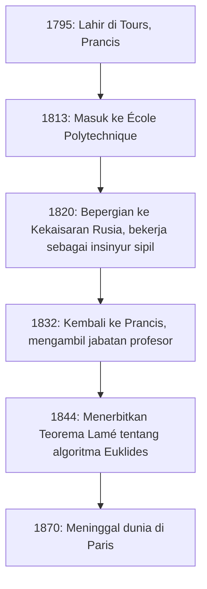
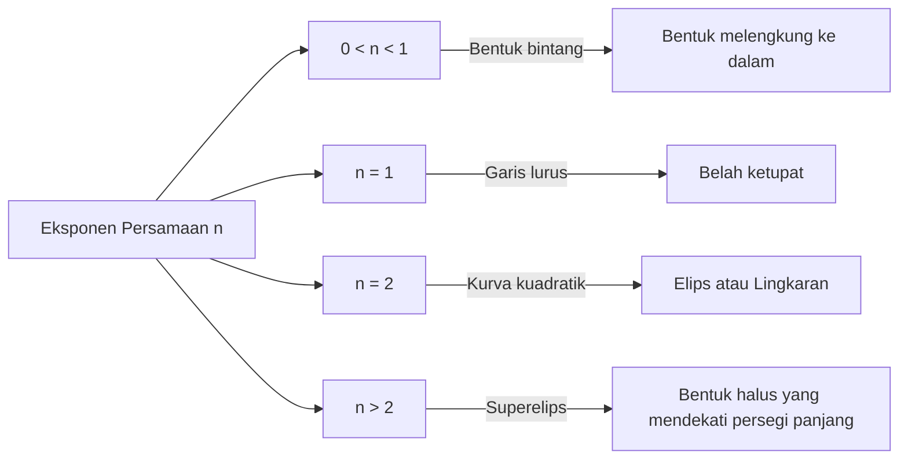

## 1. Pendahuluan: Siapakah [Gabriel Lamé](https://kenji.blog/id/p/lame/)?

[Gabriel Lamé](https://kenji.blog/id/p/lame/) (22 Juli 1795 – 1 Mei 1870) adalah seorang matematikawan, fisikawan, dan insinyur Prancis terkemuka abad ke-19. Kontribusinya mencakup rentang yang sangat luas, dari matematika murni hingga matematika terapan, dan bahkan teknik sipil praktis. Saat ini, namanya tetap terukir dalam buku teks matematika dan fisika melalui **kurva Lamé** (superelips), **Teorema Lamé** dalam algoritma Euklides, dan **parameter [Lamé](https://kenji.blog/id/p/lame/)** dalam teori elastisitas.

Dalam artikel ini, kita akan menelusuri lintasan kehidupan [Lamé](https://kenji.blog/id/p/lame/) yang penuh peristiwa sambil menjelaskan secara komprehensif dan sistematis pencapaian matematika dan fisika inovatif yang ia tinggalkan. Memahami kehidupan dan proses pemikirannya memberikan perspektif yang sangat berharga tentang bagaimana sains abad ke-19 meletakkan dasar bagi era modern.

## 2. Kehidupan dan Karier [Gabriel Lamé](https://kenji.blog/id/p/lame/)

Kehidupan [Lamé](https://kenji.blog/id/p/lame/) sangat terkait erat dengan masyarakat Eropa yang bergejolak pada awal abad ke-19. Kariernya tidak terbatas pada menara gading akademis, tetapi didasarkan pada pengalaman praktis yang keras di lapangan.

### 2.1 Kelahiran dan Pendidikan di Masa Pergolakan

[Gabriel Lamé](https://kenji.blog/id/p/lame/) lahir pada tahun 1795 di kota Tours, Prancis tengah. Ini adalah masa setelah Revolusi Prancis, suatu periode ketika masyarakat secara keseluruhan mengalami transformasi besar-besaran. Bakat matematikanya berkembang pesat sejak dini, dan pada tahun 1813 ia masuk ke **École Polytechnique** yang bergengsi. Di sana, ia bersaing dan belajar bersama banyak pemikir brilian yang kelak akan memimpin dunia ilmiah. Setelah lulus, ia memperdalam pengetahuan teknik praktisnya di **École des Mines**.

### 2.2 Bekerja di Rusia: Praktik sebagai Insinyur

Pada tahun 1820, titik balik besar terjadi dalam kehidupan [Lamé](https://kenji.blog/id/p/lame/). Bersama dengan kolega dan teman dekatnya Émile Clapeyron, ia menerima undangan dari Kekaisaran Rusia dan melakukan perjalanan ke Saint Petersburg. Pada saat itu, Rusia sedang bergegas untuk memodernisasi infrastrukturnya dan membutuhkan insinyur terampil.

Selama tinggal di Rusia, [Lamé](https://kenji.blog/id/p/lame/) bekerja sebagai insinyur sipil di berbagai proyek nasional, termasuk merancang jembatan dan membangun jalan. Secara khusus, pengetahuan matematika tingkat lanjutnya secara langsung diterapkan dalam desain jembatan gantung yang melintasi sungai-sungai di Saint Petersburg. Pengalaman lapangan praktis ini sangat memengaruhi penelitiannya di kemudian hari dalam bidang fisika dan matematika terapan.



### 2.3 Kembali ke Prancis dan Kejayaan Akademis

Pada tahun 1832, setelah 12 tahun bekerja di Rusia, [Lamé](https://kenji.blog/id/p/lame/) kembali ke Prancis. Sekembalinya, ia menjadi profesor fisika di almamaternya, École Polytechnique. Ia juga mengajar di Sorbonne (Universitas Paris), mendedikasikan dirinya untuk melatih banyak generasi mendatang. Pada tahun 1843, sebagai pengakuan atas pencapaiannya yang luar biasa, ia terpilih menjadi anggota Akademi Ilmu Pengetahuan Prancis.

## 3. Kontribusi pada Matematika: Kurva [Lamé](https://kenji.blog/id/p/lame/) (Superelips)

Salah satu kontribusi [Lamé](https://kenji.blog/id/p/lame/) yang paling visual dan terkenal pada matematika murni adalah studinya tentang figur geometris yang dikenal sebagai **kurva [Lamé](https://kenji.blog/id/p/lame/)**, atau **superelips**.

### 3.1 Persamaan dan Keragaman Bentuk

Kurva [Lamé](https://kenji.blog/id/p/lame/) ditentukan oleh persamaan berikut dalam sistem koordinat Kartesius:

$$ \left| \frac{x}{a} \right|^n + \left| \frac{y}{b} \right|^n = 1 $$

Di sini, $a$ dan $b$ adalah bilangan real positif yang menentukan lebar dan tinggi kurva, dan $n$ adalah bilangan real positif (eksponen) yang menentukan bentuk kurva. Tergantung pada nilai $n$, kurva [Lamé](https://kenji.blog/id/p/lame/) mengambil bentuk yang sama sekali berbeda.

- Jika $n = 2$, ini cocok dengan persamaan **elips** standar. Jika $a = b$, ia menjadi **lingkaran**.
- Jika $n < 1$, kurva menjadi bentuk bintang yang melengkung ke dalam (mirip astroid).
- Jika $n = 1$, ia menjadi **belah ketupat** yang menghubungkan setiap kuadran dengan garis lurus.
- Jika $n > 2$, kurva secara bertahap mendekati bentuk persegi panjang. Terutama ketika $n$ mendekati tak terhingga, ia menjadi persegi panjang yang sempurna.



### 3.2 Aplikasi Modern: Dari Desain hingga Arsitektur

Kurva ini, yang dipelajari oleh [Lamé](https://kenji.blog/id/p/lame/) murni karena minat matematika, diterapkan pada perencanaan kota dan desain industri pada abad ke-20 oleh desainer Denmark Piet Hein. Saat ini, kurva tersebut digunakan di mana-mana sebagai bentuk yang memadukan keindahan dan kepraktisan—mulai dari bentuk ikon ponsel pintar dan desain font hingga struktur arsitektur raksasa.

Berikut adalah contoh program sederhana yang menghitung koordinat kurva [Lamé](https://kenji.blog/id/p/lame/).

```python
import numpy as np

# Fungsi untuk menghitung koordinat kurva Lamé
def calculate_lame_curve(a, b, n, num_points=100):
    """
    Menghasilkan titik-titik untuk kurva Lamé berdasarkan parameter yang ditentukan.
    """
    points = []
    # Memvariasikan sudut dari 0 hingga 2π
    theta = np.linspace(0, 2 * np.pi, num_points)
    for t in theta:
        # Perhitungan koordinat menggunakan persamaan parametrik
        x = a * np.sign(np.cos(t)) * (np.abs(np.cos(t)) ** (2 / n))
        y = b * np.sign(np.sin(t)) * (np.abs(np.sin(t)) ** (2 / n))
        points.append((x, y))
    return points
```

## 4. Kontribusi pada Teori Bilangan: Teorema [Lamé](https://kenji.blog/id/p/lame/) dan Algoritma [Euklides](https://kenji.blog/p/euclid/)

Dalam ilmu komputer dan teori bilangan, apa yang membuat nama [Lamé](https://kenji.blog/id/p/lame/) paling terkenal adalah **Teorema [Lamé](https://kenji.blog/id/p/lame/)**. Ini dikenal sebagai salah satu contoh paling awal dalam sejarah yang mengevaluasi kompleksitas komputasi (waktu eksekusi) suatu algoritma secara matematis dan ketat.

### 4.1 Tinjauan dan Signifikansi Teorema

**Algoritma [Euklides](https://kenji.blog/p/euclid/)**, yang diwariskan dari Yunani kuno, adalah algoritma yang efisien untuk menemukan pembagi persekutuan terbesar dari dua bilangan asli. Namun, hingga Lamé pada tahun 1844, tidak ada seorang pun yang secara akurat membuktikan dengan pasti "seberapa cepat" algoritma ini selesai. Teorema [Lamé](https://kenji.blog/id/p/lame/) menyatakan hal berikut:

> "Ketika mencari pembagi persekutuan terbesar dari dua bilangan bulat menggunakan algoritma [Euklides](https://kenji.blog/p/euclid/), jumlah pembagian (langkah) yang diperlukan tidak pernah melebihi 5 kali jumlah digit desimal dari bilangan yang lebih kecil."

Dinyatakan sebagai rumus, yaitu:

$$ \text{Jumlah langkah} \le 5 \times \text{Jumlah digit dari bilangan yang lebih kecil} $$

### 4.2 Hubungan Mendalam dengan Deret [Fibonacci](https://kenji.blog/id/p/fibonacci/)

Dalam proses pembuktian teorema ini, [Lamé](https://kenji.blog/id/p/lame/) menemukan bahwa skenario terburuk (berarti yang mengambil langkah paling banyak) untuk algoritma Euklides terjadi ketika inputnya adalah dua **bilangan Fibonacci** yang berurutan. Dengan memanfaatkan tingkat pertumbuhan deret Fibonacci dan sifat-sifat rasio emas, ia memperoleh batas atas yang indah ini. Karena pencapaian ini, [Lamé](https://kenji.blog/id/p/lame/) dianggap sebagai salah satu "bapak teori kompleksitas" dalam ilmu komputer modern.

## 5. Kontribusi pada Fisika: Teori Elastisitas dan Parameter [Lamé](https://kenji.blog/id/p/lame/)

Dengan latar belakangnya sebagai insinyur sipil, [Lamé](https://kenji.blog/id/p/lame/) juga memberikan kontribusi yang menentukan pada fisika kekuatan dan deformasi material, yaitu **teori elastisitas**.

### 5.1 Dasar Mekanika Kontinum

Pada tahun 1852, [Lamé](https://kenji.blog/id/p/lame/) menerbitkan teori komprehensif untuk menggambarkan perilaku benda elastis isotropik (material dengan sifat fisik yang sama ke segala arah). Ia merumuskan hubungan antara tegangan (stress) dan regangan (strain) dalam ruang tiga dimensi dengan menggunakan hanya dua parameter independen. Ini dikenal saat ini sebagai **parameter [Lamé](https://kenji.blog/id/p/lame/)**, $\lambda$ dan $\mu$.

Hukum Hooke yang digeneralisasi dijelaskan dengan indah menggunakan parameter [Lamé](https://kenji.blog/id/p/lame/) sebagai berikut:

$$ \sigma_{ij} = 2\mu \varepsilon_{ij} + \lambda \delta_{ij} \text{Regangan volumetrik} $$

Di sini, $\sigma_{ij}$ mewakili tensor tegangan, $\varepsilon_{ij}$ mewakili tensor regangan, dan $\delta_{ij}$ mewakili delta [Kronecker](https://kenji.blog/id/p/kronecker/).

### 5.2 Makna Fisik dan Aplikasi Teknik

Dari dua konstanta tersebut, $\mu$ disebut **modulus geser**, yang menunjukkan seberapa kuat suatu material menahan perubahan bentuk. Di sisi lain, $\lambda$ disebut **parameter pertama [Lamé](https://kenji.blog/id/p/lame/)**. Meskipun interpretasi fisiknya secara langsung agak kompleks, hal ini terkait dengan ketahanan terhadap perubahan volume. Dengan menggunakan parameter ini, analisis esensial dalam teknik modern dan geofisika menjadi mungkin, seperti menghitung perambatan gelombang seismik (kecepatan gelombang P dan gelombang S) serta perhitungan struktural untuk jembatan dan bangunan.

## 6. Kontribusi pada Analisis: Koordinat Kurvilinear dan Persamaan Panas

Pencapaian hebat [Lamé](https://kenji.blog/id/p/lame/) lainnya adalah studi sistematisnya tentang **koordinat kurvilinear**. Dalam bukunya yang diterbitkan pada tahun 1859, ia menetapkan kerangka kerja matematika umum untuk menangani persamaan diferensial tidak hanya dalam koordinat Kartesius tetapi juga dalam koordinat silinder, bola, dan bahkan elipsoidal.

Secara khusus, untuk memecahkan **persamaan Laplace**, yang menggambarkan fenomena konduksi panas dalam ruang, ia menunjukkan pentingnya memilih sistem koordinat yang disesuaikan dengan kondisi batas yang kompleks (seperti benda elipsoidal). **Faktor skala [Lamé](https://kenji.blog/id/p/lame/)** yang ia perkenalkan dalam proses ini membentuk dasar dari kalkulus vektor modern dan analisis tensor.

## 7. Tantangan dan Kemunduran dengan [Teorema Terakhir Fermat](https://kenji.blog/id/p/fermats-last-theorem/)

Sebuah episode dramatis dalam kehidupan [Lamé](https://kenji.blog/id/p/lame/) adalah usahanya untuk membuktikan **Teorema Terakhir Fermat** pada tahun 1847. Pada bulan Maret tahun itu, Lamé dengan bangga mengumumkan di Akademi Ilmu Pengetahuan Prancis bahwa ia telah "sepenuhnya membuktikan [Teorema Terakhir Fermat](https://kenji.blog/id/p/fermats-last-theorem/)." Buktinya melibatkan pendekatan yang sangat inovatif dan kuat pada masa itu: memfaktorkan persamaan menggunakan bilangan kompleks siklotomik.

Namun, segera setelah presentasinya, koleganya, matematikawan Joseph [Liouville](https://kenji.blog/id/p/liouville/), dengan tajam menunjukkan bahwa "bukti tersebut bersandar pada asumsi diam-diam yang belum terbukti bahwa 'faktorisasi prima unik' juga berlaku di ranah bilangan kompleks." Tak lama kemudian, sepucuk surat tiba dari matematikawan Jerman Ernst Kummer yang menunjukkan bahwa "faktorisasi prima unik secara umum tidak berlaku," yang secara efektif membuat bukti [Lamé](https://kenji.blog/id/p/lame/) tidak sah.

Ini adalah kemunduran besar bagi [Lamé](https://kenji.blog/id/p/lame/), tetapi serangkaian diskusi ini memicu lahirnya teori "bilangan ideal" (ideals) Kummer, yang kemudian membuka bidang matematika masif teori bilangan aljabar. Tantangan berani [Lamé](https://kenji.blog/id/p/lame/) pada akhirnya mendorong sejarah matematika maju secara signifikan.

## 8. Tulisan dan Peran sebagai Pendidik

[Lamé](https://kenji.blog/id/p/lame/) bukan hanya seorang peneliti tetapi juga sangat berbakat sebagai seorang pendidik. Kuliahnya di École Polytechnique dan Sorbonne memikat banyak mahasiswa dengan kejernihan dan progresi logisnya. Ia menerbitkan banyak buku teks yang mengkompilasi catatan kuliah dan hasil penelitiannya, yang diadopsi sebagai teks standar di universitas-universitas di seluruh Eropa.

Karya-karya pentingnya termasuk "Pelajaran tentang Teori Matematika Elastisitas" (1852) dan "Pelajaran tentang Koordinat Kurvilinear dan Aplikasinya" (1859). Ciri khas dari karya-karya ini adalah bahwa ia tidak pernah membiarkan teori matematika tingkat lanjut dalam bentuk abstrak; ia selalu menjelaskannya dengan menghubungkannya dengan fenomena fisik atau pemecahan masalah teknik. [Lamé](https://kenji.blog/id/p/lame/) sangat percaya bahwa "matematika adalah bahasa untuk membuka kebenaran alam," dan filosofi pendidikannya sangat diwarisi oleh generasi ilmuwan berikutnya.

Di tahun-tahun terakhirnya, [Lamé](https://kenji.blog/id/p/lame/) menderita kemalangan kehilangan pendengarannya, yang membuat pengajarannya menjadi sulit. Meskipun demikian, ia tidak pernah kehilangan hasratnya terhadap penelitian dan melanjutkan kegiatan menulisnya sepanjang hidupnya.

## 9. Kesimpulan: Apa yang [Lamé](https://kenji.blog/id/p/lame/) Tinggalkan untuk Era Modern

Melihat kembali kehidupan dan pencapaian [Gabriel Lamé](https://kenji.blog/id/p/lame/), jelas bahwa ia dengan sempurna menggabungkan "keindahan abstrak dari matematika murni" dengan "kegunaan dari matematika terapan dan fisika."

Di balkon lantai pertama Menara Eiffel, nama 72 ilmuwan hebat yang berkontribusi pada sains dan teknologi Prancis terukir, dan di antara mereka berdiri dengan bangga nama [Lamé](https://kenji.blog/id/p/lame/) (LAMÉ). Teorema, konstanta, dan pendekatan inovatif yang ia tinggalkan terus hidup hingga saat ini di ujung tombak sains dan teknologi, di tangan para insinyur dan matematikawan modern.
