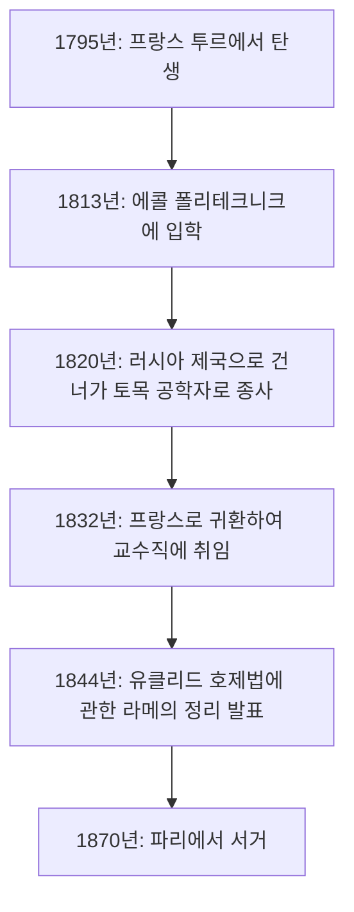
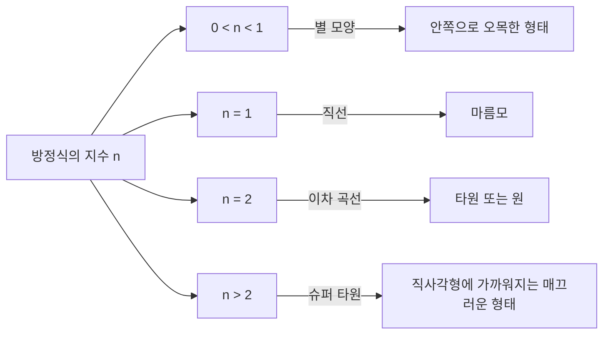

## 1. 도입: 가브리엘 라메는 누구인가?

가브리엘 라메(Gabriel Lamé, 1795년 7월 22일 – 1870년 5월 1일)는 19세기 프랑스를 대표하는 수학자, 물리학자, 그리고 공학자입니다. 순수 수학에서 응용 수학, 나아가 실제 토목 공학에 이르기까지 그의 발자취는 극히 광범위합니다. 현대에도 그의 이름은 **라메 곡선** (슈퍼 타원)이나, **유클리드 호제법** 에서의 **라메의 정리** , 그리고 탄성학에서의 **라메 상수** 로써 수학과 물리학 교과서에 깊이 새겨져 있습니다.

본 기사에서는 라메의 파란만장한 생애의 궤적을 더듬어보며, 그가 남긴 수많은 획기적인 수학적, 물리학적 업적에 대해 상세하고 체계적으로 해설합니다. 라메의 인생과 사유의 과정을 아는 것은 19세기의 과학이 어떻게 현대의 기초를 닦았는지 이해하는 데 매우 유익한 시각을 제공합니다.

## 2. 가브리엘 라메의 생애와 경력

라메의 생애는 19세기 초반의 격동하는 유럽 사회와 깊이 연결되어 있습니다. 그의 커리어는 단순한 상아탑에 머물지 않고, 현장에서의 가혹한 실무 경험으로 뒷받침되었습니다.

### 2.1 격동의 시대에서의 탄생과 교육

가브리엘 라메는 1795년 프랑스 중부 도시 투르에서 태어났습니다. 시대는 바야흐로 프랑스 혁명의 여파 속이었으며, 사회 전체가 큰 변혁을 겪고 있던 시기였습니다. 그는 젊어서부터 수학적 재능을 꽃피워, 1813년에 명문 **에콜 폴리테크니크** (이공과대학)에 입학합니다. 그곳에서 그는 훗날 과학계를 이끌어갈 많은 우수한 두뇌들과 절차탁마했습니다. 졸업 후, 그는 더욱 실용적인 공학 지식을 심화하기 위해 **에콜 데 민** (국립광업학교)에 진학했습니다.

### 2.2 러시아에서의 활약: 공학자로서의 실천

1820년, 라메의 인생에 큰 전환기가 찾아옵니다. 그는 동료이자 절친한 친구이기도 했던 에밀 클라페이롱(Émile Clapeyron)과 함께 러시아 제국의 초청을 받아 상트페테르부르크로 향했습니다. 당시 러시아는 인프라 정비의 근대화를 서두르고 있었으며, 우수한 기술자를 필요로 하고 있었습니다.

러시아에 체류하는 동안 라메는 토목 공학자로서 교량 설계나 도로 건설 등 수많은 국가 프로젝트에 참여했습니다. 특히 상트페테르부르크의 강에 놓이는 현수교 설계에 있어서는 그의 고도화된 수학적 지식이 직접적으로 응용되었습니다. 이 현장에서의 실천적인 경험은 훗날 그의 물리학적, 응용 수학적 연구에 깊은 영향을 미쳤습니다.



### 2.3 프랑스로의 귀환과 학계에서의 영광

1832년, 러시아에서의 12년간에 걸친 활약을 마치고 라메는 프랑스로 귀환했습니다. 귀국 후, 그는 모교인 에콜 폴리테크니크에서 물리학 교수로 취임합니다. 또한 소르본 대학(파리 대학)에서도 교편을 잡아 많은 후학 양성에 힘썼습니다. 1843년에는 그 지대한 공로를 인정받아 프랑스 과학 아카데미의 회원으로 선출되었습니다.

## 3. 수학에 대한 기여: 라메 곡선 (슈퍼 타원)

라메의 순수 수학에 있어서 가장 시각적이고 유명한 공헌 중 하나가 **라메 곡선** (Lamé curves), 또는 **슈퍼 타원** (Superellipse)이라고 불리는 기하학적 도형에 대한 연구입니다.

### 3.1 방정식과 형상의 다양성

라메 곡선은 직교 좌표계에서 다음과 같은 방정식으로 정의됩니다.

$$ \left| \frac{x}{a} \right|^n + \left| \frac{y}{b} \right|^n = 1 $$

여기서 $a$ 와 $b$ 는 곡선의 너비와 높이를 결정하는 양의 실수이며, $n$ 은 곡선의 형태를 결정하는 양의 실수(지수)입니다. 이 $n$ 의 값에 따라 라메 곡선은 완전히 다른 형태를 취하게 됩니다.

- $n = 2$ 인 경우, 이는 일반적인 **타원** 의 방정식과 일치합니다. 만약 $a = b$ 라면 **원** 이 됩니다.
- $n < 1$ 인 경우, 곡선은 안쪽으로 오목한 별 모양이 됩니다(아스테로이드 형태).
- $n = 1$ 인 경우, 각 사분면을 직선으로 연결한 **마름모** 가 됩니다.
- $n > 2$ 인 경우, 곡선은 서서히 직사각형에 가까워집니다. 특히 $n$ 이 무한대에 가까워지면 완전한 직사각형이 됩니다.



### 3.2 현대에의 응용: 디자인에서 건축까지

라메가 순수한 수학적 흥미에서 연구한 이 곡선은 20세기에 들어서 덴마크의 디자이너 피트 하인에 의해 도시 계획 및 산업 디자인에 응용되었습니다. 현재는 스마트폰 아이콘의 모양, 폰트 디자인, 나아가 거대한 건축물의 구조에 이르기까지 아름다움과 실용성을 겸비한 형태로서 도처에서 활용되고 있습니다.

아래는 라메 곡선의 좌표를 계산하는 간단한 프로그램 예시입니다.

```python
import numpy as np

# 라메 곡선의 좌표를 계산하는 함수
def calculate_lame_curve(a, b, n, num_points=100):
    """
    지정된 파라미터에 기초하여 라메 곡선의 점들을 생성합니다.
    """
    points = []
    # 각도를 0부터 2π까지 변화시킵니다
    theta = np.linspace(0, 2 * np.pi, num_points)
    for t in theta:
        # 매개변수 방정식을 이용한 좌표 계산
        x = a * np.sign(np.cos(t)) * (np.abs(np.cos(t)) ** (2 / n))
        y = b * np.sign(np.sin(t)) * (np.abs(np.sin(t)) ** (2 / n))
        points.append((x, y))
    return points
```

## 4. 정수론에 대한 기여: 라메의 정리와 유클리드 호제법

컴퓨터 과학 및 정수론에서 라메의 이름을 가장 유명하게 만든 것이 **라메의 정리** (Lamé's Theorem)입니다. 이는 알고리즘의 계산 복잡도(실행 시간)를 수학적으로 엄밀하게 평가한 역사상 최초기의 예로 알려져 있습니다.

### 4.1 정리의 개요와 의의

고대 그리스부터 전해지는 **유클리드 호제법** 은 두 자연수의 최대공약수를 효율적으로 구하는 알고리즘입니다. 하지만 이 알고리즘이 "얼마나 빨리 끝나는지"를 정확하게 증명한 인물은 1844년의 라메 이전까지 존재하지 않았습니다. 라메의 정리는 다음과 같이 서술하고 있습니다.

> "유클리드 호제법을 이용하여 두 정수의 최대공약수를 구할 때, 필요한 나눗셈의 횟수(단계 수)는 작은 쪽 수의 십진법 자릿수의 5배를 결코 초과하지 않는다."

수식으로 표현하면 다음과 같습니다.

$$ \text{단계 수} \le 5 \times \text{작은 쪽 수의 자릿수} $$

### 4.2 피보나치 수열과의 깊은 연관성

라메는 이 정리를 증명하는 과정에서, 유클리드 호제법이 가장 어려움을 겪는(즉, 가장 단계 수가 많아지는) 최악의 경우가 연속하는 두 **피보나치 수** 를 입력으로 한 경우라는 것을 발견했습니다. 피보나치 수열의 성장률과 황금비의 성질을 이용함으로써, 그는 이 아름다운 상한을 도출해 낸 것입니다. 이 업적으로 인해 라메는 현대 컴퓨터 과학에서 "계산 복잡도 이론의 아버지" 중 한 명으로도 간주되고 있습니다.

## 5. 물리학에 대한 기여: 탄성 이론과 라메 상수

토목 공학자로서의 배경을 가진 라메는 재료의 강도나 변형에 관한 물리학, 즉 **탄성 이론** 에 있어서도 결정적인 공헌을 했습니다.

### 5.1 연속체 역학의 기초

1852년, 라메는 등방성 탄성체(어느 방향으로든 동일한 물리적 성질을 가지는 물질)의 거동을 기술하기 위한 포괄적인 이론을 발표했습니다. 그는 3차원 공간에서 물질의 응력(스트레스)과 변형(스트레인)의 관계를 단 두 개의 독립된 파라미터를 사용하여 정식화했습니다. 이것이 오늘날 **라메 상수** (Lamé parameters)라고 불리는 $\lambda$ 와 $\mu$ 입니다.

일반화된 훅의 법칙은 라메 상수를 이용하여 다음과 같이 아름답게 기술됩니다.

$$ \sigma_{ij} = 2\mu \varepsilon_{ij} + \lambda \delta_{ij} \text{부피 변형률} $$

여기서 $\sigma_{ij}$ 는 응력 텐서, $\varepsilon_{ij}$ 는 변형률 텐서, $\delta_{ij}$ 는 크로네커 델타를 나타냅니다.

### 5.2 물리적 의미와 공학에의 응용

두 상수 중 $\mu$ 는 **강성률** (전단 탄성 계수)이라 불리며, 물질이 형태의 변화에 대해 얼마나 저항하는지를 나타냅니다. 한편 $\lambda$ 는 **라메의 제1 상수** 라고 불리며, 직접적인 물리적 해석은 다소 복잡하지만 부피 변화에 대한 저항력과 관련이 있습니다. 이들을 사용함으로써 지진파의 전파(P파와 S파의 속도 계산)나 교량 및 건축물의 구조 계산 등, 현대의 공학과 지구 물리학에서 필수 불가결한 해석이 가능해졌습니다.

## 6. 해석학에 대한 기여: 곡선 좌표계와 열전도 방정식

라메의 또 다른 위대한 업적은 **곡선 좌표계** (Curvilinear coordinates)에 대한 체계적인 연구입니다. 그는 1859년에 출판된 저서에서 직교 좌표계뿐만 아니라 원통 좌표계, 구면 좌표계, 나아가 타원 좌표계 등 다양한 좌표계에서 미분 방정식을 다루기 위한 일반적인 수학적 틀을 구축했습니다.

특히 그는 공간 내의 열전도 현상을 기술하는 **라플라스 방정식** 을 풀기 위해, 복잡한 경계 조건(예를 들어 타원체 모양의 물체 등)에 맞춘 좌표계를 선택하는 것의 중요성을 보여주었습니다. 이 과정에서 그가 도입한 **라메의 계량 계수** (Scale factors)는 현대 벡터 해석 및 텐서 해석의 기초가 되었습니다.

## 7. 페르마의 마지막 정리에 대한 도전과 좌절

라메의 생애에서 극적인 에피소드로서 1847년의 **페르마의 마지막 정리** 에 대한 도전을 들 수 있습니다. 같은 해 3월, 라메는 프랑스 과학 아카데미에서 "페르마의 마지막 정리를 완전히 증명했다"고 화려하게 선언했습니다. 그의 증명은 원분체의 복소수를 이용하여 방정식을 인수분해한다는 당시로서는 매우 참신하고 강력한 접근법이었습니다.

하지만 그 발표 직후, 동료 수학자인 조제프 리우빌이 "그 증명은 복소수의 세계에서도 '소인수 분해의 유일성'이 성립한다는 암묵적인 가정에 바탕을 두고 있으나, 그것은 증명되지 않았다"고 날카롭게 지적했습니다. 게다가 그 후, 독일의 에른스트 쿠머로부터 "소인수 분해의 유일성은 일반적으로 성립하지 않는다"는 것을 보여주는 편지가 도착하여 라메의 증명은 무효인 것으로 확정되었습니다.

라메에게는 큰 좌절이었지만, 일련의 논의가 계기가 되어 쿠머에 의한 "이상수(이데알)" 이론이 탄생하였고, 훗날 대수적 정수론이라는 거대한 수학 분야가 개척되게 된 것입니다. 라메의 대담한 도전은 결과적으로 수학의 역사를 크게 전진시켰습니다.

## 8. 저서와 교육자로서의 측면

라메는 연구자로서뿐만 아니라 교육자로서도 매우 뛰어난 재능을 가지고 있었습니다. 에콜 폴리테크니크와 소르본 대학에서의 그의 강의는 그 명쾌함과 논리적인 전개로 많은 학생들을 매료시켰습니다. 그는 자신의 강의 노트와 연구 성과를 엮은 수많은 교과서를 출판했으며, 그것들은 당시 유럽 전역의 대학에서 표준적인 텍스트로 채택되었습니다.

대표적인 저서로는 『탄성체의 수학적 이론에 관한 강의』(1852년)와 『곡선 좌표 및 그 응용에 관한 강의』(1859년)가 있습니다. 이러한 저작의 특징은 고도의 수학적 이론을 추상적인 채로 끝내지 않고, 항상 물리학적인 현상이나 공학적인 문제 해결과 결부시켜 해설하고 있다는 점에 있습니다. 라메는 "수학은 자연계의 진리를 밝혀내기 위한 언어이다"라는 신념을 강하게 가지고 있었으며, 그 교육 철학은 다음 세대의 과학자들에게 깊이 계승되었습니다.

만년의 라메는 청력을 잃는 불운을 겪으며 교단에 서는 것이 어려워졌지만, 그럼에도 연구에 대한 열정을 잃지 않고 평생 동안 집필 활동을 계속했습니다.

## 9. 결론: 라메가 현대에 남긴 것

가브리엘 라메의 생애와 업적을 되돌아보면, 그가 "순수 수학의 추상적인 아름다움"과 "응용 수학 및 물리학의 실용성"을 완벽하게 융합시켰음을 잘 알 수 있습니다.

에펠탑의 1층 발코니에는 프랑스의 과학 기술에 공헌한 72명의 위대한 과학자들의 이름이 새겨져 있는데, 그 중에 라메의 이름(LAMÉ)도 당당히 새겨져 있습니다. 그가 남긴 정리, 상수, 그리고 혁신적인 접근법은 오늘날에도 여전히 수학자나 엔지니어들의 손에 의해 최첨단 과학 기술 속에서 숨 쉬고 있습니다.
