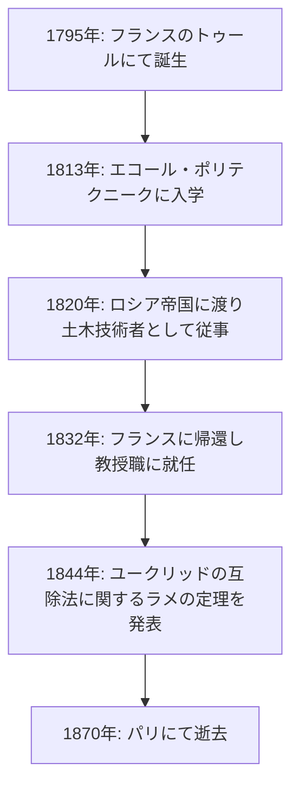
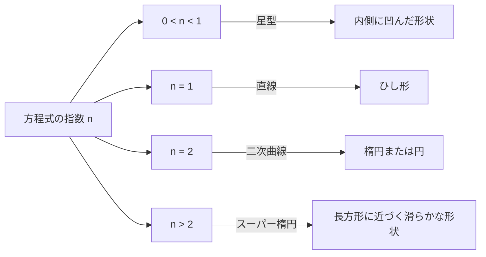

## 1. 導入：ガブリエル・ラメとは何者か

ガブリエル・ラメ（Gabriel Lamé, 1795年7月22日 – 1870年5月1日）は、19世紀のフランスを代表する数学者、物理学者、そして工学者です。純粋数学から応用数学、さらには実際の土木工学に至るまで、彼の足跡は極めて広範囲に及びます。現代においても、彼の名前は **ラメ曲線** （スーパー楕円）や、 **ユークリッドの互除法** における **ラメの定理** 、そして弾性力学における **ラメ定数** として、数学や物理学の教科書に深く刻まれています。

本記事では、ラメの波乱に満ちた生涯の軌跡を辿りつつ、彼が遺した数々の画期的な数学的・物理学的業績について、詳細かつ体系的に解説します。ラメの人生と思索の過程を知ることは、19世紀の科学がどのようにして現代の基礎を築いたのかを理解する上で、非常に有益な視座を提供してくれます。

## 2. ガブリエル・ラメの生涯と経歴

ラメの生涯は、19世紀初頭の激動のヨーロッパ社会と深く結びついています。彼のキャリアは単なる象牙の塔に留まらず、現場での過酷な実務経験に裏打ちされていました。

### 2.1 激動の時代における誕生と教育

ガブリエル・ラメは1795年、フランス中部の都市トゥールに生まれました。時代はまさにフランス革命の余波の中であり、社会全体が大きな変革を遂げつつある時期でした。彼は若くして数学の才能を開花させ、1813年に名門 **エコール・ポリテクニーク** （理工科学校）に入学します。そこで彼は、後の科学界を牽引する多くの優秀な頭脳と切磋琢磨しました。卒業後、彼はさらに **エコール・デ・ミーヌ** （国立高等鉱業学校）に進学し、実用的な工学の知識を深めました。

### 2.2 ロシアでの活躍：工学者としての実践

1820年、ラメの人生に大きな転機が訪れます。彼は同僚であり親友でもあったエミール・クラペイロン（Émile Clapeyron）と共に、ロシア帝国からの招待を受けてサンクトペテルブルクへと赴きました。当時、ロシアはインフラ整備の近代化を急いでおり、優秀な技術者を必要としていたのです。

ロシアでの滞在中、ラメは土木技術者として、橋梁の設計や道路の建設など、数々の国家プロジェクトに携わりました。特に、サンクトペテルブルクの街を流れる川に架かる吊り橋の設計においては、彼の高度な数学的知識が直接的に応用されました。この現場での実践的な経験は、後の彼の物理学的・応用数学的研究に深い影響を与えました。



### 2.3 フランスへの帰還と学界での栄光

1832年、ロシアでの12年間にわたる活躍を経て、ラメはフランスに帰還しました。帰国後、彼は母校であるエコール・ポリテクニークで物理学の教授職に就任します。また、ソルボンヌ大学（パリ大学）でも教鞭を執り、多くの後進の育成に尽力しました。1843年には、その多大な功績が認められ、フランス科学アカデミーの会員に選出されました。

## 3. 数学への貢献：ラメ曲線（スーパー楕円）

ラメの純粋数学における最も視覚的で有名な貢献の一つが、 **ラメ曲線** （Lamé curves）、または **スーパー楕円** （Superellipse）と呼ばれる幾何学的な図形の研究です。

### 3.1 方程式と形状の多様性

ラメ曲線は、以下の直交座標系における方程式で定義されます。

$$ \left| \frac{x}{a} \right|^n + \left| \frac{y}{b} \right|^n = 1 $$

ここで、$a$ と $b$ は曲線の幅と高さを決定する正の実数であり、$n$ は曲線の形状を決定する正の実数（指数）です。この $n$ の値によって、ラメ曲線は全く異なる形状に変化します。

- $n = 2$ の場合、これは通常の **楕円** の方程式と一致します。もし $a = b$ ならば **円** になります。
- $n < 1$ の場合、曲線は内側に凹んだ星型のようになります（アステロイド状）。
- $n = 1$ の場合、各象限を直線で結んだ **ひし形** になります。
- $n > 2$ の場合、曲線は徐々に長方形に近づいていきます。特に $n$ が無限大に近づくと、完全な長方形になります。



### 3.2 現代への応用：デザインから建築まで

ラメが純粋な数学的興味から研究したこの曲線は、20世紀に入ってから、デンマークのデザイナーであるピート・ハインによって都市計画や工業デザインに応用されました。現在では、スマートフォン等のアイコンの形状、フォントのデザイン、さらには巨大な建築物の構造に至るまで、美しさと実用性を兼ね備えた形状として至る所で活用されています。

以下は、ラメ曲線の座標を計算する簡単なプログラムの例です。

```python
import numpy as np

# ラメ曲線の座標を計算する関数
def calculate_lame_curve(a, b, n, num_points=100):
    """
    指定されたパラメータに基づいてラメ曲線の点を生成します。
    """
    points = []
    # 角度を0から2πまで変化させる
    theta = np.linspace(0, 2 * np.pi, num_points)
    for t in theta:
        # パラメータ方程式を用いた座標計算
        x = a * np.sign(np.cos(t)) * (np.abs(np.cos(t)) ** (2 / n))
        y = b * np.sign(np.sin(t)) * (np.abs(np.sin(t)) ** (2 / n))
        points.append((x, y))
    return points
```

## 4. 数論への貢献：ラメの定理とユークリッドの互除法

計算機科学や数論において、ラメの名前を最も有名にしているのが **ラメの定理** （Lamé's Theorem）です。これは、アルゴリズムの計算量（実行時間）を数学的に厳密に評価した歴史上最初期の例として知られています。

### 4.1 定理の概要と意義

古代ギリシャから伝わる **ユークリッドの互除法** は、二つの自然数の最大公約数を効率的に求めるアルゴリズムです。しかし、このアルゴリズムが「どれくらい速く終わるのか」を正確に証明した人物は、1844年のラメまで存在しませんでした。ラメの定理は次のように述べています。

> 「ユークリッドの互除法を用いて二つの整数の最大公約数を求める際、必要な割り算の回数（ステップ数）は、小さい方の数の十進法における桁数の5倍を決して超えない。」

数式で表すと以下のようになります。

$$ \text{ステップ数} \le 5 \times \text{小さい方の数の桁数} $$

### 4.2 フィボナッチ数列との深い繋がり

ラメはこの定理を証明する過程で、ユークリッドの互除法が最も手こずる（つまり最もステップ数が多くなる）最悪のケースが、連続する二つの **フィボナッチ数** を入力とした場合であることを発見しました。フィボナッチ数列の成長率と黄金比の性質を利用することで、彼はこの美しい上限を導き出したのです。この業績により、ラメは現代の計算機科学における「計算量理論の祖」の一人とも見なされています。

## 5. 物理学への貢献：弾性理論とラメ定数

土木工学者としてのバックグラウンドを持つラメは、材料の強度や変形に関する物理学、すなわち **弾性理論** においても決定的な貢献をしました。

### 5.1 連続体力学の基礎

1852年、ラメは等方性弾性体（どの方向にも同じ物理的性質を持つ物質）の振る舞いを記述するための包括的な理論を発表しました。彼は、三次元空間における物質の応力（ストレス）と歪み（ストレイン）の関係を、たった二つの独立したパラメータを用いて定式化しました。これが今日、 **ラメ定数** （Lamé parameters）と呼ばれる $\lambda$ と $\mu$ です。

一般化されたフックの法則は、ラメ定数を用いて以下のように美しく記述されます。

$$ \sigma_{ij} = 2\mu \varepsilon_{ij} + \lambda \delta_{ij} \text{体積歪み} $$

ここで、$\sigma_{ij}$ は応力テンソル、$\varepsilon_{ij}$ は歪みテンソル、$\delta_{ij}$ はクロネッカーのデルタを表します。

### 5.2 物理的な意味と工学への応用

二つの定数のうち、$\mu$ は **剛性率** （せん断弾性係数）と呼ばれ、物質が形状の変化に対してどれだけ抵抗するかを示します。一方、$\lambda$ は **ラメの第一定数** と呼ばれ、直接的な物理的解釈はやや複雑ですが、体積の変化に対する抵抗力に関連しています。これらを用いることで、地震波の伝播（P波とS波の速度計算）や、橋梁・建築物の構造計算など、現代の工学や地球物理学において不可欠な解析が可能となりました。

## 6. 解析学への貢献：曲線座標系と熱伝導方程式

ラメのもう一つの偉大な業績は、 **曲線座標系** （Curvilinear coordinates）の体系的な研究です。彼は1859年に出版された著書の中で、直交座標系だけでなく、円柱座標系、球座標系、さらには楕円座標系など、様々な座標系で微分方程式を扱うための一般的な数学的枠組みを構築しました。

特に彼は、空間内の熱伝導現象を記述する **ラプラス方程式** を解くために、複雑な境界条件（例えば楕円体状の物体など）に合わせた座標系を選択することの重要性を示しました。この過程で彼が導入した **ラメの計量係数** （Scale factors）は、現代のベクトル解析やテンソル解析の基礎となっています。

## 7. フェルマーの最終定理への挑戦と挫折

ラメの生涯における劇的なエピソードとして、1847年の **フェルマーの最終定理** への挑戦が挙げられます。同年3月、ラメはフランス科学アカデミーで「フェルマーの最終定理を完全に証明した」と華々しく宣言しました。彼の証明は、円分体の複素数を用いて方程式を因数分解するという、当時としては非常に斬新で強力なアプローチでした。

しかし、その発表の直後、同僚の数学者ジョゼフ・リウヴィルが「その証明は、複素数の世界においても『素因数分解の一意性』が成り立つという暗黙の仮定に基づいているが、それは証明されていない」と鋭く指摘しました。さらにその後、ドイツのエルンスト・クンマーから「素因数分解の一意性は一般には成り立たない」ことを示す手紙が届き、ラメの証明は無効であることが確定しました。

ラメにとっては大きな挫折でしたが、この一連の議論が契機となり、クンマーによる「理想数（イデアル）」の理論が誕生し、後の代数的整数論という巨大な数学の分野が切り拓かれることになったのです。ラメの大胆な挑戦は、結果的に数学の歴史を大きく前進させました。

## 8. 著作と教育者としての側面

ラメは研究者としてだけでなく、教育者としても非常に優れた才能を持っていました。エコール・ポリテクニークやソルボンヌ大学での彼の講義は、その明快さと論理的な展開で多くの学生を魅了しました。彼は自身の講義ノートや研究成果をまとめた数多くの教科書を出版しており、それらは当時のヨーロッパ中の大学で標準的なテキストとして採用されました。

代表的な著作には、『弾性体の数学的理論に関する講義』（1852年）や、『曲線座標とその応用に関する講義』（1859年）があります。これらの著作の特徴は、高度な数学的理論を抽象的なまま終わらせず、常に物理学的な現象や工学的な問題解決に結びつけて解説している点にあります。ラメは、「数学は自然界の真理を解き明かすための言語である」という信念を強く持っており、その教育哲学は次世代の科学者たちに深く受け継がれました。

晩年のラメは聴力を失うという不運に見舞われ、教壇に立つことが困難になりましたが、それでも研究への情熱を失うことなく、生涯を通じて執筆活動を続けました。

## 9. 結論：ラメが現代に遺したもの

ガブリエル・ラメの生涯と業績を振り返ると、彼が「純粋数学の抽象的な美しさ」と「応用数学・物理学の実用性」を完璧に融合させていたことがよく分かります。

エッフェル塔の1階バルコニーには、フランスの科学技術に貢献した72人の偉大な科学者の名前が刻まれていますが、その中にラメの名前（LAMÉ）も堂々と刻まれています。彼の遺した定理、定数、そして革新的なアプローチは、今日もなお、数学者やエンジニアたちの手によって、最先端の科学技術の中で息づいています。
