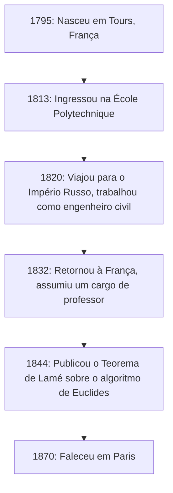
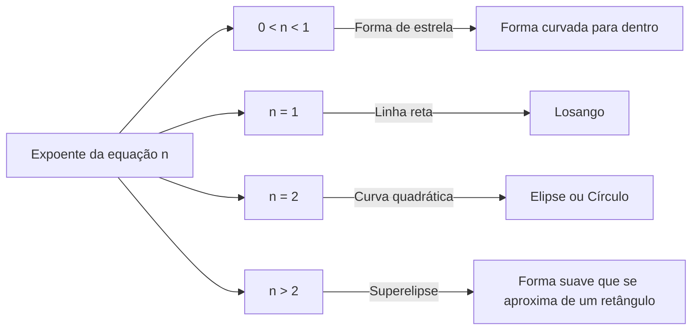

## 1. Introdução: Quem foi [Gabriel Lamé](https://kenji.blog/pt/p/lame/)?

[Gabriel Lamé](https://kenji.blog/pt/p/lame/) (22 de julho de 1795 – 1º de maio de 1870) foi um proeminente matemático, físico e engenheiro francês do século XIX. Suas contribuições abrangeram uma vasta gama, desde a matemática pura até a matemática aplicada, chegando à engenharia civil prática. Ainda hoje, seu nome permanece profundamente gravado nos livros de matemática e física através da **curva de Lamé** (superelipse), do **Teorema de Lamé** no algoritmo de [[[Euclid](https://kenji.blog/pt/p/euclid/)e](https://kenji.blog/p/euclid/)s](https://kenji.blog/p/euclid/) e dos **parâmetros de Lamé** na teoria da elasticidade.

Neste artigo, traçaremos a trajetória movimentada da vida de Lamé e explicaremos de forma abrangente e sistemática as inovadoras conquistas matemáticas e físicas que ele deixou para trás. Compreender sua vida e seus processos de pensamento fornece uma perspectiva muito valiosa sobre como a ciência do século XIX estabeleceu as bases para a era moderna.

## 2. Vida e Carreira de [Gabriel Lamé](https://kenji.blog/pt/p/lame/)

A vida de Lamé esteve profundamente interligada à turbulenta sociedade europeia do início do século XIX. Sua carreira não se limitou a uma torre de marfim acadêmica, mas foi fundamentada em duras experiências práticas de campo.

### 2.1 Nascimento e Educação em Tempos Turbulentos

[Gabriel Lamé](https://kenji.blog/pt/p/lame/) nasceu em 1795 na cidade de Tours, na região central da França. Foi o período logo após a Revolução Francesa, uma época em que a sociedade como um todo passava por grandes transformações. Seu talento matemático floresceu cedo e, em 1813, ele ingressou na prestigiosa **École Polytechnique**. Lá, ele competiu e estudou ao lado de muitas mentes brilhantes que mais tarde liderariam o mundo científico. Após se formar, aprofundou seus conhecimentos práticos de engenharia na **École des Mines**.

### 2.2 Trabalho na Rússia: Prática como Engenheiro

Em 1820, ocorreu um grande ponto de virada na vida de Lamé. Junto com seu colega e amigo íntimo Émile Clapeyron, ele aceitou um convite do Império Russo e viajou para São Petersburgo. Na época, a Rússia corria para modernizar sua infraestrutura e precisava de engenheiros qualificados.

Durante sua estadia na Rússia, Lamé trabalhou como engenheiro civil em vários projetos nacionais, incluindo o projeto de pontes e a construção de estradas. Em particular, seu avançado conhecimento matemático foi aplicado diretamente no projeto de pontes suspensas que cruzavam os rios de São Petersburgo. Essa experiência prática de campo influenciou profundamente suas pesquisas posteriores em física e matemática aplicada.



### 2.3 Retorno à França e Glória Acadêmica

Em 1832, após 12 anos trabalhando na Rússia, Lamé retornou à França. Ao voltar, tornou-se professor de física em sua alma mater, a École Polytechnique. Ele também lecionou na Sorbonne (Universidade de Paris), dedicando-se a treinar muitas gerações futuras. Em 1843, em reconhecimento às suas imensas conquistas, foi eleito membro da Academia de Ciências da França.

## 3. Contribuições para a Matemática: Curvas de Lamé (Superelipse)

Uma das contribuições mais visuais e famosas de Lamé para a matemática pura é o seu estudo sobre as figuras geométricas conhecidas como **curvas de Lamé**, ou **superelipses**.

### 3.1 Equação e Diversidade de Formas

Uma curva de Lamé é definida pela seguinte equação no sistema de coordenadas cartesianas:

$$ \left| \frac{x}{a} \right|^n + \left| \frac{y}{b} \right|^n = 1 $$

Aqui, $a$ e $b$ são números reais positivos que determinam a largura e a altura da curva, e $n$ é um número real positivo (expoente) que determina a forma da curva. Dependendo do valor de $n$, a curva de Lamé assume formas completamente diferentes.

- Se $n = 2$, isso corresponde à equação de uma **elipse** padrão. Se $a = b$, torna-se um **círculo**.
- Se $n < 1$, a curva adquire a forma de uma estrela curvada para dentro (forma de astroide).
- Se $n = 1$, torna-se um **losango** que conecta cada quadrante com linhas retas.
- Se $n > 2$, a curva se aproxima gradualmente de um retângulo. Especialmente quando $n$ tende ao infinito, ela se torna um retângulo perfeito.



### 3.2 Aplicações Modernas: Do Design à Arquitetura

Essa curva, estudada por Lamé por puro interesse matemático, foi aplicada ao planejamento urbano e ao design industrial no século XX pelo designer dinamarquês Piet Hein. Hoje, ela é usada em todos os lugares como uma forma que combina beleza e praticidade — desde os formatos de ícones de smartphones e designs de fontes até estruturas arquitetônicas massivas.

Abaixo está um exemplo de um programa simples que calcula as coordenadas de uma curva de Lamé.

```python
import numpy as np

# Função para calcular as coordenadas de uma curva de Lamé
def calculate_lame_curve(a, b, n, num_points=100):
    """
    Gera pontos para uma curva de Lamé com base nos parâmetros especificados.
    """
    points = []
    # Variar o ângulo de 0 a 2π
    theta = np.linspace(0, 2 * np.pi, num_points)
    for t in theta:
        # Cálculo de coordenadas usando equações paramétricas
        x = a * np.sign(np.cos(t)) * (np.abs(np.cos(t)) ** (2 / n))
        y = b * np.sign(np.sin(t)) * (np.abs(np.sin(t)) ** (2 / n))
        points.append((x, y))
    return points
```

## 4. Contribuições à Teoria dos Números: O Teorema de Lamé e o Algoritmo de [[[Euclid](https://kenji.blog/pt/p/euclid/)e](https://kenji.blog/p/euclid/)s](https://kenji.blog/p/euclid/)

Na ciência da computação e na teoria dos números, o que torna o nome de Lamé mais famoso é o **Teorema de Lamé**. Ele é conhecido como um dos primeiros exemplos na história de uma avaliação rigorosa e matemática da complexidade computacional (tempo de execução) de um algoritmo.

### 4.1 Visão Geral e Significado do Teorema

O **algoritmo de [[[Euclid](https://kenji.blog/pt/p/euclid/)e](https://kenji.blog/p/euclid/)s](https://kenji.blog/p/euclid/)**, transmitido desde a Grécia Antiga, é um algoritmo eficiente para encontrar o máximo divisor comum de dois números naturais. No entanto, até Lamé em 1844, ninguém havia provado com precisão exatamente "quão rápido" este algoritmo termina. O Teorema de Lamé afirma o seguinte:

> "Ao encontrar o máximo divisor comum de dois números inteiros usando o algoritmo de [[[Euclid](https://kenji.blog/pt/p/euclid/)e](https://kenji.blog/p/euclid/)s](https://kenji.blog/p/euclid/), o número de divisões necessárias (passos) nunca excede 5 vezes o número de dígitos decimais do número menor."

Expresso como uma fórmula, é:

$$ \text{Número de passos} \le 5 \times \text{Número de dígitos do número menor} $$

### 4.2 Profunda Conexão com a Sequência de [Fibonacci](https://kenji.blog/pt/p/fibonacci/)

No processo de prova desse teorema, Lamé descobriu que o pior cenário (ou seja, aquele que leva mais passos) para o algoritmo de [[[Euclid](https://kenji.blog/pt/p/euclid/)e](https://kenji.blog/p/euclid/)s](https://kenji.blog/p/euclid/) ocorre quando as entradas são dois **números de [Fibonacci](https://kenji.blog/pt/p/fibonacci/)** consecutivos. Utilizando a taxa de crescimento da sequência de [Fibonacci](https://kenji.blog/pt/p/fibonacci/) e as propriedades da proporção áurea, ele derivou esse belo limite superior. Devido a essa conquista, Lamé é considerado um dos "pais da teoria da complexidade" na ciência da computação moderna.

## 5. Contribuições à Física: Teoria da Elasticidade e Parâmetros de Lamé

Com sua formação como engenheiro civil, Lamé também fez contribuições decisivas à física de força e deformação de materiais, ou seja, a **teoria da elasticidade**.

### 5.1 Fundamentos da Mecânica do Meio Contínuo

Em 1852, Lamé publicou uma teoria abrangente para descrever o comportamento de corpos elásticos isotrópicos (materiais com as mesmas propriedades físicas em todas as direções). Ele formulou a relação entre tensão (stress) e deformação (strain) num espaço tridimensional usando apenas dois parâmetros independentes. Estes são conhecidos hoje como os **parâmetros de Lamé**, $\lambda$ e $\mu$.

A lei de Hooke generalizada é descrita de forma bela usando os parâmetros de Lamé da seguinte forma:

$$ \sigma_{ij} = 2\mu \varepsilon_{ij} + \lambda \delta_{ij} \text{Deformação volumétrica} $$

Aqui, $\sigma_{ij}$ representa o tensor de tensão, $\varepsilon_{ij}$ representa o tensor de deformação e $\delta_{ij}$ representa o delta de Kronecker.

### 5.2 Significado Físico e Aplicação na Engenharia

Das duas constantes, $\mu$ é chamado de **módulo de cisalhamento**, e indica quão fortemente o material resiste a mudanças de forma. Por outro lado, $\lambda$ é chamado de **primeiro parâmetro de Lamé**. Embora sua interpretação física direta seja um tanto complexa, ele está relacionado à resistência a mudanças de volume. Usando esses parâmetros, tornaram-se possíveis análises essenciais na engenharia moderna e geofísica, como calcular a propagação de ondas sísmicas (velocidades das ondas P e ondas S) e cálculos estruturais para pontes e edifícios.

## 6. Contribuições à Análise: Coordenadas Curvilíneas e a Equação do Calor

Outra grande conquista de Lamé é o seu estudo sistemático de **coordenadas curvilíneas**. Em seu livro publicado em 1859, ele estabeleceu uma estrutura matemática geral para lidar com equações diferenciais não apenas em coordenadas cartesianas, mas também em coordenadas cilíndricas, esféricas e até mesmo elipsoidais.

Em particular, para resolver a **equação de Laplace**, que descreve fenômenos de condução de calor no espaço, ele demonstrou a importância de escolher um sistema de coordenadas adaptado a condições de contorno complexas (como objetos elipsoidais). Os **fatores de escala de Lamé** que ele introduziu neste processo formam a base do cálculo vetorial moderno e da análise tensorial.

## 7. O Desafio e o Revés com o Último Teorema de Fermat

Um episódio dramático na vida de Lamé foi sua tentativa de provar o **Último Teorema de Fermat** em 1847. Em março daquele ano, Lamé anunciou orgulhosamente na Academia de Ciências da França que havia "provado completamente o Último Teorema de Fermat". Sua prova envolvia uma abordagem altamente inovadora e poderosa para a época: fatorar a equação usando números complexos ciclotômicos.

No entanto, imediatamente após sua apresentação, seu colega, o matemático Joseph Liouville, apontou astutamente que "a prova baseia-se na suposição tácita e não comprovada de que a 'fatoração única em primos' também se aplica no reino dos números complexos". Pouco tempo depois, uma carta chegou do matemático alemão [Ernst Kummer](https://kenji.blog/pt/p/kummer/) indicando que "a fatoração única em primos geralmente não se aplica", tornando a prova de Lamé efetivamente inválida.

Esse foi um grande revés para Lamé, mas essa série de discussões desencadeou o nascimento da teoria de Kummer dos "números ideais" (ideais), que mais tarde abriu o enorme campo matemático da teoria algébrica dos números. O desafio ousado de Lamé acabou por impulsionar a história da matemática de forma significativa.

## 8. Escritos e Papel como Educador

Lamé não foi apenas um pesquisador, mas também excepcionalmente talentoso como educador. Suas palestras na École Polytechnique e na Sorbonne cativaram muitos alunos com sua clareza e progressão lógica. Ele publicou inúmeros livros didáticos compilando suas notas de aula e resultados de pesquisa, que foram adotados como textos padrão em universidades por toda a Europa.

Obras notáveis incluem "Lições sobre a Teoria Matemática da Elasticidade" (1852) e "Lições sobre Coordenadas Curvilíneas e suas Aplicações" (1859). Uma característica definidora dessas obras é que ele nunca deixou as teorias matemáticas avançadas no abstrato; ele sempre as explicou conectando-as a fenômenos físicos ou à resolução de problemas de engenharia. Lamé acreditava firmemente que "a matemática é a linguagem para desvendar as verdades da natureza", e sua filosofia educacional foi profundamente herdada pelas gerações subsequentes de cientistas.

Em seus últimos anos, Lamé sofreu o infortúnio de perder a audição, o que dificultou o ensino. Mesmo assim, ele nunca perdeu a paixão pela pesquisa e continuou suas atividades de escrita ao longo da vida.

## 9. Conclusão: O Que Lamé Deixou para a Era Moderna

Olhando para a vida e as realizações de [Gabriel Lamé](https://kenji.blog/pt/p/lame/), fica claro que ele fundiu perfeitamente a "beleza abstrata da matemática pura" com a "utilidade da matemática aplicada e física".

Na varanda do primeiro andar da Torre Eiffel, os nomes de 72 grandes cientistas que contribuíram para a ciência e tecnologia francesas estão gravados e, entre eles, ergue-se orgulhosamente o nome de Lamé (LAMÉ). Os teoremas, constantes e abordagens inovadoras que ele deixou para trás continuam vivos hoje na vanguarda da ciência e tecnologia, nas mãos de engenheiros e matemáticos modernos.
