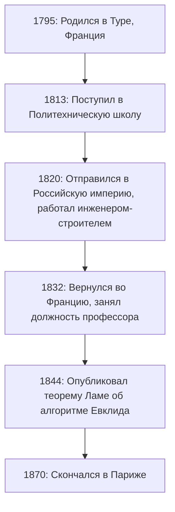
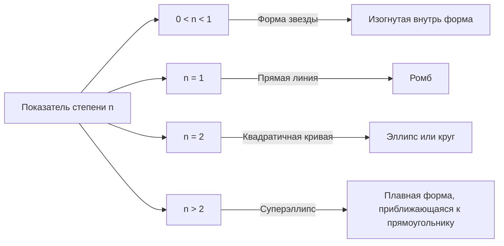

## 1. Введение: Кем был [Габриэль Ламе](https://kenji.blog/ru/p/lame/)?

[Габриэль Ламе](https://kenji.blog/ru/p/lame/) (22 июля 1795 года — 1 мая 1870 года) был выдающимся французским математиком, физиком и инженером 19-го века. Его вклад охватывает обширную область, от чистой математики до прикладной, и даже практическое гражданское строительство. Сегодня его имя глубоко вписано в учебники математики и физики благодаря **кривой Ламе** (суперэллипсу), **теореме Ламе** в алгоритме [Евклид](https://kenji.blog/ru/p/euclid/)а и **параметрам Ламе** в теории упругости.

В этой статье мы проследим насыщенный событиями жизненный путь Ламе, всесторонне и систематически объясняя новаторские математические и физические достижения, которые он оставил после себя. Понимание его жизни и мыслительных процессов дает очень ценную перспективу того, как наука 19-го века заложила основы для современной эпохи.

## 2. Жизнь и карьера Габриэля Ламе

Жизнь Ламе была тесно переплетена с бурной жизнью европейского общества начала 19-го века. Его карьера не ограничивалась академической башней из слоновой кости, а была основана на суровом практическом опыте работы в полевых условиях.

### 2.1 Рождение и образование в неспокойные времена

[Габриэль Ламе](https://kenji.blog/ru/p/lame/) родился в 1795 году в городе Тур в центральной Франции. Это было время последствий Французской революции, период, когда общество в целом претерпевало масштабные преобразования. Его математический талант расцвел рано, и в 1813 году он поступил в престижную **Политехническую школу** (École Polytechnique). Там он соревновался и учился вместе со многими блестящими умами, которые впоследствии возглавили научный мир. После окончания учебы он углубил свои практические инженерные знания в **Горной школе** (École des Mines).

### 2.2 Работа в России: Практика в качестве инженера

В 1820 году в жизни Ламе произошел важный поворотный момент. Вместе со своим коллегой и близким другом Эмилем Клапейроном он принял приглашение от Российской империи и отправился в Санкт-Петербург. В то время Россия спешила модернизировать свою инфраструктуру и нуждалась в квалифицированных инженерах.

Во время своего пребывания в России Ламе работал инженером-строителем во многих национальных проектах, включая проектирование мостов и строительство дорог. В частности, его передовые математические знания были напрямую применены при проектировании висячих мостов через реки Санкт-Петербурга. Этот практический опыт работы глубоко повлиял на его более поздние исследования в области физики и прикладной математики.



### 2.3 Возвращение во Францию и академическая слава

В 1832 году, после 12 лет работы в России, Ламе вернулся во Францию. По возвращении он стал профессором физики в своей альма-матер, Политехнической школе. Он также преподавал в Сорбонне (Парижский университет), посвятив себя подготовке многих будущих поколений. В 1843 году в знак признания его огромных достижений он был избран членом Французской академии наук.

## 3. Вклад в математику: Кривые Ламе (Суперэллипс)

Один из самых наглядных и известных вкладов Ламе в чистую математику — его исследование геометрических фигур, известных как **кривые Ламе** или **суперэллипсы**.

### 3.1 Уравнение и разнообразие форм

Кривая Ламе определяется следующим уравнением в декартовой системе координат:

$$ \left| \frac{x}{a} \right|^n + \left| \frac{y}{b} \right|^n = 1 $$

Здесь $a$ и $b$ — положительные действительные числа, определяющие ширину и высоту кривой, а $n$ — положительное действительное число (показатель степени), определяющее форму кривой. В зависимости от значения $n$ кривая Ламе принимает совершенно разные формы.

- Если $n = 2$, это совпадает с уравнением стандартного **эллипса**. Если $a = b$, он становится **кругом**.
- Если $n < 1$, кривая принимает форму звезды, изогнутой внутрь (в форме астроиды).
- Если $n = 1$, она становится **ромбом**, соединяющим каждый квадрант прямыми линиями.
- Если $n > 2$, кривая постепенно приближается к прямоугольнику. В особенности, когда $n$ стремится к бесконечности, она становится идеальным прямоугольником.



### 3.2 Современные применения: От дизайна до архитектуры

Эта кривая, изученная Ламе из чистого математического интереса, была применена в городском планировании и промышленном дизайне в 20 веке датским дизайнером Питом Хейном. Сегодня она используется повсюду как форма, сочетающая в себе красоту и практичность — от форм значков смартфонов и дизайна шрифтов до массивных архитектурных сооружений.

Ниже приведен пример простой программы, которая вычисляет координаты кривой Ламе.

```python
import numpy as np

# Функция для вычисления координат кривой Ламе
def calculate_lame_curve(a, b, n, num_points=100):
    """
    Генерирует точки для кривой Ламе на основе заданных параметров.
    """
    points = []
    # Изменение угла от 0 до 2π
    theta = np.linspace(0, 2 * np.pi, num_points)
    for t in theta:
        # Вычисление координат с использованием параметрических уравнений
        x = a * np.sign(np.cos(t)) * (np.abs(np.cos(t)) ** (2 / n))
        y = b * np.sign(np.sin(t)) * (np.abs(np.sin(t)) ** (2 / n))
        points.append((x, y))
    return points
```

## 4. Вклад в теорию чисел: Теорема Ламе и алгоритм [Евклид](https://kenji.blog/ru/p/euclid/)а

В информатике и теории чисел имя Ламе сделало наиболее известным **Теорема Ламе**. Она известна как один из самых ранних примеров в истории математически строгой оценки вычислительной сложности (времени выполнения) алгоритма.

### 4.1 Обзор и значение теоремы

**[Алгоритм Евклида](https://kenji.blog/p/euclidean-algorithm/)**, дошедший до нас из Древней Греции, является эффективным алгоритмом для нахождения наибольшего общего делителя двух натуральных чисел. Однако до Ламе в 1844 году никто точно не доказал, «как быстро» завершается этот алгоритм. Теорема Ламе гласит следующее:

> «При нахождении наибольшего общего делителя двух целых чисел с использованием алгоритма [Евклид](https://kenji.blog/ru/p/euclid/)а количество необходимых делений (шагов) никогда не превышает 5-кратного количества десятичных цифр меньшего числа.»

Выраженное в виде формулы, это выглядит так:

$$ \text{Количество шагов} \le 5 \times \text{Количество цифр меньшего числа} $$

### 4.2 Глубокая связь с последовательностью Фибоначчи

В процессе доказательства этой теоремы Ламе обнаружил, что наихудший сценарий (то есть требующий наибольшего количества шагов) для алгоритма [Евклид](https://kenji.blog/ru/p/euclid/)а происходит, когда на входе подаются два последовательных **числа Фибоначчи**. Используя скорость роста последовательности Фибоначчи и свойства золотого сечения, он вывел эту красивую верхнюю границу. Благодаря этому достижению Ламе считается одним из «отцов теории сложности» в современной информатике.

## 5. Вклад в физику: Теория упругости и параметры Ламе

Имея опыт работы инженером-строителем, Ламе также внес решающий вклад в физику прочности и деформации материалов, а именно в **теорию упругости**.

### 5.1 Основы механики сплошных сред

В 1852 году Ламе опубликовал всеобъемлющую теорию для описания поведения изотропных упругих тел (материалов с одинаковыми физическими свойствами во всех направлениях). Он сформулировал взаимосвязь между напряжением (stress) и деформацией (strain) в трехмерном пространстве, используя всего два независимых параметра. Сегодня они известны как **параметры Ламе**, $\lambda$ и $\mu$.

Обобщенный закон Гука прекрасно описывается с использованием параметров Ламе следующим образом:

$$ \sigma_{ij} = 2\mu \varepsilon_{ij} + \lambda \delta_{ij} \text{Объемная деформация} $$

Здесь $\sigma_{ij}$ представляет собой тензор напряжений, $\varepsilon_{ij}$ — тензор деформаций, а $\delta_{ij}$ — символ Кронекера.

### 5.2 Физический смысл и применение в инженерии

Из двух констант $\mu$ называется **модулем сдвига**, который указывает, насколько сильно материал сопротивляется изменениям формы. С другой стороны, $\lambda$ называется **первым параметром Ламе**. Хотя его прямая физическая интерпретация несколько сложна, он связан с сопротивлением изменениям объема. Использование этих параметров сделало возможными важные анализы в современной инженерии и геофизике, такие как расчет распространения сейсмических волн (скорости P-волн и S-волн) и структурные расчеты для мостов и зданий.

## 6. Вклад в анализ: Криволинейные координаты и уравнение теплопроводности

Еще одним великим достижением Ламе является его систематическое изучение **криволинейных координат**. В своей книге, опубликованной в 1859 году, он создал общую математическую основу для работы с дифференциальными уравнениями не только в декартовых координатах, но и в цилиндрических, сферических и даже эллипсоидальных координатах.

В частности, для решения **уравнения Лапласа**, которое описывает явления теплопроводности в пространстве, он продемонстрировал важность выбора системы координат, адаптированной к сложным граничным условиям (например, эллипсоидальным объектам). **Масштабные коэффициенты Ламе** (коэффициенты Ламе), которые он ввел в этом процессе, составляют основу современного векторного исчисления и тензорного анализа.

## 7. Вызов и неудача с Великой теоремой Ферма

Драматическим эпизодом в жизни Ламе стала его попытка доказать **Великую теорему Ферма** в 1847 году. В марте того же года Ламе с гордостью объявил во Французской академии наук, что он «полностью доказал Великую теорему Ферма». Его доказательство включало в себя весьма новаторский и мощный для того времени подход: разложение уравнения на множители с использованием циклотомических комплексных чисел.

Однако сразу после его презентации его коллега, математик Жозеф Лиувилль, резко отметил, что «доказательство опирается на недоказанное, неявное предположение о том, что "однозначное разложение на простые множители" также справедливо в области комплексных чисел». Вскоре после этого пришло письмо от немецкого математика Эрнста Куммера, в котором указывалось, что «однозначное разложение на простые множители в общем случае не выполняется», что фактически сделало доказательство Ламе недействительным.

Это стало серьезной неудачей для Ламе, но эта серия дискуссий послужила толчком к зарождению теории «идеальных чисел» (идеалов) Куммера, которая впоследствии открыла обширную математическую область алгебраической теории чисел. Смелый вызов Ламе в конечном итоге значительно продвинул историю математики вперед.

## 8. Труды и роль педагога

Ламе был не только исследователем, но и исключительно талантливым педагогом. Его лекции в Политехнической школе и Сорбонне очаровывали многих студентов своей ясностью и логической последовательностью. Он опубликовал множество учебников, в которых собрал свои конспекты лекций и результаты исследований, и они были приняты в качестве стандартных учебников в университетах по всей Европе.

Среди его известных работ — «Лекции по математической теории упругости» (1852) и «Лекции по криволинейным координатам и их применениям» (1859). Отличительной чертой этих работ является то, что он никогда не оставлял сложные математические теории абстрактными; он всегда объяснял их, связывая с физическими явлениями или решением инженерных задач. Ламе твердо верил, что «математика — это язык для раскрытия тайн природы», и его образовательная философия была глубоко унаследована последующими поколениями ученых.

В свои последние годы Ламе постигло несчастье — он потерял слух, что затруднило его преподавательскую деятельность. Несмотря на это, он никогда не терял своей страсти к исследованиям и продолжал свою писательскую деятельность на протяжении всей своей жизни.

## 9. Заключение: Что Ламе оставил для современной эпохи

Оглядываясь на жизнь и достижения Габриэля Ламе, становится ясно, что он идеально объединил «абстрактную красоту чистой математики» с «полезностью прикладной математики и физики».

На балконе первого этажа Эйфелевой башни выгравированы имена 72 великих ученых, внесших вклад во французскую науку и технику, и среди них гордо красуется имя Ламе (LAMÉ). Теоремы, константы и новаторские подходы, которые он оставил после себя, продолжают жить сегодня на переднем крае науки и техники, в руках современных инженеров и математиков.
