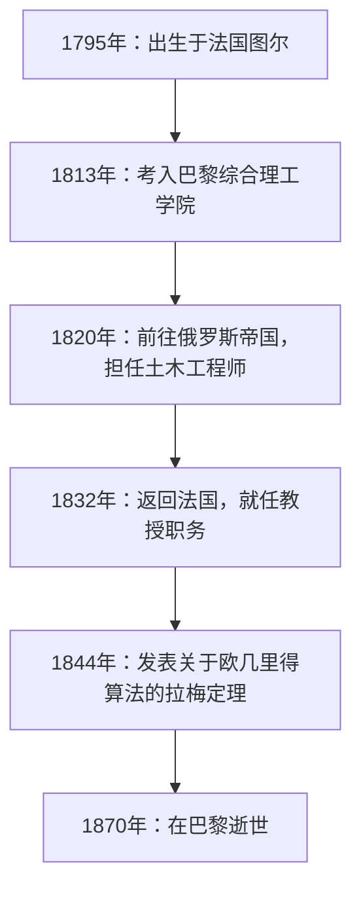
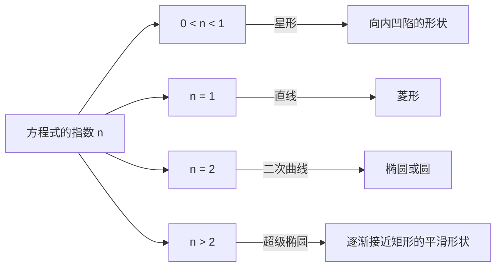

## 1. 引言：加布里埃尔·拉梅是谁？

加布里埃尔·拉梅（Gabriel Lamé，1795年7月22日 – 1870年5月1日）是19世纪法国杰出的数学家、物理学家和工程师。他的贡献极其广泛，从纯粹数学到应用数学，甚至涵盖了实际的土木工程。时至今日，他的名字依然通过 **拉梅曲线** （超级椭圆）、欧几里得算法中的 **拉梅定理** ，以及弹性力学中的 **拉梅常量** ，深深印刻在数学和物理的教科书中。

本文将追溯拉梅波澜壮阔的一生，同时全面而系统地解读他所留下的各项突破性的数学与物理学成就。了解拉梅的人生与思想历程，能为我们理解19世纪科学如何奠定现代基础提供极具价值的视角。

## 2. 加布里埃尔·拉梅的一生与职业生涯

拉梅的一生与19世纪初动荡的欧洲社会紧密相连。他的职业生涯并未局限于学术界的象牙塔，而是有着严酷的现场实践经验作为支撑。

### 2.1 动荡时代的诞生与教育

加布里埃尔·拉梅于1795年出生于法国中部的图尔市。那正是法国大革命的余波时期，整个社会都在经历巨大的变革。他很早就展现出数学天赋，并于1813年考入著名的 **巴黎综合理工学院** （École Polytechnique）。在那里，他与众多后来引领科学界的顶尖头脑们相互切磋、共同学习。毕业后，他进一步进入 **国立巴黎高等矿业学校** （École des Mines）深造，以加深其实用的工程学知识。

### 2.2 在俄罗斯的活跃：作为工程师的实践

1820年，拉梅的人生迎来了重大转折。他与同事兼挚友埃米尔·克拉佩龙（Émile Clapeyron）一起，接受了俄罗斯帝国的邀请前往圣彼得堡。当时，俄罗斯正急于实现基础设施的现代化，急需优秀的工程师。

在俄罗斯逗留期间，拉梅作为土木工程师参与了众多国家级项目，包括桥梁设计和道路建设。特别是在设计横跨圣彼得堡河流的悬索桥时，他高深的数学知识得到了直接应用。这种现场的实践经验对他后来的物理学和应用数学研究产生了深远的影响。



### 2.3 重返法国与学术界的荣耀

1832年，在俄罗斯活跃了12年后，拉梅返回了法国。回国后，他担任了母校巴黎综合理工学院的物理学教授。他同时也在索邦大学（巴黎大学）任教，致力于培养众多后起之秀。1843年，为表彰其巨大贡献，他被选为法国科学院院士。

## 3. 对数学的贡献：拉梅曲线（超级椭圆）

拉梅在纯粹数学领域最直观、最著名的贡献之一，就是他对被称为 **拉梅曲线** （Lamé curves）或 **超级椭圆** （Superellipse）的几何图形的研究。

### 3.1 方程式与形状的多样性

拉梅曲线在直角坐标系中由以下方程式定义：

$$ \left| \frac{x}{a} \right|^n + \left| \frac{y}{b} \right|^n = 1 $$

在这里，$a$ 和 $b$ 是决定曲线宽度和高度的正实数，而 $n$ 是决定曲线形状的正实数（指数）。根据 $n$ 的不同取值，拉梅曲线会呈现出完全不同的形状。

- 当 $n = 2$ 时，这与标准的 **椭圆** 方程式一致。如果 $a = b$，则成为 **圆** 。
- 当 $n < 1$ 时，曲线呈现向内凹陷的星形（星形线状）。
- 当 $n = 1$ 时，它变成了用直线连接各个象限的 **菱形** 。
- 当 $n > 2$ 时，曲线逐渐接近矩形。特别是当 $n$ 趋向于无穷大时，它将变成一个完美的矩形。



### 3.2 现代应用：从设计到建筑

这条拉梅出于纯粹的数学兴趣而研究的曲线，在20世纪被丹麦设计师皮亚特·海恩应用于城市规划和工业设计中。如今，作为兼具美感与实用性的形状，它被广泛应用于各个领域——从智能手机图标的形状、字体设计，到宏大的建筑结构。

以下是计算拉梅曲线坐标的简单程序示例。

```python
import numpy as np

# 计算拉梅曲线坐标的函数
def calculate_lame_curve(a, b, n, num_points=100):
    """
    根据指定的参数生成拉梅曲线上的点。
    """
    points = []
    # 使角度从0变化到2π
    theta = np.linspace(0, 2 * np.pi, num_points)
    for t in theta:
        # 使用参数方程式计算坐标
        x = a * np.sign(np.cos(t)) * (np.abs(np.cos(t)) ** (2 / n))
        y = b * np.sign(np.sin(t)) * (np.abs(np.sin(t)) ** (2 / n))
        points.append((x, y))
    return points
```

## 4. 对数论的贡献：拉梅定理与欧几里得算法

在计算机科学和数论中，让拉梅的名字最为人所知的是 **拉梅定理** （Lamé's Theorem）。这被公认为是历史上最早在数学上严密评估算法计算复杂度（执行时间）的例子之一。

### 4.1 定理的概述与意义

自古希腊流传下来的 **欧几里得算法** ，是求两个自然数最大公约数的高效算法。然而，直到1844年的拉梅之前，还没有人能够准确证明这个算法究竟“有多快”能结束。拉梅定理的表述如下：

> “使用欧几里得算法求两个整数的最大公约数时，所需的除法次数（步骤数）绝对不会超过较小数在十进制下位数的5倍。”

用数学公式表示如下：

$$ \text{步骤数} \le 5 \times \text{较小数的位数} $$

### 4.2 与斐波那契数列的深刻联系

拉梅在证明这一定理的过程中发现，欧几里得算法最棘手（即所需步骤数最多）的最坏情况，是当输入的两个数是连续的 **斐波那契数** 时。通过利用斐波那契数列的增长率和黄金分割的性质，他推导出了这个优美的上限。凭借这一成就，拉梅被视为现代计算机科学中“计算复杂度理论之父”之一。

## 5. 对物理学的贡献：弹性理论与拉梅常量

凭借土木工程师的背景，拉梅在有关材料强度与变形的物理学，即 **弹性理论** 中也做出了决定性的贡献。

### 5.1 连续介质力学的基础

1852年，拉梅发表了描述各向同性弹性体（在各个方向上具有相同物理性质的物质）行为的综合理论。他仅用两个独立的参数，就公式化了三维空间中物质的应力（应力）和应变（应变）之间的关系。这就是今天被称为 **拉梅常量** （Lamé parameters）的 $\lambda$ 和 $\mu$。

广义胡克定律使用拉梅常量可以优美地描述如下：

$$ \sigma_{ij} = 2\mu \varepsilon_{ij} + \lambda \delta_{ij} \text{体积应变} $$

在这里，$\sigma_{ij}$ 代表应力张量，$\varepsilon_{ij}$ 代表应变张量，$\delta_{ij}$ 代表克罗内克δ函数。

### 5.2 物理意义与工程应用

在两个常量中，$\mu$ 被称为 **剪切模量** （刚性率），它表示物质抵抗形状变化的强度。另一方面，$\lambda$ 被称为 **拉梅第一常量** ，虽然其直接的物理学解释较为复杂，但它与抵抗体积变化的能力有关。通过使用这些常量，现代工程和地球物理学中不可或缺的分析成为可能，例如计算地震波的传播（P波和S波的速度计算）以及桥梁和建筑物的结构计算。

## 6. 对分析学的贡献：曲线坐标系与热传导方程式

拉梅的另一项伟大成就是对 **曲线坐标系** （Curvilinear coordinates）的系统性研究。在1859年出版的著作中，他构建了一个通用的数学框架，用于处理不仅在直角坐标系下，而且在圆柱坐标系、球坐标系甚至椭球坐标系等各种坐标系中的微分方程。

特别是，为了求解描述空间热传导现象的 **拉普拉斯方程式** ，他展示了选择适合复杂边界条件（例如椭球状物体等）的坐标系的重要性。在这个过程中他引入的 **拉梅度量系数** （Scale factors），成为了现代矢量分析和张量分析的基础。

## 7. 挑战费马大定理与受挫

在拉梅的生平中，一个戏剧性的插曲是他于1847年对 **费马大定理** 的挑战。当年3月，拉梅在法国科学院高调宣布他“彻底证明了费马大定理”。他的证明采用了一种在当时非常新颖且强大的方法：利用分圆域的复数对方程式进行因式分解。

然而，在他发表之后不久，他的同事、数学家约瑟夫·刘维尔尖锐地指出：“该证明建立在一个尚未被证明的默认假设之上，即‘素因数分解的唯一性’在复数世界中同样成立。”不久之后，德国数学家恩斯特·库默尔寄来一封信，指出“素因数分解的唯一性在一般情况下是不成立的”，从而确定了拉梅的证明是无效的。

这对拉梅来说是一次巨大的挫折，但这系列讨论成为了契机，促使库默尔创立了“理想数”（理想）理论，并为后来代数数论这一庞大数学领域的开拓铺平了道路。拉梅的大胆挑战，最终极大地推动了数学历史的前进。

## 8. 著作与教育家的一面

拉梅不仅是一位研究者，作为教育家他也拥有极为出色的才华。他在巴黎综合理工学院和索邦大学的讲义，以其清晰明了和逻辑严密吸引了众多学生。他出版了许多将讲义笔记和研究成果汇编而成的教科书，这些书籍被当时欧洲各地的大学采纳为标准教材。

其代表作包括《弹性体数学理论讲义》（1852年）和《曲线坐标及其应用讲义》（1859年）。这些著作的特点是，他从未让高深的数学理论停留在抽象层面，而是始终将其与物理现象或工程问题的解决结合起来进行讲解。拉梅坚信“数学是揭示自然界真理的语言”，他的教育理念被下一代的科学家们深深继承。

晚年的拉梅遭遇了失聪的不幸，站上讲台变得十分困难，但他依然没有失去对研究的热情，终其一生都在继续着他的写作活动。

## 9. 结论：拉梅留给现代的遗产

回顾加布里埃尔·拉梅的一生与成就，我们可以清楚地看到，他将“纯粹数学的抽象之美”与“应用数学及物理学的实用性”完美地融合在了一起。

在埃菲尔铁塔一楼的阳台上，刻有72位对法国科学技术做出巨大贡献的伟大科学家的名字，其中拉梅的名字（LAMÉ）也堂堂正正地刻在其中。他留下的定理、常量和创新性的研究方法，在今天依然通过现代工程师和数学家们的手，在最尖端的科学技术中焕发着生机。
