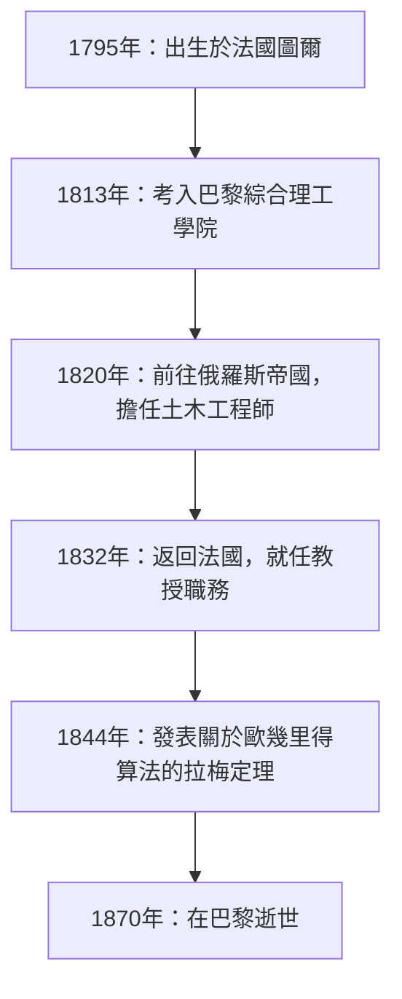
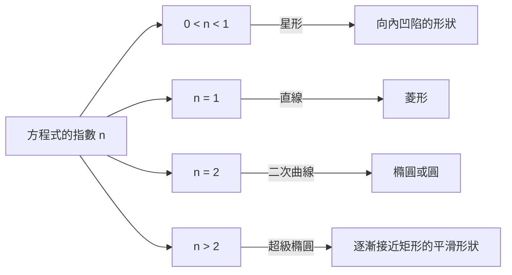

## 1. 引言：加布里埃爾·拉梅是誰？

加布里埃爾·拉梅（Gabriel Lamé，1795年7月22日 – 1870年5月1日）是19世紀法國傑出的數學家、物理學家和工程師。他的貢獻極其廣泛，從純粹數學到應用數學，甚至涵蓋了實際的土木工程。時至今日，他的名字依然透過 **拉梅曲線** （超級橢圓）、歐幾里得算法中的 **拉梅定理** ，以及彈性力學中的 **拉梅常數** ，深深印刻在數學和物理的教科書中。

本文將追溯拉梅波瀾壯闊的一生，同時全面而系統地解讀他所留下的各項突破性的數學與物理學成就。了解拉梅的人生與思想歷程，能為我們理解19世紀科學如何奠定現代基礎提供極具價值的視角。

## 2. 加布里埃爾·拉梅的一生與職業生涯

拉梅的一生與19世紀初動盪的歐洲社會緊密相連。他的職業生涯並未侷限於學術界的象牙塔，而是有著嚴酷的現場實踐經驗作為支撐。

### 2.1 動盪時代的誕生與教育

加布里埃爾·拉梅於1795年出生於法國中部的圖爾市。那正是法國大革命的餘波時期，整個社會都在經歷巨大的變革。他很早就展現出數學天賦，並於1813年考入著名的 **巴黎綜合理工學院** （École Polytechnique）。在那裡，他與眾多後來引領科學界的頂尖頭腦們相互切磋、共同學習。畢業後，他進一步進入 **國立巴黎高等礦業學校** （École des Mines）深造，以加深其實用的工程學知識。

### 2.2 在俄羅斯的活躍：作為工程師的實踐

1820年，拉梅的人生迎來了重大轉折。他與同事兼摯友埃米爾·克拉佩龍（Émile Clapeyron）一起，接受了俄羅斯帝國的邀請前往聖彼得堡。當時，俄羅斯正急於實現基礎設施的現代化，急需優秀的工程師。

在俄羅斯逗留期間，拉梅作為土木工程師參與了眾多國家級項目，包括橋樑設計和道路建設。特別是在設計橫跨聖彼得堡河流的懸索橋時，他高深的數學知識得到了直接應用。這種現場的實踐經驗對他後來的物理學和應用數學研究產生了深遠的影響。



### 2.3 重返法國與學術界的榮耀

1832年，在俄羅斯活躍了12年後，拉梅返回了法國。回國後，他擔任了母校巴黎綜合理工學院的物理學教授。他同時也在索邦大學（巴黎大學）任教，致力於培養眾多後起之秀。1843年，為表彰其巨大貢獻，他被選為法國科學院院士。

## 3. 對數學的貢獻：拉梅曲線（超級橢圓）

拉梅在純粹數學領域最直觀、最著名的貢獻之一，就是他對被稱為 **拉梅曲線** （Lamé curves）或 **超級橢圓** （Superellipse）的幾何圖形的研究。

### 3.1 方程式與形狀的多樣性

拉梅曲線在直角坐標系中由以下方程式定義：

$$ \left| \frac{x}{a} \right|^n + \left| \frac{y}{b} \right|^n = 1 $$

在這裡，$a$ 和 $b$ 是決定曲線寬度和高度的正實數，而 $n$ 是決定曲線形狀的正實數（指數）。根據 $n$ 的不同取值，拉梅曲線會呈現出完全不同的形狀。

- 當 $n = 2$ 時，這與標準的 **橢圓** 方程式一致。如果 $a = b$，則成為 **圓** 。
- 當 $n < 1$ 時，曲線呈現向內凹陷的星形（星形線狀）。
- 當 $n = 1$ 時，它變成了用直線連接各個象限的 **菱形** 。
- 當 $n > 2$ 時，曲線逐漸接近矩形。特別是當 $n$ 趨向於無窮大時，它將變成一個完美的矩形。



### 3.2 現代應用：從設計到建築

這條拉梅出於純粹的數學興趣而研究的曲線，在20世紀被丹麥設計師皮亞特·海恩應用於城市規劃和工業設計中。如今，作為兼具美感與實用性的形狀，它被廣泛應用於各個領域——從智慧型手機圖標的形狀、字體設計，到宏大的建築結構。

以下是計算拉梅曲線坐標的簡單程式範例。

```python
import numpy as np

# 計算拉梅曲線坐標的函數
def calculate_lame_curve(a, b, n, num_points=100):
    """
    根據指定的參數生成拉梅曲線上的點。
    """
    points = []
    # 使角度從0變化到2π
    theta = np.linspace(0, 2 * np.pi, num_points)
    for t in theta:
        # 使用參數方程式計算坐標
        x = a * np.sign(np.cos(t)) * (np.abs(np.cos(t)) ** (2 / n))
        y = b * np.sign(np.sin(t)) * (np.abs(np.sin(t)) ** (2 / n))
        points.append((x, y))
    return points
```

## 4. 對數論的貢獻：拉梅定理與歐幾里得算法

在計算機科學和數論中，讓拉梅的名字最為人所知的是 **拉梅定理** （Lamé's Theorem）。這被公認為是歷史上最早在數學上嚴密評估演算法計算複雜度（執行時間）的例子之一。

### 4.1 定理的概述與意義

自古希臘流傳下來的 **歐幾里得算法** ，是求兩個自然數最大公因數的高效算法。然而，直到1844年的拉梅之前，還沒有人能夠準確證明這個算法究竟「有多快」能結束。拉梅定理的表述如下：

> 「使用歐幾里得算法求兩個整數的最大公因數時，所需的除法次數（步驟數）絕對不會超過較小數在十進制下位數的5倍。」

用數學公式表示如下：

$$ \text{步驟數} \le 5 \times \text{較小數的位數} $$

### 4.2 與費氏數列的深刻聯繫

拉梅在證明這一定理的過程中發現，歐幾里得算法最棘手（即所需步驟數最多）的最壞情況，是當輸入的兩個數是連續的 **費氏數** 時。透過利用費氏數列的增長率和黃金分割的性質，他推導出了這個優美的上限。憑藉這一成就，拉梅被視為現代計算機科學中「計算複雜度理論之父」之一。

## 5. 對物理學的貢獻：彈性理論與拉梅常數

憑藉土木工程師的背景，拉梅在有關材料強度與變形的物理學，即 **彈性理論** 中也做出了決定性的貢獻。

### 5.1 連續介質力學的基礎

1852年，拉梅發表了描述各向同性彈性體（在各個方向上具有相同物理性質的物質）行為的綜合理論。他僅用兩個獨立的參數，就公式化了三維空間中物質的應力（應力）和應變（應變）之間的關係。這就是今天被稱為 **拉梅常數** （Lamé parameters）的 $\lambda$ 和 $\mu$。

廣義虎克定律使用拉梅常數可以優美地描述如下：

$$ \sigma_{ij} = 2\mu \varepsilon_{ij} + \lambda \delta_{ij} \text{體積應變} $$

在這裡，$\sigma_{ij}$ 代表應力張量，$\varepsilon_{ij}$ 代表應變張量，$\delta_{ij}$ 代表克羅內克δ函數。

### 5.2 物理意義與工程應用

在兩個常數中，$\mu$ 被稱為 **剪切模量** （剛性率），它表示物質抵抗形狀變化的強度。另一方面，$\lambda$ 被稱為 **拉梅第一常數** ，雖然其直接的物理學解釋較為複雜，但它與抵抗體積變化的能力有關。透過使用這些常數，現代工程和地球物理學中不可或缺的分析成為可能，例如計算地震波的傳播（P波和S波的速度計算）以及橋樑和建築物的結構計算。

## 6. 對分析學的貢獻：曲線坐標系與熱傳導方程式

拉梅的另一項偉大成就是對 **曲線坐標系** （Curvilinear coordinates）的系統性研究。在1859年出版的著作中，他構建了一個通用的數學框架，用於處理不僅在直角坐標系下，而且在圓柱坐標系、球坐標系甚至橢球坐標系等各種坐標系中的微分方程。

特別是，為了求解描述空間熱傳導現象的 **拉普拉斯方程式** ，他展示了選擇適合複雜邊界條件（例如橢球狀物體等）的坐標系的重要性。在這個過程中他引入的 **拉梅度量係數** （Scale factors），成為了現代向量分析和張量分析的基礎。

## 7. 挑戰費馬最後定理與受挫

在拉梅的生平中，一個戲劇性的插曲是他於1847年對 **費馬最後定理** 的挑戰。當年3月，拉梅在法國科學院高調宣布他「徹底證明了費馬最後定理」。他的證明採用了一種在當時非常新穎且強大的方法：利用分圓域的複數對方程式進行因式分解。

然而，在他發表之後不久，他的同事、數學家約瑟夫·劉維爾尖銳地指出：「該證明建立在一個尚未被證明的默認假設之上，即『質因數分解的唯一性』在複數世界中同樣成立。」不久之後，德國數學家恩斯特·庫默爾寄來一封信，指出「質因數分解的唯一性在一般情況下是不成立的」，從而確定了拉梅的證明是無效的。

這對拉梅來說是一次巨大的挫折，但這系列討論成為了契機，促使庫默爾創立了「理想數」（理想）理論，並為後來代數數論這一龐大數學領域的開拓鋪平了道路。拉梅的大膽挑戰，最終極大地推動了數學歷史的前進。

## 8. 著作與教育家的一面

拉梅不僅是一位研究者，作為教育家他也擁有極為出色的才華。他在巴黎綜合理工學院和索邦大學的講義，以其清晰明了和邏輯嚴密吸引了眾多學生。他出版了許多將講義筆記和研究成果彙編而成的教科書，這些書籍被當時歐洲各地的大學採納為標準教材。

其代表作包括《彈性體數學理論講義》（1852年）和《曲線坐標及其應用講義》（1859年）。這些著作的特點是，他從未讓高深的數學理論停留在抽象層面，而是始終將其與物理現象或工程問題的解決結合起來進行講解。拉梅堅信「數學是揭示自然界真理的語言」，他的教育理念被下一代的科學家們深深繼承。

晚年的拉梅遭遇了失聰的不幸，站上講台變得十分困難，但他依然沒有失去對研究的熱情，終其一生都在繼續著他的寫作活動。

## 9. 結論：拉梅留給現代的遺產

回顧加布里埃爾·拉梅的一生與成就，我們可以清楚地看到，他將「純粹數學的抽象之美」與「應用數學及物理學的實用性」完美地融合在了一起。

在艾菲爾鐵塔一樓的陽台上，刻有72位對法國科學技術做出巨大貢獻的偉大科學家的名字，其中拉梅的名字（LAMÉ）也堂堂正正地刻在其中。他留下的定理、常數和創新性的研究方法，在今天依然透過現代工程師和數學家們的手，在最尖端的科學技術中煥發著生機。
