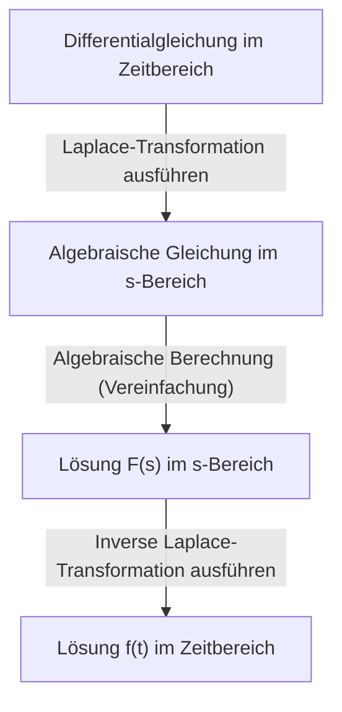

## Einleitung: Was ist die [Laplace-Transformation](https://kenji.blog/de/p/laplace-transform/)?

In Bereichen wie Physik, Ingenieurwesen und Wirtschaftswissenschaften sind **Differentialgleichungen** ein unverzichtbares Werkzeug zur Beschreibung von Phänomenen, die sich im Laufe der Zeit ändern. Das direkte Lösen komplexer Differentialgleichungen kann jedoch manchmal äußerst schwierig sein. Hier kommt die **[Laplace-Transformation](https://kenji.blog/de/p/laplace-transform/)** ins Spiel.

Einfach ausgedrückt ist die [Laplace-Transformation](https://kenji.blog/de/p/laplace-transform/) ein "magisches Werkzeug, das schwierige Differentialgleichungen in einfache algebraische Gleichungen (Gleichungen, die nur mit den vier Grundrechenarten gelöst werden können) umwandelt". Das Verfahren besteht darin, ein komplexes Problem, das im Zeitbereich ($t$) ausgedrückt wird, in den komplexen Frequenzbereich ($s$) abzubilden, es dort einfach zu lösen und dann in den Zeitbereich zurückzutransformieren.

In diesem Artikel werden wir alles von den Grundlagen der [Laplace-Transformation](https://kenji.blog/de/p/laplace-transform/) über ihre mächtigen Eigenschaften bis hin zu den konkreten Schritten zur tatsächlichen Lösung von Differentialgleichungen ausführlich erklären.

## Definition der [Laplace-Transformation](https://kenji.blog/de/p/laplace-transform/)

Die [Laplace-Transformation](https://kenji.blog/de/p/laplace-transform/) $\mathcal{L}\{f(t)\}$ für eine reellwertige Funktion $f(t)$, die für die Zeit $t \ge 0$ definiert ist, wird durch das folgende uneigentliche Integral definiert:

$$
F(s) = \mathcal{L}\{f(t)\} = \int_{0}^{\infty} f(t) e^{-st} dt
$$

Hierbei ist $s$ eine komplexe Variable (komplexe Frequenz) und wird als $s = \sigma + j\omega$ ($j$ ist die imaginäre Einheit) ausgedrückt. Die transformierte Funktion $F(s)$ wird zu einer Funktion von $s$.

Damit dieses Integral nicht gegen Unendlich divergiert, sondern als endlicher Wert existiert (konvergiert), muss der Realteil von $s$, $\sigma$, größer als ein bestimmter Wert sein. Der Bereich, der diese Bedingung erfüllt, wird als **Konvergenzbereich** bezeichnet.

## Warum ist die [Laplace-Transformation](https://kenji.blog/de/p/laplace-transform/) nützlich?

Der Grund, warum die [Laplace-Transformation](https://kenji.blog/de/p/laplace-transform/) bei der Lösung von Differentialgleichungen so äußerst leistungsfähig ist, liegt hauptsächlich in den folgenden zwei Punkten:

1. **Ableitung wird zur "Multiplikation"**: Die Ableitungsoperation $d/dt$ im Zeitbereich wird in eine einfache algebraische Operation der "Multiplikation mit $s$" im $s$-Bereich umgewandelt.
2. **Anfangsbedingungen werden natürlich integriert**: Da die Transformationsformel Anfangswerte wie $f(0)$ enthält, erspart dies die Mühe, Anfangsbedingungen später einzusetzen, und hilft, Berechnungsfehler zu reduzieren.

## Wichtige Eigenschaften der [Laplace-Transformation](https://kenji.blog/de/p/laplace-transform/)

Die [Laplace-Transformation](https://kenji.blog/de/p/laplace-transform/) hat mehrere wichtige Eigenschaften, die Berechnungen drastisch vereinfachen.

### 1. Linearität

Für Konstanten $a, b$ und Funktionen $f(t), g(t)$ gilt folgende Beziehung:

$$
\mathcal{L}\{a f(t) + b g(t)\} = a \mathcal{L}\{f(t)\} + b \mathcal{L}\{g(t)\}
$$

### 2. Erster Verschiebungssatz

Wenn eine Funktion $f(t)$ mit einer Exponentialfunktion $e^{at}$ multipliziert wird, erscheint dies als Verschiebung im $s$-Bereich.

$$
\mathcal{L}\{e^{at} f(t)\} = F(s - a)
$$

### 3. [Laplace-Transformation](https://kenji.blog/de/p/laplace-transform/) von Ableitungen

Dies ist die wichtigste Formel zur Lösung von Differentialgleichungen.

- **Erste Ableitung**: $\mathcal{L}\{f'(t)\} = s F(s) - f(0)$
- **Zweite Ableitung**: $\mathcal{L}\{f''(t)\} = s^2 F(s) - s f(0) - f'(0)$

Auf diese Weise erhöht sich mit zunehmender Ableitungsordnung der Grad von $s$, und die Anfangswerte werden subtrahiert.

## Tabelle grundlegender Transformationen

Hier sind einige [Laplace-Transformation](https://kenji.blog/de/p/laplace-transform/)en häufig verwendeter Grundfunktionen. Es ist praktisch, sich diese als Formeln zu merken.

| Zeitbereich $f(t)$ | $s$-Bereich $F(s)$ |
| :--- | :--- |
| $1$ (\text{Heaviside-Funktion}) | $\frac{1}{s}$ |
| $t$ | $\frac{1}{s^2}$ |
| $e^{at}$ | $\frac{1}{s - a}$ |
| $\sin(\omega t)$ | $\frac{\omega}{s^2 + \omega^2}$ |
| $\cos(\omega t)$ | $\frac{s}{s^2 + \omega^2}$ |

## Schritte zur Lösung von Differentialgleichungen

Das Verfahren zur Lösung von Differentialgleichungen mit der [Laplace-Transformation](https://kenji.blog/de/p/laplace-transform/) ist sehr systematisch. Das Gesamtbild ist im folgenden Flussdiagramm dargestellt.

1. **[Laplace-Transformation](https://kenji.blog/de/p/laplace-transform/) ausführen**: Wenden Sie die [Laplace-Transformation](https://kenji.blog/de/p/laplace-transform/) auf beide Seiten der gegebenen Differentialgleichung an. Setzen Sie hier die Anfangsbedingungen ein.
2. **Algebraische Gleichung im $s$-Bereich lösen**: Lösen Sie die unbekannte Funktion $F(s)$ als einfache algebraische Gleichung (durch Umstellen, Dividieren usw.).
3. **Inverse [Laplace-Transformation](https://kenji.blog/de/p/laplace-transform/) ausführen**: Transformieren Sie das erhaltene $F(s)$ mit Hilfe von Partialbruchzerlegung usw. in eine Form von Grundfunktionen und wenden Sie die inverse [Laplace-Transformation](https://kenji.blog/de/p/laplace-transform/) $\mathcal{L}^{-1}$ an, um zur Funktion $f(t)$ im Zeitbereich zurückzukehren.

## Konkretes Beispiel: Transiente Antwort eines RC-Schaltkreises

Als einfaches Beispiel wollen wir die Änderung der Ladung $q(t)$ ermitteln, wenn eine Gleichspannung $E$ an einen RC-Schaltkreis angelegt wird, in dem ein Widerstand $R$ und ein Kondensator $C$ in Reihe geschaltet sind.

Die Schaltungsgleichung lautet wie folgt:

$$
R \frac{dq(t)}{dt} + \frac{1}{C} q(t) = E
$$

Die Anfangsbedingung sei $q(0) = 0$.

**Schritt 1: [Laplace-Transformation](https://kenji.blog/de/p/laplace-transform/)**
Wenden Sie die [Laplace-Transformation](https://kenji.blog/de/p/laplace-transform/) auf beide Seiten an. Sei die [Laplace-Transformation](https://kenji.blog/de/p/laplace-transform/) von $q(t)$ gleich $Q(s)$.

$$
R (s Q(s) - q(0)) + \frac{1}{C} Q(s) = \frac{E}{s}
$$

Da $q(0) = 0$, vereinfacht sich die Gleichung wie folgt:

$$
\left(R s + \frac{1}{C}\right) Q(s) = \frac{E}{s}
$$

**Schritt 2: Algebraische Berechnung**
Lösen Sie dies nach $Q(s)$ auf.

$$
Q(s) = \frac{E / s}{R s + \frac{1}{C}} = \frac{E}{R s \left(s + \frac{1}{RC}\right)}
$$

Führen Sie eine Partialbruchzerlegung durch, um die inverse [Laplace-Transformation](https://kenji.blog/de/p/laplace-transform/) zu erleichtern.

$$
Q(s) = C E \left( \frac{1}{s} - \frac{1}{s + \frac{1}{RC}} \right)
$$

**Schritt 3: Inverse [Laplace-Transformation](https://kenji.blog/de/p/laplace-transform/)**
Kehren Sie mithilfe der Transformationstabelle zum Zeitbereich zurück. Nutzen Sie die Tatsache, dass $\frac{1}{s}$ zu $1$ zurückkehrt und $\frac{1}{s + a}$ zu $e^{-at}$ zurückkehrt.

$$
q(t) = C E \left( 1 - e^{-\frac{t}{RC}} \right)
$$

Dies ist die gesuchte Lösung. Wir konnten den [Zustand](https://kenji.blog/de/p/state-management-history-redux-context-recoil-zustand/), in dem die Ladung anfangs $0$ ist und sich im Laufe der Zeit allmählich asymptotisch $CE$ nähert, erfolgreich ableiten, ohne direkt komplexe Differential- und Integralrechnungen zu lösen.

## Fazit

Die [Laplace-Transformation](https://kenji.blog/de/p/laplace-transform/) mag auf den ersten Blick wie ein abstraktes und schwieriges Konzept erscheinen. Dank ihrer mächtigen Eigenschaft, "Ableitung in Multiplikation umzuwandeln", ist sie jedoch ein unverzichtbares Werkzeug, das die Analyse komplexer Systeme in den Ingenieurwissenschaften und der Physik drastisch vereinfacht.

Indem Sie zunächst die grundlegende Transformationstabelle verstehen und versuchen, einfache Differentialgleichungen von Hand zu lösen, sollten Sie in der Lage sein, den wahren Wert dieser "magischen Technik" zu erkennen.
