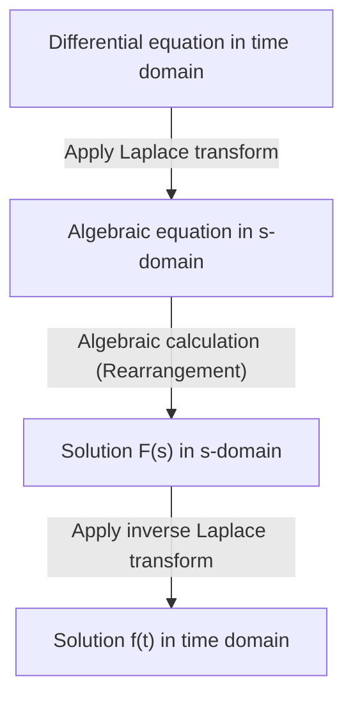

## Introduction: What is the [Laplace Transform](https://kenji.blog/en/p/laplace-transform/)?

In fields such as physics, engineering, and economics, **differential equations** are an essential tool for describing phenomena that change over time. However, solving complex differential equations directly can sometimes be extremely difficult. This is where the **[Laplace Transform](https://kenji.blog/en/p/laplace-transform/)** comes into play.

Simply put, the Laplace transform is a "magical tool that converts difficult differential equations into simple algebraic equations (equations that can be solved using only basic arithmetic)." The procedure involves mapping a complex problem expressed in the time domain ($t$) to the complex frequency domain ($s$), solving it easily there, and then transforming it back to the time domain.

In this article, we will explain in detail everything from the basics of the Laplace transform to its powerful properties and the concrete steps to actually solve differential equations.

## Definition of the [Laplace Transform](https://kenji.blog/en/p/laplace-transform/)

The Laplace transform $\mathcal{L}\{f(t)\}$ for a real-valued function $f(t)$ defined for time $t \ge 0$ is defined by the following improper integral:

$$
F(s) = \mathcal{L}\{f(t)\} = \int_{0}^{\infty} f(t) e^{-st} dt
$$

Here, $s$ is a complex variable (complex frequency) and is expressed as $s = \sigma + j\omega$ (where $j$ is the imaginary unit). The transformed function $F(s)$ is a function of $s$.

For this integral to not diverge to infinity but exist as a finite value (to converge), the real part of $s$, $\sigma$, must be greater than a certain value. The region that satisfies this condition is called the **region of convergence**.

## Why is the [Laplace Transform](https://kenji.blog/en/p/laplace-transform/) Useful?

The reason the Laplace transform is extremely powerful in solving differential equations lies mainly in the following two points:

1. **Differentiation turns into "multiplication"**: The differentiation operation $d/dt$ in the time domain is transformed into a simple algebraic operation of "multiplying by $s$" in the $s$-domain.
2. **Initial conditions are naturally incorporated**: Since the transformation formula includes initial values such as $f(0)$, it saves the trouble of substituting initial conditions later and helps reduce calculation errors.

## Important Properties of the [Laplace Transform](https://kenji.blog/en/p/laplace-transform/)

The Laplace transform has several important properties that dramatically simplify calculations.

### 1. Linearity

For constants $a, b$ and functions $f(t), g(t)$, the following relationship holds:

$$
\mathcal{L}\{a f(t) + b g(t)\} = a \mathcal{L}\{f(t)\} + b \mathcal{L}\{g(t)\}
$$

### 2. First Shifting Theorem

When a function $f(t)$ is multiplied by an exponential function $e^{at}$, it appears as a translation in the $s$-domain.

$$
\mathcal{L}\{e^{at} f(t)\} = F(s - a)
$$

### 3. [Laplace Transform](https://kenji.blog/en/p/laplace-transform/) of Derivatives

This is the most important formula for solving differential equations.

- **First derivative**: $\mathcal{L}\{f'(t)\} = s F(s) - f(0)$
- **Second derivative**: $\mathcal{L}\{f''(t)\} = s^2 F(s) - s f(0) - f'(0)$

In this way, as the order of differentiation increases, the degree of $s$ increases, and the initial values are subtracted.

## Table of Basic Transforms

Here are some Laplace transforms of commonly used basic functions. It is convenient to memorize these as formulas.

| Time domain $f(t)$ | $s$-domain $F(s)$ |
| :--- | :--- |
| $1$ (\text{Unit step function}) | $\frac{1}{s}$ |
| $t$ | $\frac{1}{s^2}$ |
| $e^{at}$ | $\frac{1}{s - a}$ |
| $\sin(\omega t)$ | $\frac{\omega}{s^2 + \omega^2}$ |
| $\cos(\omega t)$ | $\frac{s}{s^2 + \omega^2}$ |

## Steps to Solve Differential Equations

The procedure for solving differential equations using the Laplace transform is highly systematic. The overall picture is shown in the flowchart below.

1. **Apply Laplace transform**: Take the Laplace transform of both sides of the given differential equation. Substitute the initial conditions here.
2. **Solve the algebraic equation in the $s$-domain**: Solve for the unknown function $F(s)$ as a simple algebraic equation (by transposing, dividing, etc.).
3. **Apply inverse Laplace transform**: Transform the obtained $F(s)$ into a form of basic functions using partial fraction decomposition, etc., and apply the inverse Laplace transform $\mathcal{L}^{-1}$ to return to the function $f(t)$ in the time domain.

## Concrete Example: Transient Response of an RC Circuit

As a simple example, let's find the change in charge $q(t)$ when a DC voltage $E$ is applied to an RC circuit where a resistor $R$ and a capacitor $C$ are connected in series.

The circuit equation is as follows:

$$
R \frac{dq(t)}{dt} + \frac{1}{C} q(t) = E
$$

Let the initial condition be $q(0) = 0$.

**Step 1: [Laplace Transform](https://kenji.blog/en/p/laplace-transform/)**
Take the Laplace transform of both sides. Let the Laplace transform of $q(t)$ be $Q(s)$.

$$
R (s Q(s) - q(0)) + \frac{1}{C} Q(s) = \frac{E}{s}
$$

Since $q(0) = 0$, the equation is simplified as follows:

$$
\left(R s + \frac{1}{C}\right) Q(s) = \frac{E}{s}
$$

**Step 2: Algebraic Calculation**
Solve this for $Q(s)$.

$$
Q(s) = \frac{E / s}{R s + \frac{1}{C}} = \frac{E}{R s \left(s + \frac{1}{RC}\right)}
$$

Perform partial fraction decomposition to make the inverse Laplace transform easier.

$$
Q(s) = C E \left( \frac{1}{s} - \frac{1}{s + \frac{1}{RC}} \right)
$$

**Step 3: Inverse [Laplace Transform](https://kenji.blog/en/p/laplace-transform/)**
Return to the time domain using the transform table. Utilize the fact that $\frac{1}{s}$ returns to $1$, and $\frac{1}{s + a}$ returns to $e^{-at}$.

$$
q(t) = C E \left( 1 - e^{-\frac{t}{RC}} \right)
$$

This is the desired solution. We successfully derived the state where the charge is initially $0$ and gradually approaches $CE$ asymptotically over time, without directly solving complex calculus.

## Conclusion

The Laplace transform may seem like an abstract and difficult concept at first glance. However, thanks to its powerful property of "converting differentiation into multiplication," it is an indispensable tool that dramatically simplifies the analysis of complex systems in engineering and physics.

By first understanding the basic transform table and trying to solve simple differential equations by hand, you should be able to realize the true value of this "magical technique."
