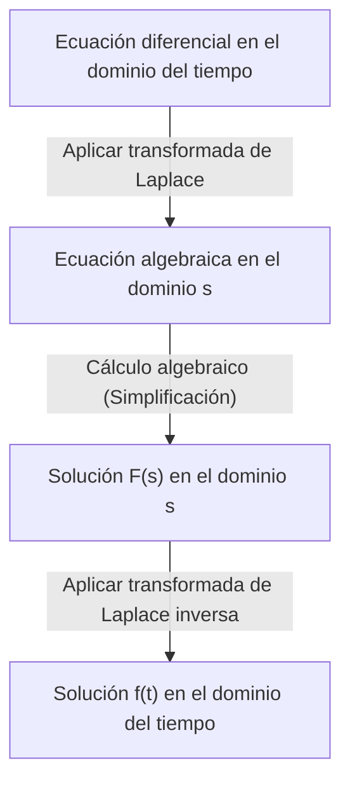

## Introducción: ¿Qué es la transformada de Laplace?

En campos como la física, la ingeniería y la economía, las **ecuaciones diferenciales** son una herramienta esencial para describir fenómenos que cambian con el tiempo. Sin embargo, resolver ecuaciones diferenciales complejas directamente a veces puede ser extremadamente difícil. Aquí es donde entra en juego la **[Transformada de Laplace](https://kenji.blog/es/p/laplace-transform/)** ([Laplace Transform](https://kenji.blog/es/p/laplace-transform/)).

En pocas palabras, la transformada de Laplace es una "herramienta mágica que convierte ecuaciones diferenciales difíciles en ecuaciones algebraicas simples (ecuaciones que se pueden resolver utilizando solo las cuatro operaciones básicas)". El procedimiento consiste en mapear un problema complejo expresado en el dominio del tiempo ($t$) al dominio de la frecuencia compleja ($s$), resolverlo fácilmente allí y luego transformarlo de nuevo al dominio del tiempo.

En este artículo, explicaremos en detalle todo, desde los conceptos básicos de la transformada de Laplace hasta sus poderosas propiedades y los pasos concretos para resolver ecuaciones diferenciales de manera efectiva.

## Definición de la transformada de Laplace

La transformada de Laplace $\mathcal{L}\{f(t)\}$ para una función de valor real $f(t)$ definida para el tiempo $t \ge 0$ se define mediante la siguiente integral impropia:

$$
F(s) = \mathcal{L}\{f(t)\} = \int_{0}^{\infty} f(t) e^{-st} dt
$$

Aquí, $s$ es una variable compleja (frecuencia compleja) y se expresa como $s = \sigma + j\omega$ ($j$ es la unidad imaginaria). La función transformada $F(s)$ se convierte en una función de $s$.

Para que esta integral no diverja al infinito sino que exista como un valor finito (para que converja), la parte real de $s$, $\sigma$, debe ser mayor que un cierto valor. La región que satisface esta condición se llama **región de convergencia**.

## ¿Por qué es útil la transformada de Laplace?

La razón por la que la transformada de Laplace es extremadamente poderosa para resolver ecuaciones diferenciales radica principalmente en los dos puntos siguientes:

1. **La diferenciación se convierte en "multiplicación"**: La operación de diferenciación $d/dt$ en el dominio del tiempo se transforma en una simple operación algebraica de "multiplicar por $s$" en el dominio $s$.
2. **Las condiciones iniciales se incorporan naturalmente**: Dado que la fórmula de transformación incluye valores iniciales como $f(0)$, ahorra la molestia de sustituir las condiciones iniciales más tarde y ayuda a reducir los errores de cálculo.

## Propiedades importantes de la transformada de Laplace

La transformada de Laplace tiene varias propiedades importantes que simplifican drásticamente los cálculos.

### 1. Linealidad

Para las constantes $a, b$ y las funciones $f(t), g(t)$, se cumple la siguiente relación:

$$
\mathcal{L}\{a f(t) + b g(t)\} = a \mathcal{L}\{f(t)\} + b \mathcal{L}\{g(t)\}
$$

### 2. Primer teorema de traslación (desplazamiento)

Cuando una función $f(t)$ se multiplica por una función exponencial $e^{at}$, aparece como una traslación en el dominio $s$.

$$
\mathcal{L}\{e^{at} f(t)\} = F(s - a)
$$

### 3. [Transformada de Laplace](https://kenji.blog/es/p/laplace-transform/) de las derivadas

Esta es la fórmula más importante para resolver ecuaciones diferenciales.

- **Primera derivada**: $\mathcal{L}\{f'(t)\} = s F(s) - f(0)$
- **Segunda derivada**: $\mathcal{L}\{f''(t)\} = s^2 F(s) - s f(0) - f'(0)$

De esta manera, a medida que aumenta el orden de diferenciación, aumenta el grado de $s$ y se restan los valores iniciales.

## Tabla de transformadas básicas

Aquí hay algunas transformadas de Laplace de funciones básicas de uso común. Es conveniente memorizarlas como fórmulas.

| Dominio del tiempo $f(t)$ | Dominio $s$ $F(s)$ |
| :--- | :--- |
| $1$ (\text{Función escalón unitario}) | $\frac{1}{s}$ |
| $t$ | $\frac{1}{s^2}$ |
| $e^{at}$ | $\frac{1}{s - a}$ |
| $\sin(\omega t)$ | $\frac{\omega}{s^2 + \omega^2}$ |
| $\cos(\omega t)$ | $\frac{s}{s^2 + \omega^2}$ |

## Pasos para resolver ecuaciones diferenciales

El procedimiento para resolver ecuaciones diferenciales utilizando la transformada de Laplace es muy sistemático. El panorama general se muestra en el diagrama de flujo a continuación.

1. **Aplicar transformada de Laplace**: Aplique la transformada de Laplace a ambos lados de la ecuación diferencial dada. Sustituya las condiciones iniciales aquí.
2. **Resolver la ecuación algebraica en el dominio $s$**: Resuelva la función desconocida $F(s)$ como una simple ecuación algebraica (transponiendo, dividiendo, etc.).
3. **Aplicar transformada de Laplace inversa**: Transforme el $F(s)$ obtenido en una forma de funciones básicas utilizando la descomposición en fracciones parciales, etc., y aplique la transformada de Laplace inversa $\mathcal{L}^{-1}$ para regresar a la función $f(t)$ en el dominio del tiempo.

## Ejemplo concreto: Respuesta transitoria de un circuito RC

Como ejemplo simple, encontremos el cambio en la carga $q(t)$ cuando se aplica un voltaje de CC $E$ a un circuito RC donde una resistencia $R$ y un condensador $C$ están conectados en serie.

La ecuación del circuito es la siguiente:

$$
R \frac{dq(t)}{dt} + \frac{1}{C} q(t) = E
$$

Sea la condición inicial $q(0) = 0$.

**Paso 1: [Transformada de Laplace](https://kenji.blog/es/p/laplace-transform/)**
Aplique la transformada de Laplace a ambos lados. Sea la transformada de Laplace de $q(t)$ denotada como $Q(s)$.

$$
R (s Q(s) - q(0)) + \frac{1}{C} Q(s) = \frac{E}{s}
$$

Dado que $q(0) = 0$, la ecuación se simplifica de la siguiente manera:

$$
\left(R s + \frac{1}{C}\right) Q(s) = \frac{E}{s}
$$

**Paso 2: Cálculo algebraico**
Resuelva esto para $Q(s)$.

$$
Q(s) = \frac{E / s}{R s + \frac{1}{C}} = \frac{E}{R s \left(s + \frac{1}{RC}\right)}
$$

Realice una descomposición en fracciones parciales para facilitar la transformada de Laplace inversa.

$$
Q(s) = C E \left( \frac{1}{s} - \frac{1}{s + \frac{1}{RC}} \right)
$$

**Paso 3: [Transformada de Laplace](https://kenji.blog/es/p/laplace-transform/) inversa**
Regrese al dominio del tiempo utilizando la tabla de transformadas. Utilice el hecho de que $\frac{1}{s}$ regresa a $1$, y $\frac{1}{s + a}$ regresa a $e^{-at}$.

$$
q(t) = C E \left( 1 - e^{-\frac{t}{RC}} \right)
$$

Esta es la solución deseada. Hemos deducido con éxito el estado en el que la carga es inicialmente $0$ y se acerca gradualmente de forma asintótica a $CE$ con el tiempo, sin resolver directamente cálculos diferenciales e integrales complejos.

## Conclusión

La transformada de Laplace puede parecer un concepto abstracto y difícil a primera vista. Sin embargo, gracias a su poderosa propiedad de "convertir la diferenciación en multiplicación", es una herramienta indispensable que simplifica drásticamente el análisis de sistemas complejos en ingeniería y física.

Al comprender primero la tabla de transformadas básicas y tratar de resolver a mano ecuaciones diferenciales simples, debería poder darse cuenta del verdadero valor de esta "técnica mágica".
