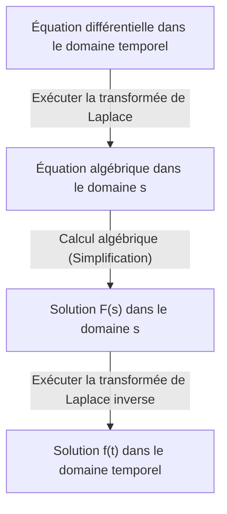

## Introduction : Qu'est-ce que la transformée de Laplace ?

Dans des domaines tels que la physique, l'ingénierie ou l'économie, les **équations différentielles** sont un outil essentiel pour décrire les phénomènes qui changent au fil du temps. Cependant, il est parfois extrêmement difficile de résoudre directement des équations différentielles complexes. C'est là qu'intervient la **[Transformée de Laplace](https://kenji.blog/fr/p/laplace-transform/)** ([Laplace Transform](https://kenji.blog/fr/p/laplace-transform/)).

En termes simples, la transformée de Laplace est un « outil magique qui convertit les équations différentielles difficiles en équations algébriques simples (des équations qui peuvent être résolues en utilisant uniquement les quatre opérations de base) ». La procédure consiste à projeter un problème complexe exprimé dans le domaine temporel ($t$) vers le domaine fréquentiel complexe ($s$), à le résoudre facilement dans ce domaine, puis à revenir au domaine temporel.

Dans cet article, nous expliquerons en détail les bases de la transformée de Laplace, ses propriétés puissantes, ainsi que les étapes concrètes pour résoudre réellement des équations différentielles.

## Définition de la transformée de Laplace

La transformée de Laplace $\mathcal{L}\{f(t)\}$ pour une fonction à valeurs réelles $f(t)$ définie pour un temps $t \ge 0$ est définie par l'intégrale généralisée suivante :

$$
F(s) = \mathcal{L}\{f(t)\} = \int_{0}^{\infty} f(t) e^{-st} dt
$$

Ici, $s$ est une variable complexe (fréquence complexe) et s'exprime par $s = \sigma + j\omega$ ($j$ étant l'unité imaginaire). La fonction transformée $F(s)$ devient une fonction de $s$.

Pour que cette intégrale ne diverge pas vers l'infini mais existe en tant que valeur finie (pour qu'elle converge), la partie réelle de $s$, $\sigma$, doit être supérieure à une certaine valeur. La région qui satisfait à cette condition est appelée la **région de convergence**.

## Pourquoi la transformée de Laplace est-elle utile ?

La raison pour laquelle la transformée de Laplace est extrêmement puissante pour résoudre les équations différentielles réside principalement dans les deux points suivants :

1. **La dérivation se transforme en « multiplication »** : L'opération de dérivation $d/dt$ dans le domaine temporel est transformée en une simple opération algébrique de « multiplication par $s$ » dans le domaine $s$.
2. **Les conditions initiales sont naturellement intégrées** : Étant donné que la formule de transformation inclut des valeurs initiales telles que $f(0)$, cela évite d'avoir à substituer les conditions initiales plus tard et permet de réduire les erreurs de calcul.

## Propriétés importantes de la transformée de Laplace

La transformée de Laplace possède plusieurs propriétés importantes qui simplifient considérablement les calculs.

### 1. Linéarité

Pour les constantes $a, b$ et les fonctions $f(t), g(t)$, la relation suivante est vérifiée :

$$
\mathcal{L}\{a f(t) + b g(t)\} = a \mathcal{L}\{f(t)\} + b \mathcal{L}\{g(t)\}
$$

### 2. Premier théorème de translation (décalage)

Lorsqu'une fonction $f(t)$ est multipliée par une fonction exponentielle $e^{at}$, cela se traduit par une translation dans le domaine $s$.

$$
\mathcal{L}\{e^{at} f(t)\} = F(s - a)
$$

### 3. [Transformée de Laplace](https://kenji.blog/fr/p/laplace-transform/) des dérivées

C'est la formule la plus importante pour résoudre les équations différentielles.

- **Dérivée première** : $\mathcal{L}\{f'(t)\} = s F(s) - f(0)$
- **Dérivée seconde** : $\mathcal{L}\{f''(t)\} = s^2 F(s) - s f(0) - f'(0)$

Ainsi, à mesure que l'ordre de dérivation augmente, le degré de $s$ augmente et les valeurs initiales sont soustraites.

## Tableau des transformées de base

Voici quelques transformées de Laplace de fonctions de base couramment utilisées. Il est pratique de les mémoriser comme des formules.

| Domaine temporel $f(t)$ | Domaine $s$ $F(s)$ |
| :--- | :--- |
| $1$ (\text{Fonction échelon unité}) | $\frac{1}{s}$ |
| $t$ | $\frac{1}{s^2}$ |
| $e^{at}$ | $\frac{1}{s - a}$ |
| $\sin(\omega t)$ | $\frac{\omega}{s^2 + \omega^2}$ |
| $\cos(\omega t)$ | $\frac{s}{s^2 + \omega^2}$ |

## Étapes de résolution des équations différentielles

La procédure de résolution des équations différentielles à l'aide de la transformée de Laplace est très systématique. Le schéma global est illustré dans l'organigramme ci-dessous.

1. **Exécuter la transformée de Laplace** : Appliquez la transformée de Laplace aux deux côtés de l'équation différentielle donnée. Substituez les conditions initiales ici.
2. **Résoudre l'équation algébrique dans le domaine $s$** : Résolvez la fonction inconnue $F(s)$ comme une simple équation algébrique (en transposant, en divisant, etc.).
3. **Exécuter la transformée de Laplace inverse** : Transformez le $F(s)$ obtenu en une forme de fonctions de base en utilisant la décomposition en éléments simples, etc., et appliquez la transformée de Laplace inverse $\mathcal{L}^{-1}$ pour revenir à la fonction $f(t)$ dans le domaine temporel.

## Exemple concret : Réponse transitoire d'un circuit RC

À titre d'exemple simple, trouvons le changement de charge $q(t)$ lorsqu'une tension continue $E$ est appliquée à un circuit RC où une résistance $R$ et un condensateur $C$ sont connectés en série.

L'équation du circuit est la suivante :

$$
R \frac{dq(t)}{dt} + \frac{1}{C} q(t) = E
$$

Soit la condition initiale $q(0) = 0$.

**Étape 1 : [Transformée de Laplace](https://kenji.blog/fr/p/laplace-transform/)**
Appliquez la transformée de Laplace des deux côtés. Soit la transformée de Laplace de $q(t)$ notée $Q(s)$.

$$
R (s Q(s) - q(0)) + \frac{1}{C} Q(s) = \frac{E}{s}
$$

Puisque $q(0) = 0$, l'équation se simplifie comme suit :

$$
\left(R s + \frac{1}{C}\right) Q(s) = \frac{E}{s}
$$

**Étape 2 : Calcul algébrique**
Résolvons ceci pour $Q(s)$.

$$
Q(s) = \frac{E / s}{R s + \frac{1}{C}} = \frac{E}{R s \left(s + \frac{1}{RC}\right)}
$$

Effectuez une décomposition en éléments simples pour faciliter la transformée de Laplace inverse.

$$
Q(s) = C E \left( \frac{1}{s} - \frac{1}{s + \frac{1}{RC}} \right)
$$

**Étape 3 : [Transformée de Laplace](https://kenji.blog/fr/p/laplace-transform/) inverse**
Revenez au domaine temporel en utilisant le tableau des transformées. Utilisez le fait que $\frac{1}{s}$ revient à $1$, et $\frac{1}{s + a}$ revient à $e^{-at}$.

$$
q(t) = C E \left( 1 - e^{-\frac{t}{RC}} \right)
$$

Ceci est la solution recherchée. Nous avons pu déduire l'état où la charge est initialement de $0$ et s'approche progressivement asymptotiquement de $CE$ au fil du temps, sans résoudre directement des calculs différentiels et intégraux complexes.

## Conclusion

La transformée de Laplace peut sembler être un concept abstrait et difficile à première vue. Cependant, grâce à sa puissante propriété de « transformer la dérivation en multiplication », c'est un outil indispensable qui simplifie considérablement l'analyse de systèmes complexes en ingénierie et en physique.

En comprenant d'abord le tableau de base des transformées et en essayant de résoudre manuellement des équations différentielles simples, vous devriez être en mesure de réaliser la véritable valeur de cette « technique magique ».
